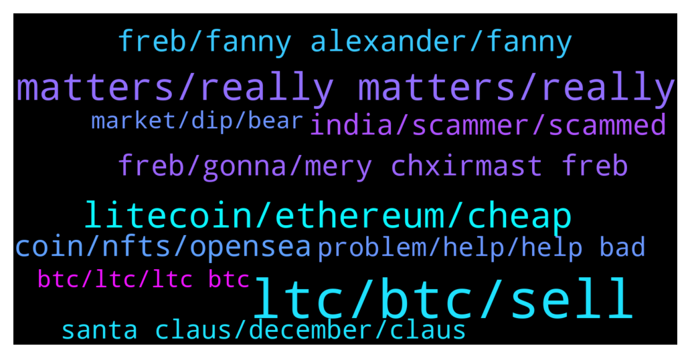

# **@Litecoin**
 ## Analysis for **2021-12-24** - **2021-12-25**.

---

## 📊 **Basic Stats**

**n_messages_sent**: 298

---

---

## 🔝 **Top keywords and related messages**

1. **ltc, btc, sell**

    @Carlos_PRO_Holder --- *Ltc to $400 soon, and I will dump my first 1000 Ltc on you plebians* **--->** [TG Discussion](https://t.me/Litecoin/2034582)

    @shahabszd --- *Ltc 7000$ very very soon😎 if you can't hold you won't be rich* **--->** [TG Discussion](https://t.me/Litecoin/2033821)

    @KevinWilson8 --- *We must pray that BTC or ETH can return to ATH, these two are market leaders, otherwise ltc has no hope of returning to ATH* **--->** [TG Discussion](https://t.me/Litecoin/2033992)

    @Forexjunkie --- *600 should be easy tartget, 650 being the 1618 ext* **--->** [TG Discussion](https://t.me/Litecoin/2034595)

    @TonyNakamoto --- *2 late 2 move LTC into the new top 20 coims imo* **--->** [TG Discussion](https://t.me/Litecoin/2034311)

    @dainguyenhp --- *Wow how many ltc you have bro* **--->** [TG Discussion](https://t.me/Litecoin/2034585)

2. **matters, really matters, really**

    @TonyNakamoto --- *dey call u some insulP but r f0rget wat it B* **--->** [TG Discussion](https://t.me/Litecoin/2034143)

    @TonyNakamoto --- *Dis gonna B black and white and subtitle'd and full of stuff no one undrstnds?* **--->** [TG Discussion](https://t.me/Litecoin/2034350)

    @Forexjunkie --- *And then I would have to listen to Life by jelly roll* **--->** [TG Discussion](https://t.me/Litecoin/2034549)

    @체인 --- *As if to summon up my leaving* **--->** [TG Discussion](https://t.me/Litecoin/2034745)

    @체인 --- *Before the dawn, I hear you whisper* **--->** [TG Discussion](https://t.me/Litecoin/2034742)

    @체인 --- *So you think you can stop me and spit in my eye So you think you can love me and leave me to die Oh, baby, can't do this to me, baby, Just gotta get out, just gotta get right outta here Nothing really matters, Anyone can see, Nothing really matters, Nothing really matters to me Any way the wind blows...* **--->** [TG Discussion](https://t.me/Litecoin/2034724)

3. **litecoin, ethereum, cheap**

    @moonsie --- *today ethereum is 30 times that value and litecoin barely 3 times* **--->** [TG Discussion](https://t.me/Litecoin/2033971)

    @kuntpuncher --- *Buy when cheap, not when it’s expensive. Some did a ‘lol’ comment when people mentioned 50 cent Doge in 2020. They was wrong, we reached that figure a few months later in 2021. So people wouldn’t buy Doge cheap at $0.005 but fomo when it was 20 cents plus. Go figure.* **--->** [TG Discussion](https://t.me/Litecoin/2034593)

    @TonyNakamoto --- *It's at like 4% yrly inflation now* **--->** [TG Discussion](https://t.me/Litecoin/2034405)

    @jericho2411 --- *that huge for litecoin dont undresastemate that.* **--->** [TG Discussion](https://t.me/Litecoin/2033877)

    @moonsie --- *this year was a good year for most crypto holders except litecuckers* **--->** [TG Discussion](https://t.me/Litecoin/2034219)

    @Carlos_PRO_Holder --- *Litecoin has a sucks volume, sad* **--->** [TG Discussion](https://t.me/Litecoin/2034259)

4. **freb, fanny alexander, fanny**

    @moonsie --- *u know what freb? there is even a feature length making of of fanny and alexander* **--->** [TG Discussion](https://t.me/Litecoin/2034366)

    @moonsie --- *but yeah u will need subtitles unless u know swed0ish* **--->** [TG Discussion](https://t.me/Litecoin/2034352)

    @moonsie --- *no, color freb. its from 1983* **--->** [TG Discussion](https://t.me/Litecoin/2034351)

    @moonsie --- *good movie freb. very long though. 312 minutes.* **--->** [TG Discussion](https://t.me/Litecoin/2034189)

    @moonsie --- *watched fanny and alexander few days ago freb* **--->** [TG Discussion](https://t.me/Litecoin/2034181)

    @moonsie --- *There's a Cinema release that is 180 minutes, but i recommend the 312 mini-series that's divided in 4 episodes* **--->** [TG Discussion](https://t.me/Litecoin/2034345)

5. **coin, nfts, opensea**

    @K_arlso_n --- *And this coin very fast go to the 0,01$* **--->** [TG Discussion](https://t.me/Litecoin/2033843)

    @dany --- *i recently learned about crypto fantasy coin and am looking forward to following its progress.* **--->** [TG Discussion](https://t.me/Litecoin/2034130)

    @K_arlso_n --- *Many people trust this coin, and everyone will be punished.* **--->** [TG Discussion](https://t.me/Litecoin/2033851)

    @Jonesland --- *Hi, thanks for your attention. and retweet. For the first time in the world,collect NFTs that have carpets All NFTs minted by David Jones company have exquisite silk handmade carpets of the same NFT, which will be sent to buyers .https://opensea.io/DJones  OpenSea DJones - Profile | OpenSea Check out DJones's NFTs on OpenSea, the largest marketplace for crypto collectibles* **--->** [TG Discussion](https://t.me/Litecoin/2034647)

    @K_arlso_n --- *I can buy other shit coin and make x4 and more. But not in this coin.* **--->** [TG Discussion](https://t.me/Litecoin/2033817)

    @BennyBennyBlanco --- *Other Shit coins belong in the 🚽* **--->** [TG Discussion](https://t.me/Litecoin/2033842)

6. **freb, gonna, mery chxirmast freb**

    @moonsie --- *Wat movi u ended up wstching freb old t0b* **--->** [TG Discussion](https://t.me/Litecoin/2034408)

    @moonsie --- *That alonenwould have morw than doibled ur litecucks* **--->** [TG Discussion](https://t.me/Litecoin/2034425)

    @TonyNakamoto --- *somteimes dey call u 'ewu' but r thinking of an0ther* **--->** [TG Discussion](https://t.me/Litecoin/2034149)

    @moonsie --- *what the fuck are you talking about lmao* **--->** [TG Discussion](https://t.me/Litecoin/2033969)

    @BennyBennyBlanco --- *If that happend jeez I get a lot* **--->** [TG Discussion](https://t.me/Litecoin/2033844)

    @TonyNakamoto --- *R do th0t so 2 but eBery1 seems 2 like* **--->** [TG Discussion](https://t.me/Litecoin/2034341)

7. **india, scammer, scammed**

    @jrx486 --- *Look, im just saying that if you encounter a scammer, it is more likely (not certain) that he is from nigeria or india* **--->** [TG Discussion](https://t.me/Litecoin/2034154)

    @jrx486 --- *Not saying everyone in those countries are scammers. I’m sure the majority isn’t.* **--->** [TG Discussion](https://t.me/Litecoin/2034134)

    @Bigbulz --- *And those people get scammed by those clowns deserve to get scammed* **--->** [TG Discussion](https://t.me/Litecoin/2034158)

    @Bigbulz --- *What does it mean by "are you Nigerian or indian" ?* **--->** [TG Discussion](https://t.me/Litecoin/2034132)

    @Bigbulz --- *I am in many indian group, the amount of scamming messages i get in every  group is unlimited.  And they all are from english native speaker. They use google translator to convert it to hindi* **--->** [TG Discussion](https://t.me/Litecoin/2034139)

    @Bigbulz --- *The "scammer" you have heard basically operate call center and get millions of $ but I have not encountered a single scammer from india in crypto space. You might have encountered some beggars!* **--->** [TG Discussion](https://t.me/Litecoin/2034138)

8. **santa claus, december, claus**

    @jrx486 --- *I celebrate saint nicholas (sinterklaas) on December 6th and not santa claus on xmas. December 25th is a jesus day.* **--->** [TG Discussion](https://t.me/Litecoin/2034186)

    @RabbitL0v3r --- *Also santa claus find his origin in st nicholas* **--->** [TG Discussion](https://t.me/Litecoin/2034198)

    @moonsie --- *english couldnt pronounce sinter klaas so they makde it Santa Claus imo* **--->** [TG Discussion](https://t.me/Litecoin/2034200)

    @RabbitL0v3r --- *Saint Nicholas is more christian than Yule being pagan* **--->** [TG Discussion](https://t.me/Litecoin/2034187)

    @moonsie --- *"As Christianity expanded into Western Europe, the people there had been celebrating a Roman holiday ('Solis Invicti') on December 25th. Rather than compete with an already popular holiday, the church simply decided to move Christmas Day to December 25th and celebrate January 6th as the Feast of the Epiphany. Undoubtedly, Solis Invicti itself was a holiday created to overwrite previous Pagan winter solstice celebrations."* **--->** [TG Discussion](https://t.me/Litecoin/2034195)

    @moonsie --- *the oldest church (armenian orthodox) celebrate it on 6 january, which is probably closer to the real birthday of jesus* **--->** [TG Discussion](https://t.me/Litecoin/2034194)

9. **problem, help, help bad**

    @BennyBennyBlanco --- *If u not happy here, go to another project* **--->** [TG Discussion](https://t.me/Litecoin/2033846)

    @TonyNakamoto --- *How bad is de pain sjr?* **--->** [TG Discussion](https://t.me/Litecoin/2034513)

    @moonsie --- *send me via here your problem* **--->** [TG Discussion](https://t.me/Litecoin/2034709)

    @moonsie --- *explain problem and i will consider* **--->** [TG Discussion](https://t.me/Litecoin/2034706)

    @TonyNakamoto --- *Can do intermission and soumdtrack and make a day of it fermb* **--->** [TG Discussion](https://t.me/Litecoin/2034371)

    @Bigbulz --- *I learned about cum rocket and looking forward to following its process* **--->** [TG Discussion](https://t.me/Litecoin/2034131)

10. **market, dip, bear**

    @Carlos_PRO_Holder --- *It will be worse because the institutional investors, imagine when they start to sell* **--->** [TG Discussion](https://t.me/Litecoin/2034308)

    @jrx486 --- *We might not get a bear market as heavy as in the previous cycle* **--->** [TG Discussion](https://t.me/Litecoin/2034305)

    @Carlos_PRO_Holder --- *Markets will sink the last friday of this month. Futures will expire 💀* **--->** [TG Discussion](https://t.me/Litecoin/2034792)

    @jrx486 --- *They don’t dump on the market. They buy and sell over the counter. And they buy the dip, aka adding scarcity* **--->** [TG Discussion](https://t.me/Litecoin/2034310)

    @Badshah_Adding_Service --- *It is loosing market share and rank.* **--->** [TG Discussion](https://t.me/Litecoin/2034082)

    @jrx486 --- *Some people said that in May after the dip too* **--->** [TG Discussion](https://t.me/Litecoin/2034312)

