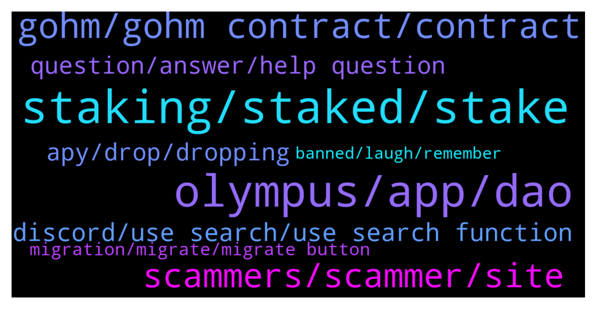

# **@OlympusTG**
 ## Analysis for **2021-12-24** - **2021-12-25**.

---

## 📊 **Basic Stats**

**n_messages_sent**: 656

---

---

## 🔝 **Top keywords and related messages**

1. **staking, staked, stake**

    @Bolo --- *Aw ok, I just want to stake and earn passive income lol* **--->** [TG Discussion](https://t.me/OlympusTG/133017)

    @Valikoni --- *Can someone explain my stake balance show gOHM but there is no reward yield and APY in "Stake" does not show anything* **--->** [TG Discussion](https://t.me/OlympusTG/134295)

    @CryptoCobiUSA --- *Hello! Can someone explain how I can see my actual value of gOHM after it has been staked ?* **--->** [TG Discussion](https://t.me/OlympusTG/134143)

    @A. --- *I don't understand why the rewards on v1 are not actualized. Why does it take so long time? There are more than 2 billions of dollars funds staked on v1. Does our money not increase anymore in v1 staking - sOhm? Please Tag me* **--->** [TG Discussion](https://t.me/OlympusTG/133063)

    @CryptoCobiUSA --- *It all makes no sense to me. I used to have wsOHM , now I moved that to V2 gOHM.  My total value is still same as the first day I staked.* **--->** [TG Discussion](https://t.me/OlympusTG/134149)

    @Daniel --- *When i go to menu dont give stake  or unstake* **--->** [TG Discussion](https://t.me/OlympusTG/134373)

2. **olympus, app, dao**

    @Wartull --- *Lobis is connected to Olympus yes* **--->** [TG Discussion](https://t.me/OlympusTG/133667)

    @A. --- *Is there any support of Olympus? A privet message I think. Tagging* **--->** [TG Discussion](https://t.me/OlympusTG/134380)

    @Al_S1919 --- *what can you say about the LOBIS project? Is it connected somehow to Olympus and why APY is so insane there?* **--->** [TG Discussion](https://t.me/OlympusTG/133652)

    @Bolo --- *Do Olympus support team usually call? Lol or are they scammers* **--->** [TG Discussion](https://t.me/OlympusTG/133049)

    @nfwaple --- *Discord, there is a Olympus Pro channel within the Olympus server* **--->** [TG Discussion](https://t.me/OlympusTG/133176)

    @cryptolevium --- *Not at the moment I think, didn't read anything about it when I researched Olympus* **--->** [TG Discussion](https://t.me/OlympusTG/134229)

3. **gohm, gohm contract, contract**

    @cokinator --- *Can you help me. I have mistakenly sent gohm to the gohm contract in polygon. Who should I talk to for help ?* **--->** [TG Discussion](https://t.me/OlympusTG/133716)

    @Swanny --- *Am trying to migrate to gohm here https://app.olympusdao.finance/#/wrap but keep getting this Error message nternal JSON-RPC error. Am using the avalanche network.* **--->** [TG Discussion](https://t.me/OlympusTG/133694)

    @roadtoabilli --- *Import gohm contract to your ledger* **--->** [TG Discussion](https://t.me/OlympusTG/132959)

    @allenkor --- *Yea it’s not showing up. Decided to wrap it back to gohm.* **--->** [TG Discussion](https://t.me/OlympusTG/133352)

    @allenkor --- *Yo admin I unwrapped my gohm to sohm. It didn’t show up on etherscan, debank or zapper.* **--->** [TG Discussion](https://t.me/OlympusTG/133350)

    @shugabelly55 --- *Please can you send me the correct contact address for gOHM on here so I can buy on uni swap? So many addresses in the article so I don’t get it mixed up* **--->** [TG Discussion](https://t.me/OlympusTG/134327)

4. **scammers, scammer, site**

    @Bolo --- *A scammer would say that lol* **--->** [TG Discussion](https://t.me/OlympusTG/133771)

    @nfwaple --- *use /report @username, if no username just forward the scammer message to @notoscam* **--->** [TG Discussion](https://t.me/OlympusTG/134006)

    @juggszn --- *@nfwaple beware somebody posing as you is sending phishing malware links to access dapps* **--->** [TG Discussion](https://t.me/OlympusTG/134172)

    @SMNFT7 --- *Damn I just received a call from scammer, wanted to see how real they made it seem before reporting the account so I followed along. This fuckers know everything and sound legit. Beware homies, for a noob I now see how easy they can get scammed.* **--->** [TG Discussion](https://t.me/OlympusTG/133878)

    @Ap0l1o --- *And thank you for the reminder to make another scammer sweep :)* **--->** [TG Discussion](https://t.me/OlympusTG/133787)

    @EleVaz --- *They’re scammers for sure.   I’ve had them call me within 2 seconds of posting a question.   Idiots* **--->** [TG Discussion](https://t.me/OlympusTG/133055)

5. **discord, use search, use search function**

    @Love3425436367564 --- *This works as well as discord.  New things, Such as?* **--->** [TG Discussion](https://t.me/OlympusTG/133898)

    @Mark --- *im unable to get to the discord* **--->** [TG Discussion](https://t.me/OlympusTG/133142)

    @Swanny --- *Sorry to keep asking, but is there anyone who can help me get into the discord, I just on a page with Memes?* **--->** [TG Discussion](https://t.me/OlympusTG/133809)

    @thepeoplesdegen --- *I'm stuck on the servers 2 meme channels for some reason* **--->** [TG Discussion](https://t.me/OlympusTG/133177)

    @nfwaple --- *Ohmies usually hang out in the Discord* **--->** [TG Discussion](https://t.me/OlympusTG/133523)

    @ChrisBCrypto --- *is there a problem with discord board? use invite through OHM site and complete what to do next, click accept and all i get it meme channel* **--->** [TG Discussion](https://t.me/OlympusTG/133714)

6. **apy, drop, dropping**

    @Love3425436367564 --- *Knew youd say this. 7000% has been solid for almost a year now. Would be happy with that or even 5000%  More marketing & bonds = this can continue.  Bear market will rebound soon.  Dropping the apy too low is stupid and defeats the point of the project.* **--->** [TG Discussion](https://t.me/OlympusTG/133889)

    @tomvarney --- *does APY auto correct based on price fluctuations? outside of the proposed drop to 1k in jan* **--->** [TG Discussion](https://t.me/OlympusTG/133674)

    @shugabelly55 --- *So how do I know or see that my tokens are increasing in value with the Apy ? Because with V1 you can See that on the website* **--->** [TG Discussion](https://t.me/OlympusTG/134325)

    @fairwinds --- *currently, 7369157 ohm out there, so not too long to go until 10 million is hit, and the apy reduces to 1000%* **--->** [TG Discussion](https://t.me/OlympusTG/133893)

    @fairwinds --- *here is OIP-18 https://forum.olympusdao.finance/d/77-oip-18-reward-rate-framework-and-reduction this tells you when it will reduce, and what brakcet APY it reduces to* **--->** [TG Discussion](https://t.me/OlympusTG/133896)

    @frank1of1 --- *How come the APY has dropped 2000% in the last 2 months?* **--->** [TG Discussion](https://t.me/OlympusTG/133564)

7. **question, answer, help question**

    @A. --- *I got an answer from you for my question before...* **--->** [TG Discussion](https://t.me/OlympusTG/134376)

    @Wartull --- *Yes we are working on it* **--->** [TG Discussion](https://t.me/OlympusTG/133715)

    @ChrisBCrypto --- *Hey apollo, i think i might have opened up dm on discord with you* **--->** [TG Discussion](https://t.me/OlympusTG/133648)

    @Collective --- *Admin I have questions dm me* **--->** [TG Discussion](https://t.me/OlympusTG/134127)

    @maurofibonacci --- *@admin I have a question somenthing is not clear to me* **--->** [TG Discussion](https://t.me/OlympusTG/134440)

    @Collective --- *So I can ask my question here* **--->** [TG Discussion](https://t.me/OlympusTG/134129)

8. **migration, migrate, migrate button**

    @cdp279 --- *The update is the migration is still going on.* **--->** [TG Discussion](https://t.me/OlympusTG/133011)

    @nfwaple --- *you can migrate now, it started but not finalised yet, soon* **--->** [TG Discussion](https://t.me/OlympusTG/134354)

    @novato_gains --- *Is there an article on how to migrate?* **--->** [TG Discussion](https://t.me/OlympusTG/133481)

    @adalipi --- *Guys why i can not migrate? There is green „approved“ written ?!* **--->** [TG Discussion](https://t.me/OlympusTG/133111)

    @JK --- *as per above buddy. error on migration.* **--->** [TG Discussion](https://t.me/OlympusTG/133126)

    @Ap0l1o --- *That is not migration, but importing of the old wallet on a new device* **--->** [TG Discussion](https://t.me/OlympusTG/133665)

