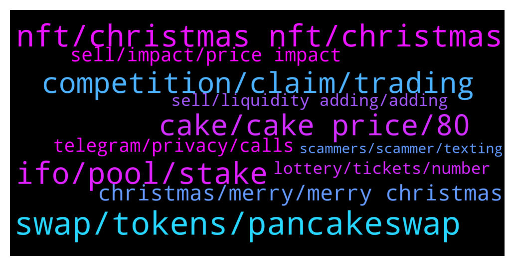

# **@PancakeSwap**
 ## Analysis for **2021-12-24** - **2021-12-25**.

---

## 📊 **Basic Stats**

**n_messages_sent**: 973

---

---

## 🔝 **Top keywords and related messages**

1. **swap, tokens, pancakeswap**

    @MadameX39 --- *Hello. Sorry to disturb you but I've got a problem. I made a swap on pancakeswap for a contract. It said that was Mobius but when I try to swap it back I could not. The error was: “The transaction cannot succeed due to error: execution reverted: TransferHelper: TRANSFER_FROM_FAILED.” Is there a way to recover my money or to find more info about the contract?* **--->** [TG Discussion](https://t.me/PancakeSwap/2220770)

    @HAITIENLK --- *https://t.me/PancakeSwap/2219827 , it's not a swap transaction, it's transfer transaction.* **--->** [TG Discussion](https://t.me/PancakeSwap/2219834)

    @Xanthius --- *Hey, I keep getting "Fail with error 'Pancake: TRANSFER_FAILED'" when trying to swap on pancakeswap and I can't figure out why. Anyone know? the help page says to use less than 70% of my balance but even with that it failed* **--->** [TG Discussion](https://t.me/PancakeSwap/2221111)

    @JoeMikaelson --- *yes it says like that. thats why im confused. i dont send tokens. i only swap. i've been trading for a long time so i wont be making this kind of mistake. Can i report it to your management please?* **--->** [TG Discussion](https://t.me/PancakeSwap/2219840)

    @Abidin --- *Hi guys, I'm trying to swap my coins at pancake swap from trust wallet. Everytime I click "swap", it says " Error Invalid Session". I tried to reopen the session but still got the same problem. Any solution?* **--->** [TG Discussion](https://t.me/PancakeSwap/2221552)

    @satrioopw --- *Can i have assistance here ? Why i need to input my passphrase every time when i want to swap* **--->** [TG Discussion](https://t.me/PancakeSwap/2219328)

2. **nft, christmas nft, christmas**

    @patmotu --- *oh and admins.. i think its crazy that the claiming of the fan token prices is now offline for 1 day... but one person can sell the NFT from there for 42 BNB  https://pancakeswap.finance/nfts/collections/0xdf7952b35f24acf7fc0487d01c8d5690a60dba07/22* **--->** [TG Discussion](https://t.me/PancakeSwap/2219387)

    @Godbabybeby --- *What is the requirement to get Christmas NFT drop* **--->** [TG Discussion](https://t.me/PancakeSwap/2219878)

    @Chatista --- *Binance smart chain is a trash bin. Buy nft here is like paying money to carry garbage home* **--->** [TG Discussion](https://t.me/PancakeSwap/2222215)

    @JaredJaSean --- *I'm also excited for the Christmas NFT drop.* **--->** [TG Discussion](https://t.me/PancakeSwap/2218976)

    @Karthik --- *Bro how much are you expectingt he price of nfts (fan token )* **--->** [TG Discussion](https://t.me/PancakeSwap/2219403)

    @bigguysgobig --- *When nfts for points? Its Christmas already* **--->** [TG Discussion](https://t.me/PancakeSwap/2221714)

3. **ifo, pool, stake**

    @cryptXXXking --- *? It's the average over 7 days. Even if you unstake, you will still get some allocation.* **--->** [TG Discussion](https://t.me/PancakeSwap/2221754)

    @wiction --- *Merry Christmas  all. What is the IFO Pool?* **--->** [TG Discussion](https://t.me/PancakeSwap/2221584)

    @HAITIENLK --- *if you unstake, average balance is decreased bro.* **--->** [TG Discussion](https://t.me/PancakeSwap/2221760)

    @Ceddi200 --- *If you don’t staked back within that period. You will loose all average balance. However you can always stake back once new IFO is announced* **--->** [TG Discussion](https://t.me/PancakeSwap/2221772)

    @Rush_lover --- *Stake CAKE to participate in IFOs* **--->** [TG Discussion](https://t.me/PancakeSwap/2221589)

    @Ceddi200 --- *Bro if you read well and able to understand. Your average pool won’t count if you unstake from the pool. And if you want to secure your IFO credit you can stake back. And patiently wait for the next one. Which doesn’t have fixed date* **--->** [TG Discussion](https://t.me/PancakeSwap/2221752)

4. **cake, cake price, 80**

    @Flower9999999999 --- *I am trying to figure out why CAKE price has continually declined since May and especially since the launch of NFT marketplace  I wish there was some sort of onchain analytics to verify 2 things:-  1. The stakers earning CAKEs, what do they do with the earned CAKEs? Do they sell their CAKEs to stablecoin or compound it?  2. People who buy NFT’s on PancakeSwap, did they sell CAKE in the previous 3 transaction to buy BNB to purchase NFT’s and do majority of CAKE holders buy NFT’s on PancakeSwap or non CAKE holders?  The answers to both questions will reveal the truth behind the decline instead of Chefs labelling any criticisms as FUD.* **--->** [TG Discussion](https://t.me/PancakeSwap/2222196)

    @Hybridds --- *$Cake and $Bake have the same team?* **--->** [TG Discussion](https://t.me/PancakeSwap/2222113)

    @Adeel --- *Why CAKE price is always going down? 😢* **--->** [TG Discussion](https://t.me/PancakeSwap/2219406)

    @Matt --- *When will cake hit 44$ 😭😭😭, been waiting for so long.. I am a hodlr but how long can i hold.. i never sell for loss.* **--->** [TG Discussion](https://t.me/PancakeSwap/2220605)

    @ctellyc --- *bought just now too, filling back cake baggage* **--->** [TG Discussion](https://t.me/PancakeSwap/2221343)

    @kripashankarsingh --- *Why cake price not goes up ???* **--->** [TG Discussion](https://t.me/PancakeSwap/2219634)

5. **competition, claim, trading**

    @way2blockchain --- *Whats going on with the trading competition prize winning claims? Still nothing?   7 days competition and 7 days for result? This is annoying man* **--->** [TG Discussion](https://t.me/PancakeSwap/2222302)

    @m33Lucky --- *Any updates from battle bugs rewards?* **--->** [TG Discussion](https://t.me/PancakeSwap/2219454)

    @murman1083 --- *when rewards claiming for trading comp?* **--->** [TG Discussion](https://t.me/PancakeSwap/2219587)

    @mc_GRAGE --- *What is the problem with the claim mam? (Contract issues?* **--->** [TG Discussion](https://t.me/PancakeSwap/2219879)

    @Od --- *Till now no update on trade competition.?* **--->** [TG Discussion](https://t.me/PancakeSwap/2221393)

    @Senju --- *Claiming the prize is most likely on Monday wasting time with announcement „soon“* **--->** [TG Discussion](https://t.me/PancakeSwap/2221224)

6. **christmas, merry, merry christmas**

    @NitroPunky --- *just enjoy Christmas and worry about that later. few days wont make that difference* **--->** [TG Discussion](https://t.me/PancakeSwap/2221820)

    @HAITIENLK --- *will be announced soon bro. merry christmas bro ^_^* **--->** [TG Discussion](https://t.me/PancakeSwap/2221715)

    @CakeCompounder --- *It’s maybe because it’s Christmas Eve/Christmas in many countries* **--->** [TG Discussion](https://t.me/PancakeSwap/2221016)

    @BOIONU --- *That's what I was trying to confirm! Merry Christmas to you!* **--->** [TG Discussion](https://t.me/PancakeSwap/2220211)

    @Naa --- *Merry Christmas, I hope you all get as generous investment profits as me* **--->** [TG Discussion](https://t.me/PancakeSwap/2220311)

    @way2blockchain --- *What tuned man, we need money, you are holding up money for Christmas and new year,* **--->** [TG Discussion](https://t.me/PancakeSwap/2222328)

7. **sell, impact, price impact**

    @J --- *Guys someone help asap!!! So I am in a coin that locked it’s sells until this evening. I own most of the coin but thr price impact of my sell would be about 75% so by default the sell button is greyed out and I have no option to sell. On the other hand if I turn on expert mode I can in fact hit the sell button but I can’t sell yet bc they are unlocking it later. I want to know if expert mode will allow me to sell regardless of price impact??? Someone plz help this is urgent🆘🆘🆘* **--->** [TG Discussion](https://t.me/PancakeSwap/2222220)

    @theillfatedjack --- *I see still recommend selling a little though, a 75% price impact is really high, I'm sure you need to input confirm button for that* **--->** [TG Discussion](https://t.me/PancakeSwap/2222237)

    @J --- *I could but everyone is selling at the same time when the sell button is unlocked by the devs so I wanna dump* **--->** [TG Discussion](https://t.me/PancakeSwap/2222227)

    @theillfatedjack --- *Can't u just sell a little by little no minimize impact* **--->** [TG Discussion](https://t.me/PancakeSwap/2222224)

    @J --- *Devs unlock sales @1pm thats why i want to know beforehand bc I can’t sell rn and I wanna be the first to dump* **--->** [TG Discussion](https://t.me/PancakeSwap/2222374)

    @J --- *If I try and dump on a low liquidity coin the price impact is too high for me to sell and the button is greyed out. If I turn on expert mode the button says sell anyway. Expert mode should allow me to sell and bypass the cap of 15% price impact and sell my bag which will have a 75% price impact correct?* **--->** [TG Discussion](https://t.me/PancakeSwap/2222370)

8. **telegram, privacy, calls**

    @Francis_I_Am --- *Check your Telegram privacy settings, stop calls by strangers* **--->** [TG Discussion](https://t.me/PancakeSwap/2219144)

    @METAGTA --- *I litterally have received over 50 voice calls and like 10 different dm since joining this telegram* **--->** [TG Discussion](https://t.me/PancakeSwap/2221059)

    @SecuestPcs --- *And this is telegram message link : https://t.me/PancakeSwapAnn/1530* **--->** [TG Discussion](https://t.me/PancakeSwap/2220218)

    @ClanMudhorn --- *i think we have it figured now, have had the whole team following along with the convo via discord.   i greatly appreciate you having taken the time to speak with me and walk me through it.   i see that what you said orginally is correct and it was my misunderstanding.   so again i say thankyou for dealing with my ignorance and walking me through it.* **--->** [TG Discussion](https://t.me/PancakeSwap/2219165)

    @Matt --- *I am giving suggestions on discord, no one is replying* **--->** [TG Discussion](https://t.me/PancakeSwap/2221012)

    @Rush_lover --- *um pouco. É melhor você ir para o grupo de telegramas em português, todos falam português lá.* **--->** [TG Discussion](https://t.me/PancakeSwap/2222352)

9. **sell, liquidity adding, adding**

    @TomorrowlandForLife --- *Try all of these steps  1) Increase your slippage, the higher the better  2) Increase your gas (15, 350000)  3) Remove any decimals, use whole numbers and round down (e.g. if you are trying to sell 592038493.20395, type in the amount 592038492 manually)   4) Use a different wallet (safepal, trustwallet, metamask)  5)Try lowering the amount you sell. Some coins got max transaction limit.  6)Ask the coin issuer to either lower the auto liquidity adding threshold or turn off automatic liquidity adding completely.   🚨🚨🚨🚨🚨🚨🚨🚨🚨🚨 7)If none of the above work, you've probably bought a coin you cant sell. 🚨🚨🚨🚨🚨🚨🚨🚨🚨🚨  Here you can check whether the token you bought is a scam. Paste the smart contract address! 👇👇👇👇👇 https://honeypot.rugdoc.io/* **--->** [TG Discussion](https://t.me/PancakeSwap/2218785)

    @TomorrowlandForLife --- *1) Increase your slippage, the higher the better  2) Increase your gas (15, 350000)  3) Remove any decimals, use whole numbers and round down (e.g. if you are trying to sell 592038493.20395, type in the amount 592038492 manually)   4) Use a different wallet (safepal, trustwallet, metamask)  5)Try lowering the amount you sell. Some coins got max transaction limit.  6)Ask the coin issuer to either lower the auto liquidity adding threshold or turn off automatic liquidity adding completely.   🚨🚨🚨🚨🚨🚨🚨🚨🚨🚨 7)If none of the above work, you've probably bought a coin you cant sell. 🚨🚨🚨🚨🚨🚨🚨🚨🚨🚨  Here you can check whether the token you bought is a scam. Paste the smart contract address! 👇👇👇👇👇 https://honeypot.rugdoc.io/* **--->** [TG Discussion](https://t.me/PancakeSwap/2221116)

    @Ceddi200 --- *1) Increase your slippage, the higher the better  2) Increase your gas (15, 350000)  3) Remove any decimals, use whole numbers and round down (e.g. if you are trying to sell 592038493.20395, type in the amount 592038492 manually)   4) Use a different wallet (safepal, trustwallet, metamask)  5)Try lowering the amount you sell. Some coins got max transaction limit.  6)Ask the coin issuer to either lower the auto liquidity adding threshold or turn off automatic liquidity adding completely.   🚨🚨🚨🚨🚨🚨🚨🚨🚨🚨 7)If none of the above work, you've probably bought a coin you cant sell. 🚨🚨🚨🚨🚨🚨🚨🚨🚨🚨  Here you can check whether the token you bought is a scam. Paste the smart contract address! 👇👇👇👇👇 https://honeypot.rugdoc.io/* **--->** [TG Discussion](https://t.me/PancakeSwap/2221561)

    @CakeCompounder --- *1) Increase your slippage, the higher the better  2) Increase your gas (15, 350000)  3) Remove any decimals, use whole numbers and round down (e.g. if you are trying to sell 592038493.20395, type in the amount 592038492 manually)   4) Use a different wallet (safepal, trustwallet, metamask)  5)Try lowering the amount you sell. Some coins got max transaction limit.  6)Ask the coin issuer to either lower the auto liquidity adding threshold or turn off automatic liquidity adding completely.   🚨🚨🚨🚨🚨🚨🚨🚨🚨🚨 7)If none of the above work, you've probably bought a coin you cant sell. 🚨🚨🚨🚨🚨🚨🚨🚨🚨🚨  Here you can check whether the token you bought is a scam. Paste the smart contract address! 👇👇👇👇👇 https://honeypot.rugdoc.io/* **--->** [TG Discussion](https://t.me/PancakeSwap/2219684)

    @SecuestPcs --- *1) Increase your slippage, the higher the better  2) Increase your gas (15, 350000)  3) Remove any decimals, use whole numbers and round down (e.g. if you are trying to sell 592038493.20395, type in the amount 592038492 manually)   4) Use a different wallet (safepal, trustwallet, metamask)  5)Try lowering the amount you sell. Some coins got max transaction limit.  6)Ask the coin issuer to either lower the auto liquidity adding threshold or turn off automatic liquidity adding completely.   🚨🚨🚨🚨🚨🚨🚨🚨🚨🚨 7)If none of the above work, you've probably bought a coin you cant sell. 🚨🚨🚨🚨🚨🚨🚨🚨🚨🚨  Here you can check whether the token you bought is a scam. Paste the smart contract address! 👇👇👇👇👇 https://honeypot.rugdoc.io/* **--->** [TG Discussion](https://t.me/PancakeSwap/2220068)

    @Ceddi200 --- *It’s always important to carry out the necessary due diligence and analysis for warning signs before depositing your funds anywhere.  If you send your funds to bad code contract, or scam token , or very low liquidity you can’t sell it. You will need to contact the community that owns it* **--->** [TG Discussion](https://t.me/PancakeSwap/2222005)

10. **lottery, tickets, number**

    @LuckyAntonio --- *Anyone knows what happened to the lottery? I had some tickets but seems like the draw is stuck* **--->** [TG Discussion](https://t.me/PancakeSwap/2222000)

    @P2E_invest --- *Guys what happening with lottery? Just me can't buy tickets?* **--->** [TG Discussion](https://t.me/PancakeSwap/2222268)

    @Wspanels --- *we need answers about the lottery, I used several different browsers and I completely cleared the cache data, if the problem is cache we need them to clear the cloudflare, because even in other browsers without connecting wallet, the page is the same* **--->** [TG Discussion](https://t.me/PancakeSwap/2222059)

    @gmaxi07 --- *How lottery pick winning number ? I can’t see people having 5 Or 6 matching number. Very rarely matched only 5* **--->** [TG Discussion](https://t.me/PancakeSwap/2221807)

    @yardimciemr --- *Have you ever win at lottery like two numbers or more* **--->** [TG Discussion](https://t.me/PancakeSwap/2220857)

    @esparrao --- *On the page it says 4 figures, now I understand that the draw is made with 6 numbers, and I do not see anywhere what is the order of the number that awards the ticket?  Is it the number at the end or at the beginning?* **--->** [TG Discussion](https://t.me/PancakeSwap/2221702)

