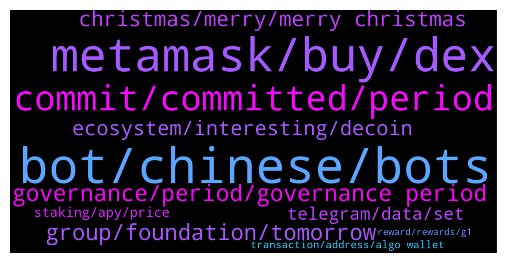

# **@algorand**
 ## Analysis for **2021-12-24** - **2021-12-25**.

---

## 📊 **Basic Stats**

**n_messages_sent**: 274

---

---

## 🔝 **Top keywords and related messages**

1. **bot, chinese, bots**

    @riqua21 --- *I know but I was wondering if race does play into perceptions about an account being a bot.  I'm sure it does but it's unconscious* **--->** [TG Discussion](https://t.me/algorand/325172)

    @mrlovin --- *Why each bot takes profile pictures of Chinese woman?* **--->** [TG Discussion](https://t.me/algorand/325154)

    @mrlovin --- *But if you see a Chinese women texting „hi“ it becomes obvious that it is a bot   If they would have a bot as profile pic I wouldn’t think so  Because a bot never says he is one* **--->** [TG Discussion](https://t.me/algorand/325157)

    @riqua21 --- *what if the pic was of a white woman, like Scarlett Johansson?* **--->** [TG Discussion](https://t.me/algorand/325165)

    @mrlovin --- *If each not would have a picture of a white women but behave like a bot I would also doubt accounts which have such pictures  The same for black man and so on  Nothing racist here* **--->** [TG Discussion](https://t.me/algorand/325169)

    @Lina --- *Why, I’m not a robot, even though I have Asian female avatars* **--->** [TG Discussion](https://t.me/algorand/325347)

2. **metamask, buy, dex**

    @AgenteBanderas --- *Hello everyone, I have a question, do you by chance know if in the next updates of the algo wallet there will be the possibility to buy algo directly from the wallet (something like metamask whit eth) without going through the exchanges?* **--->** [TG Discussion](https://t.me/algorand/325382)

    @mrlovin --- *If I remember correctly you can’t swap directly on Metamask as well. You still have to go to a dex and just approve the transaction with Metamask. It works the same with algo. You go to a dex and approve the transaction with the algowallet.* **--->** [TG Discussion](https://t.me/algorand/325385)

    @NightAlgorand --- *Nah, we dont run on trc20.* **--->** [TG Discussion](https://t.me/algorand/325212)

    @Chrissy --- *Hey how's it going ? Just wondering about depositing usdt into my Algo wallet does it run on trc20* **--->** [TG Discussion](https://t.me/algorand/325210)

    @revann98 --- *just wondering, will there any Algo name service?* **--->** [TG Discussion](https://t.me/algorand/325370)

    @mrlovin --- *What is the difference from using Metamask on a dex to using Algowallet on a dex?* **--->** [TG Discussion](https://t.me/algorand/325388)

3. **commit, committed, period**

    @hostodi --- *You can change now. Just commit again with a different amount* **--->** [TG Discussion](https://t.me/algorand/325594)

    @Jessie --- *How do i change the amount of algos committed? It says i can until 1/7/22.* **--->** [TG Discussion](https://t.me/algorand/325588)

    @Wurzelbear --- *Can you add more during the registration period or is the commit final?* **--->** [TG Discussion](https://t.me/algorand/325782)

    @rodde --- *Is it possible to uncommit before the 3 months? Say if I need to sell for whatever reason* **--->** [TG Discussion](https://t.me/algorand/325758)

    @MackDenver --- *Hey there, the button for changing your commit should be made available soon* **--->** [TG Discussion](https://t.me/algorand/325780)

    @pandemoniumq8 --- *I commited a wrong amount for period 2, less than i wanted to.. Is it possible to change/add more algo?* **--->** [TG Discussion](https://t.me/algorand/325779)

4. **governance, period, governance period**

    @aleks_qaz --- *And when does this vote end?* **--->** [TG Discussion](https://t.me/algorand/325752)

    @Wurzelbear --- *You can register as a governer for coming period* **--->** [TG Discussion](https://t.me/algorand/325473)

    @0x --- *This message is sign up period for governance 2#* **--->** [TG Discussion](https://t.me/algorand/325475)

    @MackDenver --- *The proposal details will be revealed once the governance phase starts* **--->** [TG Discussion](https://t.me/algorand/325359)

    @MackDenver --- *Hell Aleks, Here is the governance voting guide: https://algorandfoundationv2.cdn.prismic.io/algorandfoundationv2/99a613ce-ae6a-46b7-817b-f6a78edf2694_Algorand+COmmunity+Governance+Guide+-+Period+2_en-IE_V3.pdf* **--->** [TG Discussion](https://t.me/algorand/325749)

    @aleks_qaz --- *How to participate in governance voting?* **--->** [TG Discussion](https://t.me/algorand/325748)

5. **group, foundation, tomorrow**

    @Real_Noonlord --- *Hello, i have a question. Official algorand Turkish group is full of spam and admin is getting paid for nothing. He seldomly shares some tweets and goes away. Also group is full of spambots and it is not maintained well.* **--->** [TG Discussion](https://t.me/algorand/325281)

    @MackDenver --- *You should join the Spanish group  https://t.me/algorand_es* **--->** [TG Discussion](https://t.me/algorand/325289)

    @lovemelbourne --- *Am just asking in their group they are saying something about partnership* **--->** [TG Discussion](https://t.me/algorand/325242)

    @MackDenver --- *We are glad to have your interest. Let me know if you have any questions* **--->** [TG Discussion](https://t.me/algorand/325700)

    @Elmenjo --- *The foundation api said it will start tomorrow 25, on Twitter it said few hours. What is correct?* **--->** [TG Discussion](https://t.me/algorand/325361)

    @Real_Noonlord --- *Thanks. Also he made a nft competition sponsored by foundation but didn't announce the winners. And he probably doesn't have enough English as he seems to use Google translate for translating tweets* **--->** [TG Discussion](https://t.me/algorand/325285)

6. **christmas, merry, merry christmas**

    @mrlovin --- *Chainhed it during the conversation thought it would be fun* **--->** [TG Discussion](https://t.me/algorand/325178)

    @mcmaxims --- *Wish you a merry Christmas as well my friend* **--->** [TG Discussion](https://t.me/algorand/325777)

    @Susan --- *Time to wear my Christmas costume tonight* **--->** [TG Discussion](https://t.me/algorand/325693)

    @crypto_punk01 --- *Merry Xmas and happy NY In advance* **--->** [TG Discussion](https://t.me/algorand/325668)

    @hope9999999 --- *Stay away from Santa . Santa is second name of Satan 🤣🤣🤣* **--->** [TG Discussion](https://t.me/algorand/325547)

    @AlexanderShosha --- *Merry Christmas to the Algorand community!* **--->** [TG Discussion](https://t.me/algorand/325307)

7. **ecosystem, interesting, decoin**

    @BBeniek --- *But what else? There are many interesting projects with their own coin on Algorand* **--->** [TG Discussion](https://t.me/algorand/325703)

    @OKEx_Gody --- *The project side is too academic* **--->** [TG Discussion](https://t.me/algorand/325253)

    @esttty --- *hi, there’s any news about defi platform in development by algorand foundation, now the tvl is 100m.* **--->** [TG Discussion](https://t.me/algorand/325509)

    @FereydoonAttar --- *Got to love the fact the CEX like Decoin decided to list our token* **--->** [TG Discussion](https://t.me/algorand/325689)

    @Atbash1984 --- *I would like to help the ecosystem expand* **--->** [TG Discussion](https://t.me/algorand/325699)

    @hostodi --- *So this next vote will be about ecosystem funding allocation. Interesting* **--->** [TG Discussion](https://t.me/algorand/325554)

8. **telegram, data, set**

    @paulinhoa1 --- *all messengers do and social medias do😞* **--->** [TG Discussion](https://t.me/algorand/325682)

    @patrick_crypto --- *Not an official group but you might try @algorand_price I have an automatic translator set up so assuming you have your language set in Telegram, it should automatically translate to/from  your native language and the channel’s set language (English)* **--->** [TG Discussion](https://t.me/algorand/325287)

    @mathis_be --- *Take Secretum for example. You log in only with your wallet public address and that is all info the messenger gets from you. There is no way it will use it for ads or loss any sensible data.* **--->** [TG Discussion](https://t.me/algorand/325686)

    @davkelone --- *yeah, but that means they collect users data and use it. I am not ok with that.* **--->** [TG Discussion](https://t.me/algorand/325681)

    @Flor --- *What I mean is that can it go like sol* **--->** [TG Discussion](https://t.me/algorand/325195)

    @NightAlgorand --- *Please go to tinyman telegram and contact their admin* **--->** [TG Discussion](https://t.me/algorand/325799)

9. **staking, apy, price**

    @Wurzelbear --- *Will the staking rewards go up again or stay that low?* **--->** [TG Discussion](https://t.me/algorand/325409)

    @jakaaaas --- *why is the staking APR very low* **--->** [TG Discussion](https://t.me/algorand/325723)

    @hostodi --- *Accelerated vesting ended but the vested tokens aren't all sold. There's also structured selling* **--->** [TG Discussion](https://t.me/algorand/325549)

    @MJayCrypto --- *How come I don't get any staking rewards in the last months on my Algorand wallet? Has something changed?* **--->** [TG Discussion](https://t.me/algorand/325609)

    @aleks_qaz --- *hey folks, just wanted to check if the current algo staking apy is under 1%?* **--->** [TG Discussion](https://t.me/algorand/325419)

    @MackDenver --- *It is the yearly reward. The staking APY was reduced. You can participate in the governance, commit your ALGO for a higher APY* **--->** [TG Discussion](https://t.me/algorand/325789)

10. **transaction, address, algo wallet**

    @IncarnadineGlaze --- *if i have committed algos via the 0 transaction process but didn't put a note, do I have to repeat the process? I saw that my wallet address did appear in the governors page* **--->** [TG Discussion](https://t.me/algorand/325629)

    @KAPIBAYSIDE --- *Is there a way to double check your seed phrase after wallet creation on my algo wallet* **--->** [TG Discussion](https://t.me/algorand/325528)

    @IncarnadineGlaze --- *but im assuming 0 algo transaction* **--->** [TG Discussion](https://t.me/algorand/325567)

    @Tiny_Philosopher_784 --- *Oh my algo wallet? I'm not sure* **--->** [TG Discussion](https://t.me/algorand/325533)

    @Tiny_Philosopher_784 --- *I left some extra spending money in the wallet.* **--->** [TG Discussion](https://t.me/algorand/325574)

    @Wurzelbear --- *Your wallet should show a message when you click on register* **--->** [TG Discussion](https://t.me/algorand/325477)

