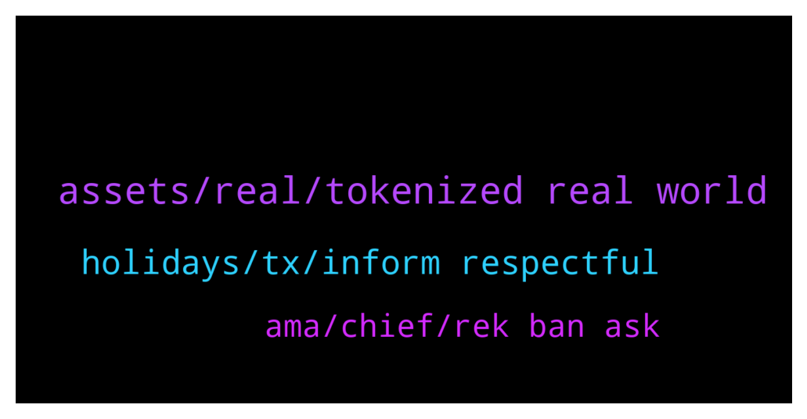

# **@ampnetapxchat**
 ## Analysis for **2021-12-20** - **2021-12-25**.

---

## 📊 **Basic Stats**

**n_messages_sent**: 35

---

---

## 🔝 **Top keywords and related messages**

1. **assets, real, tokenized real world**

    @PFCBLic --- *Ovo je 25 najperspektivnijih hrvatskih startupa koje vrijedi pratiti u 2022. - Poslovni dnevnik https://www.poslovni.hr/sci-tech/ovo-je-25-najperspektivnijih-hrvatskih-startupa-koje-vrijedi-pratiti-u-2022-4318317* **--->** [TG Discussion](https://t.me/ampnetapxchat/35835)

    @PFCBLic --- *Not bad article for slavic readers* **--->** [TG Discussion](https://t.me/ampnetapxchat/35836)

    @KonradCapital --- *Tokenized real world assets is a very new concept and will take trial and error to be done correctly. But I know @mislavjavor won’t give up so it’s just a matter of time before AMPNET gets it right. Like I said before I would recommend they make a platform and that platform provides all the services needed for tokenizing and investing in tokenized real world assets* **--->** [TG Discussion](https://t.me/ampnetapxchat/35797)

    @PFCBLic --- *Maybe this? We are rekt because our investment decision... Nothing else... Live with it mate... I know it bugs you but only person you can hold responsible is you and fud stops there* **--->** [TG Discussion](https://t.me/ampnetapxchat/35772)

    @matejmz --- *Token price is only 26x away from 2021 goal set by team. 10 days remaning, let's go* **--->** [TG Discussion](https://t.me/ampnetapxchat/35763)

    @AvanaLu --- *Looking forward to it Mislav and team 🤙* **--->** [TG Discussion](https://t.me/ampnetapxchat/35738)

2. **holidays, tx, inform respectful**

    @mislavjavor --- *Hey community. I know we've been silent for a while but there was really nothing major to report.   However, we are pleased to say we have some very big news which will be released at the beginning of January.   I would love to inform you more, however we have to be respectful towards our contractual obligations.* **--->** [TG Discussion](https://t.me/ampnetapxchat/35728)

    @runex_x1 --- *Would be nice if you guys could do a pontoondao-progress update before going into the holidays. Tx* **--->** [TG Discussion](https://t.me/ampnetapxchat/35725)

    @<UNK> --- *https://t.me/ampnetapxchat/35378 This is the latest update on DAO and overall situation, next one will be after the holidays* **--->** [TG Discussion](https://t.me/ampnetapxchat/35726)

    @runex_x1 --- *Let's just wait and see for January... Then we can ask questions I suppose 😉. Enjoy the end of the year. Tx* **--->** [TG Discussion](https://t.me/ampnetapxchat/35793)

    @runex_x1 --- *ok. I suppose there is nothing new to report for now then. Tx* **--->** [TG Discussion](https://t.me/ampnetapxchat/35727)

    @North --- *Hey community. I know we've been silent for a while but there was really nothing major to report.   However, we are pleased to say we have some very big news which will be released at the beginning of January.   I would love to inform you more, however we have to be respectful towards our contractual obligations.* **--->** [TG Discussion](https://t.me/ampnetapxchat/35794)

3. **ama, chief, rek ban ask**

    @<UNK> --- *Please read community guidelines, next time  https://t.me/ampnetapxchat/20271* **--->** [TG Discussion](https://t.me/ampnetapxchat/35754)

    @IncogSen --- *U rek me and you ban me?* **--->** [TG Discussion](https://t.me/ampnetapxchat/35752)

    @Troop --- *Hahahaha You are asking to be banned and then talking sh*** when Chat chief bans you... If I was the Chief I would ban you immediately for life.* **--->** [TG Discussion](https://t.me/ampnetapxchat/35791)

    @matejmz --- *I would remove AMA too if I wanted to avoid questions 🤷🏻‍♂️* **--->** [TG Discussion](https://t.me/ampnetapxchat/35781)

    @IncogSen --- *Remember ama were removed at a vital period* **--->** [TG Discussion](https://t.me/ampnetapxchat/35780)

    @mislavjavor --- *I ask for just a little bit more patience :)* **--->** [TG Discussion](https://t.me/ampnetapxchat/35729)

