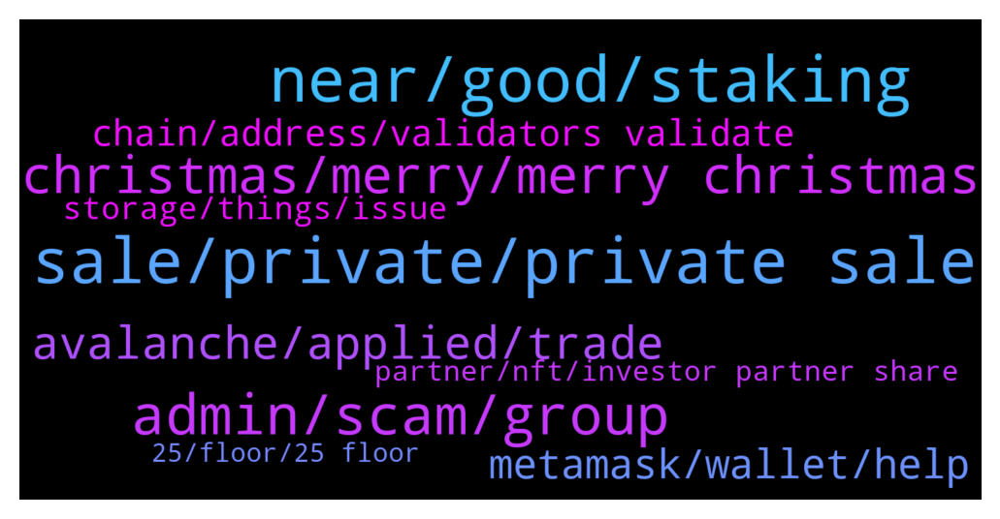

# **@avalancheavax**
 ## Analysis for **2021-12-24** - **2021-12-25**.

---

## 📊 **Basic Stats**

**n_messages_sent**: 240

---

---

## 🔝 **Top keywords and related messages**

1. **sale, private, private sale**

    @Jules 🔺 --- *team can sell I think 5 years after ico. that is published too* **--->** [TG Discussion](https://t.me/avalancheavax/317394)

    @Alex --- *I've been asking for months. Sir. And that is false because last month the team revealed it was locked for years but didn't reveal the entire schedule.* **--->** [TG Discussion](https://t.me/avalancheavax/317414)

    @Alex --- *Jules 🔺 just to prove my point, the entire cult group has plenty of ico investors and none will know the vested schedule from 3ac and polychain.* **--->** [TG Discussion](https://t.me/avalancheavax/317419)

    @Nicolas_A --- *Well it was 470 9 months ago ^^ It's a process* **--->** [TG Discussion](https://t.me/avalancheavax/316920)

    @Alex --- *My question is when these tokens get unlocked. I couldn't care less where it comes from - just your inability to find where it came from already tells u what u need to know.* **--->** [TG Discussion](https://t.me/avalancheavax/317408)

    @qllnppr --- *Anyone have a recent estimate on the time for syncing up a brand new node?* **--->** [TG Discussion](https://t.me/avalancheavax/317316)

2. **near, good, staking**

    @Nicolas_A --- *Look if you can’t sleep because you think 3ac is gonna wake up one day and market sell all their holdings I would just recommend getting rid of your avax* **--->** [TG Discussion](https://t.me/avalancheavax/317432)

    @W --- *but ya agree, a direct bridge Avax-Near or Aurora would be much nicer* **--->** [TG Discussion](https://t.me/avalancheavax/316983)

    @metad3pt --- *we're avaware.network we've been around since before most projects* **--->** [TG Discussion](https://t.me/avalancheavax/317484)

    @Alex --- *AVAX had a 2 billion mkt cap at the time of sale. With the vesting schedule unknown (being unlocked right now as u assume) it can be over 10 percent at this moment.* **--->** [TG Discussion](https://t.me/avalancheavax/317433)

    @VatsalS33 --- *Good to see fellow Indian Avax maxis :)* **--->** [TG Discussion](https://t.me/avalancheavax/317093)

    @Nicolas_A --- *Around 10% paid out in avax* **--->** [TG Discussion](https://t.me/avalancheavax/317470)

3. **admin, scam, group**

    @chloe_edwards --- *I just got a message from community Admin is it real or scam ?* **--->** [TG Discussion](https://t.me/avalancheavax/317197)

    @Chab --- *A Admin write me privat. He said.. ich will fickificki bumsiblasi machen. What does this mean ?* **--->** [TG Discussion](https://t.me/avalancheavax/317464)

    @boostoss --- *Dude shut up and listen to Nicolas only, block everyone else* **--->** [TG Discussion](https://t.me/avalancheavax/317143)

    @Nicolas_A --- *Scam no admin will ever dm you first* **--->** [TG Discussion](https://t.me/avalancheavax/317201)

    @SeqAnto --- *He tries to scam in pm* **--->** [TG Discussion](https://t.me/avalancheavax/317115)

    @swamptvar --- *but seriously, it’s a scammer guys, watch out* **--->** [TG Discussion](https://t.me/avalancheavax/317295)

4. **christmas, merry, merry christmas**

    @Nicolas_A --- *My god I’m going to close the chat for the day and try to enjoy Christmas alone* **--->** [TG Discussion](https://t.me/avalancheavax/317436)

    @Nicolas_A --- *Already plenty of them out there ^^* **--->** [TG Discussion](https://t.me/avalancheavax/317301)

    @elizabeth_baker --- *Have a safe holiday with your loved ones* **--->** [TG Discussion](https://t.me/avalancheavax/317451)

    @TheSEOdude --- *Yesh he is being paid. But it's Christmas and everybody has family.  So calm down a bit.* **--->** [TG Discussion](https://t.me/avalancheavax/317359)

    @SeqAnto --- *Best wishes to everyone, I hope that Santa Claus has brought you many, many Avax 🔺 without KYC 😜* **--->** [TG Discussion](https://t.me/avalancheavax/317210)

    @MidgetGems --- *Happy Christmas avax family, hope you all have a good one* **--->** [TG Discussion](https://t.me/avalancheavax/317287)

5. **avalanche, applied, trade**

    @svnods --- *I don't know. They just say that they applied for Know your customer program at Avalanche* **--->** [TG Discussion](https://t.me/avalancheavax/317346)

    @metad3pt --- *Embr is a new BalancerV2 fork on Avalanche, chekk it out at https://embr.finance* **--->** [TG Discussion](https://t.me/avalancheavax/317074)

    @bestcoderna --- *Join us for our Avalanche Weekly Wrapup https://twitter.com/i/spaces/1ypKdEeNXaaGW* **--->** [TG Discussion](https://t.me/avalancheavax/317191)

    @Skybax007 --- *Hello, I have BUSD on BSC and would like to get USDT on Avalanche. What is the best way? Bridging?* **--->** [TG Discussion](https://t.me/avalancheavax/317009)

    @svnods --- *Hello guys, there is a project on Avalanche called Traverse and, their website is traverse.money , they say that they applied for KYC to Ava Labs If there is any official here, how can we confirm that if they're really applied for something or not_* **--->** [TG Discussion](https://t.me/avalancheavax/317330)

    @Saehuns --- *Avalanche will go Mars in 2023* **--->** [TG Discussion](https://t.me/avalancheavax/317242)

6. **metamask, wallet, help**

    @Vas_Alexandra --- *Hello!I am new to Avalaunch system. Please help me to solve one problem.I connected Avalaunch network to Metamask and then send Avax from Gate exchange directly to my Metamask address. But I haven't recieved it yet....22hours ago. How can i fix it? Transaction is completed on the side of Gate, i reset Metamask and tried android app for Metamask but without results....* **--->** [TG Discussion](https://t.me/avalancheavax/317033)

    @Twoeazy --- *Hi ive had a transaction stuck for a while, the stuck transaction is for more avax then i have* **--->** [TG Discussion](https://t.me/avalancheavax/316966)

    @oathtobarbatos --- *Careful with anyone's DM! You could try asking for support here: chat.avax.network* **--->** [TG Discussion](https://t.me/avalancheavax/317004)

    @Nicolas_A --- *You sure you restored the same seed phrase ? It should work afaik. Weird* **--->** [TG Discussion](https://t.me/avalancheavax/317478)

    @li --- *In the avanche wallet,I need help* **--->** [TG Discussion](https://t.me/avalancheavax/317083)

    @oathtobarbatos --- *This is a Metamask issue, try restarting your Metamask account* **--->** [TG Discussion](https://t.me/avalancheavax/316970)

7. **chain, address, validators validate**

    @azzix --- *Do I need to run node to create tokens on x chain? Is it requirement?* **--->** [TG Discussion](https://t.me/avalancheavax/317322)

    @azzix --- *Can i transfer any token from x chain to c chain?* **--->** [TG Discussion](https://t.me/avalancheavax/317303)

    @li --- *Can I exchange the C-chain address?* **--->** [TG Discussion](https://t.me/avalancheavax/317082)

    @Nicolas_A --- *Never used them. It should show it on this page https://ascendex.com/en/assets/assets-recharge/AVAX If it gives you a deposit address starting with 0x it will be C chain if it gives you a X-avax1 address it will be X chain* **--->** [TG Discussion](https://t.me/avalancheavax/317449)

    @NoGivenUp --- *I don't have enough avax where would I leave it into? I means which chain would you recommend? It s on P chain at the moment* **--->** [TG Discussion](https://t.me/avalancheavax/317473)

    @Nicolas_A --- *It will probably be C chain* **--->** [TG Discussion](https://t.me/avalancheavax/317450)

8. **storage, things, issue**

    @Nicolas_A --- *Yeah storage is a big issue in scalability. Still you have plenty of others things to optimize as well* **--->** [TG Discussion](https://t.me/avalancheavax/317389)

    @Nicolas_A --- *Being optimized for their specific use case* **--->** [TG Discussion](https://t.me/avalancheavax/317341)

    @ManyWizz --- *There is an interesting project which aims to address storage issue, BLZ(Bluezelle). There exist other too, but it is IMHO one of the most promising. Would be great to see collaboration between the teams.  There are optimisations on the chain level. So this issue is in the process of solving. Crypto is very raw technology, and as it was pointed out in this chat, has plenty of things to be done and solved.* **--->** [TG Discussion](https://t.me/avalancheavax/317400)

    @neirenoir --- *I think storage would be alleviated if Solidity libraries were more common* **--->** [TG Discussion](https://t.me/avalancheavax/317393)

    @qllnppr --- *Yeah, ssd but running in a VM so that probably slows things down a bit.* **--->** [TG Discussion](https://t.me/avalancheavax/317320)

    @Nicolas_A --- *Do you have an Ssd ? It’s pretty much a requirement. Even better if it’s NVMe* **--->** [TG Discussion](https://t.me/avalancheavax/317319)

9. **partner, nft, investor partner share**

    @Alex --- *Not only is it disingenuous to your early investors, it has become borderline a pnd* **--->** [TG Discussion](https://t.me/avalancheavax/317399)

    @YouAreScammer --- *Will Avalance become a full partner to the Digital Pound Foundation or will it always just be an associate partner?* **--->** [TG Discussion](https://t.me/avalancheavax/317160)

    @bestcoderna --- *AMA with Chikn NFT starting in 10 mins https://twitter.com/WeekInAvalanche/status/1474179601207332864?s=20* **--->** [TG Discussion](https://t.me/avalancheavax/316986)

    @Tonyrohitf --- *My friend also looking for investor partner* **--->** [TG Discussion](https://t.me/avalancheavax/317240)

    @oldangusred --- *Hi! Can I share here an NFT initiative for charity? Thank you!* **--->** [TG Discussion](https://t.me/avalancheavax/317211)

    @TheSEOdude --- *I have been talking with one for the last 3 days. Really wanna see how far he is gonna go.* **--->** [TG Discussion](https://t.me/avalancheavax/317104)

10. **25, floor, 25 floor**

    @Nicolas_A --- *It's simply at 32 instead of 25 which is the floor ^^* **--->** [TG Discussion](https://t.me/avalancheavax/316916)

    @aco1731 --- *why 25 is the floor... even 25 is expensive today lol* **--->** [TG Discussion](https://t.me/avalancheavax/316917)

    @aco1731 --- *in usd terms never was so expensive for sure* **--->** [TG Discussion](https://t.me/avalancheavax/316921)

    @LeonSeah --- *Is it defi? Or fiat on ramp platform* **--->** [TG Discussion](https://t.me/avalancheavax/317459)

    @aakash297 --- *Defrost finance is at its best price possible!🔥* **--->** [TG Discussion](https://t.me/avalancheavax/317023)

    @retiredcoin --- *how is 25 the floor and what 25? units please* **--->** [TG Discussion](https://t.me/avalancheavax/316923)

