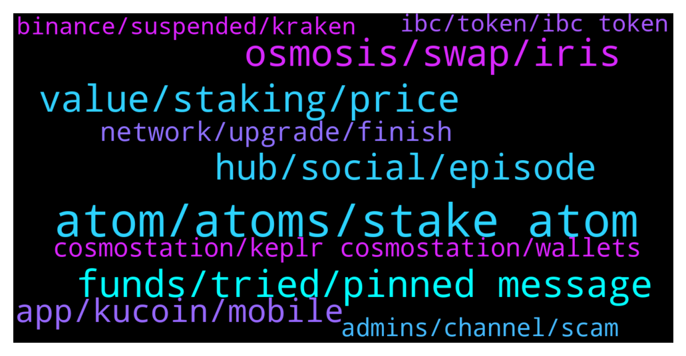

# **@cosmosproject**
 ## Analysis for **2021-12-24** - **2021-12-25**.

---

## 📊 **Basic Stats**

**n_messages_sent**: 318

---

---

## 🔝 **Top keywords and related messages**

1. **atom, atoms, stake atom**

    @ZoltanAtom --- *Hi there,if your Atom at Keplr or Cosmostation wallets, you are able to Stake your Atom. If you hold your Atoms at another non-custodial wallets, I suggest you to import your mnemonics seed to recommended wallets.(Keplr/Cosmostation)* **--->** [TG Discussion](https://t.me/cosmosproject/459297)

    @ramirolozc --- *What is happening that I cannot deposit atom into exchanges?* **--->** [TG Discussion](https://t.me/cosmosproject/459081)

    @ZoltanAtom --- *As I told you, Atom withdrawals and deposits are opened at Cryptcom, kraken or Coinbase! Check those exchanges  and send your atoms from wallet to exchange to trade your Atom.* **--->** [TG Discussion](https://t.me/cosmosproject/459428)

    @Flavio --- *Hi, to stake ATOM in the DeFi Wallet (of Crypto,com) is there a minimum amount of ATOM? I deposited 1,496 but I can't do anything. Thank you* **--->** [TG Discussion](https://t.me/cosmosproject/459122)

    @Jokrogge --- *just a noob question: i have some atom staked but i can see from ledger live and kepler two differents atom staked numbers, is this correct? i see around 15/20% less Atom in ledger live* **--->** [TG Discussion](https://t.me/cosmosproject/459394)

    @ZoltanAtom --- *Generally minimum staked of Atom for airdrops is 5* **--->** [TG Discussion](https://t.me/cosmosproject/459404)

2. **funds, tried, pinned message**

    @ZoltanAtom --- *Hi there,please check the pinned message* **--->** [TG Discussion](https://t.me/cosmosproject/459513)

    @en0N3 --- *I see, i am waiting to make other operations next days. I try your solution once i get my wallet empty from other funds* **--->** [TG Discussion](https://t.me/cosmosproject/459184)

    @jason13689 --- *But trust wallet still not working for transfer* **--->** [TG Discussion](https://t.me/cosmosproject/459027)

    @MK --- *Ah ok. I’ll try that way. Thanks Jazz* **--->** [TG Discussion](https://t.me/cosmosproject/459306)

    @Jokrogge --- *its ok, thank u so much 👍* **--->** [TG Discussion](https://t.me/cosmosproject/459403)

    @AtomJazz --- *That should work and it shouldn't take more than few minutes* **--->** [TG Discussion](https://t.me/cosmosproject/459106)

3. **osmosis, swap, iris**

    @ZoltanAtom --- *Go to assets on Osmosis. Click the “deposit” and after swap IRIS to Atom. Please join osmosis channel ;  https://t.me/osmosis_chat* **--->** [TG Discussion](https://t.me/cosmosproject/459498)

    @Cordtus --- *Yeah just send it back to osmosis chain. Then you can swap it or whatever you want to do on osmosis which is an actual functioning dex with rewards.* **--->** [TG Discussion](https://t.me/cosmosproject/459680)

    @Cordtus --- *Look on osmosis. Any of those work with keplr and you can use osmosis to swap them.* **--->** [TG Discussion](https://t.me/cosmosproject/459245)

    @MK --- *I have IRIS in Keplr and connect with osmosis but it does show my IRIS amount in the Osmosis, only in Keplr. What should I do to swap Iris to Atom?* **--->** [TG Discussion](https://t.me/cosmosproject/459497)

    @ZoltanAtom --- *Please join Osmosis channel too ;  https://t.me/osmosis_chat* **--->** [TG Discussion](https://t.me/cosmosproject/459551)

    @Cordtus --- *Osmosis Lab $OSMO [ADMINS NEVER DM] Osmosis $OSMO Fundamental Discussion and Price Speculation chat. app.osmosis.zone $ION t.me/IONGovernanceWorkingGroup https://t.me/osmosis_chat* **--->** [TG Discussion](https://t.me/cosmosproject/459247)

4. **value, staking, price**

    @AtomJazz --- *Interchain security, Interchain accounts, liquid staking... Crazy bullish* **--->** [TG Discussion](https://t.me/cosmosproject/459069)

    @Cordtus --- *And even if you do have value it doesn't mean it's justified. Investors are stupid. Dogecoin is literally a Ponzi scheme memecoin that was in top 10 mcap for an embarrassingly long time* **--->** [TG Discussion](https://t.me/cosmosproject/459203)

    @joey19944 --- *And what happens if you go bankrupt* **--->** [TG Discussion](https://t.me/cosmosproject/459326)

    @MK --- *And how do you stake it? Sorry keep asking many questions. 🙏🏻* **--->** [TG Discussion](https://t.me/cosmosproject/459502)

    @joey19944 --- *So my tokens are locked up and what happens? I can spend them while they are staked ?* **--->** [TG Discussion](https://t.me/cosmosproject/459323)

    @joey19944 --- *Still don’t understand it fully seems so complicated* **--->** [TG Discussion](https://t.me/cosmosproject/459332)

5. **hub, social, episode**

    @lightsascha --- *Woah, the Roadmap for 2022 is so exciting! So much happening and coming for us Cosmonauts ❤️❤️😍😍  https://blog.cosmos.network/whats-coming-to-cosmos-in-2022-ce8e48d383ab* **--->** [TG Discussion](https://t.me/cosmosproject/459066)

    @lightsascha --- *Truly unique, what Cosmos enables. And now also the hint of Cosmwasm on the hub, I think this is great news 😊😊* **--->** [TG Discussion](https://t.me/cosmosproject/459068)

    @jason13689 --- *Cosmos is going through an upgrade, when will it  be ready?* **--->** [TG Discussion](https://t.me/cosmosproject/459025)

    @feeshy --- *Doesn't it have to be sent with cosmos network to arrive on Keplr?* **--->** [TG Discussion](https://t.me/cosmosproject/459246)

    @NikoDMT --- *Happy Holidays cosmonauts. You're doing God's work and I'm grateful you exist.* **--->** [TG Discussion](https://t.me/cosmosproject/459563)

    @lightsascha --- *And also partially as early as January and February! Truly stellar!* **--->** [TG Discussion](https://t.me/cosmosproject/459072)

6. **app, kucoin, mobile**

    @MK --- *In the Keplr, I see only one address* **--->** [TG Discussion](https://t.me/cosmosproject/459462)

    @ZoltanAtom --- *Keplr mobile app only supports 4 chain at the moment. Please use Cosmostation app or Keplr web wallet to get your IRIS address.* **--->** [TG Discussion](https://t.me/cosmosproject/459466)

    @mahyarblue --- *I asks me to connect to Keplr* **--->** [TG Discussion](https://t.me/cosmosproject/459430)

    @ZoltanAtom --- *Yes there might be some errors. Better to use Keplr!* **--->** [TG Discussion](https://t.me/cosmosproject/459401)

    @Cordtus --- *The only keplr for pc is a chrome extension made by chainapsis just verify any links you find.* **--->** [TG Discussion](https://t.me/cosmosproject/459182)

    @Dani --- *No. I do everything in Keplr app.* **--->** [TG Discussion](https://t.me/cosmosproject/459054)

7. **network, upgrade, finish**

    @terradis --- *let just wait till their network is fully updated* **--->** [TG Discussion](https://t.me/cosmosproject/459488)

    @Slinger --- *Is the network upgrade still going on?* **--->** [TG Discussion](https://t.me/cosmosproject/459821)

    @yogasolovey --- *Hello everyone :) Tell me, when will the outputs to the network work?* **--->** [TG Discussion](https://t.me/cosmosproject/459512)

    @SoberaniaFin --- *Does anybody know for how long it will be this situation?* **--->** [TG Discussion](https://t.me/cosmosproject/459418)

    @AtomJazz --- *All we can do is focus on our network.* **--->** [TG Discussion](https://t.me/cosmosproject/459864)

    @Luke --- *When is the network update going to finish* **--->** [TG Discussion](https://t.me/cosmosproject/459854)

8. **cosmostation, keplr cosmostation, wallets**

    @Cordtus --- *Cosmostation or keplr wallet are the recommended wallets. Also ignore all DM right now they are scams* **--->** [TG Discussion](https://t.me/cosmosproject/459177)

    @HectorianFrog --- *Best wallet for to access cosmos?* **--->** [TG Discussion](https://t.me/cosmosproject/459569)

    @ZoltanAtom --- *Sure. Cosmostation is the recommended wallet. But you will need to use Keplr wallet to claim your airdrops. So you always have an option to import your mnemonics seed to Keplr. (If someone DM to you,block and report⚠️⚠️⚠️)* **--->** [TG Discussion](https://t.me/cosmosproject/459408)

    @piantif --- *Hi, do you use any app to track your assets on cosmos blockchain? is there an API?* **--->** [TG Discussion](https://t.me/cosmosproject/459501)

    @SoberaniaFin --- *Ok. So there is no way to trade Cosmos right now, is there? Neither in any wallet with exchange, right?* **--->** [TG Discussion](https://t.me/cosmosproject/459420)

    @Mathiax --- *Or you can also use cosmostation wallet on mobile.* **--->** [TG Discussion](https://t.me/cosmosproject/459770)

9. **admins, channel, scam**

    @Cordtus --- *No. They have been claiming "relayer issues" for about a month now. I don't want to FUD but I'm starting to get pretty suspicious of this. If it really is just relayer issues then it is trivial for them to spin up their own relayer. I as well as many other people have brought this up in their telegram channel many times now and every time I am completely ignored. Others have suggested things like buying out the LUNA that has been trapped on their chain for many weeks now but they still ignore every time. Admins will not even respond to the complaints.* **--->** [TG Discussion](https://t.me/cosmosproject/459885)

    @madave --- *tell your fren tell your doggo to keep their Cosmos airdrops staked. this is quickly becoming the biggest wagmi movement of crypto ))* **--->** [TG Discussion](https://t.me/cosmosproject/459036)

    @copperstone --- *where can I find the documentations to setup a node and be a validator?* **--->** [TG Discussion](https://t.me/cosmosproject/459111)

    @cronoscontinuum --- *Guys can we add the ChiHuaHua tipbot here? To tip cosmonauts in hua hua?* **--->** [TG Discussion](https://t.me/cosmosproject/459023)

    @ZoltanAtom --- *Hello,you should reach to devs on discord for technical questions;  https://discord.gg/vcExX9T* **--->** [TG Discussion](https://t.me/cosmosproject/459283)

    @AtomJazz --- *Hi there! Pls join our dev discord channel for all information regarding validating https://discord.gg/vcExX9T* **--->** [TG Discussion](https://t.me/cosmosproject/459112)

10. **binance, suspended, kraken**

    @fest8 --- *Please can you help? I have already suspended transactions on the Binance exchange for over five days now* **--->** [TG Discussion](https://t.me/cosmosproject/459096)

    @emrekilic28 --- *Why are the shots closed? binance* **--->** [TG Discussion](https://t.me/cosmosproject/459847)

    @ali_crypto1 --- *is it suspended also in binance* **--->** [TG Discussion](https://t.me/cosmosproject/459557)

    @AtomJazz --- *Binance has been having some unexplained issues. Coinbase, Cryptocom and Kraken work normally* **--->** [TG Discussion](https://t.me/cosmosproject/459082)

    @ebp700 --- *Damn to binance for trust wallet😡😡😡* **--->** [TG Discussion](https://t.me/cosmosproject/459086)

    @fest8 --- *I'm seriously hungry and I can access my money on binance* **--->** [TG Discussion](https://t.me/cosmosproject/459105)

