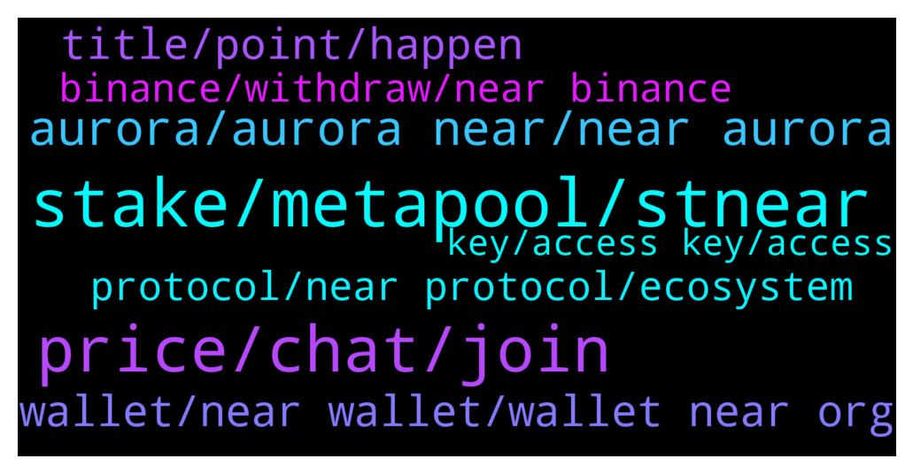

# **@cryptonear**
 ## Analysis for **2021-12-24** - **2021-12-25**.

---

## 📊 **Basic Stats**

**n_messages_sent**: 793

---

---

## 🔝 **Top keywords and related messages**

1. **stake, metapool, stnear**

    @FritzWagner --- *Thats right ! Thanks Vikash ! Metapool is awesome 🤩* **--->** [TG Discussion](https://t.me/cryptonear/250663)

    @enevve --- *Hey fam quick noob question, how much should I stake on DAI/wNEAR to get a decent income and still be secure of not falling into permanent loss? haha* **--->** [TG Discussion](https://t.me/cryptonear/251040)

    @Chad_Capital --- *don't see it on the near wallet sit staking list, wouldn't it be better to pick one from there?* **--->** [TG Discussion](https://t.me/cryptonear/250649)

    @Kripto_Raptor --- *even than you will face some IL on some occasions. If don't want to be exposed to IL you will go for single asset staking* **--->** [TG Discussion](https://t.me/cryptonear/251080)

    @FritzWagner --- *Metapool.app is the best choice from my point of view* **--->** [TG Discussion](https://t.me/cryptonear/250644)

    @kv9990 --- *Metapool stakes to a number of Validators and diversify your $NEAR to help in Decentralization :) it also offer liquid staking means instant unstaking without waiting 3 days to unstake. And you'll get stNear to use on other DeFi dapps on NEAR ✌️😀* **--->** [TG Discussion](https://t.me/cryptonear/250656)

2. **price, chat, join**

    @DeeCryptoGalaxy --- *On gate.io, price of Near was at 10k.... What's up with that?* **--->** [TG Discussion](https://t.me/cryptonear/249762)

    @marko_eth --- *do we have any whales here , i would kindly ask those people to dump the price , too much green dildos lately, who even buys at these prices, arent people aware there will...let me correct..there MUST be a correction, and it will only be as brutal as more we climb up...* **--->** [TG Discussion](https://t.me/cryptonear/250531)

    @iamkemoo --- *this is not from our chat here* **--->** [TG Discussion](https://t.me/cryptonear/250329)

    @larry_lang --- *for price movement pls go to this channel:  https://t.me/merchantsofnear* **--->** [TG Discussion](https://t.me/cryptonear/251270)

    @iamkemoo --- *You can find out more about TAs in the price chat: https://t.me/merchantsofnear* **--->** [TG Discussion](https://t.me/cryptonear/250090)

    @iamkemoo --- *for price and pump talks please go to our unofficial price channel: https://t.me/merchantsofnear* **--->** [TG Discussion](https://t.me/cryptonear/250256)

3. **aurora, aurora near, near aurora**

    @xerophyte --- *so is aurora like C chain, and near is like x chain, then i should be on the aurora for defi?* **--->** [TG Discussion](https://t.me/cryptonear/250859)

    @nitin_ag27 --- *How to transfer f aurora token to gate io..gate io showing aurora deposit address but not f aurora* **--->** [TG Discussion](https://t.me/cryptonear/250103)

    @iamkemoo --- *you must swap the fAURORA to AURORA first, please ask in https://t.me/auroraisnear channel for details* **--->** [TG Discussion](https://t.me/cryptonear/250118)

    @Kripto_Raptor --- *you can see all dApps building/running on Near/Aurora https://awesomenear.com/* **--->** [TG Discussion](https://t.me/cryptonear/250862)

    @小猪 --- *hello，i want to know the circulation of aurora* **--->** [TG Discussion](https://t.me/cryptonear/249616)

    @xerophyte --- *I am little confused between near and aurora 🙁 what is the different* **--->** [TG Discussion](https://t.me/cryptonear/250840)

4. **wallet, near wallet, wallet near org**

    @bailey_12 --- *go to wallet.near.org . Create a new wallet with domain ****.near* **--->** [TG Discussion](https://t.me/cryptonear/251367)

    @Gasidid --- *Hi I want to find link near domain name service* **--->** [TG Discussion](https://t.me/cryptonear/250686)

    @Fsboys --- *I have some problem about near wallet* **--->** [TG Discussion](https://t.me/cryptonear/250670)

    @enevve --- *it just displayed in my near wallet!* **--->** [TG Discussion](https://t.me/cryptonear/249369)

    @kv9990 --- *Create a wallet on wallet.near.org to get .near wallet ✌️😀* **--->** [TG Discussion](https://t.me/cryptonear/250691)

    @kv9990 --- *Near wallet is web wallet sir :) it won't need another dapp browser,just open another site in another tab and connect using your wallet!* **--->** [TG Discussion](https://t.me/cryptonear/249683)

5. **title, point, happen**

    @thanano46 --- *Yess that's the main point..sorry i forgot to tell this 😅* **--->** [TG Discussion](https://t.me/cryptonear/249503)

    @NEARverse_xd --- *Yes i know, only title is missing🤣* **--->** [TG Discussion](https://t.me/cryptonear/249797)

    @larry_lang --- *his title would be "NEAR B*tch) then=)))* **--->** [TG Discussion](https://t.me/cryptonear/249799)

    @bailey_12 --- *I am asking David on the forums to grant me that title personally* **--->** [TG Discussion](https://t.me/cryptonear/249805)

    @iamkemoo --- *What do you mean with Happen? Can you specify the question.* **--->** [TG Discussion](https://t.me/cryptonear/249983)

    @kv9990 --- *Hehe 😆 what's the query sir,I'm good at googling 😎* **--->** [TG Discussion](https://t.me/cryptonear/249131)

6. **protocol, near protocol, ecosystem**

    @tibgram --- *What is the shading protocol ?* **--->** [TG Discussion](https://t.me/cryptonear/250309)

    @shirley --- *What is relationship between near and Uniarts? Why they host ama together sir* **--->** [TG Discussion](https://t.me/cryptonear/251501)

    @redakb9 --- *Hi guys anyone have shitcoins groups on near ecosystem* **--->** [TG Discussion](https://t.me/cryptonear/249755)

    @shirley --- *Hey do near protocol has ama with Uniarts?* **--->** [TG Discussion](https://t.me/cryptonear/251452)

    @TheGo1denBull --- *Thanks. This uptick is having a lot of new members who are rushing in not the ecosystem without a clue* **--->** [TG Discussion](https://t.me/cryptonear/249547)

    @larry_lang --- *https://medium.com/nearprotocol/how-nears-simple-nightshade-gives-dapps-infinite-scalability-433188d2ef1e Just found another interesting article that explain Sharding with the scalability of Dapps👀👀* **--->** [TG Discussion](https://t.me/cryptonear/251508)

7. **binance, withdraw, near binance**

    @TJ --- *Is there any way I can deposit NEAR to my NEAR wallet for now? I usually use Binance but now the network is suspended* **--->** [TG Discussion](https://t.me/cryptonear/251345)

    @paperdawg --- *Hi, if im sending NEAR from binance to binance what network should i use? ERC20?* **--->** [TG Discussion](https://t.me/cryptonear/249486)

    @henrysamson1 --- *hi there, i can not withdraw near from binance to my near wallet, anyone here could please give me some near to make fee. min is 0.002 and my wallet is sonhuynh123.near* **--->** [TG Discussion](https://t.me/cryptonear/251120)

    @cashewme --- *So any tips on how i can get NEAR in my wallet. Binance cant withdraw* **--->** [TG Discussion](https://t.me/cryptonear/251587)

    @nicolassssssssssssssss --- *Withdraw near on binance is not possible - anybody else experiencing this?* **--->** [TG Discussion](https://t.me/cryptonear/251756)

    @Davy --- *Hi Guys, new NEAR hodler here, bought a load last night and want to stake them. Binance isn't letting me withdraw to NEAR wallet. Is this temporary or will it be up and running soon?  Ps: hello from Ireland 👍* **--->** [TG Discussion](https://t.me/cryptonear/251651)

