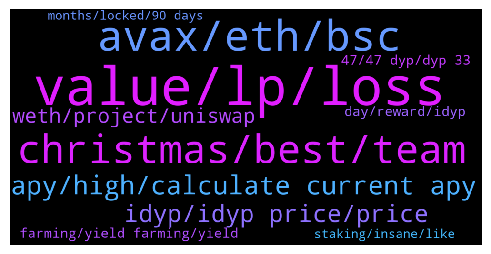

# **@dypfinance**
 ## Analysis for **2021-12-24** - **2021-12-25**.

---

## 📊 **Basic Stats**

**n_messages_sent**: 153

---

---

## 🔝 **Top keywords and related messages**

1. **value, lp, loss**

    @James --- *Hi - I have had a similar issue to those above - I deposited 500 BUSD into the 30day v2 BSC yield farm on 15/12. Despite both dyp/bnb increasing in value since then - my deposit LP token is now only worth 250 USD (which even allowing for the DYP 25% still represents a significant loss). My understanding of impermanent loss is that if both tokens increase in value, it is very difficult to lose money by impermanent loss.. is there another explanation of where this money is being lost? I had a similar experience on the 3 day v2 BSC platform. My colleagues on avax / eth have not experienced this* **--->** [TG Discussion](https://t.me/dypfinance/232953)

    @LovelySuman86 --- *Yes mine 4800$ is 2400 now 😓 I am just waiting for no profit no loss to be happy, I made good gain in V1 but lost everything in V2* **--->** [TG Discussion](https://t.me/dypfinance/233000)

    @LovelySuman86 --- *Once market correct my value decrease drastically and when Mkt recover then value decrease gradually so in any case I have never seen value increasing* **--->** [TG Discussion](https://t.me/dypfinance/233009)

    @hemanrock --- *hi, 75% is in LP and 25% is in DYP. so, the BNB and iDYP price on the day of your deposit and now the price may be different. please go through more about IL.* **--->** [TG Discussion](https://t.me/dypfinance/232955)

    @Arslan_Farrukh --- *IL is more than actual gains. Not understanding how this thing is working by decreasing LP balance on consistent basis. Although APY is good but not worth it against IL. Bad experience 😐* **--->** [TG Discussion](https://t.me/dypfinance/232997)

    @hosimo --- *And is TVL amount affect the IL.* **--->** [TG Discussion](https://t.me/dypfinance/233375)

2. **avax, eth, bsc**

    @DhoniMSD516 --- *Hey make sure you hava enough avax to pay the fees for transactions* **--->** [TG Discussion](https://t.me/dypfinance/233249)

    @sinaht --- *I want to deposit wavax in farm v2 but i ge the error message “avax c-chain is not enough to pay for the miners* **--->** [TG Discussion](https://t.me/dypfinance/233248)

    @sinaht --- *You mean i have to have avax too in addition to wavax?* **--->** [TG Discussion](https://t.me/dypfinance/233252)

    @Skipper_IM --- *Can you give me advice? Where can I exchange WAVAX? SHould it be bridge to AVAX first?* **--->** [TG Discussion](https://t.me/dypfinance/233187)

    @DhoniMSD516 --- *Hey you need to follow this route BSC-ETH-AVAX because there is no direct bsc to avax bridge* **--->** [TG Discussion](https://t.me/dypfinance/233296)

    @memiamang --- *I think it might be a bug* **--->** [TG Discussion](https://t.me/dypfinance/233120)

3. **christmas, best, team**

    @NewCryptoWorldTrader --- *Can we expect Christmas Surprise within 6 days , before EOY👀💥* **--->** [TG Discussion](https://t.me/dypfinance/233354)

    @DhoniMSD516 --- *Hey as per roadmap it should be this month, please stay tuned for further updates in this regard :)* **--->** [TG Discussion](https://t.me/dypfinance/233160)

    @DhoniMSD516 --- *Please stay tuned for upcoming listings :)* **--->** [TG Discussion](https://t.me/dypfinance/233350)

    @Ltinaii --- *I wish you all a Merry Christmas.🎉* **--->** [TG Discussion](https://t.me/dypfinance/233343)

    @dulceazucar --- *Wish you all DYP TEAM a merry Christmas and hope you have the best present in the life , health and happiness. You are DYP TEAM all great and the best for me !!!👏🎁😻* **--->** [TG Discussion](https://t.me/dypfinance/233297)

    @dulceazucar --- *Wish you all DYP TEAM a merry Christmas and hope you will get the best present in the life , health and happiness. You are DYP TEAM all great and the best for me !!!👏🎁😻* **--->** [TG Discussion](https://t.me/dypfinance/233206)

4. **apy, high, calculate current apy**

    @DhoniMSD516 --- *As said this is all auto calculated by smart contracts based on APY all these days this apy is dynamic.* **--->** [TG Discussion](https://t.me/dypfinance/233121)

    @DhoniMSD516 --- *Hey the APY is dynamic so you earned as per the apy all these days, so this might be the value for your stake period* **--->** [TG Discussion](https://t.me/dypfinance/233114)

    @palms --- *Any problem? The avax farm is showing over 177,000,000%apy* **--->** [TG Discussion](https://t.me/dypfinance/233047)

    @DhoniMSD516 --- *Hey the APY on Kucoin depends on Kucoin but still I think it is 45% still a good APY* **--->** [TG Discussion](https://t.me/dypfinance/233346)

    @memiamang --- *So contract calculate beyond current apy* **--->** [TG Discussion](https://t.me/dypfinance/233145)

    @memiamang --- *So at the bèginning , apy is higher* **--->** [TG Discussion](https://t.me/dypfinance/233140)

5. **idyp, idyp price, price**

    @Malthedk --- *Unless team does something About idyp it Will continue current trend.* **--->** [TG Discussion](https://t.me/dypfinance/233026)

    @Cj --- *How much idyp is now in circulation? Can't find it..* **--->** [TG Discussion](https://t.me/dypfinance/233001)

    @Jeffzon --- *The work done by the DYP Team so far, is highly commendable. Hence I never complain about the developments made. I however, like to advise that due to the losses incurred by IL, they should consider listing idyp token on CMC or CG. This will help investors have better understanding of fluctuation of their profits as they will be able to see the idyp vs wbnb price which influence the daily farming rewards.* **--->** [TG Discussion](https://t.me/dypfinance/233211)

    @Alliveall --- *need to watch idyp price, cause our fund 75% swap to idyp* **--->** [TG Discussion](https://t.me/dypfinance/232954)

    @hemanrock --- *hi, it will also depends on the iDYP price.* **--->** [TG Discussion](https://t.me/dypfinance/232911)

    @DhoniMSD516 --- *Hey mate we already confirmed in multiple instance there will be multiple usecases for iDYP too moving forward* **--->** [TG Discussion](https://t.me/dypfinance/233028)

6. **weth, project, uniswap**

    @Deltre1 --- *Hi all, Just bought some DYP how do I go about turning it into WETH and farming it?* **--->** [TG Discussion](https://t.me/dypfinance/233184)

    @hemanrock --- *please check more about DYP and its products from here https://t.me/dypfinance/229271* **--->** [TG Discussion](https://t.me/dypfinance/233227)

    @DhoniMSD516 --- *Hey if you are looking to swap DYP to WETH you can do it on Uniswap https://app.uniswap.org/#/swap?use=V2&inputCurrency=0x961c8c0b1aad0c0b10a51fef6a867e3091bcef17 Then after you have WETH you can head to https://dyp.finance/farmv2/eth and farm WETH* **--->** [TG Discussion](https://t.me/dypfinance/233188)

    @DhoniMSD516 --- *Hey welcome you can start reading about DYP here :)  https://t.me/dypfinance/229271* **--->** [TG Discussion](https://t.me/dypfinance/233060)

    @DhoniMSD516 --- *Not sure what is bamboo this channel is related to DYP project so make sure you are talking about DYP project* **--->** [TG Discussion](https://t.me/dypfinance/233326)

    @Cricascar --- *How to exchange dyp in avalanche* **--->** [TG Discussion](https://t.me/dypfinance/232969)

7. **farming, yield farming, yield**

    @ahuman516 --- *If more people join farms there will be buying pressure on iDYP because 38% is bought in iDYP so just need little patience don't get panic and fud your bags, as @LovelySuman86 you said you earned good in V1 sure you will earn in V2* **--->** [TG Discussion](https://t.me/dypfinance/233013)

    @Marinecommandoz --- *So, I can make business in your platform using bnb?* **--->** [TG Discussion](https://t.me/dypfinance/233225)

    @DhoniMSD516 --- *The price at the time of you deposit and now is depended  Read here to understand also as said you need to watch videos about how impermanent loss works in yield farming  https://academy.binance.com/en/articles/impermanent-loss-explained* **--->** [TG Discussion](https://t.me/dypfinance/233373)

    @timdyp --- *Check out the #Binance pools and earn up to 336% APY paid in $BNB  9374 #BNB + extra #DYP rewards worth 6,421,190 paid to the farmers  Join farming by automatically adding liquidity if you are holding WBNB, BTCB, ETH, BUSD, CAKE, or iDYP👇 https://dyp.finance/farmv2/bsc  👉https://twitter.com/dypfinance/status/1474325260849848321* **--->** [TG Discussion](https://t.me/dypfinance/233073)

    @ahuman516 --- *Guy Yield farming is longterm game, give it some time enjoy holidays, don't think that yield farming is quick flip* **--->** [TG Discussion](https://t.me/dypfinance/233005)

    @Alliveall --- *Hi guys, maybe there are many pros and cons with the new contract, but I just want to say that I got 50% profit not including DYP on BSC 30 days farm , great job teams, thank you👍* **--->** [TG Discussion](https://t.me/dypfinance/232950)

8. **day, reward, idyp**

    @memiamang --- *If i get reward by dyp then number of dyp must be increased day by day* **--->** [TG Discussion](https://t.me/dypfinance/233133)

    @DhoniMSD516 --- *You are still getting reward in DYP and not iDYP* **--->** [TG Discussion](https://t.me/dypfinance/233131)

    @DhoniMSD516 --- *Yes you get the rewards in iDYP and the price of iDYP is converted to DYP based on market value. So based on iDYP and DYP price, you can see 100 DYP today and 150 or 50 DYP tomorrow. If the rewards are not claimed, they can go up or down.* **--->** [TG Discussion](https://t.me/dypfinance/233126)

    @DhoniMSD516 --- *The rewards shown are in USD value based on iDYP price so when you hit claim, the iDYP is swapped for DYP and sent so this USD value depends on market price of iDYP, the rewards will be +/- depending on your earning and USD value of iDYP* **--->** [TG Discussion](https://t.me/dypfinance/233124)

    @memiamang --- *Why the dyp reward is not right* **--->** [TG Discussion](https://t.me/dypfinance/233112)

    @memiamang --- *The reward number decrease day by day* **--->** [TG Discussion](https://t.me/dypfinance/233118)

9. **47, 47 dyp, dyp 33**

    @DhoniMSD516 --- *You got it correctly for 1200 DYP and 33 Days 43 DYP is what you get at current APY* **--->** [TG Discussion](https://t.me/dypfinance/233138)

    @memiamang --- *So if i dont claim everydsy, i will lost some dyp ?* **--->** [TG Discussion](https://t.me/dypfinance/233123)

    @memiamang --- *Same woth number of dyp i had claime today* **--->** [TG Discussion](https://t.me/dypfinance/233139)

    @memiamang --- *But after 33 day, i only get 47 dyp* **--->** [TG Discussion](https://t.me/dypfinance/233115)

    @memiamang --- *Today i’ve claimed,i got only 47 dyp* **--->** [TG Discussion](https://t.me/dypfinance/233128)

    @timdyp --- *Did you also counted the 25% value in DYP?* **--->** [TG Discussion](https://t.me/dypfinance/232912)

10. **staking, insane, like**

    @LovelySuman86 --- *Then V1 staking was more beneficial* **--->** [TG Discussion](https://t.me/dypfinance/232913)

    @Life_is_love_La_la_la_la_la --- *Harnady: I agree but your post  reads awfully like shilling 😂* **--->** [TG Discussion](https://t.me/dypfinance/233155)

    @Disguy125 --- *Like this is insane for single asset staking given DYP is 10x undervalued.* **--->** [TG Discussion](https://t.me/dypfinance/233030)

    @LovelySuman86 --- *I think holding token is more valuable then buyback staking* **--->** [TG Discussion](https://t.me/dypfinance/233027)

    @Disguy125 --- *That was insane I needed about 1000$ in eth to stake but because the devs were smart in using suggested gas.....it only cost 120$* **--->** [TG Discussion](https://t.me/dypfinance/232934)

    @Disguy125 --- *At current apy constant staking will be 100% dyp coin match in 90days not considering what the dyp price is e d of March.* **--->** [TG Discussion](https://t.me/dypfinance/233033)

