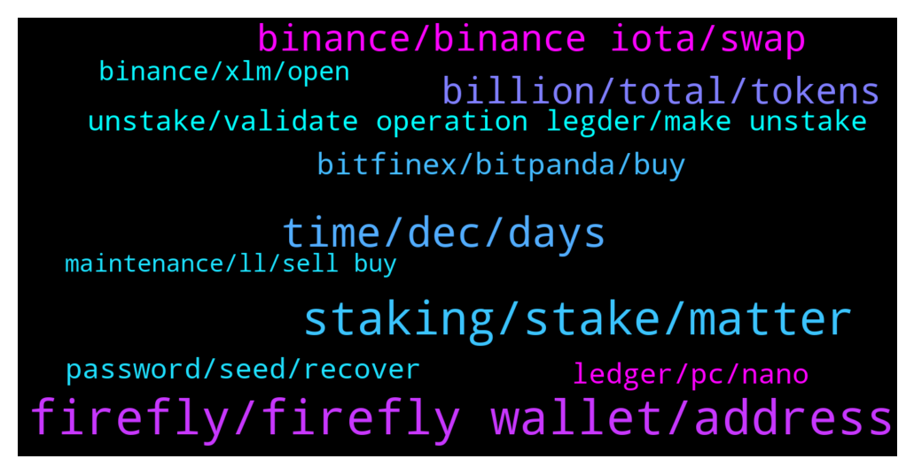

# **@iotatangle**
 ## Analysis for **2021-12-24** - **2021-12-25**.

---

## 📊 **Basic Stats**

**n_messages_sent**: 219

---

---

## 🔝 **Top keywords and related messages**

1. **firefly, firefly wallet, address**

    @cagdaskarsan --- *I sent from binance to: firefly wallet  iota1qqkcuhztjkth2rf34sl9auyauaflm94p38ypjvcmxu3a0y0dkxlyz2806t6 but then I opened a wallet account on another computer and activated the wallet by entering 24 words.  but that wallet address was starting with atoi, not iota: atoi1qqkcuhztjkth2rf34sl9auyauaflm94p38ypjvcmxu3a0y0dkxlyzdf7m3h* **--->** [TG Discussion](https://t.me/iotatangle/302140)

    @Teleappa --- *Hi... Binance won't let me transfer to Firefly. It says that there is an issue with the IOTA network. Is it correct, is there a placer where I can by MIOTA to transfer to Firefly?* **--->** [TG Discussion](https://t.me/iotatangle/301791)

    @cagdaskarsan --- *I have a problem.  On 2021.12.11, I sent 316 iota to firefly wallet using the iota network from the binance exchange.  but it is not in my wallet yet.  TxID: 8e8ce08af10c16796fd8f8536d7630ff4c76f918d8e2762e9fefcaeb3e61eacb.  The address I sent: iota1qqkcuhztjkth2rf34sl9auyauaflm94p38ypjvcmxu3a0y0dkxlyz2806t6 I would be glad if you could help.* **--->** [TG Discussion](https://t.me/iotatangle/302120)

    @Kessyboy2 --- *its been over 2 days i have been trying to get iota to my firefly wallet but still no hope* **--->** [TG Discussion](https://t.me/iotatangle/302147)

    @WeltonBarbosa --- *To get the airdrop , we just need to have iota in the firefly wallet?* **--->** [TG Discussion](https://t.me/iotatangle/302309)

    @CryptoClawn --- *i have my IOTAS in Binance and i cant send to the firefly wallet* **--->** [TG Discussion](https://t.me/iotatangle/301948)

2. **staking, stake, matter**

    @JaySave75 --- *So with staking you don’t actually earn iota?* **--->** [TG Discussion](https://t.me/iotatangle/302325)

    @sy-subrc --- *Time is running out? It’s actually more time until staking is live, than time passed, since pre-staking started.* **--->** [TG Discussion](https://t.me/iotatangle/301921)

    @SunnySide~ --- *cheers guys also does it matter the size of your stake? it is ok to split into 2 wallets to stake or better to maintain in 1 wallet, or it doesnt matter?* **--->** [TG Discussion](https://t.me/iotatangle/301887)

    @baskinbeagle --- *Can somebody explain if the staking system of firefly wallet still leaves the right or ownership over the coin (iota) to the wallet owner while staking or it's like leaving coin to a typical defi farm where the lps could be compromised due to the system of a dex?* **--->** [TG Discussion](https://t.me/iotatangle/302214)

    @SunnySide~ --- *seems like no issues to stake both* **--->** [TG Discussion](https://t.me/iotatangle/301892)

    @PNol1 --- *Feels good to be pre staked.* **--->** [TG Discussion](https://t.me/iotatangle/301982)

3. **time, dec, days**

    @Tahmis --- *They probably open the withdrawals soon. So I would wait. But if in hurry then of course better to transfer else where* **--->** [TG Discussion](https://t.me/iotatangle/301830)

    @mohsen --- *Only after 28 Dec For 90 days...* **--->** [TG Discussion](https://t.me/iotatangle/302231)

    @NOMPike --- *It really isn't looking likely, they still haven't replied to me and time is running out.* **--->** [TG Discussion](https://t.me/iotatangle/301920)

    @NOMPike --- *Every minute past is a minute gone, this is how time works. Hope that helps.* **--->** [TG Discussion](https://t.me/iotatangle/301922)

    @ola --- *Just à day before... If all try to withdraw at the same time..... The systèm may crach....* **--->** [TG Discussion](https://t.me/iotatangle/302379)

    @Hekki --- *I think the migration was around may* **--->** [TG Discussion](https://t.me/iotatangle/301841)

4. **billion, total, tokens**

    @AdamLake --- *Is there a way we can figure out how many iota have been staked so far?  I saw that we were over 40% but wouldn’t mind seeing for myself* **--->** [TG Discussion](https://t.me/iotatangle/301787)

    @K --- *1000 iota - 1 ki. ?* **--->** [TG Discussion](https://t.me/iotatangle/302200)

    @BigMak_999 --- *Hello, I think there is an error on the price of the iexp token advertised on the metavers project. 250 iota per token, I find that huge. Can you confirm please?  https://sphere-hub.io/* **--->** [TG Discussion](https://t.me/iotatangle/302393)

    @Basti --- *The Moon (@TheMoonCarl) Tweeted: Any #IOTA holders out there? 👇 https://twitter.com/TheMoonCarl/status/1474417094129291286?s=20* **--->** [TG Discussion](https://t.me/iotatangle/302189)

    @ash1taka1997 --- *Nothing wrong, because 1 Mi = 1,000,000 i* **--->** [TG Discussion](https://t.me/iotatangle/302399)

    @Sailor --- *Please give us link how to check how many % of total iota supply were staked at this moment* **--->** [TG Discussion](https://t.me/iotatangle/302216)

5. **binance, binance iota, swap**

    @Chico --- *Update Binance for IOTA Network 27.12.2021  1300 h for work 👌* **--->** [TG Discussion](https://t.me/iotatangle/302317)

    @Kox88x --- *If you get tokens in prestaking, it looks like binance is specifically blocking the Iota transfer so that they get as many tokens as possible.* **--->** [TG Discussion](https://t.me/iotatangle/302227)

    @sy-subrc --- *Every IOTA less traded on Binance, is a good IOTA. Hope that helps.* **--->** [TG Discussion](https://t.me/iotatangle/301923)

    @sy-subrc --- *10.000 IOTA is literally 1ct. So I guess you mean MIOTA.  Anyways, there’s not much you can do: 1. Wait for Binance to resume withdrawals (which they promised should be happening today or tomorrow, but I wouldn’t bet on it) 2. Swap for whatever, get it to another exchange, withdraw it from there 3. Don’t participate in the staking* **--->** [TG Discussion](https://t.me/iotatangle/301925)

    @Shortzliquidated --- *anyone knows if there something going on with binance IOTA hidrawals?* **--->** [TG Discussion](https://t.me/iotatangle/302374)

    @Kox88x --- *Why still I can't withdraw my Iota from binance.?* **--->** [TG Discussion](https://t.me/iotatangle/302226)

6. **bitfinex, bitpanda, buy**

    @TBVC1 --- *Today I've converted to sol to bitfinex to iota and withdrew* **--->** [TG Discussion](https://t.me/iotatangle/302237)

    @Tahmis --- *Not all exchanges are good. At least following have been working to my knowledge recently: Bitfinex, Bitpanda, Bitvavo, Upbit, Binance.us* **--->** [TG Discussion](https://t.me/iotatangle/302243)

    @Aleksandr --- *Opb bitfinex better but stellar ( or usd) , and buy iotap* **--->** [TG Discussion](https://t.me/iotatangle/302055)

    @DF --- *Have not used bitfinex in years* **--->** [TG Discussion](https://t.me/iotatangle/301976)

    @Basti --- *Bitfinex is approving them manually sometimes* **--->** [TG Discussion](https://t.me/iotatangle/301972)

    @DF --- *I have a processing withdraw from bitfinex since yesterday running, so I think bitfinex is also with problems.. talked with the support and they say they are having delays with the iota withdraws* **--->** [TG Discussion](https://t.me/iotatangle/301970)

7. **unstake, validate operation legder, make unstake**

    @Kox88x --- *And my Iota will be frozen on 90 days? Can we make unstake example after 30 days?* **--->** [TG Discussion](https://t.me/iotatangle/302236)

    @NOMPike --- *In time to actually get my Iota into prestaking?* **--->** [TG Discussion](https://t.me/iotatangle/301915)

    @mohsen --- *You can make unstake any time you want* **--->** [TG Discussion](https://t.me/iotatangle/302239)

    @Hulky --- *Correct. The prestake is just like sending your IOTAs to yourself. Therefore, for sending you have to validate the operation with the legder* **--->** [TG Discussion](https://t.me/iotatangle/301911)

    @Boaty --- *You can “unstake” at any time* **--->** [TG Discussion](https://t.me/iotatangle/302301)

    @Kox88x --- *Are we getting something in the prestaking period?* **--->** [TG Discussion](https://t.me/iotatangle/302229)

8. **ledger, pc, nano**

    @Shortzliquidated --- *it seems that is good on android but not on the desktop* **--->** [TG Discussion](https://t.me/iotatangle/302375)

    @Tahmis --- *Desktop only for now unfortunately. Mobile still under development. Yes, ledger is supported. More info here:* **--->** [TG Discussion](https://t.me/iotatangle/302019)

    @saverroute --- *Hey there.. not able to stake iota through ledger nano* **--->** [TG Discussion](https://t.me/iotatangle/301847)

    @Erdem --- *Did you Open the iota app on the ledger?* **--->** [TG Discussion](https://t.me/iotatangle/301870)

    @Timo --- *Bryan Do you use the wallet with a pc or with the nano ledger?* **--->** [TG Discussion](https://t.me/iotatangle/301862)

    @Timo --- *Is it recommendable to stake via the software firefly wallet on a windows pc? If I buy a nano ledger I will get it after christmas -> too late* **--->** [TG Discussion](https://t.me/iotatangle/301855)

9. **password, seed, recover**

    @Timo --- *Is it also possible to restore the wallet with the seed value on a new pc/hdd?* **--->** [TG Discussion](https://t.me/iotatangle/301865)

    @Tahmis --- *Just make sure that the password is secure 😊* **--->** [TG Discussion](https://t.me/iotatangle/302174)

    @tomastd --- *I cannot delete the an account with a lost password to recover it with the seed phrase* **--->** [TG Discussion](https://t.me/iotatangle/301999)

    @Sailor --- *I mean creat wallet using the same seeds, it's  same restore* **--->** [TG Discussion](https://t.me/iotatangle/301872)

    @BSkahill --- *With seed... Got it sussed, cheers for help* **--->** [TG Discussion](https://t.me/iotatangle/301869)

    @Teleappa --- *I tried to use my old Bitfinix account but forgot the password. I changed it and now I have to wait 5 days to do withdrawals. BitPanda doesn't verify people in my country... I don't know what to do* **--->** [TG Discussion](https://t.me/iotatangle/301835)

10. **binance, xlm, open**

    @⠠⠵ Lucas! --- *Sorry. Basically CZ says binance is located where he is sitting in a given moment* **--->** [TG Discussion](https://t.me/iotatangle/302082)

    @sy-subrc --- *It’s an issue with Binance an ongoing for days. Allegedly they will open within two days. But no guarantee on that.* **--->** [TG Discussion](https://t.me/iotatangle/301794)

    @NOMPike --- *Has anyone solved this problem yet? Those of us stuck on binance?* **--->** [TG Discussion](https://t.me/iotatangle/301916)

    @TBVC1 --- *Would have been xlm but binance also blocked xlm* **--->** [TG Discussion](https://t.me/iotatangle/302238)

    @CryptoClawn --- *or only dont work in Binance?=* **--->** [TG Discussion](https://t.me/iotatangle/301953)

    @Jacques --- *I am continuesly in chat with Binance withdraw was open I think for a few minutes because I had a popup but when checked it was closed again...* **--->** [TG Discussion](https://t.me/iotatangle/301933)

