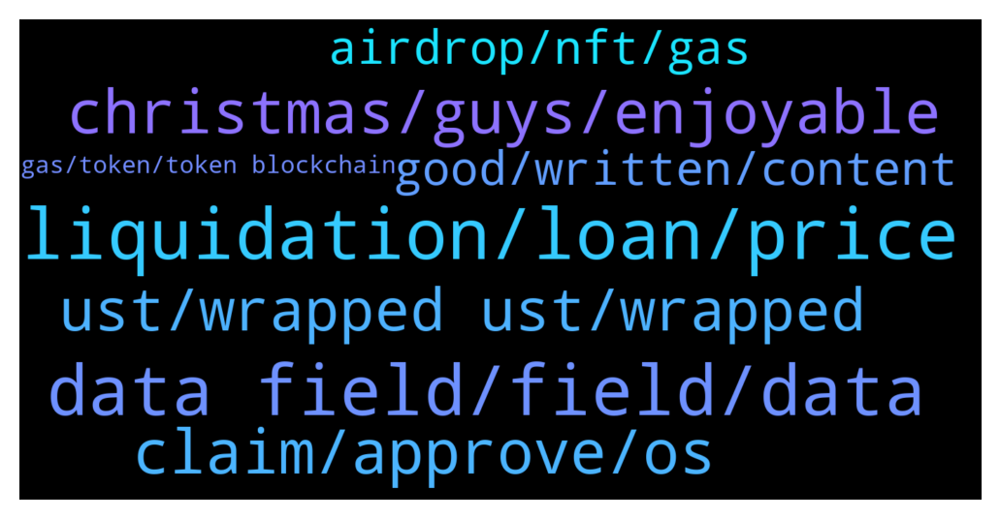

# **@lobsters_chat**
 ## Analysis for **2021-12-24** - **2021-12-25**.

---

## 📊 **Basic Stats**

**n_messages_sent**: 197

---

---

## 🔝 **Top keywords and related messages**

1. **liquidation, loan, price**

    @lesterenzo --- *I know it's a general question - but what platforms (including centralized) provide liquidation free loans on crypto / or with liqudations, but close to 100% LTV? I know Alchemix provide 25% LTV, liqudation free loan on eth. Also Ruler, but Ruler doesn't seem to be working.* **--->** [TG Discussion](https://t.me/lobsters_chat/310331)

    @lesterenzo --- *Why won't someone just create a loan marketplace. Where people could choose lending/borrowing terms, like annual rate, liquidation levels (or no liquidation), what assets they want to lend/borrow, other variables, etc. This could eliminate a need in multitude of similar defi platforms, and will let people "negotiate" loan terms with each other.* **--->** [TG Discussion](https://t.me/lobsters_chat/310403)

    @ChiTimesChi --- *I believe Myso is building something like Ruler used to have. You might want to check some other products offering options - as getting liquidation free loan is basically buying a call option.* **--->** [TG Discussion](https://t.me/lobsters_chat/310334)

    @N1ckchong --- *Routes it through low liquidity pools to get a better price even post-slippage* **--->** [TG Discussion](https://t.me/lobsters_chat/310202)

    @lesterenzo --- *in theory. if someone will create a popular loan variables combination and will check a box like "allow other lenders to join this contract" - then the problem of dispersity will be solved. some combinations just will be more popular* **--->** [TG Discussion](https://t.me/lobsters_chat/310408)

    @ChiTimesChi --- *err, not exactly. trailing stop with ~10% liquidation fee. So what you perceive as 50% LTV, in reality you'll be liquidated at ~55%.* **--->** [TG Discussion](https://t.me/lobsters_chat/310345)

2. **data field, field, data**

    @gonzogirl --- *for example, https://etherscan.io/address/0x632a0d5ca8afb1fd13db6d76c58010007e4f0b55  where do I find the project name/coin?* **--->** [TG Discussion](https://t.me/lobsters_chat/310423)

    @soup0 --- *ask this guy maybe. funded the addy that deployed them https://twitter.com/vipwzw/status/1364149494762283015* **--->** [TG Discussion](https://t.me/lobsters_chat/310429)

    @ivangbi --- *Check what assets there are in the contracts, and by their name you can likely see who it is. And then cross-check with the project’s registry of contracts* **--->** [TG Discussion](https://t.me/lobsters_chat/310419)

    @juju1234534 --- *Can I use Metamask if I want to send a message within the data field? (As we see it on Etherscan when e.g. hackers communicate with the world.)* **--->** [TG Discussion](https://t.me/lobsters_chat/310433)

    @eth2enthusiast --- *theres multisend too i think https://multisender.app/ or .org* **--->** [TG Discussion](https://t.me/lobsters_chat/310223)

    @gonzogirl --- *morning sers, is there a way to figure out which contracts belongs to which project?* **--->** [TG Discussion](https://t.me/lobsters_chat/310415)

3. **claim, approve, os**

    @deadly_punk --- *What approve are you talking about? It doesn't require approve to claim* **--->** [TG Discussion](https://t.me/lobsters_chat/310513)

    @mastertian --- *People are rushing to claim sos* **--->** [TG Discussion](https://t.me/lobsters_chat/310508)

    @alkan58 --- *Do you guys claim and revoke the token approval afterwards? Does the revoke help at all or could there be any other possibility to drain wallets?* **--->** [TG Discussion](https://t.me/lobsters_chat/310512)

    @tobaias --- *Most can't do that because the approve is necessary and unfortunetely permit isn't really taking off* **--->** [TG Discussion](https://t.me/lobsters_chat/310354)

    @alkan58 --- *You're right. It was the Uniswap approve which I revoked so nvm.* **--->** [TG Discussion](https://t.me/lobsters_chat/310514)

    @rasikhmorani --- *(their response to the motion to dismiss)* **--->** [TG Discussion](https://t.me/lobsters_chat/310306)

4. **christmas, guys, enjoyable**

    @nvy0x --- *Hope you’re all having safe and enjoyable holidays so far!* **--->** [TG Discussion](https://t.me/lobsters_chat/310236)

    @duckdegen --- *Just dumped mine, just in time for us wakie up time. I cant see how this has any value besides being a potential rug pull from the creators.* **--->** [TG Discussion](https://t.me/lobsters_chat/310542)

    @xf33d --- *Okay guys, who of you owns DumpsterDAO handle on Twitter? 🧐* **--->** [TG Discussion](https://t.me/lobsters_chat/310483)

    @ivangbi --- *Guys cmon if you are degening into rugs at least fucking read 2 messages above. Thx peace.* **--->** [TG Discussion](https://t.me/lobsters_chat/310263)

    @lefterisjp --- *you are one of the cool kids!* **--->** [TG Discussion](https://t.me/lobsters_chat/310523)

    @CroPurger --- *I got a whopping 6 usd worth of SOS, Christmas shopping here I come! :)* **--->** [TG Discussion](https://t.me/lobsters_chat/310316)

5. **ust, wrapped ust, wrapped**

    @akj0x --- *USDC on gearbox seems to require this much* **--->** [TG Discussion](https://t.me/lobsters_chat/310265)

    @bout3fiddy --- *This is a bit alarming. Binance listed UST, abra has been using wrapped UST from the shuttle bridge, curve has an immense amount of shuttle UST in their mim-ust pool.* **--->** [TG Discussion](https://t.me/lobsters_chat/310546)

    @bout3fiddy --- *hi! any Terra fanbois and fangals here? Been looking into the asset UST and I am to understand that wrapped UST needs to be migrated to wormhole UST gradually over time?* **--->** [TG Discussion](https://t.me/lobsters_chat/310544)

    @B_pagee --- *It makes sense as it made 10x* **--->** [TG Discussion](https://t.me/lobsters_chat/310509)

    @johan_ct --- *hey guys, can someone kindly explain how erc721 contract works? This is from cryptozombie* **--->** [TG Discussion](https://t.me/lobsters_chat/310249)

    @lesterenzo --- *so Abra can be used as a form of trailing stop. which is executed before the price actually dropped. and you can revert that "trade" if the price never dropped to your chosen level. kinda cool* **--->** [TG Discussion](https://t.me/lobsters_chat/310344)

6. **airdrop, nft, gas**

    @sir_integra_hellsing --- *anyone knows of a site that let you airdrop to a large number of wallets for a fixed gas cost?* **--->** [TG Discussion](https://t.me/lobsters_chat/310217)

    @banteg --- *is there any project behind sos or is it just an airdrop?* **--->** [TG Discussion](https://t.me/lobsters_chat/310500)

    @TombillyY --- *Any benefits for holding Lobster nft?* **--->** [TG Discussion](https://t.me/lobsters_chat/310522)

    @SpikeSpiege1 --- *Sold mine as well. It has no affiliation to opensea what so ever. Just pumped by CT in order to salvage a little money from all the illiquid NFT bags they're holding.  Sad part even at this mc the airdrop didn't cover their gas from nft trading lol* **--->** [TG Discussion](https://t.me/lobsters_chat/310543)

    @wilflare --- *it feels like an airdrop just to thank early supporters of the NFT community (who use OpenSea) - but their "early" is a snapshot taken a few days ago  there's a Discord and it seems like they are shaping it to be DAO to support folks rekted by rugpulls, etc.* **--->** [TG Discussion](https://t.me/lobsters_chat/310505)

    @whiterun --- *how opendao airdrop works? i see it doesn't use merkle proof.* **--->** [TG Discussion](https://t.me/lobsters_chat/310488)

7. **good, written, content**

    @Ameliafern --- *Knows someone who can create from scratch* **--->** [TG Discussion](https://t.me/lobsters_chat/310534)

    @UltimatePractitioner --- *Solidity Development tele chat can prob help you ser. Going down same path and they are really helpful there* **--->** [TG Discussion](https://t.me/lobsters_chat/310293)

    @Clone95 --- *hi guys, do you know any discord generalist on DeFi where I can be up-to-date with latest developments?* **--->** [TG Discussion](https://t.me/lobsters_chat/310385)

    @goeth121 --- *Here's the paper written by myself https://github.com/ArableProtocol/arableintro/blob/main/Arable%20Protocol%20%5BDraft%5D.pdf* **--->** [TG Discussion](https://t.me/lobsters_chat/310381)

    @goeth121 --- *It would be nice if any good content writer could be involved full time on the project.* **--->** [TG Discussion](https://t.me/lobsters_chat/310382)

    @goeth121 --- *I would like to get a content writer who is pretty good at writing new DeFi concept - would be pretty nice if he/she is familiar with Synthetix's underlying mechanism. (We are building a synthetic farming protocol - but didn't write any articles official yet - all draft is written by myself but it's not good for reading.) FYI, we are giving airdrop to Lobster DAO NFT holders based on NFT hold amount at December 9th snapshot.* **--->** [TG Discussion](https://t.me/lobsters_chat/310379)

