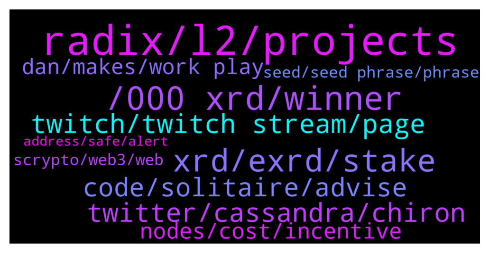

# **@radix_dlt**
 ## Analysis for **2021-12-24** - **2021-12-25**.

---

## 📊 **Basic Stats**

**n_messages_sent**: 312

---

---

## 🔝 **Top keywords and related messages**

1. **radix, l2, projects**

    @bonafideplug --- *How can a L2 solve L1 problems. In regards to other L1’s.  And what are instances where despite infinite scalability, a L2 could be useful on Radix.  I only ask since some are being created* **--->** [TG Discussion](https://t.me/radix_dlt/326846)

    @TyPo1 --- *Cheers, having read the link and your reply I make a step closer to understanding it all. I can’t wait for the other projects to finally accept and be in a position in which they can’t deny the significance of your and the Radix team’s achievements. I’m not talking money here at all, I’m talking of a desire for all the hard work to be acknowledged. This can’t be a VHS and Betamax story.* **--->** [TG Discussion](https://t.me/radix_dlt/326450)

    @Radstakes --- *Dan's twitter demo showcases some of the far reaching applications of Radix tech, with many of the features unique to Radix such as atomic cross shard composability while maintaining high levels of safety, liveness and throughput. There's a handy guide in the about section of the Twitter demo that explains a bit about what's going on under the hood: https://flexathon.net/twitter/index.html?help=1* **--->** [TG Discussion](https://t.me/radix_dlt/326391)

    @joshhoppie --- *Seems like Radix really should be listed here – https://www.stakingrewards.com/* **--->** [TG Discussion](https://t.me/radix_dlt/326541)

    @Jazzer9F --- *Excellent article from Coin Telegraph highlighting the current issues faced by Solidity developers, and detailing how Radix will give developers the power to build quickly, securely, and know that scale will never be a bottleneck!  https://cointelegraph.com/news/watch-out-solidity-new-project-aims-to-tackle-downsides-of-coding-defi-projects* **--->** [TG Discussion](https://t.me/radix_dlt/326949)

    @bonafideplug --- *Are people going to build L2 on Radix. Have people already started? Can someone give me more info on this* **--->** [TG Discussion](https://t.me/radix_dlt/326812)

2. **, 000 xrd, winner**

    @TaserFace6937 --- *🚨 Less than 4 hours left to enter this week's 2,000 XRD Giveaway!  👉 How to enter:  radixstake.com/giveaway.html  💰 December   3rd - 2,000 XRD Winner  https://bit.ly/3pOfIQW 💰 December 10th - 2,000 XRD Winner  https://bit.ly/3pG9p1D 💰 December 17th - 2,000 XRD Winner  https://bit.ly/3q3pQFl 💰 December 24th - 2,000 XRD Winner 💰 December 31st - 2,000 XRD Winner  Weekly winners are selected using a random name picker.  🙏Thank you RadixStake delegators and good luck tomorrow!* **--->** [TG Discussion](https://t.me/radix_dlt/326366)

    @MZ --- *Can anyone help me please with OCI ... I just got some into my Radix wallet and am nort sure what it is and what to do with it. Can i stake it, get more through airdrops and where? Thank you* **--->** [TG Discussion](https://t.me/radix_dlt/326641)

    @Magal36 --- *It's airdrop from the Ociswap team. It's the governance token for Ociswap, the DEX that will be live on Babylon day one* **--->** [TG Discussion](https://t.me/radix_dlt/326645)

    @shahzaibak --- *i do wanna keep this relevant still @fpieper if you get a chance can you please take a look ¿? thank you 🙏🏽* **--->** [TG Discussion](https://t.me/radix_dlt/326896)

    @bonafideplug --- *Ociswap and Dogecube?  Are they L2 or Dapps?* **--->** [TG Discussion](https://t.me/radix_dlt/326853)

    @tonnypin --- *Thank,  do they have teams from USA?* **--->** [TG Discussion](https://t.me/radix_dlt/326690)

3. **xrd, exrd, stake**

    @pahleviarsa --- *what different XRD and eXRD please* **--->** [TG Discussion](https://t.me/radix_dlt/327020)

    @Jeroen --- *When Will it be possible to stake EXRD on KuCoin?* **--->** [TG Discussion](https://t.me/radix_dlt/326578)

    @MarcoID --- *eXRD is a wrapped version. For staking in Radix wallet you need XRD, not eXRD.* **--->** [TG Discussion](https://t.me/radix_dlt/327021)

    @mx471 --- *English please  and if my translator is correct, then the answer is: Both coins are almost the same. eXRD is the Ethereum wrapped version and XRD is the native coin which you can use to use the network and to stake. /2tokens* **--->** [TG Discussion](https://t.me/radix_dlt/327005)

    @Al_Bunderino --- *You can not stake eXRD - it's a wrapped coin on the Ethereum* **--->** [TG Discussion](https://t.me/radix_dlt/326970)

    @selfmadezeus --- *Not $EXRD. This needs to be changed to avoid confusion* **--->** [TG Discussion](https://t.me/radix_dlt/326631)

4. **twitter, cassandra, chiron**

    @gpel33 --- *How did you get twitter onto Cassandra? Is there some sort of open source twitter code? Or am I missing something more fundamental (not very teccy)* **--->** [TG Discussion](https://t.me/radix_dlt/326279)

    @danhughes --- *my cassandra twitter notifications have gone quiet!  where are ya'll??* **--->** [TG Discussion](https://t.me/radix_dlt/326277)

    @danhughes --- *working on that ... Twitter is the most comprehensive demo though as it touches ALL parts of Cassandra* **--->** [TG Discussion](https://t.me/radix_dlt/326312)

    @danhughes --- *Firstly what a wonderful wholesome message that is to read. Thank you!  As for cassandra, its demonstrating capabilities that no one in this space is able to do. Not ethereum, not solana, not elrond, or anyone else.  Its showing the raw power of what we can do at radix, even if from a product perspective it doesn't make sense. It's a tech demo so all bets are off and we can push things to the max.  Can other projects do this stuff? Sure, there are twitter clones, dapp platforms etc. But none can do it at this kind of scale. If they say they can, ask them to show you a fair comparison. They can't.  That is the non tech significance* **--->** [TG Discussion](https://t.me/radix_dlt/326394)

    @Speakers --- *I have to keep double checking if I'm on the real twitter, or the Casandra version 😂* **--->** [TG Discussion](https://t.me/radix_dlt/326458)

    @danhughes --- *BTW if any tech out there can match cassandra like for like, not just twitter, but across the board, I will absolutely be damn impressed and tip my hat without prejudice* **--->** [TG Discussion](https://t.me/radix_dlt/326410)

5. **twitch, twitch stream, page**

    @teslr --- *any idea what happened to https://getradix.com/live-stats ?* **--->** [TG Discussion](https://t.me/radix_dlt/326499)

    @shahzaibak --- *it ain’t there bruv thas why im askin* **--->** [TG Discussion](https://t.me/radix_dlt/326900)

    @Allen --- *No spamming here god damn it* **--->** [TG Discussion](https://t.me/radix_dlt/326599)

    @luke55 --- *you need to Twitch stream again 😂 live commentating* **--->** [TG Discussion](https://t.me/radix_dlt/326280)

    @ITProfligate --- *I saw the whole Twitch stream. Brilliant, and great Q&A at the end, both technical and friendly Everyone should watch it.* **--->** [TG Discussion](https://t.me/radix_dlt/326353)

    @daxter889 --- *Glad you liked that one 👍🏼 @danhughes* **--->** [TG Discussion](https://t.me/radix_dlt/326387)

6. **code, solitaire, advise**

    @Artistizen --- *When code is law ... ... better know your Devs.  https://t.me/Tributjects* **--->** [TG Discussion](https://t.me/radix_dlt/326982)

    @danhughes --- *You'd be a fool to take that code and release a main net with it at this stage* **--->** [TG Discussion](https://t.me/radix_dlt/326418)

    @Cpt_Charles --- *Well if it’s not written out yet, it’s not yet part of the (open) source code right 👀😂* **--->** [TG Discussion](https://t.me/radix_dlt/326441)

    @Magal36 --- *Get a basic programming course in Rust* **--->** [TG Discussion](https://t.me/radix_dlt/326467)

    @wojtekkalka --- *I think you can already just working with the code for four days* **--->** [TG Discussion](https://t.me/radix_dlt/326819)

    @Magal36 --- *This is the first one under development: https://t.me/cerbymask* **--->** [TG Discussion](https://t.me/radix_dlt/326719)

7. **nodes, cost, incentive**

    @danhughes --- *well imagine if a network made of #pi3 was actually a viable hardware spec  that cost is super small, can piggy back on your home internet, consumes a few watts of power  the most expensive thing to maintain really is storage* **--->** [TG Discussion](https://t.me/radix_dlt/326344)

    @Toby --- *I’ve wondered how a network would grow without an economic incentive. It seems to me like without, it cannot grow. You’re participating nodes and such have to spend money to keep the network alive and growing so unless a ton of them are just sitting around with money to blow, then it seems necessary.* **--->** [TG Discussion](https://t.me/radix_dlt/326339)

    @danhughes --- *you need some sure, but don't forget, there are 10000 Bitcoin full nodes that receive nothing at all* **--->** [TG Discussion](https://t.me/radix_dlt/326340)

    @danhughes --- *if that is very low, then the incentive model becomes somewhat simpler to some degree* **--->** [TG Discussion](https://t.me/radix_dlt/326346)

    @danhughes --- *the desire to just have a network that functions can go a long way as an incentive under its own merit* **--->** [TG Discussion](https://t.me/radix_dlt/326341)

    @danhughes --- *economic frictions of operating the network are a thing sure, but that isn't the wider problem of perception* **--->** [TG Discussion](https://t.me/radix_dlt/326323)

8. **dan, makes, work play**

    @TelgarKW --- *Why doesn’t Dan just focus on being Babylon to the market sooner. Twitter demo is cool but seems like a deviation from the core project.* **--->** [TG Discussion](https://t.me/radix_dlt/326503)

    @daxter889 --- *All work and no play makes Dan a dull boy 😜* **--->** [TG Discussion](https://t.me/radix_dlt/326308)

    @danhughes --- *They don't have my brain is the arrogant yet accurate response* **--->** [TG Discussion](https://t.me/radix_dlt/326414)

    @LucPro --- *Even Dan is promoting this in his tweets :-)* **--->** [TG Discussion](https://t.me/radix_dlt/326604)

    @Magal36 --- *It's encoded in his hair mapping.* **--->** [TG Discussion](https://t.me/radix_dlt/326440)

    @Frosties --- *Pretty sure Dan kept some key parts locked in his noggin with a safe word only Matt and Piers knows….* **--->** [TG Discussion](https://t.me/radix_dlt/326436)

9. **seed, seed phrase, phrase**

    @faustoBTC --- *So if I lost my seed phrase I am okay to upgrade it?* **--->** [TG Discussion](https://t.me/radix_dlt/326506)

    @jumpfetus --- *regarding the new wallet recs - you can just view your seed phrase again in the app, you don't have to make a new wallet* **--->** [TG Discussion](https://t.me/radix_dlt/326521)

    @Seboeoeoel --- *If you lost your seed phrase but have password and wallet you can review it again in settings.* **--->** [TG Discussion](https://t.me/radix_dlt/326607)

    @JAmontaigne --- *I didn't know seed phrase was visible from the desktop wallet UI.* **--->** [TG Discussion](https://t.me/radix_dlt/326523)

    @Jake --- *Keeping your seed phrase is crucial* **--->** [TG Discussion](https://t.me/radix_dlt/326511)

    @CSpace80 --- *You can update without seedphrase yes. But make sure to create another wallet if you have lost seed phrase incase you need it in future* **--->** [TG Discussion](https://t.me/radix_dlt/326507)

10. **scrypto, web3, web**

    @danhughes --- *forget the validators  look at Twitter etc ... #web3 = NFTs for most that would be users  #web3 stands for so much more philosophically* **--->** [TG Discussion](https://t.me/radix_dlt/326322)

    @Ben_XRD --- *Without a token how do you incentivise a decentralized ecosystem of participants to: - host - validate - generally participate  In web 3?* **--->** [TG Discussion](https://t.me/radix_dlt/326321)

    @danhughes --- *I think having a wallet in there maybe confuses it more ... most people associate web3 with tokens.  To see #web3 without tokens is maybe more eye-opening to its fundamental potential?* **--->** [TG Discussion](https://t.me/radix_dlt/326319)

    @rmf55 --- *Maybe a basic wallet dapp would be useful so people can see you are able to send & receive coins on there?* **--->** [TG Discussion](https://t.me/radix_dlt/326310)

    @Jazzer9F --- *We’re pleased to announce that Radix Alexandria has launched!  Scrypto is a game-changer for DeFi, developers, you can get started with Scrypto now.  Full Announcement: https://www.radixdlt.com/post/alexandria-scrypto-is-here* **--->** [TG Discussion](https://t.me/radix_dlt/326766)

    @Jazzer9F --- *The ramp-up to Alexandria begins here 🚀  Part 1 in a series on Radix Engine and Scrypto, we break down how today's form of smart contracts are failing DeFi and failing developers.  📖 https://www.radixdlt.com/post/the-problem-with-smart-contracts-today* **--->** [TG Discussion](https://t.me/radix_dlt/327017)

