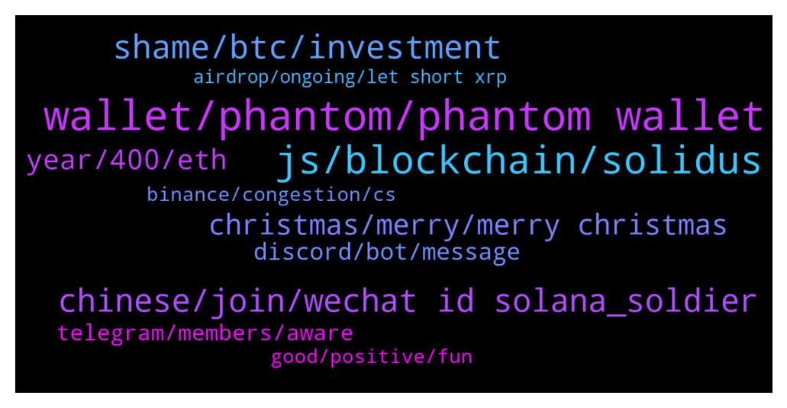

# **@solana**
 ## Analysis for **2021-12-24** - **2021-12-25**.

---

## 📊 **Basic Stats**

**n_messages_sent**: 377

---

---

## 🔝 **Top keywords and related messages**

1. **wallet, phantom, phantom wallet**

    @aughustx --- *Thanks I DMd you. I mean I must have made a mistake . But DEX like this should not allow to connect a wallet to do a trade if it is not possible .* **--->** [TG Discussion](https://t.me/solana/879045)

    @mattiarxx --- *Hi, when i try to mint a nft on staking page, one error processing error 4 appears: custom program error 0x1 please try again* **--->** [TG Discussion](https://t.me/solana/877922)

    @Giorgio --- *Hi guys, I just opened a software version of solflare and something doesn't sound me so good, but of corse because I have no knowledge. At the moment of login, Instead of asking me for the password, it asks for the mnemonic, with no password, and then it shows me a list of solflare wallets based on the derivation path. Then I cannot select mine but just click on ACCESS and It goes directly to my own wallet. How does it associate it, since I haven t select it? Is there anything unsafe in this? Thanks* **--->** [TG Discussion](https://t.me/solana/878031)

    @aughustx --- *I just put it there and its deducted from My phantom wallet 12SOL  I want to buy their token amd disnt know this DEX is not userfriendly no wonder the price is lower than ICO* **--->** [TG Discussion](https://t.me/solana/879032)

    @mahib45 --- *FTX exchange :  You can use FTX to deposit tokens (ERC20, XRP, BTC etc) and withdraw from FTX to Sollet.io. FTX will automatically wrap your crypto in an SPL token to be used with the Serum DEX. Please note that to convert wrapped SPL assets back into their native chain, you can deposit into FTX and withdraw the unwrapped assets.  🔗 https://ftx.com  Telegram: https://t.me/FTX_Official* **--->** [TG Discussion](https://t.me/solana/878699)

    @Selltop1 --- *How can I unwrap wusdt from sollet ?* **--->** [TG Discussion](https://t.me/solana/878697)

2. **js, blockchain, solidus**

    @sid_godara --- *How to add solana network in metamask can anyone tell?* **--->** [TG Discussion](https://t.me/solana/878148)

    @mahib45 --- *Ethereum Virtual Machine (EVM) is coming on Solana soon.  Have you seen this? 👇🏻 https://twitter.com/neonlabsorg/status/1417485843426648067?s=21* **--->** [TG Discussion](https://t.me/solana/879169)

    @NtriDuc --- *Hi Rahul, we are a game project in advanced stage of development. We would like to launch on solana. Please can you  let us know whom we should speak to. (We don’t need funding - just technical partnership of some sort).* **--->** [TG Discussion](https://t.me/solana/878088)

    @eniolaojo --- *Please I keep getting errors will Trying to install solana on my visual studio code I really need assistance* **--->** [TG Discussion](https://t.me/solana/879326)

    @mahib45 --- *Hello 👋   You can check it out here 👇 https://docs.solana.com/running-validator on how to run a validator node on Solana.   You can also join us in Discord for some more info on spinning up a node - https://solana.com/discord  Thanks 👍* **--->** [TG Discussion](https://t.me/solana/879170)

    @RealPrinceOla --- *Welcome to Solana!   Just in case you wonder what is #Solana about:   #Solana is a high-speed single-layer blockchain, currently supporting peak capacity of 65k transactions per second and 400ms block times in a globally distributed network with more than 70 nodes. It's explicitly built to scale transaction throughput  with Moore's Law (doubling GPU core count every ~2 years). There is NO SHARDING required to achieve this throughput.  To read more about Solana please visit  https://docs.solana.com/introduction* **--->** [TG Discussion](https://t.me/solana/878205)

3. **shame, btc, investment**

    @TraceyGraye --- *Most of you here are newbies to crypto investment You don't even know what to do to make money off crypto especially SOL at this period It's a shame* **--->** [TG Discussion](https://t.me/solana/879120)

    @Amaru --- *So many people here don't even know how to make money over crypto currency, especially SOL at this time It's a shame* **--->** [TG Discussion](https://t.me/solana/878062)

    @Grace_Mya --- *Do you have any investment advice? , I want to invest but I don’t know how to start* **--->** [TG Discussion](https://t.me/solana/877788)

    @Mas --- *why shame?? as we still learn is not shame to invest in crypto* **--->** [TG Discussion](https://t.me/solana/879123)

    @TraceyGraye --- *Investing in crpyto is so much fun and many don't know how to go about it. I started as a newbie but I'm currently making daily profit* **--->** [TG Discussion](https://t.me/solana/879125)

    @thinks_deep4742 --- *Its silly that you are comparing sol with btc. Both are very ver very different.* **--->** [TG Discussion](https://t.me/solana/877888)

4. **chinese, join, wechat id solana_soldier**

    @mahib45 --- *Hello 👋  You may check out this to know more https://docs.solana.com/staking* **--->** [TG Discussion](https://t.me/solana/877730)

    @mahib45 --- *Hello 👋  You may ask here https://t.me/allbridge_official* **--->** [TG Discussion](https://t.me/solana/877845)

    @RealPrinceOla --- *Hello, what is the issue here?* **--->** [TG Discussion](https://t.me/solana/878207)

    @Alan9696 --- *have  Chinese Community   ？* **--->** [TG Discussion](https://t.me/solana/879306)

    @mahib45 --- *Hello!  1️⃣ https://solana.com/ecosystem  2️⃣ https://twitter.com/Solana_Mates (Latest updates on new projects)  3️⃣ https://solanabeach.io/tokens* **--->** [TG Discussion](https://t.me/solana/878670)

    @RealPrinceOla --- *Hello!  1️⃣ https://solana.com/ecosystem  2️⃣ https://twitter.com/Solana_Mates (Latest updates on new projects)  3️⃣ https://solanabeach.io/tokens* **--->** [TG Discussion](https://t.me/solana/878078)

5. **christmas, merry, merry christmas**

    @joanagermany14 --- *Merry Christmas from Rio Grande do Sul* **--->** [TG Discussion](https://t.me/solana/879402)

    @zet07 --- *Merry Christmas guys, have a lovely Christmas* **--->** [TG Discussion](https://t.me/solana/878937)

    @Tadeus --- *Merry Christmas for those who celebrate* **--->** [TG Discussion](https://t.me/solana/878938)

    @zet07 --- *Also merry Christmas to those without a family❤️🎄* **--->** [TG Discussion](https://t.me/solana/878940)

    @elyyss88 --- *Merry Christmas to everyone in the group* **--->** [TG Discussion](https://t.me/solana/879227)

    @Rayonr1 --- *for those who celebrate Christmas, for gifts to me 🤭🤭💝* **--->** [TG Discussion](https://t.me/solana/879011)

6. **year, 400, eth**

    @Hrn --- *Will solana be over 400 in a year* **--->** [TG Discussion](https://t.me/solana/877911)

    @vintageme28 --- *$200 coming in 20 minutes. Watch 🚀🚀🚀🚀🚀🚀🚀🚀🚀🚀🚀🚀🚀* **--->** [TG Discussion](https://t.me/solana/878722)

    @Monarch420 --- *in 2022 it will definitely reach $400* **--->** [TG Discussion](https://t.me/solana/878361)

    @David --- *Maybe solana hit u$2000 like eth?* **--->** [TG Discussion](https://t.me/solana/878598)

    @vintageme28 --- *U think Sol will hit $2000 2023??* **--->** [TG Discussion](https://t.me/solana/877824)

    @vintageme28 --- *ETH cap at 500 billion. Took em 6 years* **--->** [TG Discussion](https://t.me/solana/877843)

7. **discord, bot, message**

    @Sudesh --- *hi guys, i am a co-founder of a company building on solana, and for some reason i cannot get into solana discord.. please help.. i get linked is expired message, i have several dev questions and would like to connect to dev community at large.. i was talking to @cryptolover1987 and i hope someone can help me with this, i have seen several people have the same problems in reddit as well* **--->** [TG Discussion](https://t.me/solana/877702)

    @NtriDuc --- *I tried to post the link to our twitter here but somehow the bot kept deleting it* **--->** [TG Discussion](https://t.me/solana/878104)

    @mahib45 --- *▫️Join us in the Discord for technical support from the dev team 🔗 https://discord.com/invite/pquxPsq  ✅Click on #role and select the emoji "Community " 👨‍🌾 on Carl -bot. And then go back to the general section again.  Then you will able to send message!* **--->** [TG Discussion](https://t.me/solana/879411)

    @cryptolover1987 --- *▫️Join us in the Discord for technical support from the dev team 🔗 https://discord.com/invite/pquxPsq  ✅Click on #role and select the emoji "Community " 👨‍🌾 on Carl -bot. And then go back to the general section again.  Then you will able to send message!* **--->** [TG Discussion](https://t.me/solana/879343)

    @RealPrinceOla --- *You can join our discord channel. Our dev support will be able to help you technical things!   👉 https://solana.com/discord  ✅Click on #role and select the emoji "Community " 👨‍🌾 on Carl -bot. And then go back to the general section again.  Then you will able to send message!* **--->** [TG Discussion](https://t.me/solana/878206)

    @ruch149 --- *Oh ok great. Do you guys have discord as well?* **--->** [TG Discussion](https://t.me/solana/878120)

8. **telegram, members, aware**

    @Karim_zaki0 --- *since 4 days ago, there was alive video in youtube about solana and its developpers, they was talking about 2x solana you sent to them, i sent them solana but i didn't recieve anything from them* **--->** [TG Discussion](https://t.me/solana/878436)

    @mahib45 --- *Hello ! 👋    Welcome to Solana official community! As you just entered in #Solana, in case you have a question about what is #Solana?  Solana is a fast, secure, and censorship-resistant blockchain providing the open infrastructure required for crypto to scale to global adoption.   To read more about Solana please visit  Website: www.solana.com Document: https://docs.solana.com/introduction  ⚠️ Please be aware of fraudulent actors posing as Solana team members on Telegram. If you do receive suspicious messages, do not respond, click on links or follow any instructions. ✅ We recommend changing your telegram privacy settings to avoid being added to scam groups. ❗️There is no Solana airdrop or free giveaway!* **--->** [TG Discussion](https://t.me/solana/878899)

    @mahib45 --- *Hello to all the newcomers! 👋    Welcome to Solana official community! As you just entered in #Solana, in case you have a question about what is #Solana?  Solana is a fast, secure, and censorship-resistant blockchain providing the open infrastructure required for crypto to scale to global adoption.   To read more about Solana please visit  Website: www.solana.com Document: https://docs.solana.com/introduction  ⚠️ Please be aware of fraudulent actors posing as Solana team members on Telegram. If you do receive suspicious messages, do not respond, click on links or follow any instructions. ✅ We recommend changing your telegram privacy settings to avoid being added to scam groups. ❗️There is no Solana airdrop or free giveaway!* **--->** [TG Discussion](https://t.me/solana/878877)

    @kris_anon --- *admins, Solana Support just messaged, no unique username however* **--->** [TG Discussion](https://t.me/solana/877759)

    @mahib45 --- *🚨🚨🚨 Scammer alert 🚨🚨🚨  ⚠️ Please be aware of fraudulent accounts posing as Solana team members on Telegram. If you receive suspicious messages, do not respond to them, click on links or follow any instructions. ⚠️ Please also be aware of "giveaways" promoted by bots, YouTube, in Medium articles or fake Telegram groups. Scammers are very creative, however the standard rule is never send funds to strangers or share your private key. ❗️There is no Solana airdrop or free giveaway! Do not send SOL anywhere with the expectation that you will receive more back.  ✅ We recommend changing your telegram privacy settings to avoid being added to scam groups.* **--->** [TG Discussion](https://t.me/solana/878731)

    @itz_raki --- *Another solana telegram channel ..Please someone report reward solana .com to admin* **--->** [TG Discussion](https://t.me/solana/878661)

9. **binance, congestion, cs**

    @thinks_deep4742 --- *Is sol network facing congestion? Im beginning to think those binance cs guys r lying to me.* **--->** [TG Discussion](https://t.me/solana/877815)

    @tscrow567 --- *Binance is yet to be approved bro* **--->** [TG Discussion](https://t.me/solana/877732)

    @mahib45 --- *Hello 👋  This is NOT congestion on #Solana  network.  Please remember Binance is a centralized exchange, so when you request a withdrawal from Binance to  wallet, the Binance side will need to approve it, and the tx will NOT be recorded in the blockchain until Binance approved it. You may contact Binance tech support for more assistance ❤ Thank you so much!* **--->** [TG Discussion](https://t.me/solana/877676)

    @thinks_deep4742 --- *Ive been waiting for an almost an hour now...withdrawing sole from binance to phantom* **--->** [TG Discussion](https://t.me/solana/877675)

    @thinks_deep4742 --- *I wasnt fuding. Those binance guy did lie to me.* **--->** [TG Discussion](https://t.me/solana/878180)

    @thinks_deep4742 --- *Does anyone know how long it can take to transfer sol from binance?* **--->** [TG Discussion](https://t.me/solana/877673)

10. **good, positive, fun**

    @dreamstorealityy --- *Hahahahahaha I thought you where high lol. Compliments of the season* **--->** [TG Discussion](https://t.me/solana/878266)

    @aFidcel --- *Today is going to be a good day* **--->** [TG Discussion](https://t.me/solana/879052)

    @crypto_fredje --- *OK GUYS it’s been fun but I’m going to cut my losses here. Ttyl* **--->** [TG Discussion](https://t.me/solana/878826)

    @Michael --- *I think now is a good time to hold* **--->** [TG Discussion](https://t.me/solana/878757)

    @AUT0KIT --- *Just feel positive and it will go through* **--->** [TG Discussion](https://t.me/solana/878674)

    @chamanjairaj2000 --- *All well... Hope all well there* **--->** [TG Discussion](https://t.me/solana/878651)

