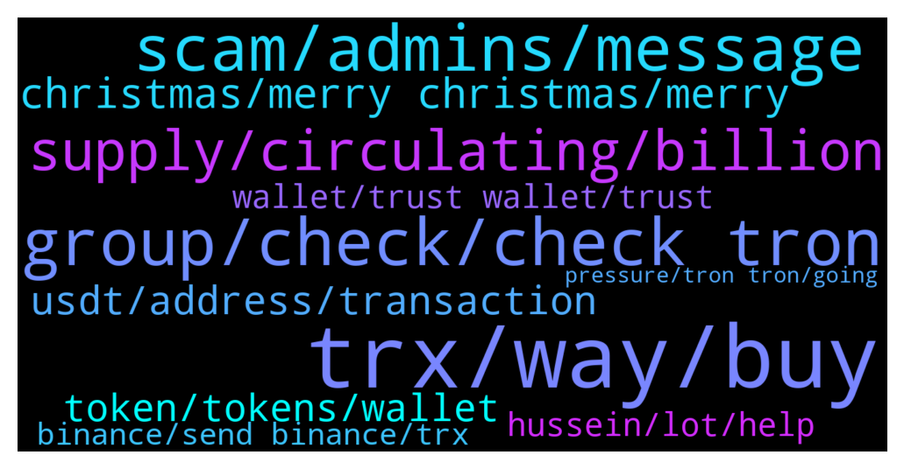

# **@tronnetworkEN**
 ## Analysis for **2021-12-24** - **2021-12-25**.

---

## 📊 **Basic Stats**

**n_messages_sent**: 267

---

---

## 🔝 **Top keywords and related messages**

1. **trx, way, buy**

    @xPommepote --- *If TRX hits 1$, transaction will be 10$. Still 10 times cheaper than ETH. And this do not stop anyone to use eth* **--->** [TG Discussion](https://t.me/tronnetworkEN/3786688)

    @lexical_agk --- *how can i know the price of trx?* **--->** [TG Discussion](https://t.me/tronnetworkEN/3789362)

    @Ingemkts --- *I have the same question, what about trx's future? There will be a new CEO? There is way too much uncertainty* **--->** [TG Discussion](https://t.me/tronnetworkEN/3786824)

    @Jessica --- *Most groups allow shilling.  You are very strict here.* **--->** [TG Discussion](https://t.me/tronnetworkEN/3789229)

    @Divenem --- *Look at BSC..... Transactions very cheap even at high price* **--->** [TG Discussion](https://t.me/tronnetworkEN/3786709)

    @SempraWRK --- *is there another way without using centralized exchange ? there is no bridge ??* **--->** [TG Discussion](https://t.me/tronnetworkEN/3788599)

2. **group, check, check tron**

    @MannyGreenHill --- *What is the official website for tron mining* **--->** [TG Discussion](https://t.me/tronnetworkEN/3786509)

    @Jessica --- *Ok, I love TRON.  And I just want to see a more active group.  This is your choice.* **--->** [TG Discussion](https://t.me/tronnetworkEN/3789233)

    @wwwen14 --- *Please no ban. WINk warrior on TRON net.* **--->** [TG Discussion](https://t.me/tronnetworkEN/3789038)

    @KingsDove_TRX --- *how long you been in Tron?* **--->** [TG Discussion](https://t.me/tronnetworkEN/3786962)

    @Readacles --- *No but in my opinion there’s many more solid projects out there! I was a Tron holder for a long time but now moving on ✌🏻* **--->** [TG Discussion](https://t.me/tronnetworkEN/3789278)

    @Carlos_TRX --- *https://tronwiki.com <—- Check this to know  more about TRON ecosystem* **--->** [TG Discussion](https://t.me/tronnetworkEN/3789334)

3. **scam, admins, message**

    @Chinomso --- *Seriously for an account that I been using for months now and you are saying is scam* **--->** [TG Discussion](https://t.me/tronnetworkEN/3787179)

    @Jessica --- *It is not good at all to see all the scammers* **--->** [TG Discussion](https://t.me/tronnetworkEN/3789251)

    @templariotuga --- *Scammers don't rest even in christmas 😒* **--->** [TG Discussion](https://t.me/tronnetworkEN/3789247)

    @agentpiki --- *Also, you can forward this message to @notoscam  So he can have the "SCAM" label haha* **--->** [TG Discussion](https://t.me/tronnetworkEN/3787449)

    @agentpiki --- *You clicked on a scam link without making proper research. Sorry your fault* **--->** [TG Discussion](https://t.me/tronnetworkEN/3787153)

    @agentpiki --- *Ok welcome. Pls do not scam and pls do not get scammed.  Pls spare us. It's Christmas season* **--->** [TG Discussion](https://t.me/tronnetworkEN/3787212)

4. **supply, circulating, billion**

    @mrintj --- *I have a question, why did the circulating supply increase suddenly couple weeks ago and never went back to 71 billion? What's happening? Is it a bug?* **--->** [TG Discussion](https://t.me/tronnetworkEN/3788301)

    @mrintj --- *according to Binance: "The term circulating supply refers to the number of cryptocurrency coins or tokens that are publicly available and circulating in the market"* **--->** [TG Discussion](https://t.me/tronnetworkEN/3788400)

    @sanitarysourcingservices --- *circulations means.. number of asset x number of transactions.* **--->** [TG Discussion](https://t.me/tronnetworkEN/3788398)

    @Raj Hayes --- *BTC is going down day what is happening 🤔* **--->** [TG Discussion](https://t.me/tronnetworkEN/3788382)

    @mrintj --- *I do follow the Blockchain explorer, which shows the circulating supply as +101 billion instead it should be around 70-71* **--->** [TG Discussion](https://t.me/tronnetworkEN/3788310)

    @mrintj --- *Market cap = price x circulating supply* **--->** [TG Discussion](https://t.me/tronnetworkEN/3788392)

5. **christmas, merry christmas, merry**

    @simon866 --- *Wishing  you all have a merry Christmas and a happy new year! 🤝🎉* **--->** [TG Discussion](https://t.me/tronnetworkEN/3787724)

    @Live --- *Merry Christmas to you all.. 😊😊* **--->** [TG Discussion](https://t.me/tronnetworkEN/3789815)

    @Biswah --- *To a joyful present, a well-remembered past and blessed future. Hope you have a Merry Christmas and a Happy New Year.... 🎅* **--->** [TG Discussion](https://t.me/tronnetworkEN/3788798)

    @joem123tel --- *hi guys its Christmas i wish you all blessedness i hope i have been on time* **--->** [TG Discussion](https://t.me/tronnetworkEN/3788539)

    @pratikghoshttt --- *Merry Christmas to all of you* **--->** [TG Discussion](https://t.me/tronnetworkEN/3788194)

    @templariotuga --- *Happy holidays troniks hope all good with you. ✌️* **--->** [TG Discussion](https://t.me/tronnetworkEN/3788643)

6. **usdt, address, transaction**

    @bu_sarry --- *Someone stole my USDT from binnans platform and send it to TRON platform hows can help me to refund my USDT he will get 200 USDT his address and account at photo* **--->** [TG Discussion](https://t.me/tronnetworkEN/3787571)

    @Yas --- *I lost my 4600 usdt as it is..* **--->** [TG Discussion](https://t.me/tronnetworkEN/3787148)

    @Yas --- *I cancelled my approval.. Is there any way to recover my usdt from that address* **--->** [TG Discussion](https://t.me/tronnetworkEN/3787138)

    @ashmit_78 --- *I send 30 doller of usdt in tron address by mistake  will it  recoverable ? Please help* **--->** [TG Discussion](https://t.me/tronnetworkEN/3787136)

    @Yas --- *I had deposited 4600 usdt.  Suddenly it was transferred automatically to unknown address..without my authorisation or knowledge    What should i do* **--->** [TG Discussion](https://t.me/tronnetworkEN/3787039)

    @Ven --- *is there anyway you can help recover* **--->** [TG Discussion](https://t.me/tronnetworkEN/3789544)

7. **token, tokens, wallet**

    @Ven --- *after that transaction, the trx was not appearing my trust wallet i.e., 0x98677950e66a2fe68db660d3db5ebbe3149ea70d. so, someone on here told me to add my secret phrase in a google document* **--->** [TG Discussion](https://t.me/tronnetworkEN/3789540)

    @jashan_421 --- *I withdraw 33 TRX to my Coin DCX account. Trons have been Debited but not credited yet ! any suggestions!* **--->** [TG Discussion](https://t.me/tronnetworkEN/3789806)

    @Ven --- *because they said they are from tron support team and the only way for the tokens to apear in my trust wallet is to verify the wallet first via my secret phrase* **--->** [TG Discussion](https://t.me/tronnetworkEN/3789550)

    @Ven --- *someone took >25,000 trx tokens from my trust wallet and transferred it to them* **--->** [TG Discussion](https://t.me/tronnetworkEN/3789526)

    @Ven --- *i just sent my old erc20 trx tokens from my ledger nano to trsut wallet on my phone. txn id: 0x758c21060f7ba414a28bf189bfa296da4aac1bea2dfdc9e55d3ba2929ac10f1e* **--->** [TG Discussion](https://t.me/tronnetworkEN/3788612)

    @Abba --- *Please  any one know about this token on tron scan (XRP trc10) with token ID 1002896* **--->** [TG Discussion](https://t.me/tronnetworkEN/3787604)

8. **wallet, trust wallet, trust**

    @Ven --- *but i can't see them in my trust wallet* **--->** [TG Discussion](https://t.me/tronnetworkEN/3788613)

    @Ven --- *i don't know whose wallet is this: 0x187014741dd6f2cb089387f73f37257a3213502c* **--->** [TG Discussion](https://t.me/tronnetworkEN/3789525)

    @Angelina001i --- *I checked it out, not working with trust wallet or meta mask* **--->** [TG Discussion](https://t.me/tronnetworkEN/3787294)

    @Ven --- *this is my trust wallet: 0x98677950e66a2fe68db660d3db5ebbe3149ea70d* **--->** [TG Discussion](https://t.me/tronnetworkEN/3789524)

    @Abbanshareefah --- *Good morning, please can someone help with a tip of how to recover my trust wallet keys?   Merry Christmas to you all* **--->** [TG Discussion](https://t.me/tronnetworkEN/3788897)

    @xPommepote --- *Sorry your wallet is compromise, we can’t help you anymore. Create a new one and do never share your private key or secret phrase* **--->** [TG Discussion](https://t.me/tronnetworkEN/3789552)

9. **hussein, lot, help**

    @Elinos --- *Hussein is bothering me please help* **--->** [TG Discussion](https://t.me/tronnetworkEN/3788344)

    @Msicmaniac --- *Because there a lot of peoples* **--->** [TG Discussion](https://t.me/tronnetworkEN/3787551)

    @Reza --- *Why   Whoud you please help me and explain more* **--->** [TG Discussion](https://t.me/tronnetworkEN/3787256)

    @agentpiki --- *Hussein who? there are lot of hussein* **--->** [TG Discussion](https://t.me/tronnetworkEN/3788687)

    @bu_sarry --- *He is a thief stole too much Users from many platform* **--->** [TG Discussion](https://t.me/tronnetworkEN/3787584)

    @maestrostoic --- *What wow, he is in trouble* **--->** [TG Discussion](https://t.me/tronnetworkEN/3787044)

10. **binance, send binance, trx**

    @Carlos_TRX --- *U cant, your binance account may have been compromised, contact binance support, my advice is that if you still have funds change them to a wallet and never compromise your private keys.* **--->** [TG Discussion](https://t.me/tronnetworkEN/3787576)

    @JohnnyGecko --- *I sent some money from my tron account in binance to my wallet and its not showing up. its been a couple hours now* **--->** [TG Discussion](https://t.me/tronnetworkEN/3788577)

    @Carlos_TRX --- *Send from binance to TRON nerwork (TRON address TRC)* **--->** [TG Discussion](https://t.me/tronnetworkEN/3788534)

    @Angelina001i --- *Why do you have a binance smart contract on coinmarketcap?* **--->** [TG Discussion](https://t.me/tronnetworkEN/3787289)

    @PiterSpain --- *You MUST send them to Binance.com (Deposit TRX ERC20)  You MUST swap old trx to TRX mainnet on TRON Blockchain  If you sent your old TRX from eth wallet to eth wallet, now send them to Binance as I said before.   If your token is hidden and you can't see it in your trustwallet app try adding a custom token    Contract address: 0xf230b790E05390FC8295F4d3F60332c93BEd42e2  Decimal: 6  Symbol: TRX (You may need to add it as TRX2, if you get an error)   After all this process you will get TRX Mainnet in Binance.com.  Pay attention: TRX MainNet runs on TRON Blockchain. Withdraw using TRON/TRC protocol and use Tronlink.org app as wallet* **--->** [TG Discussion](https://t.me/tronnetworkEN/3788676)

    @Buydogelon --- *Iwant deposit my NFT in binance* **--->** [TG Discussion](https://t.me/tronnetworkEN/3788201)

