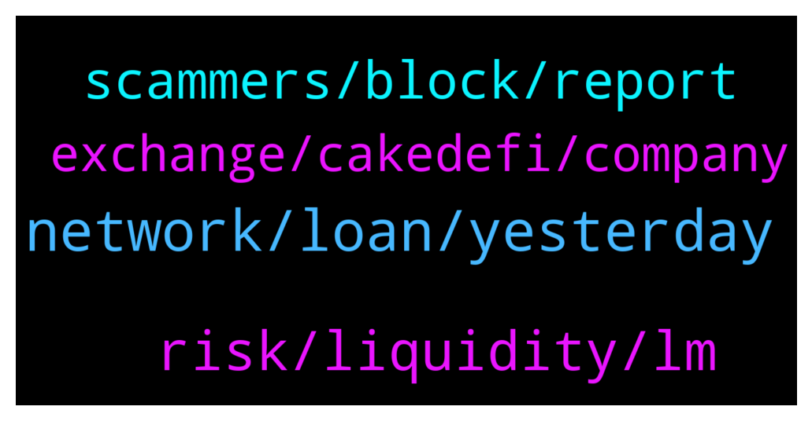

# **@CakeDeFi_EN**
 ## Analysis for **2021-12-25** - **2021-12-26**.

---

## 📊 **Basic Stats**

**n_messages_sent**: 62

---

---

## 🔝 **Top keywords and related messages**

1. **network, loan, yesterday**

    @Eugene --- *The withdrawal button is greyed out even after answering the knowledge questions and putting in my 2fa* **--->** [TG Discussion](https://t.me/CakeDeFi_EN/156892)

    @financialsurf --- *Micheal why is it still not possible to withdraw?* **--->** [TG Discussion](https://t.me/CakeDeFi_EN/156951)

    @Hdnro --- *How do I reset my 2FA? Does anybody know?* **--->** [TG Discussion](https://t.me/CakeDeFi_EN/156944)

    @MaverickGoh --- *I do not want to lock it up anymore. Does this means from tomorrow onwards i can withdraw? Or just flexible staking.* **--->** [TG Discussion](https://t.me/CakeDeFi_EN/156694)

    @kirkburni --- *Hi. What option should I choose to withdraw to kucoin? Defi Network? Eth network? Please* **--->** [TG Discussion](https://t.me/CakeDeFi_EN/156962)

    @Kassius84 --- *App or web browser? I did a withdrawal yesterday and it worked for me.* **--->** [TG Discussion](https://t.me/CakeDeFi_EN/156893)

2. **risk, liquidity, lm**

    @mikkelseg --- *The risk level, please are they the same?* **--->** [TG Discussion](https://t.me/CakeDeFi_EN/156924)

    @Thomas --- *In couple of sentences, it’s about the stability of the pair you are providing the liquidity. If the pair is stable (moves up or down equally)you are fine. As soon as the price separate vex or secs from each other arises a opportunity for arbitrageurs. They are fixing the price and bringing them in balance but they are getting the reward for it, which you are losing as a potential gain, if you wouldn’t have provided the liquidity* **--->** [TG Discussion](https://t.me/CakeDeFi_EN/156933)

    @DmgBautista --- *Obviously not. If it was, no one would do staking. You have more risk in LM, specifically imparmenent loss.* **--->** [TG Discussion](https://t.me/CakeDeFi_EN/156926)

    @Thomas --- *For LM you need a pair (btc/dfi etc.) and for staking only dfi* **--->** [TG Discussion](https://t.me/CakeDeFi_EN/156923)

    @mikkelseg --- *What is the difference between liquidity mining and staking* **--->** [TG Discussion](https://t.me/CakeDeFi_EN/156921)

    @mikkelseg --- *It seems liquidity mining is far more profitable. Please are the risk level the same?* **--->** [TG Discussion](https://t.me/CakeDeFi_EN/156922)

3. **scammers, block, report**

    @Cosmic88 --- *many scammers messaged me as well* **--->** [TG Discussion](https://t.me/CakeDeFi_EN/156910)

    @Eugene --- *Had a good time answering the scammers though haha* **--->** [TG Discussion](https://t.me/CakeDeFi_EN/156897)

    @enalettin --- *Anyone dm you and offer help is dangerous one hundred percent a thief make no mistake* **--->** [TG Discussion](https://t.me/CakeDeFi_EN/156753)

    @Nico --- *Oh yes it is but there is a dude called Bernd mack in here who is asking people for their Account data. Him: Bernd mack* **--->** [TG Discussion](https://t.me/CakeDeFi_EN/156750)

    @Eugene --- *Yeah they msged me very soon after I posted my msg* **--->** [TG Discussion](https://t.me/CakeDeFi_EN/156906)

    @A --- *Hi Eugene. I had a few run ins with scammers here too.* **--->** [TG Discussion](https://t.me/CakeDeFi_EN/156904)

4. **exchange, cakedefi, company**

    @YyeapY --- *if withdraw frm cake to other platform for fiat without go through defi wallet....is that acceptable?* **--->** [TG Discussion](https://t.me/CakeDeFi_EN/156854)

    @Grepolis_il_ritorno --- *hello everybody I'm starting with stake activity on CakeDefi platform, but I don't know the differences between Transak and Banxa service. could you kindly help me?* **--->** [TG Discussion](https://t.me/CakeDeFi_EN/156865)

    @A --- *How did I send crypto from the central exchange to cake?  If this is what you are asking then it is not difficult but difficult to text how to here. In short once you have your cake account set up and are verified you are able to deposit or receive crypto to cake. Look for the deposit tab under the asset you want to move to cake and use the QR code to tell your exchange where to send. I hope that help* **--->** [TG Discussion](https://t.me/CakeDeFi_EN/156882)

    @enalettin --- *Defie cake is a good company with good will and a bright future i believe this is the pro as for con 72 hours for withdrawals or deposits is not an acceptable time frame for users including me however much company states it is for security there needs to be a fine balance between speed and security I hope in the near future they will fix this.* **--->** [TG Discussion](https://t.me/CakeDeFi_EN/156726)

    @DmgBautista --- *Cakedefi is not a blockchain as you are for sure aware, being part of the Defichain channel. Cakedefi is a company that provides crypto services, having as reward mechanism the Defichain blockchain coin, that one fully decentralized. There is a difference :)* **--->** [TG Discussion](https://t.me/CakeDeFi_EN/156648)

    @Cosmic88 --- *hi. Does anyone how long does it take to withdraw btc (not tokenize/wrapped btc) from cake?* **--->** [TG Discussion](https://t.me/CakeDeFi_EN/156771)

