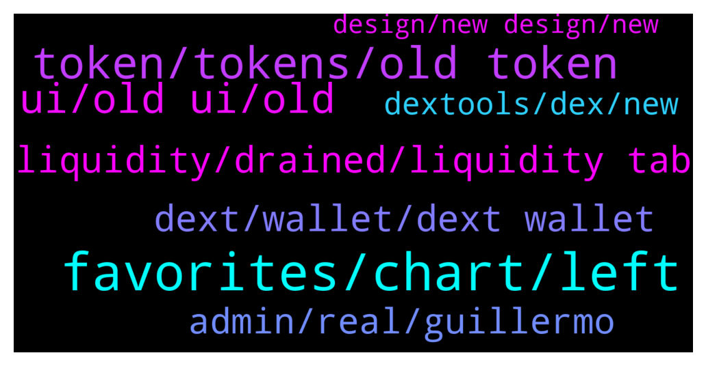

# **@DEXToolsCommunity**
 ## Analysis for **2021-12-24** - **2021-12-26**.

---

## 📊 **Basic Stats**

**n_messages_sent**: 732

---

---

## 🔝 **Top keywords and related messages**

1. **favorites, chart, left**

    @Simon --- *Guys not sure I’m a fan of the new layout, basically I want to be able to see my favourites so I can track current prices of my investments and a single chart together. I don’t care about anything else. All the guff on the left with pool info, dext score etc is fixed when I rarely care about any of it, it reduces the space for the chart and my favourites now have to float on top of it* **--->** [TG Discussion](https://t.me/DEXToolsCommunity/317457)

    @Simon --- *I still think being able to hide the stuff on the left would be good so I can have the chart and trade history spanning the rest of the width* **--->** [TG Discussion](https://t.me/DEXToolsCommunity/318245)

    @Bralna --- *To give an idea of what this looks like for me: 1) all the stuff on the left I only need to see occasionally yet it’s fixed. 2) chart is now much smaller and obscured by favourites 3) favourites are now less compact so I have to scroll vertically to see them all 4) trade history table really difficult to view and I have to scroll horizontally now* **--->** [TG Discussion](https://t.me/DEXToolsCommunity/317559)

    @hopiumvictim --- *Who in the right mind would want to redesign the "favorites" section* **--->** [TG Discussion](https://t.me/DEXToolsCommunity/317949)

    @fiesta_0604 --- *Could I ask something relate to the BOTS? How can I stop users using BOT to call for a chart? There are no helps command show me that.* **--->** [TG Discussion](https://t.me/DEXToolsCommunity/316592)

    @atosm --- *same as this guy. is there a way to put the graph on the left side. wayyyy tooo much info that I don't really want.* **--->** [TG Discussion](https://t.me/DEXToolsCommunity/317106)

2. **token, tokens, old token**

    @FredericDEXT --- *Same as before , at token info tab* **--->** [TG Discussion](https://t.me/DEXToolsCommunity/318154)

    @solidask --- *Hello, is it possible to remove old version (V1) chart of a token that migrated to new version (V2)?* **--->** [TG Discussion](https://t.me/DEXToolsCommunity/316912)

    @Kian_hashemi --- *Because everyone who trades has valuable seconds to check the tokens on the favorite list.  We had access to the previous version very quickly, but now we have to click a few times to be informed about the status of the tokens.  This is very bad for the trader.  I hope users think fast before their numbers dwindle.* **--->** [TG Discussion](https://t.me/DEXToolsCommunity/317746)

    @D --- *nice work making the old token available after making a new one* **--->** [TG Discussion](https://t.me/DEXToolsCommunity/317036)

    @justdhu --- *I cannot use the new one it’s just another bogged version bring back the score on tokens lol you guys used to bait out the scammers etc* **--->** [TG Discussion](https://t.me/DEXToolsCommunity/318047)

    @chupapimunyenyo60 --- *That doesn’t list the token version* **--->** [TG Discussion](https://t.me/DEXToolsCommunity/317225)

3. **ui, old ui, old**

    @KK1P1 --- *the old interface was pretty much perfect, there was no need for this change* **--->** [TG Discussion](https://t.me/DEXToolsCommunity/317871)

    @spfr237 --- *u guys want old UI back because you are too lazy to study new one!😂 common step out of your comfort zone and try to learn it, i bet it worth it, cause there are things that can be done with this UI which was impossible with old one😉* **--->** [TG Discussion](https://t.me/DEXToolsCommunity/317542)

    @hopiumvictim --- *Everything about the old UI was done right.* **--->** [TG Discussion](https://t.me/DEXToolsCommunity/317970)

    @hopiumvictim --- *When can we get the old UI back?* **--->** [TG Discussion](https://t.me/DEXToolsCommunity/317940)

    @PGtheGreat --- *New UI not support UNI V3?* **--->** [TG Discussion](https://t.me/DEXToolsCommunity/318091)

    @DekuNinja --- *You messed up with new UI on phone used to be able to see volume mc all gone , is that going to be sorted ?* **--->** [TG Discussion](https://t.me/DEXToolsCommunity/317358)

4. **liquidity, drained, liquidity tab**

    @HELLO1241 --- *Why do I have to come down and click on liquidity shitt to see the mc pooled eth etc* **--->** [TG Discussion](https://t.me/DEXToolsCommunity/318163)

    @HELLO1241 --- *Where is the mc pooled eth and liquidity* **--->** [TG Discussion](https://t.me/DEXToolsCommunity/318150)

    @napascual --- *You can see it on the Liquidity tab, bottom tabs on mobile* **--->** [TG Discussion](https://t.me/DEXToolsCommunity/317359)

    @D3c3ntraliz3d --- *yes the liquidity and mcap is not been showed on the phone* **--->** [TG Discussion](https://t.me/DEXToolsCommunity/318022)

    @danrunn --- *For new UI can we see liquidity amount for each pair anywhere?* **--->** [TG Discussion](https://t.me/DEXToolsCommunity/318062)

    @币 --- *Why the sudden surge so much?* **--->** [TG Discussion](https://t.me/DEXToolsCommunity/317895)

5. **dext, wallet, dext wallet**

    @scottcrypto11 --- *hi guys have we received our monthly allocation in numbers yet it is overdue now* **--->** [TG Discussion](https://t.me/DEXToolsCommunity/316715)

    @napascual --- *Your could send more and the remaining will be linked to your account, but the DEXT need is calculated at the moment in renewing it (DEXT price at that moment)* **--->** [TG Discussion](https://t.me/DEXToolsCommunity/317360)

    @rpoole69 --- *Thanks, do I just need to hold 1000 DEXT in my wallet to have a subscription or do I need to do what the user account page states "Transfer 224 DEXT from your current account to the following account" ? Because the main website says one thing, user configuration in the dAPP says another* **--->** [TG Discussion](https://t.me/DEXToolsCommunity/316547)

    @stanes --- *We have one reserved for people holding at least 1k DEXT https://dextools.medium.com/dext-force-is-now-open-a6dc966966b5  For support, only TG.* **--->** [TG Discussion](https://t.me/DEXToolsCommunity/316928)

    @Hatice --- *Hi. I just noticed something. This didn't exist before. Is it new? Does the 2nd option have to be done every month or if I send 200 dext to the wallet once, will I have the standart plan?* **--->** [TG Discussion](https://t.me/DEXToolsCommunity/317354)

    @napascual --- *Yeah monthly, read message above, it's ok to send more that the monthly need, but you have to take what I explained into account* **--->** [TG Discussion](https://t.me/DEXToolsCommunity/317368)

6. **admin, real, guillermo**

    @CyberBULK --- *Sorry can he DM me? Im on tg jail* **--->** [TG Discussion](https://t.me/DEXToolsCommunity/316573)

    @sunshinecrypto --- *Gosh I I asked one question in the chat and I got about three fake people messaging me pretending to be you lol   Anyway do you mind if I send you a DM? Needed some help with my dextools plz* **--->** [TG Discussion](https://t.me/DEXToolsCommunity/317623)

    @napascual --- *Could you dm me the issue?* **--->** [TG Discussion](https://t.me/DEXToolsCommunity/318222)

    @FredericDEXT --- *Feel free, real admins never DM first* **--->** [TG Discussion](https://t.me/DEXToolsCommunity/317632)

    @stanes --- *Never trust anybody here who doesn't have an admin tag.* **--->** [TG Discussion](https://t.me/DEXToolsCommunity/316799)

    @MYHOMECOIN --- *How can i make sure that's admin? as theirs no admin on top!?* **--->** [TG Discussion](https://t.me/DEXToolsCommunity/317077)

7. **dextools, dex, new**

    @FredericDEXT --- *This is the first step to make a more complete and modern UI, but many things are still in progress, and the community feedback is the best way to improve and the guide we always followed at dextools since the beginning.* **--->** [TG Discussion](https://t.me/DEXToolsCommunity/317317)

    @Chris --- *Any way to revert to the old DexTools?* **--->** [TG Discussion](https://t.me/DEXToolsCommunity/317101)

    @darkstorns --- *I haven't seen a significant change in functionality yet, this is not an update but an idle.  The number showing the price is too small, need blue red as before to know the price movement, I think the dev is imitating some other dex site, while dextools is number 1, who else needs to be imitated?* **--->** [TG Discussion](https://t.me/DEXToolsCommunity/317980)

    @bastardganpunk --- *Dextools released the new redesign 😊* **--->** [TG Discussion](https://t.me/DEXToolsCommunity/317933)

    @HeiHei1985 --- *I have used many applications, and dextools is better than other applications.* **--->** [TG Discussion](https://t.me/DEXToolsCommunity/317993)

    @Sad --- *The new dextools environment has become very difficult ... it is difficult to work with* **--->** [TG Discussion](https://t.me/DEXToolsCommunity/317453)

