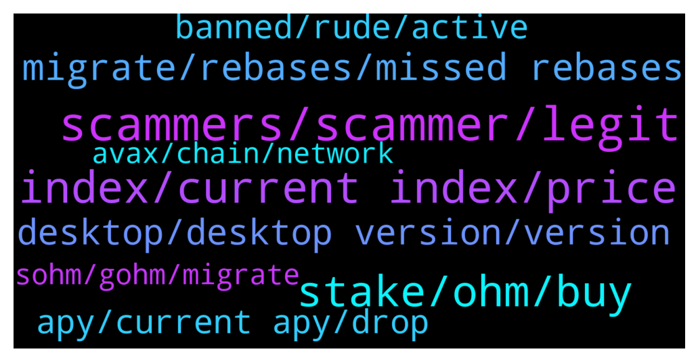

# **@OlympusTG**
 ## Analysis for **2021-12-25** - **2021-12-26**.

---

## 📊 **Basic Stats**

**n_messages_sent**: 658

---

---

## 🔝 **Top keywords and related messages**

1. **scammers, scammer, legit**

    @Bolo --- *A scammer would say that lol* **--->** [TG Discussion](https://t.me/OlympusTG/133771)

    @N --- *@nfwapl mind helping me bro, these scammers don’t rest 🤣😭* **--->** [TG Discussion](https://t.me/OlympusTG/134668)

    @nfwaple --- *use /report @username, if no username just forward the scammer message to @notoscam* **--->** [TG Discussion](https://t.me/OlympusTG/134006)

    @nfwaple --- *you say that but a lot of people here do get scammed sadly😢😢* **--->** [TG Discussion](https://t.me/OlympusTG/135048)

    @juggszn --- *@nfwaple beware somebody posing as you is sending phishing malware links to access dapps* **--->** [TG Discussion](https://t.me/OlympusTG/134172)

    @Ap0l1o --- *Not me, but there are some that copy my info and try to scam people* **--->** [TG Discussion](https://t.me/OlympusTG/133770)

2. **index, current index, price**

    @nfwaple --- *yes the current index is on the dashboard, current index is the same for everyone* **--->** [TG Discussion](https://t.me/OlympusTG/134952)

    @nfwaple --- *nothing, because the price is made up of OHM price x current index, and current index goes up only. If gOHM price stays the same, it means OHM price has gone down* **--->** [TG Discussion](https://t.me/OlympusTG/134995)

    @Dr. --- *Can there be a Python API so that I can embed this price of OHM and the current index at the same time so that I can build my own monitor app?* **--->** [TG Discussion](https://t.me/OlympusTG/134958)

    @Samuil86 --- *@nfwaple can't figure out how to profit from owning gOHM? I migrated to it 10 days ago. Now the quantity is the same, the price is about the same. Before that, they acquired an additional amount of Olympos, which I could generate constantly and sell whenever I wanted.* **--->** [TG Discussion](https://t.me/OlympusTG/134985)

    @nfwaple --- *number of gOHM = number of sOHM/current index* **--->** [TG Discussion](https://t.me/OlympusTG/134992)

    @ZR_CRYPTO --- *nothing is wrong, look on the app, you will see how many sOHM you have in your gOHM. Multiply by OHM price (currently $382) - this is your value* **--->** [TG Discussion](https://t.me/OlympusTG/135011)

3. **stake, ohm, buy**

    @Orlando --- *Is there a different reward rate depending on which type of OHM is staked* **--->** [TG Discussion](https://t.me/OlympusTG/135066)

    @Collective --- *To explain how to stake ohm* **--->** [TG Discussion](https://t.me/OlympusTG/134107)

    @Collective --- *Then use avalanche on trader joe to wrap stake ohm* **--->** [TG Discussion](https://t.me/OlympusTG/134122)

    @kyle333 --- *Should I swap my eth for ohmv1 on MetaMask? Will that work when I go to approve and stake?* **--->** [TG Discussion](https://t.me/OlympusTG/134695)

    @Morf486 --- *What is the difference between stake ohm or and ohm. On coingekco they have different prices.* **--->** [TG Discussion](https://t.me/OlympusTG/134814)

    @Marcosdel94 --- *I staked ohm , but the rewards doesnt accumulate... What i have to do?* **--->** [TG Discussion](https://t.me/OlympusTG/134651)

4. **migrate, rebases, missed rebases**

    @nfwaple --- *no rebase showing for v1, migrate to v2 to get your missed rebases* **--->** [TG Discussion](https://t.me/OlympusTG/134369)

    @KingMozzie --- *Anyone know why it's taking so long to migrate? Just curious to know how it works* **--->** [TG Discussion](https://t.me/OlympusTG/134785)

    @L --- *Hi, so got a problem with migration. The migrate button doesn’t seem to work and can’t connect to the app on the phone. Anyone know why these things occur? Thanks!* **--->** [TG Discussion](https://t.me/OlympusTG/134269)

    @Encrypted --- *do your rewards stop if you dont migrate* **--->** [TG Discussion](https://t.me/OlympusTG/134568)

    @nfwaple --- *yes if you own v1, the website should prompt you to migrate or see pinned message* **--->** [TG Discussion](https://t.me/OlympusTG/134562)

    @nfwaple --- *you can migrate now, it started but not finalised yet, soon* **--->** [TG Discussion](https://t.me/OlympusTG/134354)

5. **desktop, desktop version, version**

    @SaintJerome --- *Still doesnt work. Only the welcome -verification channel is showing* **--->** [TG Discussion](https://t.me/OlympusTG/134934)

    @nfwaple --- *try using the desktop version, try leaving and rejoining to redo the verification* **--->** [TG Discussion](https://t.me/OlympusTG/134927)

    @nfwaple --- *clear cache + use desktop version, then try again* **--->** [TG Discussion](https://t.me/OlympusTG/134092)

    @dinpriya --- *It says read only channel. I can’t send any message* **--->** [TG Discussion](https://t.me/OlympusTG/134061)

    @BongoBoing --- *for some reason always says the invite has expired* **--->** [TG Discussion](https://t.me/OlympusTG/134681)

    @nfwaple --- *not sure then, just worked for me, prolly try the basic troubleshoot on and off reconnect etc. idk* **--->** [TG Discussion](https://t.me/OlympusTG/134892)

6. **apy, current apy, drop**

    @Al_S1919 --- *What is the current APY? Doesn't show up to me.* **--->** [TG Discussion](https://t.me/OlympusTG/134881)

    @Telega_4eva --- *frens what is current apy please? away from pc* **--->** [TG Discussion](https://t.me/OlympusTG/134616)

    @Love3425436367564 --- *Knew youd say this. 7000% has been solid for almost a year now. Would be happy with that or even 5000%  More marketing & bonds = this can continue.  Bear market will rebound soon.  Dropping the apy too low is stupid and defeats the point of the project.* **--->** [TG Discussion](https://t.me/OlympusTG/133889)

    @fairwinds --- *here is OIP-18 https://forum.olympusdao.finance/d/77-oip-18-reward-rate-framework-and-reduction this tells you when it will reduce, and what brakcet APY it reduces to* **--->** [TG Discussion](https://t.me/OlympusTG/133896)

    @fairwinds --- *currently, 7369157 ohm out there, so not too long to go until 10 million is hit, and the apy reduces to 1000%* **--->** [TG Discussion](https://t.me/OlympusTG/133893)

    @shugabelly55 --- *So how do I know or see that my tokens are increasing in value with the Apy ? Because with V1 you can See that on the website* **--->** [TG Discussion](https://t.me/OlympusTG/134325)

7. **banned, rude, active**

    @yasir --- *Hm I may have been banned on my other account not sure why. Can someone help me* **--->** [TG Discussion](https://t.me/OlympusTG/134408)

    @Ap0l1o --- *If your name and or photo were suspicious you were banned by me.* **--->** [TG Discussion](https://t.me/OlympusTG/134416)

    @Ap0l1o --- *You were banned about a week ago* **--->** [TG Discussion](https://t.me/OlympusTG/134432)

    @Ap0l1o --- *Just a fair warning: If it happens again, both of your accounts will be banned.* **--->** [TG Discussion](https://t.me/OlympusTG/134437)

    @yasir --- *So I'm here and not being rude right, is that enough for you to unban me? This is over something dubious and subjective* **--->** [TG Discussion](https://t.me/OlympusTG/134436)

    @Bolo --- *Very aggressive no need for that lol* **--->** [TG Discussion](https://t.me/OlympusTG/133783)

8. **sohm, gohm, migrate**

    @nfwaple --- *ok, I don't know it is pretty straightforward to me, just like before when you buy OHM and stake for sOHM, the only tricky thing of the migration is people not understanding how gOHM works* **--->** [TG Discussion](https://t.me/OlympusTG/133940)

    @NaveenUSA --- *I have bought OHM and staked it later again I bought to add to the stake , I tried migrating as well Now my account shows gOHM and SOhm* **--->** [TG Discussion](https://t.me/OlympusTG/134319)

    @KingMozzie --- *I've already migrated to gOHM. Was more a question about the website and how long it'll take for everything to be updated. Was just curious because I've tried to get a few people staking and everything isn't showing correctly 😂* **--->** [TG Discussion](https://t.me/OlympusTG/134789)

    @Mark --- *Am I going to incur gas fees when I migrate my staked sOHM?* **--->** [TG Discussion](https://t.me/OlympusTG/135088)

    @shugabelly55 --- *From this, I have to go into uni swap and buy gOHM and then stake it on the website, that’s all? As And I don’t have to migrate to V2 later on, is this correct ?* **--->** [TG Discussion](https://t.me/OlympusTG/134316)

    @NaveenUSA --- *I am wondering did my migration process went well or is there anything I am missing since I still see sohm v1 in my account* **--->** [TG Discussion](https://t.me/OlympusTG/134323)

