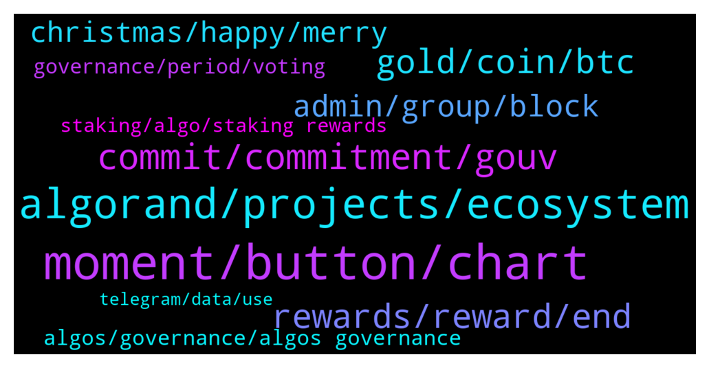

# **@algorand**
 ## Analysis for **2021-12-25** - **2021-12-26**.

---

## 📊 **Basic Stats**

**n_messages_sent**: 393

---

---

## 🔝 **Top keywords and related messages**

1. **moment, button, chart**

    @Tiny_Philosopher_784 --- *I'm guessing you were searching for a purpose. I wish I could give better news* **--->** [TG Discussion](https://t.me/algorand/325542)

    @MackDenver --- *You can check the link below to find them  https://www.algorand.com/ecosystem/use-cases* **--->** [TG Discussion](https://t.me/algorand/325704)

    @MackDenver --- *We are glad to have your interest. Let me know if you have any questions* **--->** [TG Discussion](https://t.me/algorand/325700)

    @MackDenver --- *You should find a button to do so soon, not sure why it is unavailable at the moment* **--->** [TG Discussion](https://t.me/algorand/326056)

    @NightAlgorand --- *You can refer to this doc https://developer.algorand.org/docs/run-a-node/setup/install/* **--->** [TG Discussion](https://t.me/algorand/325810)

    @hasbulaa --- *That’s fine but what wrong I’m doing ?* **--->** [TG Discussion](https://t.me/algorand/325910)

2. **algorand, projects, ecosystem**

    @Atbash1984 --- *Excuse me, I tried to ask if anyone can give me a piece of advice about what to study to be able to run an Algorand node. I linked the official link about the guide. I am asking about the basis. I am a young smart guy, i know how to deal with defi but I have no knowledge about programming.. thanks!* **--->** [TG Discussion](https://t.me/algorand/325803)

    @BBeniek --- *But what else? There are many interesting projects with their own coin on Algorand* **--->** [TG Discussion](https://t.me/algorand/325703)

    @pictonz8 --- *algorand was on the radar before this - it's looking very good so far!  Iso 20022, eco friendly and all that, checks all the boxes.* **--->** [TG Discussion](https://t.me/algorand/326089)

    @Tiny_Philosopher_784 --- *Cost will become most important soon.   Yes, free tx coins are gonna catch interest, but they'll have to start with excessive amounts of coins. Or they have to burn alot and mint more, which means it can be rugged easily.  With algorand, that's not the concept. It's a nice little loop. Some algos have been lost already, and it will only continue to become less over time. So as much as people harp on the tokenomics, they don't see the future reductions that will invariably occur.* **--->** [TG Discussion](https://t.me/algorand/326257)

    @NightAlgorand --- *check out this link for all project built on Algorand https://www.algorand.com/ecosystem/use-cases* **--->** [TG Discussion](https://t.me/algorand/325510)

    @pictonz8 --- *nice.  Any big projects about to launch on Algorand soon?* **--->** [TG Discussion](https://t.me/algorand/326083)

3. **commit, commitment, gouv**

    @MackDenver --- *Hey there, the button for changing your commit should be made available soon* **--->** [TG Discussion](https://t.me/algorand/325780)

    @Wurzelbear --- *Just remember to not cancel your commitment before 3/31* **--->** [TG Discussion](https://t.me/algorand/326208)

    @idontknowwhattouseforusername --- *You can update your commitment before the registration window ends* **--->** [TG Discussion](https://t.me/algorand/326053)

    @pandemoniumq8 --- *I commited a wrong amount for period 2, less than i wanted to.. Is it possible to change/add more algo?* **--->** [TG Discussion](https://t.me/algorand/325779)

    @Bastien --- *Hello, I just commited Algo to gouvernance 2. But just saw that I need to keep committed until 31 Dec for gouv #1. Did I made a mistake ?* **--->** [TG Discussion](https://t.me/algorand/325814)

    @rodde --- *Is it possible to uncommit before the 3 months? Say if I need to sell for whatever reason* **--->** [TG Discussion](https://t.me/algorand/325758)

4. **rewards, reward, end**

    @Tiny_Philosopher_784 --- *Until rewards end mid February, yes* **--->** [TG Discussion](https://t.me/algorand/325954)

    @MJayCrypto --- *Last reward I see is on Aug 7* **--->** [TG Discussion](https://t.me/algorand/325614)

    @bogieman8 --- *Thank you…but the rewards will get tabulated and put into the wallet at end of day 3/31/22?* **--->** [TG Discussion](https://t.me/algorand/326203)

    @Tiny_Philosopher_784 --- *I think once holding rewards disappear, they might do it then* **--->** [TG Discussion](https://t.me/algorand/325856)

    @MilanSWOL --- *Can’t find anything about the reward?* **--->** [TG Discussion](https://t.me/algorand/325916)

    @MackDenver --- *Oh I see, yes, you will still get your reward* **--->** [TG Discussion](https://t.me/algorand/326180)

5. **gold, coin, btc**

    @hope9999999 --- *😕😕😕 while all of you are dreaming about market caps, govs are buying back real gold silently. 😂😂😂* **--->** [TG Discussion](https://t.me/algorand/326256)

    @Pablo_cast --- *Mostly easier get cash from gold than from btc* **--->** [TG Discussion](https://t.me/algorand/326300)

    @sconelover --- *The world is waking up to the power and utility of $arcc 😂* **--->** [TG Discussion](https://t.me/algorand/325944)

    @Tiny_Philosopher_784 --- *Yeah, I like money too... but I'm not gonna shill it to make that money and leave others holding my bags* **--->** [TG Discussion](https://t.me/algorand/325952)

    @hope9999999 --- *😀 oneday you will see physical gold and gold paper similiar to btc and wrapped btc 😝* **--->** [TG Discussion](https://t.me/algorand/325541)

    @mcmaxims --- *Gold is crap. I mean people are mining gold, just to hide it somewhere else afterward* **--->** [TG Discussion](https://t.me/algorand/326258)

6. **admin, group, block**

    @Beni --- *Why is the information in the group so complicated! The administrator should share more useful information with us.* **--->** [TG Discussion](https://t.me/algorand/326235)

    @Tiny_Philosopher_784 --- *You can also DM them. If they have a little lettering in the upper right hand corner of the comment box, they are either admin or people who are considered admin for the group* **--->** [TG Discussion](https://t.me/algorand/326293)

    @Nadir_Ali_CSE --- *i know one fake profile dm me and say i am admin* **--->** [TG Discussion](https://t.me/algorand/326290)

    @Tiny_Philosopher_784 --- *There are a couple people. Don't be fooled by fake people* **--->** [TG Discussion](https://t.me/algorand/326289)

    @Tiny_Philosopher_784 --- *It doesn't say admin in the corner.* **--->** [TG Discussion](https://t.me/algorand/325994)

    @mrlovin --- *He dms people and pretends to be an admin* **--->** [TG Discussion](https://t.me/algorand/325737)

7. **christmas, happy, merry**

    @mcmaxims --- *Wish you a merry Christmas as well my friend* **--->** [TG Discussion](https://t.me/algorand/325777)

    @bogieman8 --- *Thank you all for your responses and help! Happy, healthy and Algorand prosperous New Year!* **--->** [TG Discussion](https://t.me/algorand/326207)

    @Charles --- *🎄Christmas is the best time to share love and happiness🎄😍💖. 🎁May the best season be yours and your family.🎄* **--->** [TG Discussion](https://t.me/algorand/325846)

    @qwert494 --- *Talking and laughing during the day and a good night’s sleep😁* **--->** [TG Discussion](https://t.me/algorand/325796)

    @crypto_punk01 --- *Merry Xmas and happy NY In advance* **--->** [TG Discussion](https://t.me/algorand/325668)

    @Wurzelbear --- *First time for me too, so don't take every word for granted 😂* **--->** [TG Discussion](https://t.me/algorand/325481)

8. **algos, governance, algos governance**

    @bogieman8 --- *@daysandbox_boo are the algos locked for Governor? If so, how long?  What’s the minimum needed for governo?* **--->** [TG Discussion](https://t.me/algorand/325907)

    @Mehrdad_bast09 --- *what's this message in algorond wallet : Become a governor. Vote on Algorand's future. Earn rewards. The registration window for Governance Period #2 is Dec 24 to Jan 6, 16:00 UTC Get Started >* **--->** [TG Discussion](https://t.me/algorand/325472)

    @Tiny_Philosopher_784 --- *And how many algos successfully remain in governance for 3 months* **--->** [TG Discussion](https://t.me/algorand/325934)

    @Malvo --- *Greetings  has it reach the time to recommit your Algos for governance* **--->** [TG Discussion](https://t.me/algorand/325628)

    @MackDenver --- *If you go to the governance site, you will need to commit X amount of ALGO* **--->** [TG Discussion](https://t.me/algorand/326193)

    @Jessie --- *Im on their website and the only option available is to change the governance period and "show governors." Nothing about committing more algos.* **--->** [TG Discussion](https://t.me/algorand/325596)

9. **governance, period, voting**

    @0x --- *This message is sign up period for governance 2#* **--->** [TG Discussion](https://t.me/algorand/325475)

    @aleks_qaz --- *And when does this vote end?* **--->** [TG Discussion](https://t.me/algorand/325752)

    @Prabu --- *Hello when does voting open for second governance?* **--->** [TG Discussion](https://t.me/algorand/326061)

    @MackDenver --- *Hell Aleks, Here is the governance voting guide: https://algorandfoundationv2.cdn.prismic.io/algorandfoundationv2/99a613ce-ae6a-46b7-817b-f6a78edf2694_Algorand+COmmunity+Governance+Guide+-+Period+2_en-IE_V3.pdf* **--->** [TG Discussion](https://t.me/algorand/325749)

    @hasbulaa --- *I haven’t did the first governance* **--->** [TG Discussion](https://t.me/algorand/325905)

    @Wurzelbear --- *Not sure if you can sign the new contract for next period before end of the governance period. That's something the mods have to confirm.* **--->** [TG Discussion](https://t.me/algorand/326215)

10. **staking, algo, staking rewards**

    @jakaaaas --- *why is the staking APR very low* **--->** [TG Discussion](https://t.me/algorand/325723)

    @mcmaxims --- *Yes you earn algo for staking.* **--->** [TG Discussion](https://t.me/algorand/326167)

    @KAPIBAYSIDE --- *Yes I know but I wanted to know if it is a type of staking as well were you will earn any just like if u left it on my algo* **--->** [TG Discussion](https://t.me/algorand/326166)

    @MJayCrypto --- *How come I don't get any staking rewards in the last months on my Algorand wallet? Has something changed?* **--->** [TG Discussion](https://t.me/algorand/325609)

    @Owl321 --- *For Algo governor rewards is this, for those who hold Algo in cold storage, cold staking? Do Algo holders retain control of the private key?* **--->** [TG Discussion](https://t.me/algorand/326222)

    @max219912 --- *Is it on the ledger nano ? I heard there are staking rewards* **--->** [TG Discussion](https://t.me/algorand/325527)

