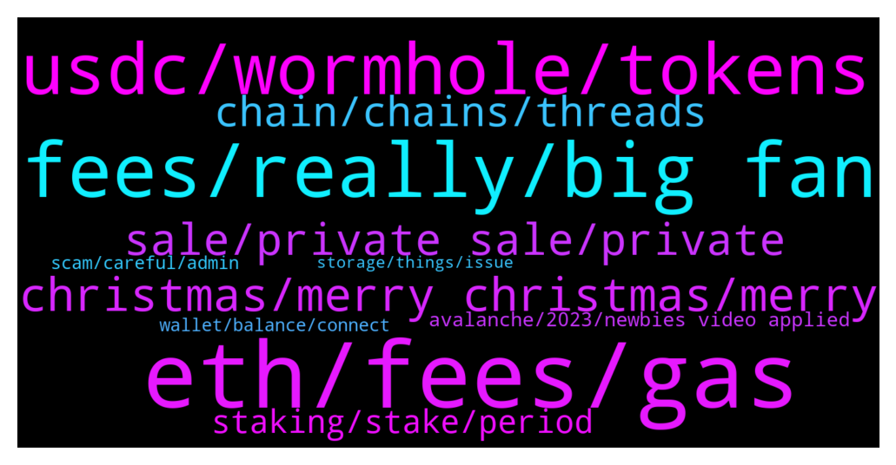

# **@avalancheavax**
 ## Analysis for **2021-12-25** - **2021-12-26**.

---

## 📊 **Basic Stats**

**n_messages_sent**: 247

---

---

## 🔝 **Top keywords and related messages**

1. **eth, fees, gas**

    @alrko616 --- *1 dollar is alright but if it would be like ETH that would be pretty much bad* **--->** [TG Discussion](https://t.me/avalancheavax/317735)

    @elizabeth_baker --- *Eth fees are too expensive,dev's should take a look at this* **--->** [TG Discussion](https://t.me/avalancheavax/317719)

    @Nicolas_A --- *Fees can go up to 1 dollar if there is a big traffic spike* **--->** [TG Discussion](https://t.me/avalancheavax/317733)

    @alrko616 --- *so can we say in future 1-2 years fees can go up to 1 dollar* **--->** [TG Discussion](https://t.me/avalancheavax/317732)

    @oathtobarbatos --- *What do you mean? Gas fees are under 50 cents I think* **--->** [TG Discussion](https://t.me/avalancheavax/317552)

    @Nicolas_A --- *Less than 50 cents. For simple transactions it will be like 10 cents* **--->** [TG Discussion](https://t.me/avalancheavax/317731)

2. **fees, really, big fan**

    @Nicolas_A --- *Around 10% paid out in avax* **--->** [TG Discussion](https://t.me/avalancheavax/317470)

    @alexbwork --- *I like everytgin about AVAX and I’m really a big fan of ecosystem and etc but these fees are really will became a problem with growing* **--->** [TG Discussion](https://t.me/avalancheavax/317541)

    @Alex --- *AVAX had a 2 billion mkt cap at the time of sale. With the vesting schedule unknown (being unlocked right now as u assume) it can be over 10 percent at this moment.* **--->** [TG Discussion](https://t.me/avalancheavax/317433)

    @alexbwork --- *If we wanna see avax in top 5 my assuming the fees must be lowered* **--->** [TG Discussion](https://t.me/avalancheavax/317536)

    @Nicolas_A --- *Look if you can’t sleep because you think 3ac is gonna wake up one day and market sell all their holdings I would just recommend getting rid of your avax* **--->** [TG Discussion](https://t.me/avalancheavax/317432)

    @alrko616 --- *so. what are avax feees? say you want to transfer 100 worth of avax* **--->** [TG Discussion](https://t.me/avalancheavax/317720)

3. **usdc, wormhole, tokens**

    @manilabear --- *My usdc Its not showing up on trader joe if I click usdc or usdc.e but Its showing up on snowtrace as usd coin (wormhole)* **--->** [TG Discussion](https://t.me/avalancheavax/317697)

    @ramziakram --- *UST (wormhole token) got liquidity on curve factory (ust/usdc.e pair) if you want to bridge stable using wormhole* **--->** [TG Discussion](https://t.me/avalancheavax/317701)

    @rusakova_8 --- *sent tokens over the network from the С-chain, they did not come, what to do, please help !!!* **--->** [TG Discussion](https://t.me/avalancheavax/317610)

    @TheSEOdude --- *Where did you send the tokens?* **--->** [TG Discussion](https://t.me/avalancheavax/317612)

    @manilabear --- *Hi I sent some usdc from solana to my avax MetaMask wallet via wormhole. Anybody know a way to swap it to avax? Thanks* **--->** [TG Discussion](https://t.me/avalancheavax/317689)

    @Alex --- *My question is when these tokens get unlocked. I couldn't care less where it comes from - just your inability to find where it came from already tells u what u need to know.* **--->** [TG Discussion](https://t.me/avalancheavax/317408)

4. **christmas, merry christmas, merry**

    @Nicolas_A --- *My god I’m going to close the chat for the day and try to enjoy Christmas alone* **--->** [TG Discussion](https://t.me/avalancheavax/317436)

    @Saehuns --- *Merry christmas too! Have a good day* **--->** [TG Discussion](https://t.me/avalancheavax/317284)

    @elizabeth_baker --- *Have a safe holiday with your loved ones* **--->** [TG Discussion](https://t.me/avalancheavax/317451)

    @TheSEOdude --- *Yesh he is being paid. But it's Christmas and everybody has family.  So calm down a bit.* **--->** [TG Discussion](https://t.me/avalancheavax/317359)

    @MidgetGems --- *Happy Christmas avax family, hope you all have a good one* **--->** [TG Discussion](https://t.me/avalancheavax/317287)

    @Marte3e --- *⠀             🌟               🎄🎄             🎄💝🎄           🎄🎒💻🎄         🎄👢📱🏈🎄       🎄🎺🎿🎸💄🎄     🎄👜💍👘📺👔🎄   🎄👗👒🚲💐🐶⚽🎄 🎁🎁🎁🎁🎁🎁🎁🎁🎁 ✨ Merry Christmas✨* **--->** [TG Discussion](https://t.me/avalancheavax/317178)

5. **sale, private sale, private**

    @Alex --- *I've been asking for months. Sir. And that is false because last month the team revealed it was locked for years but didn't reveal the entire schedule.* **--->** [TG Discussion](https://t.me/avalancheavax/317414)

    @Jules 🔺 --- *team can sell I think 5 years after ico. that is published too* **--->** [TG Discussion](https://t.me/avalancheavax/317394)

    @Alex --- *Jules 🔺 just to prove my point, the entire cult group has plenty of ico investors and none will know the vested schedule from 3ac and polychain.* **--->** [TG Discussion](https://t.me/avalancheavax/317419)

    @qllnppr --- *Anyone have a recent estimate on the time for syncing up a brand new node?* **--->** [TG Discussion](https://t.me/avalancheavax/317316)

    @Nicolas_A --- *Date not announced yet. Around March / April afaik* **--->** [TG Discussion](https://t.me/avalancheavax/317495)

    @Alex --- *Exactly, but the inevitable will happen and at this rate with the vesting schedules hidden, supply is literally centralized.* **--->** [TG Discussion](https://t.me/avalancheavax/317405)

6. **chain, chains, threads**

    @NoGivenUp --- *I don't have enough avax where would I leave it into? I means which chain would you recommend? It s on P chain at the moment* **--->** [TG Discussion](https://t.me/avalancheavax/317473)

    @A01010100 --- *Yes, it seems not working at all.. not sure if is metamask .. but seems to be working fine with other chains.. that’s why i’m asking* **--->** [TG Discussion](https://t.me/avalancheavax/317661)

    @azzix --- *Do I need to run node to create tokens on x chain? Is it requirement?* **--->** [TG Discussion](https://t.me/avalancheavax/317322)

    @azzix --- *Can i transfer any token from x chain to c chain?* **--->** [TG Discussion](https://t.me/avalancheavax/317303)

    @Nicolas_A --- *Never used them. It should show it on this page https://ascendex.com/en/assets/assets-recharge/AVAX If it gives you a deposit address starting with 0x it will be C chain if it gives you a X-avax1 address it will be X chain* **--->** [TG Discussion](https://t.me/avalancheavax/317449)

    @Nicolas_A --- *It will probably be C chain* **--->** [TG Discussion](https://t.me/avalancheavax/317450)

7. **staking, stake, period**

    @retiredcoin --- *not really on yieldyak de-staking from some pools, some takes about 0.08avax which is hefty* **--->** [TG Discussion](https://t.me/avalancheavax/317554)

    @NoGivenUp --- *It s at the moment on P one, cause I wanted to stake but it doesn't let me do it* **--->** [TG Discussion](https://t.me/avalancheavax/317463)

    @lawlessyak --- *is there locking period for staking?* **--->** [TG Discussion](https://t.me/avalancheavax/317642)

    @LeonSeah --- *hey, any staking for AVAX without a lockin period?* **--->** [TG Discussion](https://t.me/avalancheavax/317454)

    @hossein_barati_93 --- *Excuse me, what is the relationship between CRA staking and avax? Could anyone tell me plaese?* **--->** [TG Discussion](https://t.me/avalancheavax/317195)

    @JayMCrypto --- *Avax wallet mate via delegate staking* **--->** [TG Discussion](https://t.me/avalancheavax/317640)

8. **avalanche, 2023, newbies video applied**

    @svnods --- *I don't know. They just say that they applied for Know your customer program at Avalanche* **--->** [TG Discussion](https://t.me/avalancheavax/317346)

    @bestcoderna --- *Join us for our Avalanche Weekly Wrapup https://twitter.com/i/spaces/1ypKdEeNXaaGW* **--->** [TG Discussion](https://t.me/avalancheavax/317191)

    @edc812 --- *go to the avalanche homepage and its linked at the bottom* **--->** [TG Discussion](https://t.me/avalancheavax/317504)

    @Bruno_LGD --- *Avalanche for newbies on the video☝🏻* **--->** [TG Discussion](https://t.me/avalancheavax/317382)

    @Saehuns --- *Sure Avalanche is very nice I love it* **--->** [TG Discussion](https://t.me/avalancheavax/317249)

    @Saehuns --- *Avalanche will go Mars in 2023* **--->** [TG Discussion](https://t.me/avalancheavax/317242)

9. **wallet, balance, connect**

    @Nicolas_A --- *Sometimes resetting Metamask helps. Settings > Advanced > Reset. Not sure what issue you have* **--->** [TG Discussion](https://t.me/avalancheavax/317662)

    @tonynguyen56155 --- *Hey @Support teams have you Validated your wallet address?* **--->** [TG Discussion](https://t.me/avalancheavax/317548)

    @manilabear --- *Yeah it’s looking like I have to bridge it again back to my solana wallet* **--->** [TG Discussion](https://t.me/avalancheavax/317699)

    @Nicolas_A --- *You sure you restored the same seed phrase ? It should work afaik. Weird* **--->** [TG Discussion](https://t.me/avalancheavax/317478)

    @CLG --- *On the old hardware wallet when I connect it I can see the balance, when I connect the new hardware wallet I can't see the balance.* **--->** [TG Discussion](https://t.me/avalancheavax/317477)

    @A01010100 --- *That solved the issue. Thanks 🙏🏼👏🏼* **--->** [TG Discussion](https://t.me/avalancheavax/317664)

10. **scam, careful, admin**

    @Nicolas_A --- *Are you just trying to get as many dm from scammers as possible or really need help ? You can just contact me if you need help no need to pay lol* **--->** [TG Discussion](https://t.me/avalancheavax/317522)

    @chloe_edwards --- *I just got a message from community Admin is it real or scam ?* **--->** [TG Discussion](https://t.me/avalancheavax/317197)

    @oathtobarbatos --- *Careful with this kind of message, most of them are scams. Be careful with anyone's DM!* **--->** [TG Discussion](https://t.me/avalancheavax/317549)

    @celofg --- *Bom dia, amigos. Um abraço do Brasil 🇧🇷  Como faço pra descobrir novos projetos (que tenham credibilidade) para fazer Staking? Com um bom APY, claro* **--->** [TG Discussion](https://t.me/avalancheavax/317342)

    @swamptvar --- *but seriously, it’s a scammer guys, watch out* **--->** [TG Discussion](https://t.me/avalancheavax/317295)

    @Nicolas_A --- *Scam no admin will ever dm you first* **--->** [TG Discussion](https://t.me/avalancheavax/317201)

