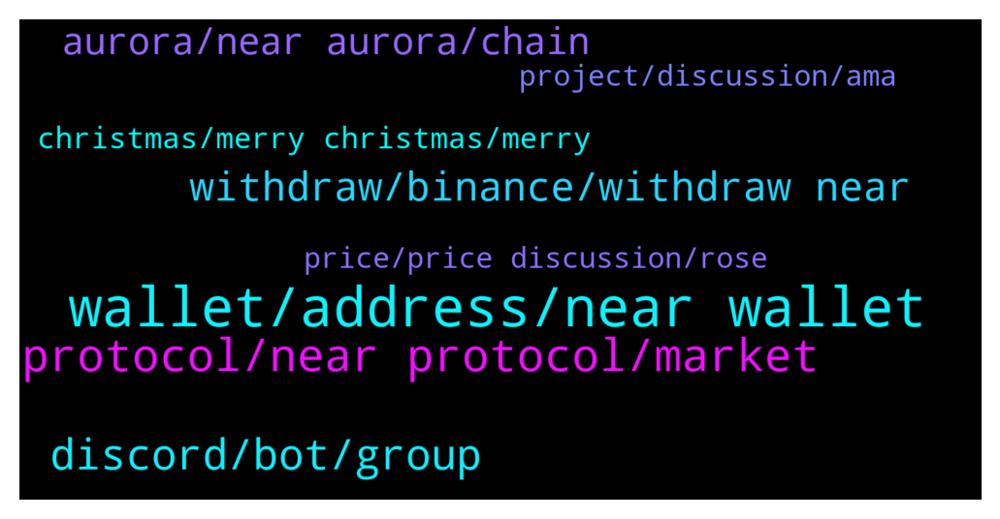

# **@cryptonear**
 ## Analysis for **2021-12-25** - **2021-12-26**.

---

## 📊 **Basic Stats**

**n_messages_sent**: 574

---

---

## 🔝 **Top keywords and related messages**

1. **wallet, address, near wallet**

    @bailey_12 --- *go to wallet.near.org . Create a new wallet with domain ****.near* **--->** [TG Discussion](https://t.me/cryptonear/251367)

    @bailey_12 --- *He is trying to send Near from crypto.com wallet to his Near wallet. The thing is when he input his address, it keeps display the above address which can’t alter.* **--->** [TG Discussion](https://t.me/cryptonear/251402)

    @traderchristofer --- *ok, so in the crypto dot com app, it says the address xyz.near is invalid* **--->** [TG Discussion](https://t.me/cryptonear/251266)

    @bailey_12 --- *but that should be a dead address* **--->** [TG Discussion](https://t.me/cryptonear/251383)

    @traderchristofer --- *I sent NEAR to my Crypto dot com Defi Wallet, and now it will not let me send the NEAR back. it is 3.9 NEAR . The error message is "Inactive Recipient Address" Your request cannot be processed . Please send at least 0.00182 NEAR to activate it.* **--->** [TG Discussion](https://t.me/cryptonear/251343)

    @Gasidid --- *Hi I want to find link near domain name service* **--->** [TG Discussion](https://t.me/cryptonear/250686)

2. **protocol, near protocol, market**

    @frankwizard --- *why do you guys think NEAR ecosystem is not as widely used (or widely recognized) by the world  P/s: Im merely judging from TVL and token price where we lag behind SOL/AVAX etc  - where do you guys think there is the gap btwn us and them?* **--->** [TG Discussion](https://t.me/cryptonear/251801)

    @frankwizard --- *With all the L1 competing for TVL i do feel NEAR is falling behind in market share (NEAR has such solid product but just not picking up market share) —> makes me wonder why* **--->** [TG Discussion](https://t.me/cryptonear/251816)

    @kv9990 --- *Different approach to Sharding 👀   Read about NEAR's Nightshade Sharding here https://near.org/papers/nightshade/* **--->** [TG Discussion](https://t.me/cryptonear/252288)

    @Kripto_Raptor --- *📣JUST IN: NEAR Protocol is launching an $800 million ecosystem grants program, including   - $250 million in ecosystem grants that will be distributed over four years - A regional fund of $100 million - $100 million specifically for startups - $350 million fund from Proximity Labs  Read more 🔽 https://www.coindesk.com/tech/2021/10/25/near-protocol-offers-800m-in-grants-in-bid-for-defi-mindshare* **--->** [TG Discussion](https://t.me/cryptonear/250814)

    @xerophyte --- *i am going stable coins because of this omicron news .. is that good idea?* **--->** [TG Discussion](https://t.me/cryptonear/251075)

    @EinyC --- *Personal perceptions of predicting the market* **--->** [TG Discussion](https://t.me/cryptonear/251560)

3. **discord, bot, group**

    @r33pich33p --- *can the admins say something in here about it? 13k users in there..* **--->** [TG Discussion](https://t.me/cryptonear/251084)

    @Attaulhadisindhu --- *Raptor are u messaging me in private ?* **--->** [TG Discussion](https://t.me/cryptonear/251057)

    @larry_lang --- *Heyy i just replied to u on DM but yeah so it should be able to trade on https://app.ref.finance/deposit* **--->** [TG Discussion](https://t.me/cryptonear/252044)

    @Kripto_Raptor --- *aren't you following me on twitter* **--->** [TG Discussion](https://t.me/cryptonear/251039)

    @traderchristofer --- *I will show you the screenshot* **--->** [TG Discussion](https://t.me/cryptonear/251372)

    @Roki --- *I inform them a bug on their system that so harmfull* **--->** [TG Discussion](https://t.me/cryptonear/251456)

4. **withdraw, binance, withdraw near**

    @Davy --- *Hi Guys, new NEAR hodler here, bought a load last night and want to stake them. Binance isn't letting me withdraw to NEAR wallet. Is this temporary or will it be up and running soon?  Ps: hello from Ireland 👍* **--->** [TG Discussion](https://t.me/cryptonear/251651)

    @cashewme --- *Binance says i can withdraw to bsc. Is token on bsc?* **--->** [TG Discussion](https://t.me/cryptonear/251582)

    @TJ --- *Is there any way I can deposit NEAR to my NEAR wallet for now? I usually use Binance but now the network is suspended* **--->** [TG Discussion](https://t.me/cryptonear/251345)

    @nicolassssssssssssssss --- *Withdraw near on binance is not possible - anybody else experiencing this?* **--->** [TG Discussion](https://t.me/cryptonear/251756)

    @rahulgoel007 --- *Ok so binance have again suspended the withdraw* **--->** [TG Discussion](https://t.me/cryptonear/251589)

    @cashewme --- *Binance wont let me withdraw.. They suspended it due to maintenance or something* **--->** [TG Discussion](https://t.me/cryptonear/251590)

5. **aurora, near aurora, chain**

    @xerophyte --- *so is aurora like C chain, and near is like x chain, then i should be on the aurora for defi?* **--->** [TG Discussion](https://t.me/cryptonear/250859)

    @frankwizard --- *Yes I did, but aurora is one of the many amazing aspect near has, If aurora become the key driver of near growth then we are no diff with other evm* **--->** [TG Discussion](https://t.me/cryptonear/251830)

    @xerophyte --- *I am little confused between near and aurora 🙁 what is the different* **--->** [TG Discussion](https://t.me/cryptonear/250840)

    @larry_lang --- *Hmm would u mind stating your problem here or in this Aurora channel so we can help u ? https://t.me/auroraisnear* **--->** [TG Discussion](https://t.me/cryptonear/251995)

    @kv9990 --- *For adding aurora network to MetaMask ,here's the process https://t.me/cryptonear/195500* **--->** [TG Discussion](https://t.me/cryptonear/252465)

    @elgranfed --- *thank you! maybe it was Aurora then that can be set up in metamask. I appreciatte your fast response.* **--->** [TG Discussion](https://t.me/cryptonear/252464)

6. **christmas, merry christmas, merry**

    @Badis --- *In reward merry Christmas to you and the rest of our mates over here* **--->** [TG Discussion](https://t.me/cryptonear/250639)

    @DexiNigeria --- *Waoh. That's fine. Transport for Christmas visit hanging. 😂* **--->** [TG Discussion](https://t.me/cryptonear/251856)

    @nearpunk --- *🎄 Guys. On Paras https://paras.id/ru/npunks_xmas.near/creation  we launched a limited edition collection for Christmas! Completely unique and cool NPunks with rare New Year's attributes. Merry Christmas everyone!* **--->** [TG Discussion](https://t.me/cryptonear/250892)

    @bailey_12 --- *Anyways, what cha doing for this Christmas?* **--->** [TG Discussion](https://t.me/cryptonear/250957)

    @FritzWagner --- *I can send you a christmast gift if you want =) an NFT 🎄✨* **--->** [TG Discussion](https://t.me/cryptonear/250636)

    @kv9990 --- *Merry Christmas to all 💕 and gm ❤️* **--->** [TG Discussion](https://t.me/cryptonear/251105)

7. **project, discussion, ama**

    @Adam --- *What do you guys view as the best project on near?* **--->** [TG Discussion](https://t.me/cryptonear/252109)

    @ksdrian --- *Hi, is there any project like AAVE or DyDx on Near?* **--->** [TG Discussion](https://t.me/cryptonear/251611)

    @larry_lang --- *=]] well then maybe a trio of u AVB and illia would made an epic episode* **--->** [TG Discussion](https://t.me/cryptonear/251199)

    @Kaiguy69 --- *i hear it's got some similarities to avax* **--->** [TG Discussion](https://t.me/cryptonear/251220)

    @Kripto_Raptor --- *please check awesomenear.com defi category to discover all 😉* **--->** [TG Discussion](https://t.me/cryptonear/251614)

    @shirley --- *What is relationship between near and Uniarts? Why they host ama together sir* **--->** [TG Discussion](https://t.me/cryptonear/251501)

