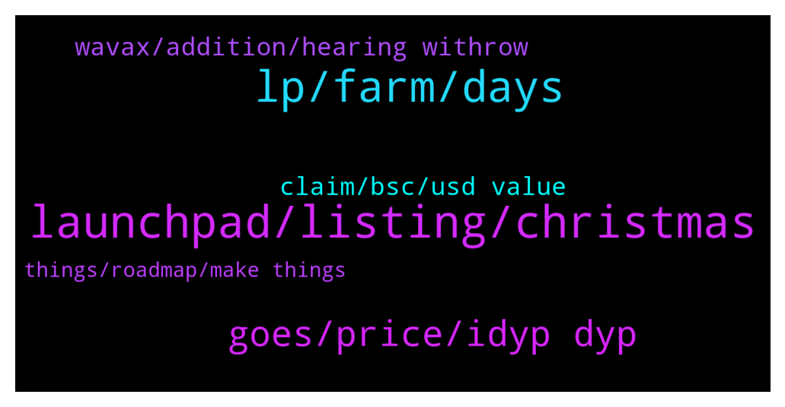

# **@dypfinance**
 ## Analysis for **2021-12-25** - **2021-12-26**.

---

## 📊 **Basic Stats**

**n_messages_sent**: 135

---

---

## 🔝 **Top keywords and related messages**

1. **launchpad, listing, christmas**

    @Vl_investor --- *With the listing, it is clear that nothing can depend on you, and the launchpad, according to you, should have been released like 5 days ago, where is it? what's happened? people want to know!* **--->** [TG Discussion](https://t.me/dypfinance/233559)

    @DhoniMSD516 --- *Here is some update regarding listings https://t.me/dypprice/30006* **--->** [TG Discussion](https://t.me/dypfinance/233355)

    @DhoniMSD516 --- *Please stay tuned for upcoming listings :)* **--->** [TG Discussion](https://t.me/dypfinance/233350)

    @timdyp --- *Hi, the launchpad portal for new projects to apply will be announced tomorrow, also a preview of the new NFTs marketplace and collection will be launched tomorrow. We expect the first project to be launched through our launchpad by the middle of January.* **--->** [TG Discussion](https://t.me/dypfinance/233565)

    @trader_broi --- *Only 5 days left .. listing will come ?* **--->** [TG Discussion](https://t.me/dypfinance/233464)

    @DhoniMSD516 --- *Hey mate we are already live  https://coinmarketcap.com/currencies/defi-yield-protocol/* **--->** [TG Discussion](https://t.me/dypfinance/233548)

2. **lp, farm, days**

    @Bodo --- *i mean same value in busd of my 3 days farm as per today not as per the date I created this farm? :)* **--->** [TG Discussion](https://t.me/dypfinance/233530)

    @DhoniMSD516 --- *The LP value might change in the time if token prices of BNB and iDYP changes also lets say if you deposited 1000$ in 3 Days and assume LP value is 10 LP and when you are withdrawing you get 75% ie 750 if IL is not effected  Now lets say you are depositing 1000$ again in 30 Days you may or may not get 10LP this value depends on current prices* **--->** [TG Discussion](https://t.me/dypfinance/233517)

    @Bodo --- *thanks.. that is clear.. and I think you also answered my question :).. this was only if I get today 1000 out from 3 day and use it to deposit 1000 in 30 days do I get exactly the same number of LPs and dyp into the 30 days today like I had also today in the 3 day farm? :)* **--->** [TG Discussion](https://t.me/dypfinance/233533)

    @Bodo --- *same value of my 3 day farm as of today pls* **--->** [TG Discussion](https://t.me/dypfinance/233527)

    @hosimo --- *And is TVL amount affect the IL.* **--->** [TG Discussion](https://t.me/dypfinance/233375)

    @DhoniMSD516 --- *Hey the value of LP depends on market prices and impermanent loss will be applied, the value can change +/-* **--->** [TG Discussion](https://t.me/dypfinance/233505)

3. **goes, price, idyp dyp**

    @umarbisyir --- *Bro, dyp team never disappoints  Proven from time to time* **--->** [TG Discussion](https://t.me/dypfinance/233561)

    @DhoniMSD516 --- *This value depends on both iDYP and DYP if both goes down you get value what is shown mostly, if one goes up and other goes down you get +/- values* **--->** [TG Discussion](https://t.me/dypfinance/233636)

    @RadiantPhoenix4 --- *How do i calculate it manually?  I'll like to have an idea of how the calculation is done* **--->** [TG Discussion](https://t.me/dypfinance/233642)

    @DhoniMSD516 --- *No there is no calculator to calculate this* **--->** [TG Discussion](https://t.me/dypfinance/233640)

    @RadiantPhoenix4 --- *I want to know what to expect when iDYP or DYP price goes up or down* **--->** [TG Discussion](https://t.me/dypfinance/233643)

    @DhoniMSD516 --- *Yes DYP value you get or shown changes based on marketprice of iDYP* **--->** [TG Discussion](https://t.me/dypfinance/233632)

4. **claim, bsc, usd value**

    @DhoniMSD516 --- *The Staking reward you earned is in USD value untill you claim when you click claim this USD value of iDYP is swapped to DYP* **--->** [TG Discussion](https://t.me/dypfinance/233645)

    @Adam --- *I want to stake. But it says I need web 3 can somebody explain* **--->** [TG Discussion](https://t.me/dypfinance/233260)

    @Stormhaven8472 --- *Do u need to select what your rewards are or is it in DYP and the Token / coin u staked?* **--->** [TG Discussion](https://t.me/dypfinance/233487)

    @Stormhaven8472 --- *Hi I am new to Defi Yield, i would like to know if there is a vesting period for claiming rewards?* **--->** [TG Discussion](https://t.me/dypfinance/233481)

    @DhoniMSD516 --- *Hey you need to follow this route BSC-ETH-AVAX because there is no direct bsc to avax bridge* **--->** [TG Discussion](https://t.me/dypfinance/233296)

    @Paul --- *Hey...i have DYP in Bsc on Metamask and want to join staking on Avalanche do i have to send tokens from Bsc to Avax?* **--->** [TG Discussion](https://t.me/dypfinance/233295)

5. **wavax, addition, hearing withrow**

    @Stormhaven8472 --- *If I stake with Wavax i get wavax as well? Love hearing that* **--->** [TG Discussion](https://t.me/dypfinance/233489)

    @sinaht --- *I want to deposit wavax in farm v2 but i ge the error message “avax c-chain is not enough to pay for the miners* **--->** [TG Discussion](https://t.me/dypfinance/233248)

    @RadiantPhoenix4 --- *Hey admins... if i wait before claiming my WAVAX, will the value change?* **--->** [TG Discussion](https://t.me/dypfinance/233629)

    @DhoniMSD516 --- *Hey nope the WAVAX earned will not be changed if you don't claim* **--->** [TG Discussion](https://t.me/dypfinance/233630)

    @sinaht --- *You mean i have to have avax too in addition to wavax?* **--->** [TG Discussion](https://t.me/dypfinance/233252)

    @DhoniMSD516 --- *You can check on Pangolin for WAVAX - iDYP pair* **--->** [TG Discussion](https://t.me/dypfinance/233523)

6. **things, roadmap, make things**

    @shinigamikami --- *I know but sometimes pushing one of the things on roadmap down and launching others can be a good strategic move* **--->** [TG Discussion](https://t.me/dypfinance/233570)

    @Vl_investor --- *No, you can't deviate too much from the roadmap* **--->** [TG Discussion](https://t.me/dypfinance/233569)

    @shinigamikami --- *After all we still have so many other things in the pipeline* **--->** [TG Discussion](https://t.me/dypfinance/233568)

    @Mavindee --- *Please i want to be enlightened more on DeFi* **--->** [TG Discussion](https://t.me/dypfinance/233408)

    @R --- *Make things clear about facts and assumptions.* **--->** [TG Discussion](https://t.me/dypfinance/233475)

    @hosimo --- *Now is much more than this* **--->** [TG Discussion](https://t.me/dypfinance/233370)

