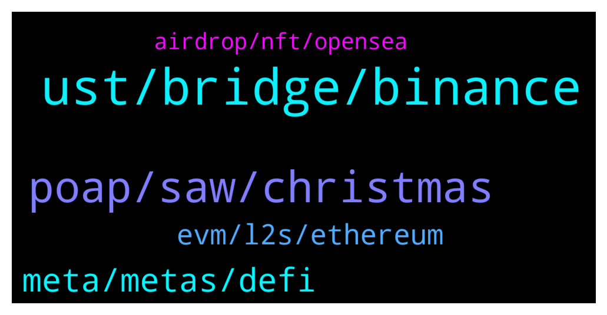

# **@lobsters_chat**
 ## Analysis for **2021-12-25** - **2021-12-26**.

---

## 📊 **Basic Stats**

**n_messages_sent**: 117

---

---

## 🔝 **Top keywords and related messages**

1. **ust, bridge, binance**

    @zhongfu --- *have you tried stable.anyswap.exchange instead, or their new site (I think) http://app.multichain.org* **--->** [TG Discussion](https://t.me/lobsters_chat/310611)

    @philippzentner --- *We’re in the process of aggregating you guys atm. :) at Li.Finance* **--->** [TG Discussion](https://t.me/lobsters_chat/310645)

    @duckdegen --- *I really dont understand why binance keeps listing stablecoins. The previous one they listed it went up 100x which tells me that they dont have enough liquidity and that they frankly dont care about keeping stablecoins stable. Even these stablecoin listings pumped.* **--->** [TG Discussion](https://t.me/lobsters_chat/310548)

    @Cuter0x --- *Also, do You know what's the "bridge" section difference compared to the "router" one?* **--->** [TG Discussion](https://t.me/lobsters_chat/310613)

    @nneverlander --- *https://twitter.com/fabdaRice/status/1474605862324998144?s=20 this explains the off chain part* **--->** [TG Discussion](https://t.me/lobsters_chat/310511)

    @ChiTimesChi --- *Ser, may I DM you? We happen to have quite a liquid bridge for ETH and stablecoins over here :)* **--->** [TG Discussion](https://t.me/lobsters_chat/310648)

2. **poap, saw, christmas**

    @ivangbi --- *Can someone blz help get a POAP maker, I can’t find one for a week already -cries- @patricioworthalter want a POAP for 5000 people sers* **--->** [TG Discussion](https://t.me/lobsters_chat/310517)

    @Ameliafern --- *Knows someone who can create from scratch* **--->** [TG Discussion](https://t.me/lobsters_chat/310534)

    @xf33d --- *Okay guys, who of you owns DumpsterDAO handle on Twitter? 🧐* **--->** [TG Discussion](https://t.me/lobsters_chat/310483)

    @vaibhavchellani --- *hope I don't have to do this everytime  see all your options here: https://app.fund.movr.network/* **--->** [TG Discussion](https://t.me/lobsters_chat/310629)

    @ivangbi --- *All good thank u, done and verified! Thx to @mdzor* **--->** [TG Discussion](https://t.me/lobsters_chat/310535)

    @farm42 --- *Thanks @enderwiggins1 already posted it here:3* **--->** [TG Discussion](https://t.me/lobsters_chat/310595)

3. **meta, metas, defi**

    @Milan_ZIL --- *DeFi summer meta, Memecoins meta, NFT meta, L1 competitors meta, Earn2Play meta, Metaverse meta, DAO meta, DeFI 2.0 meta  Any others I missed?* **--->** [TG Discussion](https://t.me/lobsters_chat/310696)

    @Hullow --- *Privacy meta : never took off* **--->** [TG Discussion](https://t.me/lobsters_chat/310710)

    @Cody_123 --- *What do you think he is hinting is the next meta… eth becoming useable again?* **--->** [TG Discussion](https://t.me/lobsters_chat/310682)

    @SpikeSpiege1 --- *Not for another 6+ months at least* **--->** [TG Discussion](https://t.me/lobsters_chat/310684)

    @Milan_ZIL --- *Leak me the next meta that is going to take off😛* **--->** [TG Discussion](https://t.me/lobsters_chat/310711)

    @Milan_ZIL --- *Its also interesting why some metas keep getting revived, until they dont* **--->** [TG Discussion](https://t.me/lobsters_chat/310704)

4. **evm, l2s, ethereum**

    @yic_alex --- *L1s are competing with Ethereum L2s imho. At least they're selling the same qualities to the end user. I don't think Ethereum can be beaten from an ecosystem / network effect / security POV realistically any time soon.  Ethereum L2s mostly have been building in the background, some don't even have tokens. It will be interesting to see what happens once the marketing is turned up for those.* **--->** [TG Discussion](https://t.me/lobsters_chat/310689)

    @Suk4b1y4t --- *Only EVM L1s are competing with ETH L2s* **--->** [TG Discussion](https://t.me/lobsters_chat/310693)

    @Hullow --- *The argument is shifting now. Solana proponents are now claiming their L1 is more scalable AND decentralized than Ethereum (+ its L2s). Same narrative emerging from Avalanche community. You’re also seeing attacks on the lack of decentralization of ETH L2s (token distribution, node count etc.)* **--->** [TG Discussion](https://t.me/lobsters_chat/310690)

    @Hullow --- *It’s a narrative fight. Alt-L1 proponents claim they are in a battle against Ethereum, whereas Ethereum proponents claim it’s all about scaling, and that its L2s are the answer* **--->** [TG Discussion](https://t.me/lobsters_chat/310688)

    @Suk4b1y4t --- *Why aren't you convinced of that? The only reason for anyone to use anything EVM which isn't eth is gas fees or speed of confirmation, there are no further innovations that I have seen. Hence they are all competitors with one another directly for developer and user activity based on EVM.  Non evm chains are attempting to move away from or improve upon what EVM is, and are not competing over EVM devs, and are in a different niche which consists of features or functionalities that perhaps aren't supported on EVM or solidity and thereby aren't exactly competitors.* **--->** [TG Discussion](https://t.me/lobsters_chat/310705)

    @cragslist --- *Sol and Avax stole a lot of market share from ETH but I think 2.0 will steal the show when it comes* **--->** [TG Discussion](https://t.me/lobsters_chat/310694)

5. **airdrop, nft, opensea**

    @banteg --- *is there any project behind sos or is it just an airdrop?* **--->** [TG Discussion](https://t.me/lobsters_chat/310500)

    @SpikeSpiege1 --- *Sold mine as well. It has no affiliation to opensea what so ever. Just pumped by CT in order to salvage a little money from all the illiquid NFT bags they're holding.  Sad part even at this mc the airdrop didn't cover their gas from nft trading lol* **--->** [TG Discussion](https://t.me/lobsters_chat/310543)

    @wilflare --- *it feels like an airdrop just to thank early supporters of the NFT community (who use OpenSea) - but their "early" is a snapshot taken a few days ago  there's a Discord and it seems like they are shaping it to be DAO to support folks rekted by rugpulls, etc.* **--->** [TG Discussion](https://t.me/lobsters_chat/310505)

    @whiterun --- *how opendao airdrop works? i see it doesn't use merkle proof.* **--->** [TG Discussion](https://t.me/lobsters_chat/310488)

    @rohan_pandit --- *anyone have that airdrop selling meme handy where the guy gets more depressed as the price goes up?* **--->** [TG Discussion](https://t.me/lobsters_chat/310532)

    @samd0000 --- *Idk mine is too small to be even able to sell lol* **--->** [TG Discussion](https://t.me/lobsters_chat/310503)

