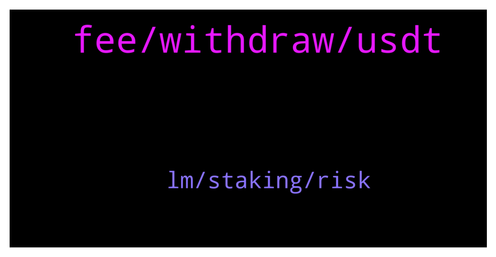

# **@CakeDeFi_EN**
 ## Analysis for **2021-12-26** - **2021-12-27**.

---

## 📊 **Basic Stats**

**n_messages_sent**: 112

---

---

## 🔝 **Top keywords and related messages**

1. **fee, withdraw, usdt**

    @Vishaljain2 --- *My Friends are facing lots of Friction while Signing up. Some of them Deleted the App due to this.* **--->** [TG Discussion](https://t.me/CakeDeFi_EN/157140)

    @J --- *It cost me 1 DFI yesterday to move dUSD. Not .2* **--->** [TG Discussion](https://t.me/CakeDeFi_EN/157201)

    @ru1kang --- *is there a way to buy usdt in cake? else, what would be the best way to buy usdt to transfer to cake?* **--->** [TG Discussion](https://t.me/CakeDeFi_EN/157080)

    @dmunasco --- *I want to verified with national ID, but  my national ID is lifetime use, no expired date. How to do?* **--->** [TG Discussion](https://t.me/CakeDeFi_EN/157113)

    @Eugene --- *The withdrawal button is greyed out even after answering the knowledge questions and putting in my 2fa* **--->** [TG Discussion](https://t.me/CakeDeFi_EN/156892)

    @schoedlerino --- *Topic Sign up Bonus: I used a Ref link for $20 worth of DFI (din‘t received it yet)   If i buy DFI or BTC worth $50 on my first purchase, i‘ll get another $30 worth of DFI right?   I‘m a bit confused because my regustration and verification was successful and i din‘t received the $20 sign-up bonus from the ref link yet  Pls help  Thx Florian* **--->** [TG Discussion](https://t.me/CakeDeFi_EN/157216)

2. **lm, staking, risk**

    @mikkelseg --- *Will these affect value of my staking profit* **--->** [TG Discussion](https://t.me/CakeDeFi_EN/157154)

    @DmgBautista --- *LM risks are exactly the same in Cake as well as in Defichain. Or in any other project with LM capabilities. The difference in the rewards is only due to the cut Cake gets, in exchange for the possibility to offer additional services, as well as support and the GUI. The main difference I would say, since the risks in LM are the same, is in the wallet itself. With Cake, you get support and in case someting goes wrong, the team can help and track everything. Your holdings are also insured. With the defichain wallet, you have nothing of that, you are the sole responsible for your wallet, basically your own bank. If something goes wrong or you make any mistake, no way to help. The good part is that 15% cut on rewards doesn't exist. Its basically, a compromise between the risk and the profit you wish to have. I myself use both.* **--->** [TG Discussion](https://t.me/CakeDeFi_EN/157129)

    @resinio --- *Are there any other pros or cons for liquidity mining on cake vs. defichain wallet? I just see quite differences in the rewards…* **--->** [TG Discussion](https://t.me/CakeDeFi_EN/157124)

    @mikkelseg --- *The risk level, please are they the same?* **--->** [TG Discussion](https://t.me/CakeDeFi_EN/156924)

    @AbunaSemai --- *Aligning DEX and Oracle prices by dynamic distribution of profit and introduction of locked vaults  https://github.com/DeFiCh/ain/issues/1002* **--->** [TG Discussion](https://t.me/CakeDeFi_EN/157132)

    @fatTeapot --- *Is the LM in cake and light wallet rewards the same?* **--->** [TG Discussion](https://t.me/CakeDeFi_EN/157209)

