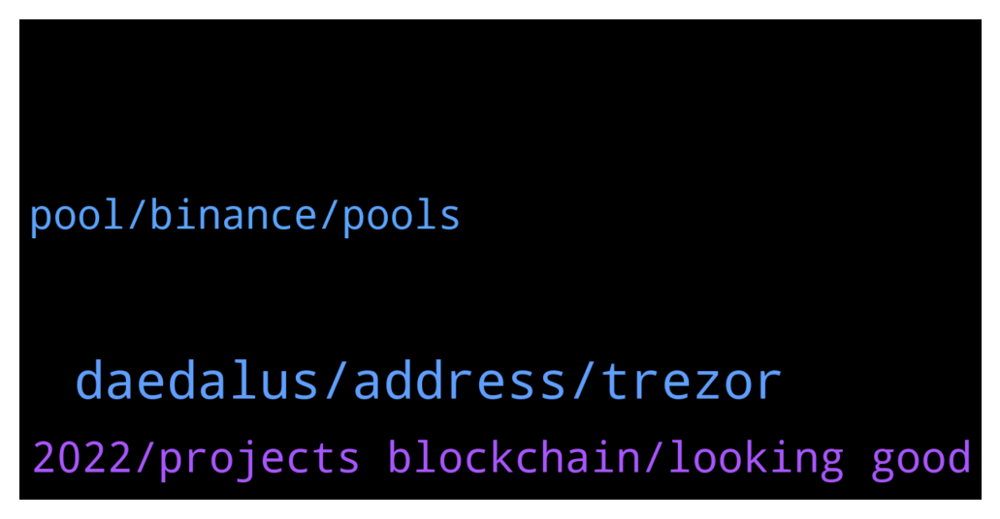

# **@Cardano**
 ## Analysis for **2021-12-26** - **2021-12-27**.

---

## 📊 **Basic Stats**

**n_messages_sent**: 47

---

---

## 🔝 **Top keywords and related messages**

1. **daedalus, address, trezor**

    @Chillig. --- *Is this up to date ?  The Cardano blockchain has two types of addresses, according to the stage of development: Byron (legacy) addresses and Shelley addresses.  Byron addresses During the Byron era (Finished in July 2020) all addresses were one of the following:  1 Icarus-style: Starting with Ae2  2 Daedalus-style: Starting with  DdzFF Shelley addresses Since the Shelley era started, a new type of wallet was added to the system, these can support delegation and earning rewards, the Shelley-era addresses follow this:  1  Start with addr1 Only these three types are valid addresses on the Cardano Network.  Daedalus shows an error message if you input an address that is not valid (for instance, when using an address from a different network.)  Sending to Daedalus from exchanges or third party wallets When sending money to your Daedalus wallet from an exchange or third party wallet, please always be sure that:  1 You use the CARDANO NETWORK, you will lose your funds if you use a different network.  2 You copied the address from the receive tab on your wallet,  and verify that your address starts with DdzFF or addr1.   3 For an extra sense of security, you can send a small test transaction first to ensure that everything is working correctly on your exchange, once you are confident send the rest of your funds to Daedalus.* **--->** [TG Discussion](https://t.me/Cardano/762908)

    @nes585 --- *Hey George, I haven't tried to restore my wallet yet. I will give it a go. Do I need to restore my wallet from daedalus, right?* **--->** [TG Discussion](https://t.me/Cardano/762779)

    @nes585 --- *Hey guys, after I updated my trezors software, I can't send my ada from daedalus due to "exporting the public key failed" error. Anyone has experienced the same issue?* **--->** [TG Discussion](https://t.me/Cardano/762768)

    @Chillig. --- *and the old addresses are still supported?* **--->** [TG Discussion](https://t.me/Cardano/762912)

    @Chillig. --- *which are actually the current ada addresses that are supported?* **--->** [TG Discussion](https://t.me/Cardano/762894)

    @doc_holiday1881 --- *Just connect your hardware wallet using adalite and you should be able to view the assets in your wallet* **--->** [TG Discussion](https://t.me/Cardano/762898)

2. **2022, projects blockchain, looking good**

    @caio --- *When this blockchain will be working?* **--->** [TG Discussion](https://t.me/Cardano/762669)

    @Chillig. --- *means there is still time until 2023?* **--->** [TG Discussion](https://t.me/Cardano/762936)

    @RickMcCracken --- *my estimate is about 2 years to include full voltaire with on chain governance + P2P + Hydra, just my opinion... development will continue indefinitely* **--->** [TG Discussion](https://t.me/Cardano/762694)

    @glitch04 --- *yes, it's up to developers to build their projects* **--->** [TG Discussion](https://t.me/Cardano/762683)

    @doc_holiday1881 --- *Probably in the new year. It will happen soon 😊 just follow their telegram channel, discord, and Twitter for announcements. They just recently had an AMA talking about the progress they have made. It is looking very good* **--->** [TG Discussion](https://t.me/Cardano/762901)

    @Chillig. --- *but it will still be supported in 2022?* **--->** [TG Discussion](https://t.me/Cardano/762929)

3. **pool, binance, pools**

    @rickazley --- *Hey Cardanians, did you all see a video released by Bankless? They're saying Cardano is a scam and has been paying Youtubers 100% in staking pool rewards.  Source: https://youtu.be/DoAyY1V57RA* **--->** [TG Discussion](https://t.me/Cardano/762913)

    @los_yiduma --- *why binance has 8% but normal only has 5%？* **--->** [TG Discussion](https://t.me/Cardano/762920)

    @Zyroxa --- *Your coins are locked up on Binance and you arent the owner of the keys. Also Binance is offering "up to" 8% which means it can be less aswell.* **--->** [TG Discussion](https://t.me/Cardano/762923)

    @glitch04 --- *join this channel for stake pool issues https://t.me/CardanoStakePoolWorkgroup* **--->** [TG Discussion](https://t.me/Cardano/762430)

    @pesuazo --- *Binance pools charge 6% fees .... but then claim to pay "up to 8%"....🤔😅😂* **--->** [TG Discussion](https://t.me/Cardano/762944)

    @JohnGoldberg --- *So I can earn rewards with voting in Deadalus, but does that require a fee? I have all my ADA delegated to a stakepool.* **--->** [TG Discussion](https://t.me/Cardano/762547)

