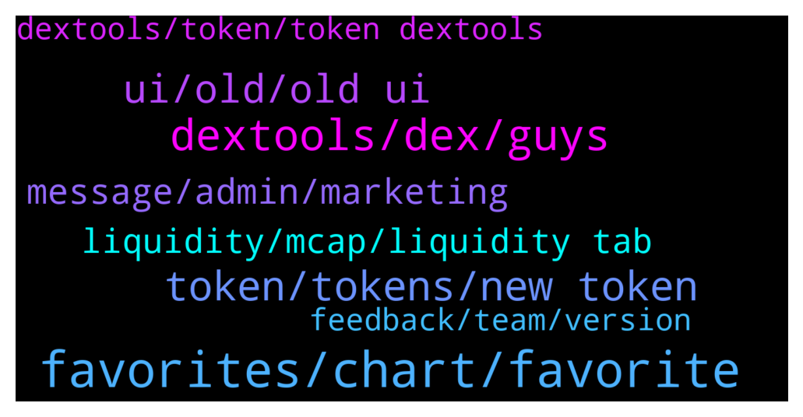

# **@DEXToolsCommunity**
 ## Analysis for **2021-12-25** - **2021-12-27**.

---

## 📊 **Basic Stats**

**n_messages_sent**: 781

---

---

## 🔝 **Top keywords and related messages**

1. **favorites, chart, favorite**

    @Simon --- *Guys not sure I’m a fan of the new layout, basically I want to be able to see my favourites so I can track current prices of my investments and a single chart together. I don’t care about anything else. All the guff on the left with pool info, dext score etc is fixed when I rarely care about any of it, it reduces the space for the chart and my favourites now have to float on top of it* **--->** [TG Discussion](https://t.me/DEXToolsCommunity/317457)

    @Simon --- *I still think being able to hide the stuff on the left would be good so I can have the chart and trade history spanning the rest of the width* **--->** [TG Discussion](https://t.me/DEXToolsCommunity/318245)

    @Kratom34 --- *Can anyone tell me how to bring up favorites to add tokens on new dextools page on mobile?* **--->** [TG Discussion](https://t.me/DEXToolsCommunity/317686)

    @atosm --- *same as this guy. is there a way to put the graph on the left side. wayyyy tooo much info that I don't really want.* **--->** [TG Discussion](https://t.me/DEXToolsCommunity/317106)

    @stanes --- *A lot of people asked to have the percentage change for the favorites.* **--->** [TG Discussion](https://t.me/DEXToolsCommunity/317953)

    @CryptoElro --- *looks like any other shitty charting site* **--->** [TG Discussion](https://t.me/DEXToolsCommunity/317569)

2. **dextools, dex, guys**

    @matarazzee00 --- *Yes i don't no i want you guys to show me how to list it on dextools* **--->** [TG Discussion](https://t.me/DEXToolsCommunity/316985)

    @FredericDEXT --- *This is the first step to make a more complete and modern UI, but many things are still in progress, and the community feedback is the best way to improve and the guide we always followed at dextools since the beginning.* **--->** [TG Discussion](https://t.me/DEXToolsCommunity/317317)

    @Chris --- *Any way to revert to the old DexTools?* **--->** [TG Discussion](https://t.me/DEXToolsCommunity/317101)

    @darkstorns --- *I haven't seen a significant change in functionality yet, this is not an update but an idle.  The number showing the price is too small, need blue red as before to know the price movement, I think the dev is imitating some other dex site, while dextools is number 1, who else needs to be imitated?* **--->** [TG Discussion](https://t.me/DEXToolsCommunity/317980)

    @Monolithof --- *I'll have to agree with this user. Im a fan of dextools, dont get me wrong. But the UI before the current one was better* **--->** [TG Discussion](https://t.me/DEXToolsCommunity/318839)

    @Sloth34 --- *saying "design is fine" lol, that's every user's individual opinion, a lot of people would like to be able to just revert back to the normal "old" dextools, you should make it so people can switch to that in 1 button, just some advice* **--->** [TG Discussion](https://t.me/DEXToolsCommunity/318814)

3. **token, tokens, new token**

    @FredericDEXT --- *Same as before , at token info tab* **--->** [TG Discussion](https://t.me/DEXToolsCommunity/318154)

    @solidask --- *Hello, is it possible to remove old version (V1) chart of a token that migrated to new version (V2)?* **--->** [TG Discussion](https://t.me/DEXToolsCommunity/316912)

    @chupapimunyenyo60 --- *That doesn’t list the token version* **--->** [TG Discussion](https://t.me/DEXToolsCommunity/317225)

    @D --- *nice work making the old token available after making a new one* **--->** [TG Discussion](https://t.me/DEXToolsCommunity/317036)

    @chupapimunyenyo60 --- *Please tell me where I can find a tokens version thank you* **--->** [TG Discussion](https://t.me/DEXToolsCommunity/317215)

    @FredericDEXT --- *It's there in the token info section* **--->** [TG Discussion](https://t.me/DEXToolsCommunity/317614)

4. **ui, old, old ui**

    @hopiumvictim --- *Plenty of people are complaining about the new UI* **--->** [TG Discussion](https://t.me/DEXToolsCommunity/318013)

    @hopiumvictim --- *Everything about the old UI was done right.* **--->** [TG Discussion](https://t.me/DEXToolsCommunity/317970)

    @spfr236 --- *u guys want old UI back because you are too lazy to study new one!😂 common step out of your comfort zone and try to learn it, i bet it worth it, cause there are things that can be done with this UI which was impossible with old one😉* **--->** [TG Discussion](https://t.me/DEXToolsCommunity/317542)

    @PGtheGreat --- *New UI not support UNI V3?* **--->** [TG Discussion](https://t.me/DEXToolsCommunity/318091)

    @Qboybm --- *Can I switch back to the old interface?* **--->** [TG Discussion](https://t.me/DEXToolsCommunity/318791)

    @hopiumvictim --- *When can we get the old UI back?* **--->** [TG Discussion](https://t.me/DEXToolsCommunity/317940)

5. **message, admin, marketing**

    @Crypto_odds --- *Hi I have DM’d the person in charge of marketing @guillermorodriguez78 can you please get back to me* **--->** [TG Discussion](https://t.me/DEXToolsCommunity/318259)

    @lazymobile --- *I sent Guillermo a message on it 😉* **--->** [TG Discussion](https://t.me/DEXToolsCommunity/316810)

    @FredericDEXT --- *Feel free, real admins never DM first* **--->** [TG Discussion](https://t.me/DEXToolsCommunity/317632)

    @sunshinecrypto --- *Gosh I I asked one question in the chat and I got about three fake people messaging me pretending to be you lol   Anyway do you mind if I send you a DM? Needed some help with my dextools plz* **--->** [TG Discussion](https://t.me/DEXToolsCommunity/317623)

    @Crypto_odds --- *Hi I messaged the person in charge of advertising a few days ago can someone please get in contact with me* **--->** [TG Discussion](https://t.me/DEXToolsCommunity/318777)

    @Markmorga --- *Who will I contact for the marketing proposal* **--->** [TG Discussion](https://t.me/DEXToolsCommunity/318767)

6. **liquidity, mcap, liquidity tab**

    @napascual --- *You can see it on the Liquidity tab, bottom tabs on mobile* **--->** [TG Discussion](https://t.me/DEXToolsCommunity/317359)

    @HELLO1241 --- *Where is the mc pooled eth and liquidity* **--->** [TG Discussion](https://t.me/DEXToolsCommunity/318150)

    @napascual --- *On mobile Bottom tabs, Liquidity tab. On PC on the left side pair information* **--->** [TG Discussion](https://t.me/DEXToolsCommunity/318597)

    @HELLO1241 --- *Why do I have to come down and click on liquidity shitt to see the mc pooled eth etc* **--->** [TG Discussion](https://t.me/DEXToolsCommunity/318163)

    @danrunn --- *For new UI can we see liquidity amount for each pair anywhere?* **--->** [TG Discussion](https://t.me/DEXToolsCommunity/318062)

    @sharvMF --- *I can’t even see marketcap and LP on my phone* **--->** [TG Discussion](https://t.me/DEXToolsCommunity/317529)

7. **feedback, team, version**

    @stanes --- *No. But team is currently working on improving the new version with all the feedbacks received.* **--->** [TG Discussion](https://t.me/DEXToolsCommunity/318794)

    @stanes --- *Every feedback will be considered. This version is only few hours old so we need to adapt and see in the coming days/weeks what we should modify.* **--->** [TG Discussion](https://t.me/DEXToolsCommunity/317726)

    @FredericDEXT --- *It will be included in next version* **--->** [TG Discussion](https://t.me/DEXToolsCommunity/318086)

    @chengxue8899 --- *I just studied the new version, it takes a while to adapt to it, I hope it will be more and mor useful* **--->** [TG Discussion](https://t.me/DEXToolsCommunity/317760)

    @SillySmiles21 --- *How often are the devs around? I know it is holidays, but obviously we know how crypto works :P* **--->** [TG Discussion](https://t.me/DEXToolsCommunity/316876)

    @stanes --- *The team is currently working on improving the new version with all the feedbacks received. Expect some changes on the next few days.* **--->** [TG Discussion](https://t.me/DEXToolsCommunity/318950)

