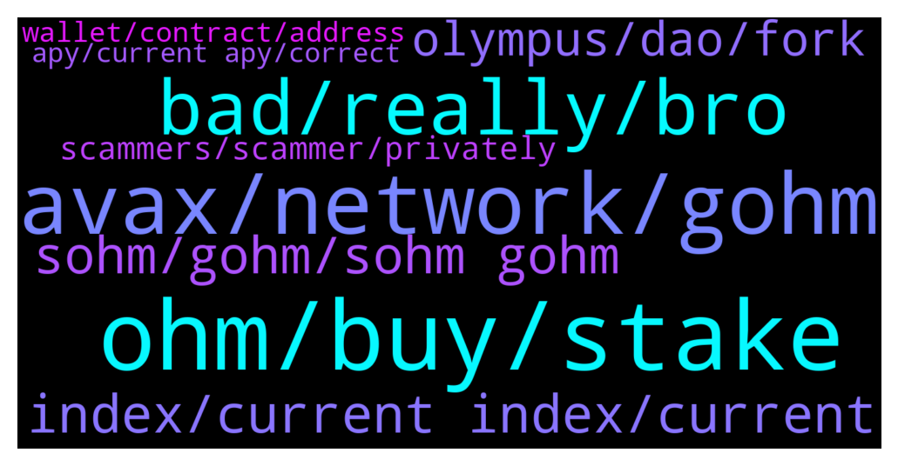

# **@OlympusTG**
 ## Analysis for **2021-12-26** - **2021-12-27**.

---

## 📊 **Basic Stats**

**n_messages_sent**: 604

---

---

## 🔝 **Top keywords and related messages**

1. **ohm, buy, stake**

    @kyle333 --- *Should I swap my eth for ohmv1 on MetaMask? Will that work when I go to approve and stake?* **--->** [TG Discussion](https://t.me/OlympusTG/134695)

    @S --- *hola hello !!! if i buy ohm now in a exchange or uni is the migrated version already ?* **--->** [TG Discussion](https://t.me/OlympusTG/135734)

    @JM --- *As a new staker, you stake and receive gOhm. The price of gOhm fluctuates with the market but also aims to increase with every block. When you come to unstake, you’ll receive more Ohm than you invested based on the number of rebases you staked for.* **--->** [TG Discussion](https://t.me/OlympusTG/135360)

    @S00825 --- *So should I buy v2? N stake* **--->** [TG Discussion](https://t.me/OlympusTG/134770)

    @nfwaple --- *why not OHM v2? Not too sure if you can stake OHM v1 and what version of sOHM you get, best to ask in the Discord* **--->** [TG Discussion](https://t.me/OlympusTG/134697)

    @Iv --- *Witch ohm must y buy 2 stake, V1 or V2 ?* **--->** [TG Discussion](https://t.me/OlympusTG/135004)

2. **avax, network, gohm**

    @Z --- *Ok I understand this part but now numbers on dashboard are wrong as I should have like near $1k more and if I bridge over to avax network shows I will get even less..so is this right that we lose some funds moving around? Or is there a issue somewhere or am I doing it wrong 😑  Sorry for all questions just want to understand what’s happening* **--->** [TG Discussion](https://t.me/OlympusTG/134998)

    @R --- *I brought on the avax network to avoid gas fees* **--->** [TG Discussion](https://t.me/OlympusTG/134563)

    @nfwaple --- *correct because the gOHM is only in AVAX, you can bridge to other chains but they do take some fees* **--->** [TG Discussion](https://t.me/OlympusTG/135288)

    @Rete --- *Just bought gohm in trader joe, I can see gohm balance in olympus web at avalance network, when i switch to eth network gohm balance its gone....so is it different gohm in avalance and eth network?  Because When I use bridge in avalance net, I can swab gohm avalance net. to gohm eth net. With lower value* **--->** [TG Discussion](https://t.me/OlympusTG/135286)

    @N --- *Then from there should I just bridge my gohm into avax network straight from there and is that it ?  So after that if i want to take out some money it will cost me low fees as it is on avax network* **--->** [TG Discussion](https://t.me/OlympusTG/134674)

    @nfwaple --- *you can hold gOHM on different chains, they don't all necessarily need to be on one chain only, I have gOHM on both ETH and AVAX* **--->** [TG Discussion](https://t.me/OlympusTG/134916)

3. **bad, really, bro**

    @Dr. --- *Thanks a lot to tell me this.   Let me come back to understand better after having lunch.  I may ask some more questions.* **--->** [TG Discussion](https://t.me/OlympusTG/134902)

    @CryptoCrazy_TR3 --- *You really should watch a YouTube video or something* **--->** [TG Discussion](https://t.me/OlympusTG/135082)

    @nfwaple --- *a pretty bad one too, they're kinda in the same basket* **--->** [TG Discussion](https://t.me/OlympusTG/135323)

    @MrMann89 --- *I will take that I was playing safe lol* **--->** [TG Discussion](https://t.me/OlympusTG/135023)

    @nfwaple --- *ask your specific question here thanks* **--->** [TG Discussion](https://t.me/OlympusTG/135680)

    @FLankarooo --- *Your gf is hotter than you obviously 🙄* **--->** [TG Discussion](https://t.me/OlympusTG/135757)

4. **index, current index, current**

    @nfwaple --- *gOHM price = OHM price x current index, current index increases every rebase, what do you not understand brother? if you want you can also unwrap your gOHM to sOHM v2, then you would be able to see it increasing if that's what you prefer...* **--->** [TG Discussion](https://t.me/OlympusTG/135355)

    @nfwaple --- *nothing, because the price is made up of OHM price x current index, and current index goes up only. If gOHM price stays the same, it means OHM price has gone down* **--->** [TG Discussion](https://t.me/OlympusTG/134995)

    @Dr. --- *Is there a way to check my current index of gOHM? Oh my... that sounds a little complicated, but it is supposed to be possible.* **--->** [TG Discussion](https://t.me/OlympusTG/134951)

    @nfwaple --- *number of gOHM = number of sOHM/current index* **--->** [TG Discussion](https://t.me/OlympusTG/134992)

    @nfwaple --- *yes the current index is on the dashboard, current index is the same for everyone* **--->** [TG Discussion](https://t.me/OlympusTG/134952)

    @ZR_CRYPTO --- *nothing is wrong, look on the app, you will see how many sOHM you have in your gOHM. Multiply by OHM price (currently $382) - this is your value* **--->** [TG Discussion](https://t.me/OlympusTG/135011)

5. **sohm, gohm, sohm gohm**

    @Richie1968 --- *It would be helpful if gOHM balance increased too so that I can update my portfolio accordingly* **--->** [TG Discussion](https://t.me/OlympusTG/135364)

    @Richie1968 --- *So when we’ve converted to gOHM when do we see the gOHM balance change? …..how long is an epoch 🤷🏻‍♂️* **--->** [TG Discussion](https://t.me/OlympusTG/135336)

    @Ahmednasef --- *is there any video that expaliains all thsi mess of sOHM and gOHM and OHM,.........I have some money stacked but i don't know how to see my current balance or my current P/L* **--->** [TG Discussion](https://t.me/OlympusTG/135006)

    @nathanael --- *Why my sohm wont move up still at the same number WHY* **--->** [TG Discussion](https://t.me/OlympusTG/135771)

    @nfwaple --- *gohm is a wrapped version of sohm, see second pic: https://twitter.com/dopex_intern/status/1473439395999068162/photo/1* **--->** [TG Discussion](https://t.me/OlympusTG/135614)

    @bachstelze99 --- *For my sohm I didn't get rewards  only for gohm right?* **--->** [TG Discussion](https://t.me/OlympusTG/135668)

6. **olympus, dao, fork**

    @gettinggrowth --- *Sure. I'd like to know if someone is working on bridging Olympus from ETH to something else as well for more optimal trading experience?* **--->** [TG Discussion](https://t.me/OlympusTG/135683)

    @gettinggrowth --- *Hey! Who is the official representative of Olympus?* **--->** [TG Discussion](https://t.me/OlympusTG/135679)

    @Orlando --- *Can anyone tell me why there are two Olympus TG groups?* **--->** [TG Discussion](https://t.me/OlympusTG/134862)

    @cryptosmyptos --- *can i buy olympus with bsc?* **--->** [TG Discussion](https://t.me/OlympusTG/135699)

    @Rete --- *I got metamask, so after migration is it will appear on olympus?* **--->** [TG Discussion](https://t.me/OlympusTG/134937)

    @Cat --- *I want to know the correct Olympus discord . Which one is correct?* **--->** [TG Discussion](https://t.me/OlympusTG/134705)

7. **scammers, scammer, privately**

    @robthegreat --- *Also scammers please don’t dm me, I’m not going to fall for it* **--->** [TG Discussion](https://t.me/OlympusTG/135090)

    @nfwaple --- *you say that but a lot of people here do get scammed sadly😢😢* **--->** [TG Discussion](https://t.me/OlympusTG/135048)

    @N --- *@nfwapl mind helping me bro, these scammers don’t rest 🤣😭* **--->** [TG Discussion](https://t.me/OlympusTG/134668)

    @CryptoCrazy_TR3 --- *I just don't want to see you get scammed. Because they normally go after people that ask these type of questions* **--->** [TG Discussion](https://t.me/OlympusTG/135085)

    @Z --- *Take it anyone dm me are scammer?* **--->** [TG Discussion](https://t.me/OlympusTG/135032)

    @Irnweirdo --- *I saw your message in another group which I caanot remember exactly but the words was exactly copy paste are you scammers if not place your question here* **--->** [TG Discussion](https://t.me/OlympusTG/135670)

8. **wallet, contract, address**

    @nfwaple --- *you can find the contract address here https://docs.olympusdao.finance/main/contracts/tokens* **--->** [TG Discussion](https://t.me/OlympusTG/135303)

    @Ap0l1o --- *You need to add the contract to your wallet* **--->** [TG Discussion](https://t.me/OlympusTG/135192)

    @javierross --- *Check if you copied the right contract address* **--->** [TG Discussion](https://t.me/OlympusTG/135232)

    @nfwaple --- *depending on what wallet you use, but you should be able to see it through website like debank if your wallet doesn't support it, I can see it from Metamask. If you buy through the AVAX chain, the website won't show it at the moment, but you can still keep track of it through metamask* **--->** [TG Discussion](https://t.me/OlympusTG/134929)

    @theMagicUnicorn --- *well if you see them on the app you should see it on the wallet, make sure you have the wallet on the right eth addy* **--->** [TG Discussion](https://t.me/OlympusTG/135382)

    @nfwaple --- *maybe not supported yet on the trust wallet end, you can see them through debank though, look up your own address there* **--->** [TG Discussion](https://t.me/OlympusTG/135312)

