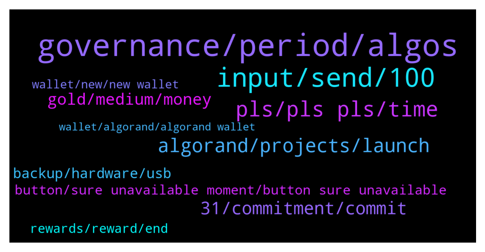

# **@algorand**
 ## Analysis for **2021-12-26** - **2021-12-27**.

---

## 📊 **Basic Stats**

**n_messages_sent**: 524

---

---

## 🔝 **Top keywords and related messages**

1. **governance, period, algos**

    @TheSondler --- *I have ally ALGOs on my Ledger Nano S. As i seen there in no chance to connect my Wallet-ID with the Governance Programm, because Ladger don't support note section. Also the offical algorand wallet don't support the Nano S :-(* **--->** [TG Discussion](https://t.me/algorand/326713)

    @Chris --- *so quick question, before i subscribe; if i connected my ledger to myalgowallet, and then decide to subscribe to the governance, do my algos from my ledger get taken out( not planning to remove any algo)* **--->** [TG Discussion](https://t.me/algorand/326371)

    @khunpon --- *Now I had 2 address on ledger One for yieldly Another for this governance #2* **--->** [TG Discussion](https://t.me/algorand/326374)

    @MackDenver --- *Thank you for your interest, Chris. By participating in governance you are committing ALGO to keep them in your wallet and vote in proposals. If you successfully do it, you will be eligible for the governance reward. And yes, you can do it with your ledger as well* **--->** [TG Discussion](https://t.me/algorand/326030)

    @MackDenver --- *Hey Gourab,  Governance rewards will be distributed in Q3 of 2022.* **--->** [TG Discussion](https://t.me/algorand/326734)

    @MackDenver --- *Add your ledger wallet to https://wallet.myalgo.com/ => Use MyAlgo to connect to the Governance site and commit. Simple as that* **--->** [TG Discussion](https://t.me/algorand/326032)

2. **input, send, 100**

    @idontknowwhattouseforusername --- *hello, algorand wallet team, there is one issue, when sending out ALGOs, one has to input a number, right, the input area by default has way too many trailing zeros, e.g.  if you input 100, the actual input becomes 0.0001  to send 100 algos, you have to input 100000000   please fix this, thanks.* **--->** [TG Discussion](https://t.me/algorand/326571)

    @idontknowwhattouseforusername --- *so from wikipedia:  Traditionally, English-speaking countries employed commas as the delimiter – 10,000 – and other European countries employed periods or spaces: 10.000 or 10000.* **--->** [TG Discussion](https://t.me/algorand/326669)

    @hope9999999 --- *Not as fast as before. It took around 12 to 13 seconds to send usdc. Don’t know why?* **--->** [TG Discussion](https://t.me/algorand/326097)

    @idontknowwhattouseforusername --- *you know why i input a wrong number of commitment? because of the trailing zeros. the other day i input 10000, it turns out to be 100, and i did not take a further look because i was in the middle of sleep.   just now, i changed the commitment and found that 10000 input is actually 10000, not 100 any more.* **--->** [TG Discussion](https://t.me/algorand/326592)

    @idontknowwhattouseforusername --- *i think i am very clear on the issue.   1. when you input the amount of algo, the keyboard pops up, the keyboard has only 0-9 and a delete button, no "DOT"  2. if you want to send 100, you have to type 10000000  3. if you want to send 100.5, you have to type 100500000  4. if you want to send 103.45, well, try that. i don't know how to ..  5. if you want to send 50.001, as @xM3Dx said, then try that ... i don't know how to ...* **--->** [TG Discussion](https://t.me/algorand/326629)

    @Pablo_cast --- *All software were in English or USA made* **--->** [TG Discussion](https://t.me/algorand/326694)

3. **pls, pls pls, time**

    @Leonidas_Agiad --- *@patrick_crypto while you at let me in to lol* **--->** [TG Discussion](https://t.me/algorand/326746)

    @Tiny_Philosopher_784 --- *That makes no difference. You're here now* **--->** [TG Discussion](https://t.me/algorand/325908)

    @hope9999999 --- *I mean you request stupid order 😂😂😂* **--->** [TG Discussion](https://t.me/algorand/326578)

    @Amalshaamal2017 --- *Hey there I'm from cryptodecko. com  I would like to invite your team to have a AMA session with our community who is the concerned person here?* **--->** [TG Discussion](https://t.me/algorand/325925)

    @Nadir_Ali_CSE --- *@algorandland sir are you there ?* **--->** [TG Discussion](https://t.me/algorand/326292)

    @hasbulaa --- *That’s fine but what wrong I’m doing ?* **--->** [TG Discussion](https://t.me/algorand/325910)

4. **algorand, projects, launch**

    @pictonz8 --- *algorand was on the radar before this - it's looking very good so far!  Iso 20022, eco friendly and all that, checks all the boxes.* **--->** [TG Discussion](https://t.me/algorand/326089)

    @EldarDRM --- *Algorand community need you to the right thing and don't allow people to copy blatantly other people's ideas!* **--->** [TG Discussion](https://t.me/algorand/326327)

    @Tiny_Philosopher_784 --- *Cost will become most important soon.   Yes, free tx coins are gonna catch interest, but they'll have to start with excessive amounts of coins. Or they have to burn alot and mint more, which means it can be rugged easily.  With algorand, that's not the concept. It's a nice little loop. Some algos have been lost already, and it will only continue to become less over time. So as much as people harp on the tokenomics, they don't see the future reductions that will invariably occur.* **--->** [TG Discussion](https://t.me/algorand/326257)

    @aleks_qaz --- *Is algorand doing anything in metaverse space?* **--->** [TG Discussion](https://t.me/algorand/326129)

    @ChristopherHouse --- *What programming language does Algorand use?* **--->** [TG Discussion](https://t.me/algorand/326405)

    @0x --- *Algorand Economic Evolution Report (last update September 2021)  👇 https://prismic-io.s3.amazonaws.com/algorandfoundationv2/dcbe6c89-251a-41b3-9c78-23d8ecabd6c1_Algo+Economic+Evolution+Report+Sept+2021.PDF* **--->** [TG Discussion](https://t.me/algorand/326410)

5. **31, commitment, commit**

    @Wurzelbear --- *Just remember to not cancel your commitment before 3/31* **--->** [TG Discussion](https://t.me/algorand/326208)

    @idontknowwhattouseforusername --- *no, i don't think so. if they won't hear us, they won't fix the issue i had yesterday, which , one can not update the commitment. it got fixed sometime just now* **--->** [TG Discussion](https://t.me/algorand/326588)

    @idontknowwhattouseforusername --- *You can update your commitment before the registration window ends* **--->** [TG Discussion](https://t.me/algorand/326053)

    @idontknowwhattouseforusername --- *seriously, is it just me or do you guys able to update or change the commitment?* **--->** [TG Discussion](https://t.me/algorand/326414)

    @idontknowwhattouseforusername --- *still not able to change the commitment, is anyone in algorand working on this issue?* **--->** [TG Discussion](https://t.me/algorand/326329)

    @MackDenver --- *Yes, committed ALGO has to be kept in your wallet for 3 months.* **--->** [TG Discussion](https://t.me/algorand/326176)

6. **gold, medium, money**

    @Pablo_cast --- *Mostly easier get cash from gold than from btc* **--->** [TG Discussion](https://t.me/algorand/326300)

    @hope9999999 --- *😕😕😕 while all of you are dreaming about market caps, govs are buying back real gold silently. 😂😂😂* **--->** [TG Discussion](https://t.me/algorand/326256)

    @Tiny_Philosopher_784 --- *So gold still needs a medium, like bitcoin...* **--->** [TG Discussion](https://t.me/algorand/326308)

    @Tiny_Philosopher_784 --- *Yeah, I like money too... but I'm not gonna shill it to make that money and leave others holding my bags* **--->** [TG Discussion](https://t.me/algorand/325952)

    @patrick_crypto --- *suit yourself - but seriously though - people  lost millions of BTC due to thinking they’d remember something they rarely if ever used.* **--->** [TG Discussion](https://t.me/algorand/326472)

    @mcmaxims --- *Gold is crap. I mean people are mining gold, just to hide it somewhere else afterward* **--->** [TG Discussion](https://t.me/algorand/326258)

7. **backup, hardware, usb**

    @patrick_crypto --- *for funds that you would consider critical - the key should never be stored digitally - basically ever. no photos, nothing.* **--->** [TG Discussion](https://t.me/algorand/326505)

    @AlgoQueen --- *Probably why it’s better to get a USB and upload your information in an organized manner. IMO* **--->** [TG Discussion](https://t.me/algorand/326496)

    @patrick_crypto --- *I’d just recommend a trusted hardware wallet.* **--->** [TG Discussion](https://t.me/algorand/326498)

    @patrick_crypto --- *computers are very very easily compromised - and in very not-obvious ways.* **--->** [TG Discussion](https://t.me/algorand/326517)

    @hope9999999 --- *🙂🙂🙂 a garmin Fenix 6x pro solar with inside storage with car key and ledger x. I would go anywhere 🤩🤩🤩* **--->** [TG Discussion](https://t.me/algorand/326522)

    @patrick_crypto --- *airgapped multisig hardware wallets with seeds spread out and stamped in fire/acid/water proof metal is probably better 😉* **--->** [TG Discussion](https://t.me/algorand/326475)

8. **button, sure unavailable moment, button sure unavailable**

    @angelo9007 --- *You should find a button to do so soon, not sure why it is unavailable at the moment* **--->** [TG Discussion](https://t.me/algorand/326420)

    @MackDenver --- *You should find a button to do so soon, not sure why it is unavailable at the moment* **--->** [TG Discussion](https://t.me/algorand/326056)

    @namhuycp --- *Hi admin, I want to commit more. Where is the button?* **--->** [TG Discussion](https://t.me/algorand/326476)

    @idontknowwhattouseforusername --- *it is back, thanks everyone working on this.* **--->** [TG Discussion](https://t.me/algorand/326560)

    @angelo9007 --- *Hi there, you should find a button to do so soon, not sure why it is unavailable at the moment.* **--->** [TG Discussion](https://t.me/algorand/326477)

    @idontknowwhattouseforusername --- *but where is the edit button?* **--->** [TG Discussion](https://t.me/algorand/326054)

9. **rewards, reward, end**

    @Tiny_Philosopher_784 --- *Until rewards end mid February, yes* **--->** [TG Discussion](https://t.me/algorand/325954)

    @MilanSWOL --- *Can’t find anything about the reward?* **--->** [TG Discussion](https://t.me/algorand/325916)

    @bogieman8 --- *Thank you…but the rewards will get tabulated and put into the wallet at end of day 3/31/22?* **--->** [TG Discussion](https://t.me/algorand/326203)

    @Tiny_Philosopher_784 --- *I think once holding rewards disappear, they might do it then* **--->** [TG Discussion](https://t.me/algorand/325856)

    @MackDenver --- *If you are eligible, the reward will be sent to you once the quarter ends.* **--->** [TG Discussion](https://t.me/algorand/326204)

    @Lydia --- *Did you claim the bonus today* **--->** [TG Discussion](https://t.me/algorand/326107)

10. **wallet, new, new wallet**

    @appliepietrade --- *i know i don't have a problem now. I am afraid if something happens to my current wallet that I cannot access, i will be in a trouble; but I found a passphrase from a paper that I am not sure if it is for algo wallet, i want to try to restore it in another spare phone, my question is will it impact my current wallet if the passphrase is the right one?* **--->** [TG Discussion](https://t.me/algorand/326439)

    @appliepietrade --- *the passphrase is fixed when you create a new wallet and yu are supposed to use the same passphrase when you try to restore your wallet, I don't understand how you can change this?* **--->** [TG Discussion](https://t.me/algorand/326452)

    @MackDenver --- *You don't have to create a new wallet* **--->** [TG Discussion](https://t.me/algorand/326719)

    @KAPIBAYSIDE --- *And still be anonymous? Because one wallet address is public will it let people know o have other wallets on the app?* **--->** [TG Discussion](https://t.me/algorand/326168)

    @hope9999999 --- *No need to delete app. Create new different account then you will get new seed for that new ones. Seed phrases are for account address not wallet app* **--->** [TG Discussion](https://t.me/algorand/326438)

    @appliepietrade --- *I lost my wallet seed phrase. after i got the reward at the end of the month, i need to transfer all my algo out and then create a new wallet before there is a problem to access to the wallet. Now I am good* **--->** [TG Discussion](https://t.me/algorand/326426)

