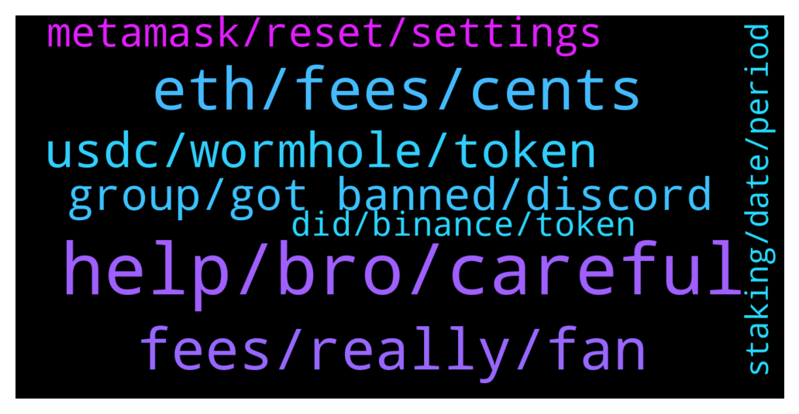

# **@avalancheavax**
 ## Analysis for **2021-12-26** - **2021-12-27**.

---

## 📊 **Basic Stats**

**n_messages_sent**: 175

---

---

## 🔝 **Top keywords and related messages**

1. **help, bro, careful**

    @Plukumusukutu --- *I can't dm y account settings don't allow me* **--->** [TG Discussion](https://t.me/avalancheavax/317952)

    @Plukumusukutu --- *Can you help me bro please 🙏🙏🙏🙏🙏🙏🙏* **--->** [TG Discussion](https://t.me/avalancheavax/317507)

    @Plukumusukutu --- *I'm giving 10k to someone who can help me please dm me* **--->** [TG Discussion](https://t.me/avalancheavax/317508)

    @Plukumusukutu --- *No man i just need help bro i can provide whatever you can ask* **--->** [TG Discussion](https://t.me/avalancheavax/317518)

    @Nicolas_A --- *Are you just trying to get as many dm from scammers as possible or really need help ? You can just contact me if you need help no need to pay lol* **--->** [TG Discussion](https://t.me/avalancheavax/317522)

    @Plukumusukutu --- *I will give a good Bag to someone who help me* **--->** [TG Discussion](https://t.me/avalancheavax/317946)

2. **eth, fees, cents**

    @alrko616 --- *1 dollar is alright but if it would be like ETH that would be pretty much bad* **--->** [TG Discussion](https://t.me/avalancheavax/317735)

    @elizabeth_baker --- *Eth fees are too expensive,dev's should take a look at this* **--->** [TG Discussion](https://t.me/avalancheavax/317719)

    @Nicolas_A --- *Fees can go up to 1 dollar if there is a big traffic spike* **--->** [TG Discussion](https://t.me/avalancheavax/317733)

    @alrko616 --- *so can we say in future 1-2 years fees can go up to 1 dollar* **--->** [TG Discussion](https://t.me/avalancheavax/317732)

    @alexbwork --- *they’ll fix that soon or later everybody know that. Should we wanna compete with them than the most attractive way for people the fees which you can see at SOL and MATIC for example is very cheap.* **--->** [TG Discussion](https://t.me/avalancheavax/317538)

    @oathtobarbatos --- *What do you mean? Gas fees are under 50 cents I think* **--->** [TG Discussion](https://t.me/avalancheavax/317552)

3. **fees, really, fan**

    @alexbwork --- *If we wanna see avax in top 5 my assuming the fees must be lowered* **--->** [TG Discussion](https://t.me/avalancheavax/317536)

    @elizabeth_baker --- *I'm holding Avax long term. Sorry I don't feel your pain ☺* **--->** [TG Discussion](https://t.me/avalancheavax/317736)

    @Juanleobi --- *I guess, Colony ($CLY) is one of the best innovative idea in AVAX ecosystem; 🥳🥳🥳* **--->** [TG Discussion](https://t.me/avalancheavax/317957)

    @alexbwork --- *I like everytgin about AVAX and I’m really a big fan of ecosystem and etc but these fees are really will became a problem with growing* **--->** [TG Discussion](https://t.me/avalancheavax/317541)

    @retiredcoin --- *any update on avax fee reduction???* **--->** [TG Discussion](https://t.me/avalancheavax/317551)

    @alrko616 --- *so. what are avax feees? say you want to transfer 100 worth of avax* **--->** [TG Discussion](https://t.me/avalancheavax/317720)

4. **usdc, wormhole, token**

    @manilabear --- *My usdc Its not showing up on trader joe if I click usdc or usdc.e but Its showing up on snowtrace as usd coin (wormhole)* **--->** [TG Discussion](https://t.me/avalancheavax/317697)

    @TheSEOdude --- *Many - AUSD ,usdt.e, USDC.e , dai.e, mim* **--->** [TG Discussion](https://t.me/avalancheavax/317936)

    @And --- *I thought usdc.e was the bridged version for use on avax. If there is native usdc now what is the point in having both* **--->** [TG Discussion](https://t.me/avalancheavax/317797)

    @And --- *Can someone enlighten me on usdc and usdc.e* **--->** [TG Discussion](https://t.me/avalancheavax/317796)

    @ramziakram --- *UST (wormhole token) got liquidity on curve factory (ust/usdc.e pair) if you want to bridge stable using wormhole* **--->** [TG Discussion](https://t.me/avalancheavax/317701)

    @TheSEOdude --- *even real USDT isn't that safe , haha* **--->** [TG Discussion](https://t.me/avalancheavax/317956)

5. **group, got banned, discord**

    @Mr. --- *@Nicolas_A was the german group deleted?* **--->** [TG Discussion](https://t.me/avalancheavax/317968)

    @Nicolas_A --- *Immer noch da https://t.me/avalanche_dach Might got banned if you don't see it* **--->** [TG Discussion](https://t.me/avalancheavax/317969)

    @redbullcryptoo --- *Maybe you can take a look at MERD* **--->** [TG Discussion](https://t.me/avalancheavax/317964)

    @dehraw --- *Ia there a telegram chat group for AVAX developers?* **--->** [TG Discussion](https://t.me/avalancheavax/317814)

    @Mr. --- *did nothing and got banned? maybe system error?* **--->** [TG Discussion](https://t.me/avalancheavax/317973)

    @l_webster --- *If there is a link? Please share* **--->** [TG Discussion](https://t.me/avalancheavax/317875)

6. **metamask, reset, settings**

    @A01010100 --- *Yes, it seems not working at all.. not sure if is metamask .. but seems to be working fine with other chains.. that’s why i’m asking* **--->** [TG Discussion](https://t.me/avalancheavax/317661)

    @Nicolas_A --- *Sometimes resetting Metamask helps. Settings > Advanced > Reset. Not sure what issue you have* **--->** [TG Discussion](https://t.me/avalancheavax/317662)

    @Mick1187k --- *Transactions taking forever on Avalanche, is MetaMask not calculating the correct gas should we do it manually?* **--->** [TG Discussion](https://t.me/avalancheavax/317889)

    @TheSEOdude --- *don't know if anybody have noticed or not , now Metamask shows low fees for the transaction but the real transaction take higher than what metamask shows.* **--->** [TG Discussion](https://t.me/avalancheavax/317967)

    @TheSEOdude --- *Are you withdrawing it to metamask ?  If yes it  should c chain.* **--->** [TG Discussion](https://t.me/avalancheavax/317923)

    @Andy --- *Any issues on Metamask...just reset wallet.. it will clear all stuck pending txs . in that network ..go to Settings...Advance...Reset...Wiola...only will clear txs...nothing else.🤪🤪🤪* **--->** [TG Discussion](https://t.me/avalancheavax/317593)

7. **did, binance, token**

    @Nicolas_A --- *There are plenty of fake tokens that are sent to users. The Avalaunch airdrop was for validators / delegators and the snapshot was taken months ago. I believe there is a 1 year period before they are airdropped* **--->** [TG Discussion](https://t.me/avalancheavax/317763)

    @rusakova_8 --- *I transferred from Coinlist to Binance* **--->** [TG Discussion](https://t.me/avalancheavax/317613)

    @rusakova_8 --- *sent tokens over the network from the С-chain, they did not come, what to do, please help !!!* **--->** [TG Discussion](https://t.me/avalancheavax/317610)

    @alrko616 --- *well, got The graph token   and trying to transfer to an exchange.* **--->** [TG Discussion](https://t.me/avalancheavax/317739)

    @TheSEOdude --- *Where did you send the tokens?* **--->** [TG Discussion](https://t.me/avalancheavax/317612)

    @Nicolas_A --- *Not sure how it works with Binance. Ask their support* **--->** [TG Discussion](https://t.me/avalancheavax/317759)

8. **staking, date, period**

    @Sandbar1 --- *After selecting the node validator and then confirming it - ie the last part of staking - I got that warning. I can log on again sometime and copy the exact phrase but what I quoted from memory is about 90% right. (All you scammers stop trying. I don't reply to DMs and block and report them)* **--->** [TG Discussion](https://t.me/avalancheavax/317778)

    @Nikki7363 --- *Anybody knows if i redeemed my staking  before maturity date on binance so should I get holding period days interest* **--->** [TG Discussion](https://t.me/avalancheavax/317742)

    @retiredcoin --- *not really on yieldyak de-staking from some pools, some takes about 0.08avax which is hefty* **--->** [TG Discussion](https://t.me/avalancheavax/317554)

    @lawlessyak --- *is there locking period for staking?* **--->** [TG Discussion](https://t.me/avalancheavax/317642)

    @Nicolas_A --- *When you stake you choose a period between 2 and 52 weeks and your tokens are locked until the end of the period* **--->** [TG Discussion](https://t.me/avalancheavax/317643)

    @Sandbar1 --- *I've got a question about staking on the Avax wallet website. When I click Confirm to stake I get a red warning saying the start date has to be later, but it doesn't show where to change the start date. Anyone know what you are supposed to do and where?* **--->** [TG Discussion](https://t.me/avalancheavax/317776)

