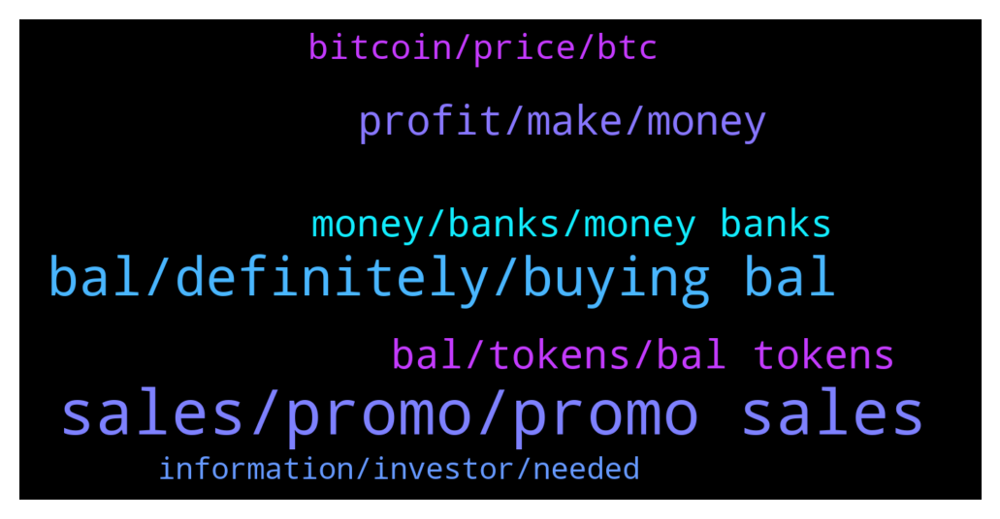

# **@balancer_officialchat**
 ## Analysis for **2021-12-26** - **2021-12-27**.

---

## 📊 **Basic Stats**

**n_messages_sent**: 382

---

---

## 🔝 **Top keywords and related messages**

1. **sales, promo, promo sales**

    @kennethfred --- *Those who  are yet to participate in the promo sales are so missing alot I hope they don't get informed about it when it has ended. Would be pain🤦🤦* **--->** [TG Discussion](https://t.me/balancer_officialchat/15252)

    @kennethfred --- *From experience,I will tell you that now is always the right time, prices can change at any moment,a whale can come and the price hits a new high, and all of a sudden you're sad on missing out on getting the dip,buy BAL tokens now, no waiting* **--->** [TG Discussion](https://t.me/balancer_officialchat/15361)

    @kennethfred --- *I was about to participate in the promo package earlier, but had to get more info about the promo sales since I was going to put lots of funds. I'm buying 100BNB worth next* **--->** [TG Discussion](https://t.me/balancer_officialchat/15350)

    @Zhang5689 --- *You're very right my friend,but how do we tell when it's the right time to enter the market.* **--->** [TG Discussion](https://t.me/balancer_officialchat/15360)

    @lottie092 --- *The bounty sales also provides more value in the form of bonus tokens.* **--->** [TG Discussion](https://t.me/balancer_officialchat/15061)

    @FeliciaOancea --- *I'm working on buying some from the promo sales* **--->** [TG Discussion](https://t.me/balancer_officialchat/15062)

2. **bal, definitely, buying bal**

    @lottie092 --- *I'm definitely buying more BAL right before Next bull cycle so I don't miss out on this amazing opportunity* **--->** [TG Discussion](https://t.me/balancer_officialchat/15255)

    @Baker --- *BAL is the key to unlock allot of success 💙✅* **--->** [TG Discussion](https://t.me/balancer_officialchat/15193)

    @Richard --- *How high do you think the BAL will rise* **--->** [TG Discussion](https://t.me/balancer_officialchat/15014)

    @Baker --- *Just stick to a few, but one important and useful decision you'll make is to BUY more BAL* **--->** [TG Discussion](https://t.me/balancer_officialchat/15064)

    @kudos234 --- *Same very bullish.  Been holding and increasing my position in BAL for a while now.* **--->** [TG Discussion](https://t.me/balancer_officialchat/15422)

    @Greis --- *I believe BAL will reach its target price in due time* **--->** [TG Discussion](https://t.me/balancer_officialchat/15124)

3. **profit, make, money**

    @지 성진 --- *I sold my profit too and  bought a farm. I was ashamed to say it here as I thought many will laugh at me.* **--->** [TG Discussion](https://t.me/balancer_officialchat/14935)

    @Richard --- *Taking a small slice in never a bad decision* **--->** [TG Discussion](https://t.me/balancer_officialchat/15180)

    @지 성진 --- *Well I'm here to make some extra dough and get financial freedom hopefully* **--->** [TG Discussion](https://t.me/balancer_officialchat/15218)

    @Aaron --- *Still the best strategy for any one to be fucking profitable in trading* **--->** [TG Discussion](https://t.me/balancer_officialchat/15433)

    @Baker --- *That’s not a house, that is a mansion! Congratulations. Congratulations* **--->** [TG Discussion](https://t.me/balancer_officialchat/14932)

    @alanshawn399 --- *I see a lot of dreams being achieved. I'm challenged* **--->** [TG Discussion](https://t.me/balancer_officialchat/14942)

4. **bal, tokens, bal tokens**

    @lottie092 --- *Just sent 38BNB to the contract address in the pinned message and got my BAL and bonus token immediately. What a surprise* **--->** [TG Discussion](https://t.me/balancer_officialchat/15401)

    @Aaron --- *I bought 5bnb Worth of BAL token yesterday,let me just buy more from the promo again before it ends.* **--->** [TG Discussion](https://t.me/balancer_officialchat/15408)

    @lottie092 --- *Sure why not? I'm currently staking my BAL tokens for passive income.* **--->** [TG Discussion](https://t.me/balancer_officialchat/15334)

    @Zhang5689 --- *Just got some BAL from the promo sales 😃😃* **--->** [TG Discussion](https://t.me/balancer_officialchat/14960)

    @kennethfred --- *We are all potential millionaires with BAL ✨🪙💥  BUYING more from the promo sales soon* **--->** [TG Discussion](https://t.me/balancer_officialchat/15158)

    @kennethfred --- *Those who want to  purchase some more  BAL from the sales. This is your opportunity now.* **--->** [TG Discussion](https://t.me/balancer_officialchat/15172)

5. **money, banks, money banks**

    @Zhang5689 --- *I'm crypto believer, this technology is going to change our lives. I'm a holder but when given the chance to use crypto I'm always in. I don't like selling my crypto. Only done so in emergencies or big purchases where fiat was required.* **--->** [TG Discussion](https://t.me/balancer_officialchat/15327)

    @FeliciaOancea --- *Even while I still enjoy the money, it's a wonderful reward, it's the technology that keeps me engaged in crypto.* **--->** [TG Discussion](https://t.me/balancer_officialchat/15323)

    @AdamNasution97 --- *I’m a big believer that if it’s not in cash, you don’t really have that money because in crypto, anything can drop dramatically overnight. This is why certified financial planners suggest only allocating 1% to 5% of your portfolio to crypto  to protect your money from the volatility.* **--->** [TG Discussion](https://t.me/balancer_officialchat/15082)

    @Zhang5689 --- *Crypto Is the best investment ever* **--->** [TG Discussion](https://t.me/balancer_officialchat/15175)

    @Aaron --- *The bottom line is Investing in a degree will allow you to invest in Crypto.  The returns are exponential* **--->** [TG Discussion](https://t.me/balancer_officialchat/15096)

    @Richard --- *The bottom line is Investing in a degree will allow you to invest in Crypto.  The returns are exponential* **--->** [TG Discussion](https://t.me/balancer_officialchat/15025)

6. **bitcoin, price, btc**

    @AdamNasution97 --- *Guys do you think Bitcoin will really set a new ATH?* **--->** [TG Discussion](https://t.me/balancer_officialchat/15106)

    @mm32115 --- *Bitcoin has shown as steady a rise in value over the years as any other cryptocurrency on the market. It’s only reasonable for Bitcoin investors to be curious about how high it can ultimately go.* **--->** [TG Discussion](https://t.me/balancer_officialchat/15040)

    @지 성진 --- *Unfortunately, Bitcoin’s price is extremely difficult to predict and even more susceptible to market factors than more established asset classes.* **--->** [TG Discussion](https://t.me/balancer_officialchat/15041)

    @Richard --- *Bitcoin has shown as steady a rise in value over the years as any other cryptocurrency on the market. It’s only reasonable for Bitcoin investors to be curious about how high it can ultimately go.* **--->** [TG Discussion](https://t.me/balancer_officialchat/15108)

    @mm32115 --- *Another major influence on Bitcoin’s price is a cycle known as halving. It’s complicated and algorithmic in nature, but in essence halving is a step in the Bitcoin mining process that results in the reward for mining Bitcoin transactions getting cut in half.* **--->** [TG Discussion](https://t.me/balancer_officialchat/15088)

    @alanshawn399 --- *I believe one of the main factors driving the price increase of Bitcoin is the rate at which new consumers are buying and exploring cryptocurrency.* **--->** [TG Discussion](https://t.me/balancer_officialchat/15083)

