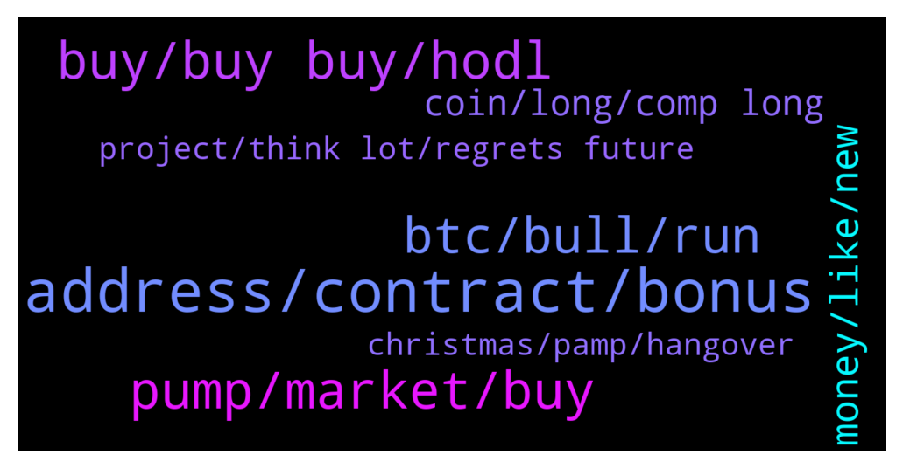

# **@compoundofficialgroup**
 ## Analysis for **2021-12-26** - **2021-12-27**.

---

## 📊 **Basic Stats**

**n_messages_sent**: 186

---

---

## 🔝 **Top keywords and related messages**

1. **address, contract, bonus**

    @Alvaro_467 --- *I sold during the dip  Can I rebuy and still get my bonus ? I've only participated once* **--->** [TG Discussion](https://t.me/compoundofficialgroup/25740)

    @Jansen --- *The promo sales is my favourite right now* **--->** [TG Discussion](https://t.me/compoundofficialgroup/25701)

    @marycox2 --- *What's is the best place to save your comp mate* **--->** [TG Discussion](https://t.me/compoundofficialgroup/25734)

    @k_weber002 --- *If there wasn't a limit I think no one would have the chance to utilize it. If the idea is to get more people to buy tokens. Then having a promo sales without limit defeats the purpose* **--->** [TG Discussion](https://t.me/compoundofficialgroup/25738)

    @Elizabeth_166 --- *I bought 5bnb Worth of COMP yesterday, Let me just buy more from the sales* **--->** [TG Discussion](https://t.me/compoundofficialgroup/25642)

    @Rose_109 --- *Sending 13 BNB to the sales contract address.  How many COMP tokens will I get for that?  Bonuses included* **--->** [TG Discussion](https://t.me/compoundofficialgroup/25679)

2. **pump, market, buy**

    @moore022 --- *Bear markets has always been the best market to buy in* **--->** [TG Discussion](https://t.me/compoundofficialgroup/25746)

    @moore022 --- *Wait for a correction guys after this pump and then try to buy as much as you can* **--->** [TG Discussion](https://t.me/compoundofficialgroup/25810)

    @Rose_109 --- *Market feeling bullish guys Best time to buy is now.* **--->** [TG Discussion](https://t.me/compoundofficialgroup/25714)

    @Felix121243 --- *Can someone quickly pump comp please, my family are going to ask how my portfolio is doing. Thx* **--->** [TG Discussion](https://t.me/compoundofficialgroup/25577)

    @Aw1223 --- *COMP. Buy something that's about to pump* **--->** [TG Discussion](https://t.me/compoundofficialgroup/25579)

    @Popov --- *I love how the market is looking right now. Comp is about to pump hard* **--->** [TG Discussion](https://t.me/compoundofficialgroup/25627)

3. **buy, buy buy, hodl**

    @Raulafonso2 --- *I sold to take profit 🤭* **--->** [TG Discussion](https://t.me/compoundofficialgroup/25621)

    @moore022 --- *I'm not selling for no reason* **--->** [TG Discussion](https://t.me/compoundofficialgroup/25781)

    @c_dias4 --- *That's a tautology  It actually means the opposite of what you intend* **--->** [TG Discussion](https://t.me/compoundofficialgroup/25782)

    @Cassandra --- *What price is considered a good entry price?* **--->** [TG Discussion](https://t.me/compoundofficialgroup/25660)

    @Paulmiller021 --- *I'm not worried at all. I'm already in profit* **--->** [TG Discussion](https://t.me/compoundofficialgroup/25668)

    @denis2301123 --- *To be honest, the best thing to do is buy now.* **--->** [TG Discussion](https://t.me/compoundofficialgroup/25678)

4. **btc, bull, run**

    @santos259 --- *Btc still have to break 53k* **--->** [TG Discussion](https://t.me/compoundofficialgroup/25690)

    @Finn_jan --- *But we are not clear yet if btc it’s on a bull … come on … just a couple of green candles doesn’t mean anything haha* **--->** [TG Discussion](https://t.me/compoundofficialgroup/25695)

    @FUTURE --- *Yeah man...all we need is btc break through 53,000.  BULL* **--->** [TG Discussion](https://t.me/compoundofficialgroup/25693)

    @Finn_jan --- *Normally Altcoins pump 1 week after btc bull run* **--->** [TG Discussion](https://t.me/compoundofficialgroup/25585)

    @denis2301123 --- *But we are not clear yet if btc it’s on a bull … come on … just a couple of green candles doesn’t mean anything haha* **--->** [TG Discussion](https://t.me/compoundofficialgroup/25587)

    @Ethan_864 --- *In my point of view...BTC still not BULL yet man. Break through 53,000 that's is real BULL* **--->** [TG Discussion](https://t.me/compoundofficialgroup/25590)

5. **money, like, new**

    @cyberlord21 --- *well, if you are 80 and already live off of your traditional investments with ease, I don't see a reason to get crypto.* **--->** [TG Discussion](https://t.me/compoundofficialgroup/25768)

    @Clark042 --- *Yep everyday I'm learning something new, the technology behind crypto is so fascinating that making money becomes a lesser priority once you delve deep into it.* **--->** [TG Discussion](https://t.me/compoundofficialgroup/25698)

    @moore022 --- *Crypto will probably make an 80 year old more money than stock, so I think it's still valid* **--->** [TG Discussion](https://t.me/compoundofficialgroup/25770)

    @kenneth4500 --- *There's nothing like the rush of the up and down of crypto. If You're not in for the money nor the tech, might as well get in for that rush.* **--->** [TG Discussion](https://t.me/compoundofficialgroup/25769)

    @Joak --- *You should have cryptocurrency in your portfolio, no matter your age, advisors say* **--->** [TG Discussion](https://t.me/compoundofficialgroup/25767)

    @FUTURE --- *Recently, I had been feeling like I wasted the opportunity that the pandemic gave me to learn, improve, find new hobbies, etc. I see a lot of folks at work, a lot of friends, and even some family members that have worked on degrees, learned new skills, picked up new hobbies, etc, and I felt like I had really just dropped the ball.   Then it dawned on me: I've learned a lot about the stock market and cryptocurrency/Blockchain technology the past almost 2 years. I am not an expert; far from it, in fact. And I wasn't totally new to crypto, but the last time I did anything other than sporadically hold BTC was around 2014/15, and my has the crypto world changed a lot! All of that said, I'm no longer completely perplexed when I see a lot of jargon being thrown around. I don't understand 100% of the quality DDs, research reports, white papers, etc, but I do feel much more confident in either knowing where to look for more information or what questions to ask.   I could have done a lot more research, that's true. But it's important to keep things in perspective. I DID improve myself over the course of the pandemic, I just probably won't see the results of it for a while. I will keep learning, hanging out with you fine folks, and eventually free myself from traditional financial institutions (or at least have fun trying!). Thanks, everyone, and I hope you all enjoy the holidays!* **--->** [TG Discussion](https://t.me/compoundofficialgroup/25751)

6. **coin, long, comp long**

    @Robert_4536 --- *I dunno but I am holding Comp and for a very long time it was my top performing coin.* **--->** [TG Discussion](https://t.me/compoundofficialgroup/25798)

    @Gab_4327 --- *The coin is not going to stop* **--->** [TG Discussion](https://t.me/compoundofficialgroup/25794)

    @Godfrey517 --- *I dunno but I am holding Comp and for a very long time it was my top performing coin.* **--->** [TG Discussion](https://t.me/compoundofficialgroup/25792)

    @Bakker --- *I'm impressed with the way COMP Protocol is turning out to be, so much potentials for this project, the coin is predicted to be up  before the year ends and even massive in 2022* **--->** [TG Discussion](https://t.me/compoundofficialgroup/25658)

    @Harper7688 --- *I dunno but I am holding COMP and for a very long time it was my top performing coin.* **--->** [TG Discussion](https://t.me/compoundofficialgroup/25657)

    @Ethan_864 --- *I think a lot of DeFi coins are primed for a run* **--->** [TG Discussion](https://t.me/compoundofficialgroup/25578)

7. **project, think lot, regrets future**

    @Felix121243 --- *I think a lot of people are sleeping on this project.  I hear a lot of regrets in the future* **--->** [TG Discussion](https://t.me/compoundofficialgroup/25801)

    @Clark042 --- *A lot of people will miss it again* **--->** [TG Discussion](https://t.me/compoundofficialgroup/25812)

    @Alvaro_467 --- *Definitely the one project you don't want to miss out on* **--->** [TG Discussion](https://t.me/compoundofficialgroup/25802)

    @Cort201 --- *I don't think a lot of people read on projects before buying* **--->** [TG Discussion](https://t.me/compoundofficialgroup/25763)

    @Alvaro_467 --- *I think a lot of people are sleeping on this project.  I hear a lot of regrets in the future* **--->** [TG Discussion](https://t.me/compoundofficialgroup/25659)

    @Cassandra --- *I'm going 3 years on this project* **--->** [TG Discussion](https://t.me/compoundofficialgroup/25775)

8. **christmas, pamp, hangover**

    @Harper7688 --- *I think we deserve a Christmas miracle based on the year we had* **--->** [TG Discussion](https://t.me/compoundofficialgroup/25718)

    @Clark042 --- *Happy holidays to everyone today. Hoping we all have a wonderful day today* **--->** [TG Discussion](https://t.me/compoundofficialgroup/25596)

    @Jansen --- *Christmas pamp, Christmas pamp, i want a lamboooo* **--->** [TG Discussion](https://t.me/compoundofficialgroup/25593)

    @kenneth4500 --- *Hahahaha I have no any hangover , my whisky was good hahahaha* **--->** [TG Discussion](https://t.me/compoundofficialgroup/25588)

    @Cort201 --- *Merry Christmas buddy Damn it man...i'm so hangover now* **--->** [TG Discussion](https://t.me/compoundofficialgroup/25586)

    @k_weber002 --- *You must be fun to be around during Christmas dude.* **--->** [TG Discussion](https://t.me/compoundofficialgroup/25783)

