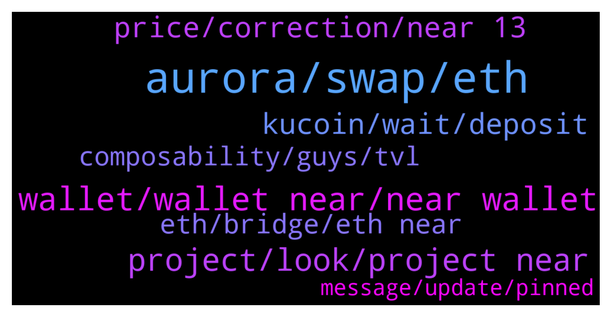

# **@cryptonear**
 ## Analysis for **2021-12-26** - **2021-12-27**.

---

## 📊 **Basic Stats**

**n_messages_sent**: 396

---

---

## 🔝 **Top keywords and related messages**

1. **aurora, swap, eth**

    @TheGo1denBull --- *Just send near to Aurora. Swap for eth there* **--->** [TG Discussion](https://t.me/cryptonear/253199)

    @haidang87dotcom --- *Hello all. Anyone know how Near get the benefit as Aurora growth? Please explain or give me some docs, thanks!* **--->** [TG Discussion](https://t.me/cryptonear/252848)

    @nita_NFtart --- *the swap fee is very cheap but the withdrawal fee from market is very expensive* **--->** [TG Discussion](https://t.me/cryptonear/253029)

    @kv9990 --- *Have you checked tvl on Aurora (L2 on NEAR for scaling ETH)which is a smart contract on NEAR ✌️ https://defillama.com/chain/Aurora* **--->** [TG Discussion](https://t.me/cryptonear/251829)

    @Aflatoon123 --- *Hey buddy give me you wallet address let me see if i can forward some 0.1 near worth eth to you on aurora* **--->** [TG Discussion](https://t.me/cryptonear/253202)

    @sumeet04 --- *NOOB here. whats driving the aurora price? Its full diluted market cap seems too high* **--->** [TG Discussion](https://t.me/cryptonear/253152)

2. **wallet, wallet near, near wallet**

    @LifeMachine4 --- *is it normal to have to "import existing account" each time one wants to check one's near wallet at https://wallet.near.org ? Or is there supposed to be a general sign-in option?* **--->** [TG Discussion](https://t.me/cryptonear/252685)

    @EimiFukada96 --- *Why is my previous wallet not. near* **--->** [TG Discussion](https://t.me/cryptonear/252275)

    @thanano46 --- *Sir you can make wallet for free by making your wallet with email or phone number signup* **--->** [TG Discussion](https://t.me/cryptonear/252619)

    @kv9990 --- *There're two types of addresses, one 64 digit and one .near 👀 when you create one wallet from wallet.near.org ,you can get .near address* **--->** [TG Discussion](https://t.me/cryptonear/252278)

    @Juls746 --- *so no desktop wallet? any plans for one?* **--->** [TG Discussion](https://t.me/cryptonear/252892)

    @kv9990 --- *You can check transaction to your wallet from explorer.near.org* **--->** [TG Discussion](https://t.me/cryptonear/252298)

3. **project, look, project near**

    @li --- *ok ,You should check it out, after all it was released on near* **--->** [TG Discussion](https://t.me/cryptonear/253074)

    @li --- *What do you think of empyreandao* **--->** [TG Discussion](https://t.me/cryptonear/253067)

    @Adam --- *What do you guys view as the best project on near?* **--->** [TG Discussion](https://t.me/cryptonear/252109)

    @kv9990 --- *Gonna give it a look today ✌️* **--->** [TG Discussion](https://t.me/cryptonear/253070)

    @walkonwayvs --- *Hello. I am wondering if the NEAR + New Order AMA that was mentioned in a NEAR tweet on December 7th has a recorded audio anywhere? I can link to the tweet if needed.* **--->** [TG Discussion](https://t.me/cryptonear/252857)

    @walkonwayvs --- *Amazing thank you. Please @ me so I can be notified when/if you find it 🙏* **--->** [TG Discussion](https://t.me/cryptonear/252860)

4. **price, correction, near 13**

    @Kripto_Raptor --- *from new year on I will reduce official tipping amount to 0.05 from 0.1 😜* **--->** [TG Discussion](https://t.me/cryptonear/251888)

    @thanano46 --- *What if near goes to 50$ by dn ?? Tipping will be like 0.001 😜😜* **--->** [TG Discussion](https://t.me/cryptonear/251890)

    @thanano46 --- *So generous sir 😊.. i can also fund it but i sold all my near at 13$ point 🤣🤣🤣🤣* **--->** [TG Discussion](https://t.me/cryptonear/252625)

    @TheGo1denBull --- *Gotta dyor. You did so in the past you must know better. But you can have price discussions in  https://t.me/merchantsofnear* **--->** [TG Discussion](https://t.me/cryptonear/252828)

    @iamkemoo --- *for price and pump talks please go to https://t.me/merchantsofnear* **--->** [TG Discussion](https://t.me/cryptonear/252170)

    @larry_lang --- *=0000 hehe i sure hope the future would be brighter for u buddy^^* **--->** [TG Discussion](https://t.me/cryptonear/252728)

5. **kucoin, wait, deposit**

    @namjoo59 --- *Hi. I sent my Near tokens to Kucoin ( what a mistake) and they stopped deposits because of " Node maintenance"  It's about 10 days.  Is there anybody know how can i get rid of kucoin?  I contacted with thier support and they are messy and don't know when deposit will open.* **--->** [TG Discussion](https://t.me/cryptonear/252639)

    @SidMh --- *I am trying to create near wallet. But binance and kucoin withdrawl are not working for hours.  Can someone give me 0.1 near to funding wallet address?* **--->** [TG Discussion](https://t.me/cryptonear/252613)

    @TheGo1denBull --- *Always make sure an exchange is accepting deposits for a certain coin or token before sending. With kucoin you will have to wait until node maintenance concludes. Hopefully they assist with a manual deposit. If it's successful in https://explorer.near.org they must manually deposit. Just wait and then go to live support. They will help you.* **--->** [TG Discussion](https://t.me/cryptonear/252669)

    @DexiNigeria --- *I am finding it difficult to withdraw near* **--->** [TG Discussion](https://t.me/cryptonear/251845)

    @CallMeDrico --- *Maybe I should wait for kucoin* **--->** [TG Discussion](https://t.me/cryptonear/252766)

    @Wojak_near --- *This should blame on kucoin solely* **--->** [TG Discussion](https://t.me/cryptonear/252643)

6. **eth, bridge, eth near**

    @nino706 --- *hello, how do we turn atUST to UST to bridge to Terra ?* **--->** [TG Discussion](https://t.me/cryptonear/252792)

    @kv9990 --- *If you're bridging from near to eth, it's fast ✌️* **--->** [TG Discussion](https://t.me/cryptonear/252747)

    @traderchristofer --- *Don't use rainbow bridge to convert your eth to NEAR. Your money will never get there. Happened to me yesterday* **--->** [TG Discussion](https://t.me/cryptonear/251993)

    @CallMeDrico --- *I need eth I wanna bridge from near to get ethereum* **--->** [TG Discussion](https://t.me/cryptonear/252760)

    @nita_NFtart --- *so i have to get eth in near then bridge?* **--->** [TG Discussion](https://t.me/cryptonear/253159)

    @larry_lang --- *so we can find the route for u* **--->** [TG Discussion](https://t.me/cryptonear/252759)

7. **composability, guys, tvl**

    @frankwizard --- *why do you guys think NEAR ecosystem is not as widely used (or widely recognized) by the world  P/s: Im merely judging from TVL and token price where we lag behind SOL/AVAX etc  - where do you guys think there is the gap btwn us and them?* **--->** [TG Discussion](https://t.me/cryptonear/251801)

    @NickHaverilla --- *Near's scaling impacts composability in the sense that it is no longer atomic anymore but sequential  Atomic composability can be viewed as zero blocktime composability Sequential composability as x (x > zero) blocktime composability* **--->** [TG Discussion](https://t.me/cryptonear/252665)

    @FritzWagner --- *Hey, maybe timing and marketing made some difference. In the long run I believe Near will prevail and become top 5. Near onboarding and use is smooth and simpler than with any other Blockchain ecosystems.* **--->** [TG Discussion](https://t.me/cryptonear/251813)

    @frankwizard --- *With all the L1 competing for TVL i do feel NEAR is falling behind in market share (NEAR has such solid product but just not picking up market share) —> makes me wonder why* **--->** [TG Discussion](https://t.me/cryptonear/251816)

    @Onilgrg --- *Near is more popular outside USA so likely we ll see more investors.* **--->** [TG Discussion](https://t.me/cryptonear/251809)

    @masstahcoiner --- *NEAR is next better ethereum  don't you know?* **--->** [TG Discussion](https://t.me/cryptonear/252481)

