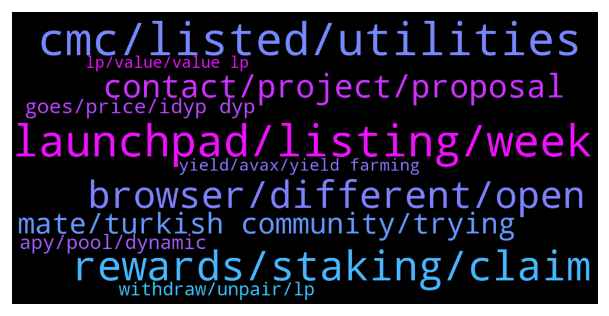

# **@dypfinance**
 ## Analysis for **2021-12-26** - **2021-12-27**.

---

## 📊 **Basic Stats**

**n_messages_sent**: 309

---

---

## 🔝 **Top keywords and related messages**

1. **cmc, listed, utilities**

    @DhoniMSD516 --- *iDYP is our new token which is being used in new strategies of farming, staking and buyback more utilities for iDYP will be coming through moving forward* **--->** [TG Discussion](https://t.me/dypfinance/234021)

    @nobodyffff --- *What kind of additional utilities should we consider for iDYP going forward?* **--->** [TG Discussion](https://t.me/dypfinance/234042)

    @nobodyffff --- *Yep, I'm considering all. What is the deal about iDYP?* **--->** [TG Discussion](https://t.me/dypfinance/234012)

    @DhoniMSD516 --- *Hey we are already on CMC and CGK https://coinmarketcap.com/currencies/defi-yield-protocol/  https://www.coingecko.com/en/coins/defi-yield-protocol* **--->** [TG Discussion](https://t.me/dypfinance/233825)

    @DhoniMSD516 --- *You can read about why iDYP here  https://link.medium.com/QZD2POunskb* **--->** [TG Discussion](https://t.me/dypfinance/233876)

    @umarbisyir --- *Bro, dyp team never disappoints  Proven from time to time* **--->** [TG Discussion](https://t.me/dypfinance/233561)

2. **launchpad, listing, week**

    @Vl_investor --- *With the listing, it is clear that nothing can depend on you, and the launchpad, according to you, should have been released like 5 days ago, where is it? what's happened? people want to know!* **--->** [TG Discussion](https://t.me/dypfinance/233559)

    @timdyp --- *Hi, the launchpad portal for new projects to apply will be announced tomorrow, also a preview of the new NFTs marketplace and collection will be launched tomorrow. We expect the first project to be launched through our launchpad by the middle of January.* **--->** [TG Discussion](https://t.me/dypfinance/233565)

    @profit984 --- *so this last week will have launchpad, matic farm, and listing for sure?* **--->** [TG Discussion](https://t.me/dypfinance/233903)

    @finaldust --- *Thanks. Currently there is no fixed date on the launch?* **--->** [TG Discussion](https://t.me/dypfinance/234255)

    @DhoniMSD516 --- *Not live yet It is upcoming expansion* **--->** [TG Discussion](https://t.me/dypfinance/233910)

    @DhoniMSD516 --- *We will have an announcement regarding launchpad on monday regarding listing you can read this update https://t.me/dypfinance/232488  Regarding Matic farms pls stay tuned* **--->** [TG Discussion](https://t.me/dypfinance/233906)

3. **rewards, staking, claim**

    @Abulsagga --- *guys when i approve staking it asks for 200+ just for gas fees is that logical* **--->** [TG Discussion](https://t.me/dypfinance/234058)

    @raid_off --- *U said me - I will receive 75% in my staked tokens ..... but It’s was wrong info* **--->** [TG Discussion](https://t.me/dypfinance/234225)

    @chunshern90 --- *Same here. i just hope to get back my initial deposit. Instead of earning their "Rewards"* **--->** [TG Discussion](https://t.me/dypfinance/233763)

    @DhoniMSD516 --- *The Staking reward you earned is in USD value untill you claim when you click claim this USD value of iDYP is swapped to DYP* **--->** [TG Discussion](https://t.me/dypfinance/233645)

    @chunshern90 --- *same here.. buyback staking make me lost my 30% intial deposit.* **--->** [TG Discussion](https://t.me/dypfinance/233756)

    @raid_off --- *I don’t received... I had staked 50 cake and unstaked only 15* **--->** [TG Discussion](https://t.me/dypfinance/234218)

4. **browser, different, open**

    @HumbleFutures --- *my wallet is not connecting on brave browser* **--->** [TG Discussion](https://t.me/dypfinance/234169)

    @DhoniMSD516 --- *Ok but I have no issues here is from mobile* **--->** [TG Discussion](https://t.me/dypfinance/234180)

    @DhoniMSD516 --- *Hey I just tested with Metamsk + Brave and it connected successfully* **--->** [TG Discussion](https://t.me/dypfinance/234172)

    @HumbleFutures --- *I tried to send a screenshot but it deleted… Im getting a no web3 error* **--->** [TG Discussion](https://t.me/dypfinance/234182)

    @Life_is_love_La_la_la_la_la --- *Hi Dhoni. I access the platform via the C98 wallet. How do I clear the cache please?* **--->** [TG Discussion](https://t.me/dypfinance/233586)

    @DhoniMSD516 --- *Nope works fine on my end* **--->** [TG Discussion](https://t.me/dypfinance/234158)

5. **contact, project, proposal**

    @Crypto_partner1 --- *Hi bro I have a sticker proposal for your project. So whom should I contact?* **--->** [TG Discussion](https://t.me/dypfinance/233973)

    @dob --- *Hi, Could you let me know where I can apply to the DYP careers as a Solidity developer?* **--->** [TG Discussion](https://t.me/dypfinance/233914)

    @Btok_Draco --- *Hello folks, Merry Xmas and happy New year! Would you mind referring me to the marketing contact regarding this project? Our APP Btok is a social network that connects over 10 million active users. If you wish to promote your token on our APP, I'll send our proposal shortly.* **--->** [TG Discussion](https://t.me/dypfinance/233899)

    @Jack_nguyen16 --- *I from IM Community (50k members) , i'd like to invite your project to hold AMA in our community, who can i discuss with?* **--->** [TG Discussion](https://t.me/dypfinance/234214)

    @nobodyffff --- *Where can I see the proposalin question and results?* **--->** [TG Discussion](https://t.me/dypfinance/234033)

    @Mariana2q --- *How can I join this project???* **--->** [TG Discussion](https://t.me/dypfinance/233424)

6. **mate, turkish community, trying**

    @DhoniMSD516 --- *Hey mate we are already live  https://coinmarketcap.com/currencies/defi-yield-protocol/* **--->** [TG Discussion](https://t.me/dypfinance/233548)

    @DhoniMSD516 --- *Hey mate hope you read this message https://t.me/dypfinance/232488* **--->** [TG Discussion](https://t.me/dypfinance/233465)

    @KW --- *Hi Dhoni - did u just msg me ?* **--->** [TG Discussion](https://t.me/dypfinance/233971)

    @fikritt --- *Hi @admin Do you need an mod for the Turkish community?* **--->** [TG Discussion](https://t.me/dypfinance/234110)

    @DhoniMSD516 --- *Hey you can dm me if is urgent 😀* **--->** [TG Discussion](https://t.me/dypfinance/234243)

    @DhoniMSD516 --- *Nope we admins will never DM you first please Report and block* **--->** [TG Discussion](https://t.me/dypfinance/233974)

7. **goes, price, idyp dyp**

    @DhoniMSD516 --- *Yes DYP value you get or shown changes based on marketprice of iDYP* **--->** [TG Discussion](https://t.me/dypfinance/233632)

    @DhoniMSD516 --- *You can check iDYP price here https://info.pangolin.exchange/#/pair/0x66eecc97203704d9e2db4a431cb0e9ce92539d5a* **--->** [TG Discussion](https://t.me/dypfinance/234015)

    @DhoniMSD516 --- *This value depends on both iDYP and DYP if both goes down you get value what is shown mostly, if one goes up and other goes down you get +/- values* **--->** [TG Discussion](https://t.me/dypfinance/233636)

    @RadiantPhoenix4 --- *How do i calculate my DYP reward using iDYP/DYP price?  Is there a calculator?* **--->** [TG Discussion](https://t.me/dypfinance/233639)

    @RadiantPhoenix4 --- *So if iDYP value goes down, my earned DYP goes down?* **--->** [TG Discussion](https://t.me/dypfinance/233635)

    @RadiantPhoenix4 --- *I want to know what to expect when iDYP or DYP price goes up or down* **--->** [TG Discussion](https://t.me/dypfinance/233643)

8. **apy, pool, dynamic**

    @hemanrock --- *%share, APY is dynamic and you can also check more on internet how yield farming works.* **--->** [TG Discussion](https://t.me/dypfinance/233683)

    @ehgdu55 --- *If I earn 295% APY will I then earn 295/4 every 3 months. So 295/4 =  73%. Since I farm my idyp in a 90 lock staking pool and I want to compound every 90 days!* **--->** [TG Discussion](https://t.me/dypfinance/233717)

    @hemanrock --- *the new strategies from the new contracts are designed for APY.* **--->** [TG Discussion](https://t.me/dypfinance/233732)

    @crypto crow --- *I think your math will be correct if 295 percent was the APR not APY* **--->** [TG Discussion](https://t.me/dypfinance/233721)

    @Tettluft --- *What is changing the apy? More people in the pool, or less?* **--->** [TG Discussion](https://t.me/dypfinance/233573)

    @Life_is_love_La_la_la_la_la --- *Hi Heman. Would you be kind enough to clarify for me something. I stake DYP in the 90 day V2 pool contract and dyrung the last week it so I have seen the APY reduce from around 180% to 116%, as I write. DYP's price has remained fairly constant over this timeframe, but the TVL has fallen by $2m to $3m. What are the greatest influencers of the APY? Is it my investment as a proportion of TVL? Does DYP's price enter into the formula? Also, I know that I can reinvest rewards without extending the lock-in end date, but how about new investment into the same contract? Does this create a new end date for the new money?* **--->** [TG Discussion](https://t.me/dypfinance/233700)

9. **withdraw, unpair, lp**

    @DhoniMSD516 --- *After withdrawing from dApp head to this link and unpair https://app.uniswap.org/#/remove/v2/0x961C8c0B1aaD0c0b10a51FeF6a867E3091BCef17/ETH* **--->** [TG Discussion](https://t.me/dypfinance/233965)

    @DhoniMSD516 --- *Actually when you are withdrawing in V2 farms you get the token you selected as withdraw and not LP* **--->** [TG Discussion](https://t.me/dypfinance/233509)

    @KW --- *HI Dhoni - This may sound a really dumb question. please bear with me. Before doing the unpair in uniswap, I will need to connect it to a wallet 1st right ?  it looks like there is no trust wallet from the list of supported wallet in uniswap. I am doing the withdrawal from Trust wallet so I thought the unpair should also be from Trust wallet  as well. Do you have any tutorial to show the step by step to unpair LP ?* **--->** [TG Discussion](https://t.me/dypfinance/233996)

    @KW --- *HI Dhoni - what is the difference between claim and withdraw ? which one should i choose ?* **--->** [TG Discussion](https://t.me/dypfinance/233988)

    @hemanrock --- *after you click withdraw from https://app.dyp.finance/staking-usdt pool,   you can simply visit https://app.uniswap.org/#/pool/v2pool to convert your LP to normal assets.* **--->** [TG Discussion](https://t.me/dypfinance/233676)

    @donkeyskin --- *Does anyone know how to sell the LP tokens we’ve withdrawn ?* **--->** [TG Discussion](https://t.me/dypfinance/233669)

10. **yield, avax, yield farming**

    @DhoniMSD516 --- *We explain the process in our medium and impermanent loss is common in yield farming* **--->** [TG Discussion](https://t.me/dypfinance/234229)

    @Guntjong --- *Can someone sugest legit farm in defi yield?? Tq* **--->** [TG Discussion](https://t.me/dypfinance/234200)

    @crypto crow --- *What factors influence APY of the AVAX yield Earn V2 Farms?* **--->** [TG Discussion](https://t.me/dypfinance/233665)

    @DhoniMSD516 --- *Hey you can check out our DYP farms available on ETH, BSC and AVAX chains https://dyp.finance/farmv2* **--->** [TG Discussion](https://t.me/dypfinance/234201)

    @timdyp --- *Maximize your Yield Farming Rewards!  Available multi-chain on #Avalanche #Ethereum #Binance  9130 #ETH, 9445 #BNB & 20302 #AVAX worth $44,096,899 paid to farmers  Join farming by automatically adding liquidity and earn 585% APY https://dyp.finance/farmv2  👉https://twitter.com/dypfinance/status/1475082390389370885* **--->** [TG Discussion](https://t.me/dypfinance/233582)

    @crypto crow --- *will APY of the AVAX yield v2 farms increase if DYP token price increases?* **--->** [TG Discussion](https://t.me/dypfinance/233692)

