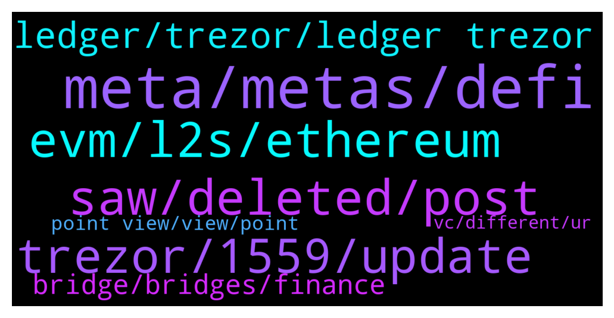

# **@lobsters_chat**
 ## Analysis for **2021-12-26** - **2021-12-27**.

---

## 📊 **Basic Stats**

**n_messages_sent**: 194

---

---

## 🔝 **Top keywords and related messages**

1. **meta, metas, defi**

    @Milan_ZIL --- *Leak me the next meta that is going to take off😛* **--->** [TG Discussion](https://t.me/lobsters_chat/310711)

    @sixty10 --- *Really abusing the term meta here* **--->** [TG Discussion](https://t.me/lobsters_chat/310721)

    @Milan_ZIL --- *I guess we can speculate on which meta are easier to take off than others. My assumption right now that zk L2 metas are a bit too technical/abstract to take off. But I may be wrong* **--->** [TG Discussion](https://t.me/lobsters_chat/310714)

    @Hullow --- *Privacy meta : never took off* **--->** [TG Discussion](https://t.me/lobsters_chat/310710)

    @Milan_ZIL --- *DeFi summer meta, Memecoins meta, NFT meta, L1 competitors meta, Earn2Play meta, Metaverse meta, DAO meta, DeFI 2.0 meta  Any others I missed?* **--->** [TG Discussion](https://t.me/lobsters_chat/310696)

    @InsidemePLZ --- *i think decentralised cross-margin will have its time in the meta as well* **--->** [TG Discussion](https://t.me/lobsters_chat/310745)

2. **saw, deleted, post**

    @nickbtts --- *You added an ‘s’ to the actual degenDAO and are making people pay for it 😂  Pretty terrible attempt at a shill tbf* **--->** [TG Discussion](https://t.me/lobsters_chat/310794)

    @fommes --- *is there a typo on gearbox?* **--->** [TG Discussion](https://t.me/lobsters_chat/310672)

    @PmRiviere --- *oops, thanks for pointing this out! seems they like your work tho! https://twitter.com/CurveFinance/status/1475468806566952960* **--->** [TG Discussion](https://t.me/lobsters_chat/310916)

    @Sal_ash --- *hahaha, was about to say peeps said the same for loot till I saw the end of the thread* **--->** [TG Discussion](https://t.me/lobsters_chat/310576)

    @Cuter0x --- *ELI5? I usually understand this stuff but not your message ahah* **--->** [TG Discussion](https://t.me/lobsters_chat/310616)

    @ivangbi --- *Buddha muted, wellkochi muted, . Diamond crab banned.* **--->** [TG Discussion](https://t.me/lobsters_chat/310846)

3. **evm, l2s, ethereum**

    @yic_alex --- *L1s are competing with Ethereum L2s imho. At least they're selling the same qualities to the end user. I don't think Ethereum can be beaten from an ecosystem / network effect / security POV realistically any time soon.  Ethereum L2s mostly have been building in the background, some don't even have tokens. It will be interesting to see what happens once the marketing is turned up for those.* **--->** [TG Discussion](https://t.me/lobsters_chat/310689)

    @cragslist --- *How? They are completely different platforms. DOT is the highway that interconnects all the different L1's like ETH, SOL. They can't compete. They will be successful in their own pillars* **--->** [TG Discussion](https://t.me/lobsters_chat/310756)

    @cragslist --- *Sol and Avax stole a lot of market share from ETH but I think 2.0 will steal the show when it comes* **--->** [TG Discussion](https://t.me/lobsters_chat/310694)

    @Hullow --- *It’s a narrative fight. Alt-L1 proponents claim they are in a battle against Ethereum, whereas Ethereum proponents claim it’s all about scaling, and that its L2s are the answer* **--->** [TG Discussion](https://t.me/lobsters_chat/310688)

    @Suk4b1y4t --- *Only EVM L1s are competing with ETH L2s* **--->** [TG Discussion](https://t.me/lobsters_chat/310693)

    @StephanGoss --- *I think DOT will seriously cramp ETH 2.0s style* **--->** [TG Discussion](https://t.me/lobsters_chat/310750)

4. **trezor, 1559, update**

    @zhongfu --- *not sure about that, but the trezor team (I think) was not entirely convinced about the need for eip-1559 to be implemented* **--->** [TG Discussion](https://t.me/lobsters_chat/310880)

    @tufuntu --- *In uniswap v2, why didn't they use IERC20 instead of selector?  https://github.com/Uniswap/v2-core/blob/master/contracts/UniswapV2Pair.sol#L45  Anybody has an idea?* **--->** [TG Discussion](https://t.me/lobsters_chat/310940)

    @nikolajankovic --- *Not sure if that's a move up, really - for example, Trezor only added support for EIP-1559 just a few weeks ago, in early December.* **--->** [TG Discussion](https://t.me/lobsters_chat/310865)

    @IvoGeorgiev --- *It used to work cause it just read the top stack value which happened to be non zero* **--->** [TG Discussion](https://t.me/lobsters_chat/310945)

    @IvoGeorgiev --- *Initially things worked automagically if you just evaluated require(x.transfer(..)) but then with the returnvaluesize opcode and the the following solidity update this was patched* **--->** [TG Discussion](https://t.me/lobsters_chat/310944)

    @Gb0514 --- *Can be annoying with the 3 step confirmations but it works* **--->** [TG Discussion](https://t.me/lobsters_chat/310850)

5. **ledger, trezor, ledger trezor**

    @raoufbenhar --- *What’s your guys favorite/best hardware wallet? Aside from ledger* **--->** [TG Discussion](https://t.me/lobsters_chat/310842)

    @mogglet --- *ledger nano s is still the best, I bought 2 nano x and both died upon arrival ( battery dead). Ledger team if you were here please fix asappp !* **--->** [TG Discussion](https://t.me/lobsters_chat/310859)

    @yic_alex --- *Tbh it does not make much sense to not use Ledger/Trezor if you don't want to run into compatibility issues / lack of apps. It does not pay off to go for the non market leaders with those kind of things in my experience, especially when even those already kinda suck.* **--->** [TG Discussion](https://t.me/lobsters_chat/310854)

    @raoufbenhar --- *has anybody switched from ledger to trezor?* **--->** [TG Discussion](https://t.me/lobsters_chat/310861)

    @yic_alex --- *It is not that Ledger and Trezor are bad, they are just confronted with the issue of having to support rapidly changing protocols / networks / browsers (and extensions) without compromising security. I think they have understood (will understand) this and will allocate more resources eventually.* **--->** [TG Discussion](https://t.me/lobsters_chat/310889)

    @forelsket.eth --- *Is lattice one fully compatible with metamask or does it also have issues like ledger?* **--->** [TG Discussion](https://t.me/lobsters_chat/310856)

6. **bridge, bridges, finance**

    @Cuter0x --- *Also, do You know what's the "bridge" section difference compared to the "router" one?* **--->** [TG Discussion](https://t.me/lobsters_chat/310613)

    @philippzentner --- *We’re in the process of aggregating you guys atm. :) at Li.Finance* **--->** [TG Discussion](https://t.me/lobsters_chat/310645)

    @mogglet --- *Router is a bridge with innovate function, allow token bridges multi-directional.* **--->** [TG Discussion](https://t.me/lobsters_chat/310615)

    @rahemanAli --- *Awesome. Wen SDK ser? We've been building some cool cross-chain infrastructure and can leverage Li.finance bridge aggregation/order routing..* **--->** [TG Discussion](https://t.me/lobsters_chat/310646)

    @ChiTimesChi --- *Ser, may I DM you? We happen to have quite a liquid bridge for ETH and stablecoins over here :)* **--->** [TG Discussion](https://t.me/lobsters_chat/310648)

    @KeyedDepartment --- *elk.finance is a cross-chain bridge that bridges its elk token  it has an option to sell and convert 1 elk into gas upon bridging* **--->** [TG Discussion](https://t.me/lobsters_chat/310766)

7. **point view, view, point**

    @Dogetoshi --- *If anyone is curious about my SOS investment thesis https://twitter.com/dogetoshi/status/1474841966416482316?s=21* **--->** [TG Discussion](https://t.me/lobsters_chat/310575)

    @yic_alex --- *I'm not quite convinced of that. It's a too technical point of view.* **--->** [TG Discussion](https://t.me/lobsters_chat/310695)

    @bout3fiddy --- *We're independent from Curve and our views are our own. It is an attempt at avoiding a Mochi fiasco.* **--->** [TG Discussion](https://t.me/lobsters_chat/310915)

    @yic_alex --- *How did they justify that? It seems fairly important.* **--->** [TG Discussion](https://t.me/lobsters_chat/310882)

    @zhongfu --- *but of course that's not useful for most people* **--->** [TG Discussion](https://t.me/lobsters_chat/310876)

    @yic_alex --- *From that point of view I agree.* **--->** [TG Discussion](https://t.me/lobsters_chat/310709)

