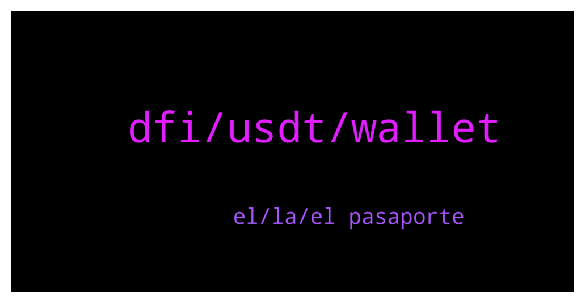

# **@CakeDeFi_EN**
 ## Analysis for **2021-12-27** - **2021-12-28**.

---

## 📊 **Basic Stats**

**n_messages_sent**: 200

---

---

## 🔝 **Top keywords and related messages**

1. **dfi, usdt, wallet**

    @Michael_Schredl --- *Yes, you can swap USDT to DFI on Cake* **--->** [TG Discussion](https://t.me/CakeDeFi_EN/157583)

    @J --- *It cost me 1 DFI yesterday to move dUSD. Not .2* **--->** [TG Discussion](https://t.me/CakeDeFi_EN/157201)

    @Yengkhom Givson --- *How I should do that ...whenever I press confirm it just goes to websites* **--->** [TG Discussion](https://t.me/CakeDeFi_EN/157355)

    @Vishaljain2 --- *My Friends are facing lots of Friction while Signing up. Some of them Deleted the App due to this.* **--->** [TG Discussion](https://t.me/CakeDeFi_EN/157140)

    @Kassius84 --- *Not yet, I guess a full integration of the DeFiChain DEX is planned to be released soon. With this feature, it would be possible to swap DFI in other cryptos, but no ETA.* **--->** [TG Discussion](https://t.me/CakeDeFi_EN/157400)

    @B1cY2 --- *hi theres a promo when i deposit 30$* **--->** [TG Discussion](https://t.me/CakeDeFi_EN/157422)

2. **el, la, el pasaporte**

    @J --- *Trata con el pasaporte, los DNI le cuestan más a las verificaciones, el pasaporte en cambio trae formatos más standard, y un número que correlaciona contigo.   Ejemplo licencia de conducir de California puede ser usada como true Id, a nivel federal pero también emiten unas licencias sin true id, por lo que esa variabilidad puede desacreditar.   Yo trataría con el pasaporte y esperaría paciente 24 horas, ademas ahorita el precio no anda lo que digas muy alegre van dos semanas a la baja, esperar un poco más no te hará perderte de gran cosa.* **--->** [TG Discussion](https://t.me/CakeDeFi_EN/157765)

    @cirillianomaxi --- *Claro, no es por el precio. Pero ni siquiera me rechaza la solicitud, solo queda en espera un largo tiempo. Probaré con el pasaporte, si es eso. Gracias!* **--->** [TG Discussion](https://t.me/CakeDeFi_EN/157766)

    @cirillianomaxi --- *Sigo esperando, ya realicé el proceso varias veces y sigue sin funcionar.* **--->** [TG Discussion](https://t.me/CakeDeFi_EN/157757)

    @cirillianomaxi --- *Ya intente realizarlo a traves del celular y de la pc.* **--->** [TG Discussion](https://t.me/CakeDeFi_EN/157749)

    @cirillianomaxi --- *Hola! Tengo problemas para hacer la verificacion. Completo todos los pasos y se queda procesando los datos un largo tiempo y no me deja continuar.* **--->** [TG Discussion](https://t.me/CakeDeFi_EN/157748)

    @J --- *Creo yo lo hice con mi INE (dni de mexico) pero batalle un poco porque olvide tomarme la foto con la id y un post it que dijera cake* **--->** [TG Discussion](https://t.me/CakeDeFi_EN/157767)

