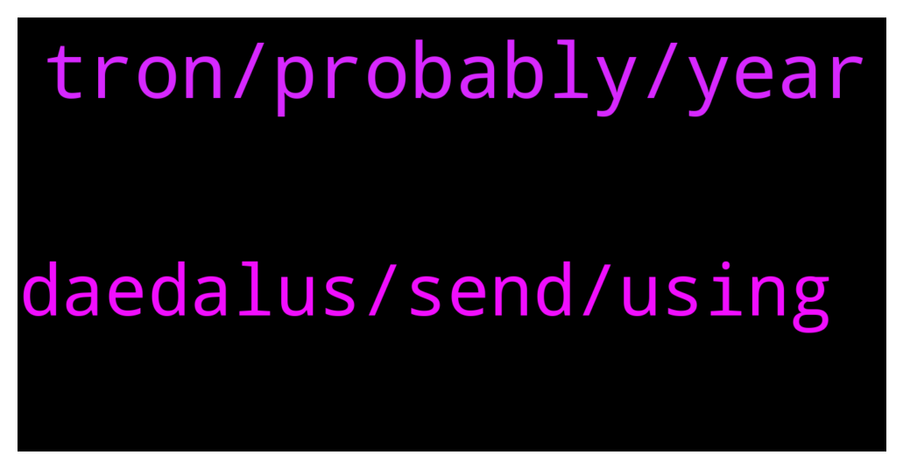

# **@Cardano**
 ## Analysis for **2021-12-27** - **2021-12-28**.

---

## 📊 **Basic Stats**

**n_messages_sent**: 51

---

---

## 🔝 **Top keywords and related messages**

1. **tron, probably, year**

    @caio --- *When this blockchain will be working?* **--->** [TG Discussion](https://t.me/Cardano/762669)

    @sozaried --- *I agree also, but probably that goes hand in hand with the passion he has for the project.  Probably a CH not caring about attacks and focusing only in developing, would be boring and uninspiring.* **--->** [TG Discussion](https://t.me/Cardano/763182)

    @Chillig. --- *means there is still time until 2023?* **--->** [TG Discussion](https://t.me/Cardano/762936)

    @Chillig. --- *and the old addresses are still supported?* **--->** [TG Discussion](https://t.me/Cardano/762912)

    @glitch04 --- *yes, it's up to developers to build their projects* **--->** [TG Discussion](https://t.me/Cardano/762683)

    @RickMcCracken --- *my estimate is about 2 years to include full voltaire with on chain governance + P2P + Hydra, just my opinion... development will continue indefinitely* **--->** [TG Discussion](https://t.me/Cardano/762694)

2. **daedalus, send, using**

    @Anasheku_CryptoBuzz --- *can I send native Ada coin from Kucoin to Yoroi wallet?* **--->** [TG Discussion](https://t.me/Cardano/763118)

    @Chillig. --- *Is this up to date ?  The Cardano blockchain has two types of addresses, according to the stage of development: Byron (legacy) addresses and Shelley addresses.  Byron addresses During the Byron era (Finished in July 2020) all addresses were one of the following:  1 Icarus-style: Starting with Ae2  2 Daedalus-style: Starting with  DdzFF Shelley addresses Since the Shelley era started, a new type of wallet was added to the system, these can support delegation and earning rewards, the Shelley-era addresses follow this:  1  Start with addr1 Only these three types are valid addresses on the Cardano Network.  Daedalus shows an error message if you input an address that is not valid (for instance, when using an address from a different network.)  Sending to Daedalus from exchanges or third party wallets When sending money to your Daedalus wallet from an exchange or third party wallet, please always be sure that:  1 You use the CARDANO NETWORK, you will lose your funds if you use a different network.  2 You copied the address from the receive tab on your wallet,  and verify that your address starts with DdzFF or addr1.   3 For an extra sense of security, you can send a small test transaction first to ensure that everything is working correctly on your exchange, once you are confident send the rest of your funds to Daedalus.* **--->** [TG Discussion](https://t.me/Cardano/762908)

    @nes585 --- *Hey guys, after I updated my trezors software, I can't send my ada from daedalus due to "exporting the public key failed" error. Anyone has experienced the same issue?* **--->** [TG Discussion](https://t.me/Cardano/762768)

    @nes585 --- *Hey George, I haven't tried to restore my wallet yet. I will give it a go. Do I need to restore my wallet from daedalus, right?* **--->** [TG Discussion](https://t.me/Cardano/762779)

    @Zyroxa --- *Yeah but there are certain functions which are not possible with the legacy wallets like staking/delegation.* **--->** [TG Discussion](https://t.me/Cardano/762914)

    @Zyroxa --- *Your coins are locked up on Binance and you arent the owner of the keys. Also Binance is offering "up to" 8% which means it can be less aswell.* **--->** [TG Discussion](https://t.me/Cardano/762923)

