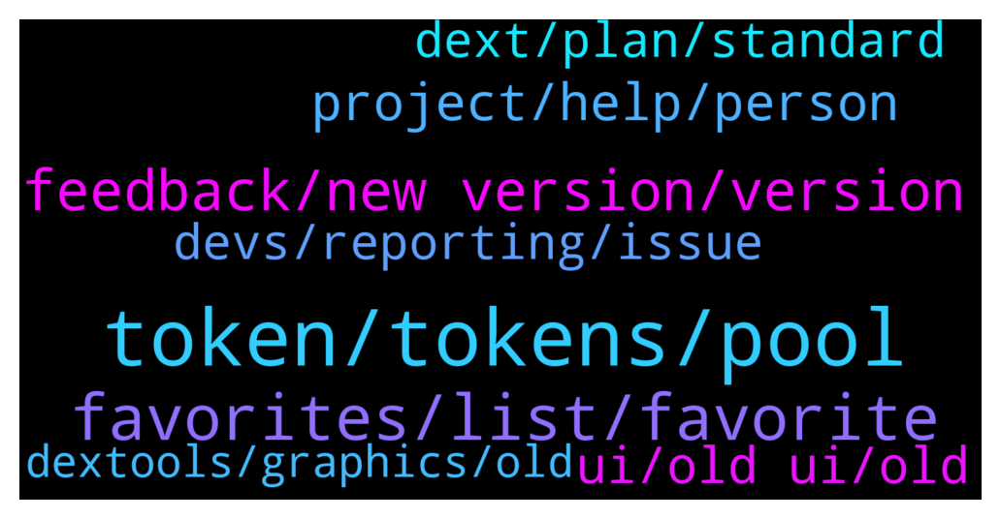

# **@DEXToolsCommunity**
 ## Analysis for **2021-12-26** - **2021-12-28**.

---

## 📊 **Basic Stats**

**n_messages_sent**: 772

---

---

## 🔝 **Top keywords and related messages**

1. **token, tokens, pool**

    @FredericDEXT --- *Same as before , at token info tab* **--->** [TG Discussion](https://t.me/DEXToolsCommunity/318154)

    @Kian_hashemi --- *Because everyone who trades has valuable seconds to check the tokens on the favorite list.  We had access to the previous version very quickly, but now we have to click a few times to be informed about the status of the tokens.  This is very bad for the trader.  I hope users think fast before their numbers dwindle.* **--->** [TG Discussion](https://t.me/DEXToolsCommunity/317746)

    @gumbercules --- *I'm not seeing a verified marking (assuming we're talking about the same token)* **--->** [TG Discussion](https://t.me/DEXToolsCommunity/319109)

    @chupapimunyenyo60 --- *Please tell me where I can find a tokens version thank you* **--->** [TG Discussion](https://t.me/DEXToolsCommunity/317215)

    @chupapimunyenyo60 --- *That doesn’t list the token version* **--->** [TG Discussion](https://t.me/DEXToolsCommunity/317225)

    @FredericDEXT --- *It's there in the token info section* **--->** [TG Discussion](https://t.me/DEXToolsCommunity/317614)

2. **favorites, list, favorite**

    @Singhdeep05050 --- *I can't remove favorites. There's a bug* **--->** [TG Discussion](https://t.me/DEXToolsCommunity/319309)

    @Kratom34 --- *Can anyone tell me how to bring up favorites to add tokens on new dextools page on mobile?* **--->** [TG Discussion](https://t.me/DEXToolsCommunity/317686)

    @stanes --- *A lot of people asked to have the percentage change for the favorites.* **--->** [TG Discussion](https://t.me/DEXToolsCommunity/317953)

    @Simon --- *Another small thing, default sort order for favourites is last added and it doesn’t remember after I change it to name* **--->** [TG Discussion](https://t.me/DEXToolsCommunity/317530)

    @Monolithof --- *At the bottom of the list, it says "Loading more favorites" but it's actually not loading it. It's non-clickable too* **--->** [TG Discussion](https://t.me/DEXToolsCommunity/318846)

    @Qboybm --- *I can't see the full list FAVORITES* **--->** [TG Discussion](https://t.me/DEXToolsCommunity/318772)

3. **feedback, new version, version**

    @napascual --- *Thanks for the feedback, it's a good point* **--->** [TG Discussion](https://t.me/DEXToolsCommunity/317458)

    @napascual --- *All the feedback it's being considered, thanks a lot for the suggestions* **--->** [TG Discussion](https://t.me/DEXToolsCommunity/318175)

    @stanes --- *Every feedback will be considered. This version is only few hours old so we need to adapt and see in the coming days/weeks what we should modify.* **--->** [TG Discussion](https://t.me/DEXToolsCommunity/317726)

    @stanes --- *No. But team is currently working on improving the new version with all the feedbacks received.* **--->** [TG Discussion](https://t.me/DEXToolsCommunity/318794)

    @chengxue8899 --- *I just studied the new version, it takes a while to adapt to it, I hope it will be more and mor useful* **--->** [TG Discussion](https://t.me/DEXToolsCommunity/317760)

    @FredericDEXT --- *It will be included in next version* **--->** [TG Discussion](https://t.me/DEXToolsCommunity/318086)

4. **project, help, person**

    @FredericDEXT --- *Feel free, real admins never DM first* **--->** [TG Discussion](https://t.me/DEXToolsCommunity/317632)

    @sunshinecrypto --- *Gosh I I asked one question in the chat and I got about three fake people messaging me pretending to be you lol   Anyway do you mind if I send you a DM? Needed some help with my dextools plz* **--->** [TG Discussion](https://t.me/DEXToolsCommunity/317623)

    @napascual --- *Could you dm me the issue?* **--->** [TG Discussion](https://t.me/DEXToolsCommunity/318222)

    @Crypto_odds --- *Hi I have DM’d the person in charge of marketing @guillermorodriguez78 can you please get back to me* **--->** [TG Discussion](https://t.me/DEXToolsCommunity/318259)

    @napascual --- *we never dm first, send your issue here* **--->** [TG Discussion](https://t.me/DEXToolsCommunity/318448)

    @sunshinecrypto --- *Thank u! I sent you a dm :)* **--->** [TG Discussion](https://t.me/DEXToolsCommunity/317633)

5. **ui, old ui, old**

    @hopiumvictim --- *Plenty of people are complaining about the new UI* **--->** [TG Discussion](https://t.me/DEXToolsCommunity/318013)

    @spfr236 --- *u guys want old UI back because you are too lazy to study new one!😂 common step out of your comfort zone and try to learn it, i bet it worth it, cause there are things that can be done with this UI which was impossible with old one😉* **--->** [TG Discussion](https://t.me/DEXToolsCommunity/317542)

    @hopiumvictim --- *Everything about the old UI was done right.* **--->** [TG Discussion](https://t.me/DEXToolsCommunity/317970)

    @hopiumvictim --- *When can we get the old UI back?* **--->** [TG Discussion](https://t.me/DEXToolsCommunity/317940)

    @PGtheGreat --- *New UI not support UNI V3?* **--->** [TG Discussion](https://t.me/DEXToolsCommunity/318091)

    @Darius5558 --- *Feel like this update has made the UI worse* **--->** [TG Discussion](https://t.me/DEXToolsCommunity/319241)

6. **devs, reporting, issue**

    @FredericDEXT --- *We can fix that thanks for reporting* **--->** [TG Discussion](https://t.me/DEXToolsCommunity/318650)

    @napascual --- *We'll think on a more handy place, it's been actively reported* **--->** [TG Discussion](https://t.me/DEXToolsCommunity/318191)

    @stanes --- *Team is aware of this issue, they are currently working on a fix.* **--->** [TG Discussion](https://t.me/DEXToolsCommunity/318773)

    @stanes --- *Will report that to the team 👍* **--->** [TG Discussion](https://t.me/DEXToolsCommunity/317687)

    @stanes --- *Ok thanks, I am reporting the issue to the devs 👍* **--->** [TG Discussion](https://t.me/DEXToolsCommunity/317718)

    @FredericDEXT --- *Yes , that was already reported and will be fixed next week* **--->** [TG Discussion](https://t.me/DEXToolsCommunity/318655)

7. **dext, plan, standard**

    @hopiumvictim --- *Not when i'm invested in DEXT* **--->** [TG Discussion](https://t.me/DEXToolsCommunity/318017)

    @FredericDEXT --- *Yes, hold 1000 dext and that's all* **--->** [TG Discussion](https://t.me/DEXToolsCommunity/318094)

    @napascual --- *Your could send more and the remaining will be linked to your account, but the DEXT need is calculated at the moment in renewing it (DEXT price at that moment)* **--->** [TG Discussion](https://t.me/DEXToolsCommunity/317360)

    @napascual --- *Yeah monthly, read message above, it's ok to send more that the monthly need, but you have to take what I explained into account* **--->** [TG Discussion](https://t.me/DEXToolsCommunity/317368)

    @melfalou --- *so i get 1000 dext on binance chain i can this for free with the standard membership?* **--->** [TG Discussion](https://t.me/DEXToolsCommunity/318088)

    @Hatice --- *Hi. I just noticed something. This didn't exist before. Is it new? Does the 2nd option have to be done every month or if I send 200 dext to the wallet once, will I have the standart plan?* **--->** [TG Discussion](https://t.me/DEXToolsCommunity/317354)

