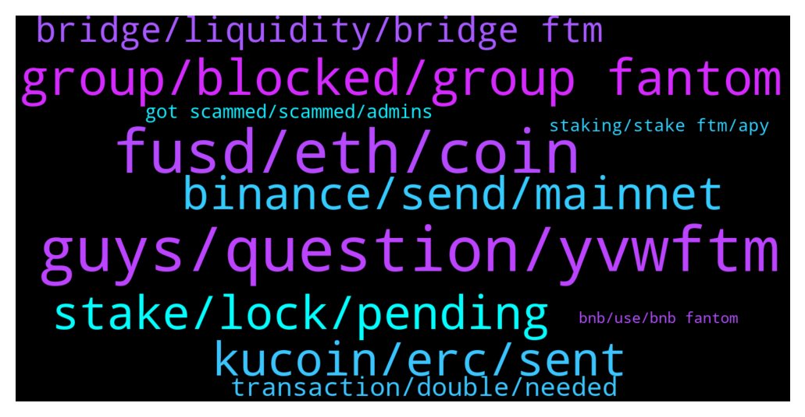

# **@Fantom_English**
 ## Analysis for **2021-12-27** - **2021-12-28**.

---

## 📊 **Basic Stats**

**n_messages_sent**: 234

---

---

## 🔝 **Top keywords and related messages**

1. **guys, question, yvwftm**

    @nooshin_shinshin --- *Ftm come down i want buy you😀😅* **--->** [TG Discussion](https://t.me/Fantom_English/617245)

    @x --- *hey guys is anyone using yearn vaults for their ftm? and also abradacadabra to borrow mim with the yvwFTM? wondering if that's safe* **--->** [TG Discussion](https://t.me/Fantom_English/617845)

    @r0m1r0m1 --- *Genuine question : do you know if it's or will be  possible in the future to be a FTM validator?* **--->** [TG Discussion](https://t.me/Fantom_English/617551)

    @x --- *so that my position yvwFTM on abracadabra doesn't get liquidated randomly* **--->** [TG Discussion](https://t.me/Fantom_English/617848)

    @sam --- *FTM is one of my favourite holdings, I got in cheap so I wasn't too pissed off.* **--->** [TG Discussion](https://t.me/Fantom_English/618013)

    @Ionuț --- *Ftm ....  stay strong !* **--->** [TG Discussion](https://t.me/Fantom_English/617973)

2. **fusd, eth, coin**

    @Shun --- *I am new to eth. The gas fees make it unusable for me. It's seriously absolute garbage in my experience* **--->** [TG Discussion](https://t.me/Fantom_English/617290)

    @Shun --- *Eth is the biggest piece of shit I have ever come across* **--->** [TG Discussion](https://t.me/Fantom_English/617287)

    @Paul --- *My favorite is ianAlexCryptoTrades, he always posts lowcap gems to buy, hot news, and market analysis, and yeah i wasn't paid for this message))* **--->** [TG Discussion](https://t.me/Fantom_English/617279)

    @HanMooKwan --- *I guess you are quite new to Crypto?* **--->** [TG Discussion](https://t.me/Fantom_English/617288)

    @pajamasfreak --- *Please understand our official channel don’t discuss price* **--->** [TG Discussion](https://t.me/Fantom_English/617229)

    @HanMooKwan --- *You will be surprised once eth 2.0 is rdy…* **--->** [TG Discussion](https://t.me/Fantom_English/617292)

3. **group, blocked, group fantom**

    @SummerWind --- *Yeap I got blocked from that group* **--->** [TG Discussion](https://t.me/Fantom_English/618027)

    @akalterssdfa --- *coz u didnt make native bridge😢* **--->** [TG Discussion](https://t.me/Fantom_English/617709)

    @Gkranz --- *Why 3 Janes are  DMing  me* **--->** [TG Discussion](https://t.me/Fantom_English/616993)

    @wongecoin --- *Is there a Korean chat room* **--->** [TG Discussion](https://t.me/Fantom_English/617139)

    @Be a layman --- *Is there a Chinese chat room* **--->** [TG Discussion](https://t.me/Fantom_English/617072)

    @MasterParrot --- *Are there AMAs hosted in this group?* **--->** [TG Discussion](https://t.me/Fantom_English/617924)

4. **stake, lock, pending**

    @VR_Lee --- *Any article how to set up Fantom in MM?* **--->** [TG Discussion](https://t.me/Fantom_English/617940)

    @Mahjid_1 --- *Can someone help me with fantom contract address on fantom network* **--->** [TG Discussion](https://t.me/Fantom_English/617756)

    @pajamasfreak --- *Look up the guide from fantombot* **--->** [TG Discussion](https://t.me/Fantom_English/617748)

    @karli770 --- *How I can stake my fantomas I mean fantoms* **--->** [TG Discussion](https://t.me/Fantom_English/617413)

    @Ed --- *How do I use Fantom bought in Gemini to stake in tomb?* **--->** [TG Discussion](https://t.me/Fantom_English/617904)

    @Mastercards777 --- *for unstake Fantom , how many day please ?* **--->** [TG Discussion](https://t.me/Fantom_English/617492)

5. **kucoin, erc, sent**

    @Derivadax2 --- *How to send avax from Metamask to Kucoin via the Fantom network* **--->** [TG Discussion](https://t.me/Fantom_English/617535)

    @slickrick6 --- *You need to contact kucoin. They are the only ones who can help you in this instance* **--->** [TG Discussion](https://t.me/Fantom_English/617510)

    @Wazzzz1 --- *Sent from Metamask ftm (fantomnetwork) to Kucoin erc network* **--->** [TG Discussion](https://t.me/Fantom_English/617507)

    @EAE999 --- *Hello everyone  I'm brand new to crypto thingy.   I sent  some Eth from Metamask address to Fantom Fwallet . Transaction  completed as metamask said , but nothing showing in Fwallet* **--->** [TG Discussion](https://t.me/Fantom_English/617040)

    @slickrick6 --- *You sent fantom network to kucoin MetaMask erc 20?* **--->** [TG Discussion](https://t.me/Fantom_English/617505)

    @Wazzzz1 --- *Hello guys, need help. Deposited from metamask Ftm to kucoin ercnetwork. How do I retrieve it?* **--->** [TG Discussion](https://t.me/Fantom_English/617501)

6. **binance, send, mainnet**

    @teguh213 --- *where can i buy ftm and withdraw With fatom network..while binance no fatom network to withdraw* **--->** [TG Discussion](https://t.me/Fantom_English/616882)

    @HanMooKwan --- *impossible… go on binance spot wallet, choose matic, choose deposit, choose polygon network, copy deposit address* **--->** [TG Discussion](https://t.me/Fantom_English/617575)

    @Mcjig --- *see if anyswap does bep2, not sure if its bep2 or 20. you can also send to binance and just withdraw mainnet* **--->** [TG Discussion](https://t.me/Fantom_English/617622)

    @bymat21 --- *how to change i couldn't see matic-usdc pair anywhere* **--->** [TG Discussion](https://t.me/Fantom_English/617572)

    @ben --- *can you send usdt at fantom wallet to binance usdt bep20?* **--->** [TG Discussion](https://t.me/Fantom_English/617338)

    @HanMooKwan --- *why you don‘t trade them into usdc, send to binance and from there via binance mainnet to ftm opera?* **--->** [TG Discussion](https://t.me/Fantom_English/617570)

7. **bridge, liquidity, bridge ftm**

    @akalterssdfa --- *why ftm native bridge isnt healthy?* **--->** [TG Discussion](https://t.me/Fantom_English/617712)

    @bymat21 --- *i will try it too.  Do you have any bridge suggestions?* **--->** [TG Discussion](https://t.me/Fantom_English/617576)

    @pajamasfreak --- *There is no sense if you keep expecting from foundation while anyswap is 3rd party* **--->** [TG Discussion](https://t.me/Fantom_English/617698)

    @Janevietani --- *Because  FTX only support  erc20 FTM so you need to bridge it if you wanna have it as Opera FTM* **--->** [TG Discussion](https://t.me/Fantom_English/617992)

    @akalterssdfa --- *as i said, swapping isnt an option, so i have to wait for mercy from gods, so that someone adds liquidity and i can transfer ftm to NATIVE chain?* **--->** [TG Discussion](https://t.me/Fantom_English/617707)

    @Janevietani --- *there is 5 million on multichain.xyz bridge   Multichain https://ftmscan.com/address/0xE3e0C14bbCBF86b3Ff60E8666C070d34b84F3f73* **--->** [TG Discussion](https://t.me/Fantom_English/617713)

8. **transaction, double, needed**

    @Johnnyfantom --- *Overdrive was started and stopped. It was a post to earn project. I will find out what is happening with it.* **--->** [TG Discussion](https://t.me/Fantom_English/617454)

    @pajamasfreak --- *Try again later when gas lower a bit* **--->** [TG Discussion](https://t.me/Fantom_English/617705)

    @pensiun --- *got it just push the same nuance for stuck transaction* **--->** [TG Discussion](https://t.me/Fantom_English/617155)

    @pensiun --- *because of that i cannot do other transaction* **--->** [TG Discussion](https://t.me/Fantom_English/617147)

    @pensiun --- *i was created a lp and it finished but double transaction first one still waiting* **--->** [TG Discussion](https://t.me/Fantom_English/617146)

    @pensiun --- *how much needed to cancel if one transaction double and stuck* **--->** [TG Discussion](https://t.me/Fantom_English/617145)

9. **got scammed, scammed, admins**

    @sam --- *I got scammed a few days ago, not as much as you but 1300 FTM. there is another FTM Foundation group on telegram and there's 40,000 members or bots who knows 😂* **--->** [TG Discussion](https://t.me/Fantom_English/618005)

    @SummerWind --- *Any possible way to report the other fantom group?got scammed for being greedy but thought should raise awareness* **--->** [TG Discussion](https://t.me/Fantom_English/617879)

    @Wazzzz1 --- *Need help here due scammers trying to dm* **--->** [TG Discussion](https://t.me/Fantom_English/617502)

    @Fina --- *Some just clone himself as the admin and try to scam me* **--->** [TG Discussion](https://t.me/Fantom_English/617160)

    @Ziga --- *Admins wont dm you, if anyone messages you in private it's a scam* **--->** [TG Discussion](https://t.me/Fantom_English/617044)

    @slickrick6 --- *Admins will never contact you first* **--->** [TG Discussion](https://t.me/Fantom_English/617001)

10. **staking, stake ftm, apy**

    @okdecoin --- *How can I see the APY when I am choosing a validator?* **--->** [TG Discussion](https://t.me/Fantom_English/617797)

    @Fjody --- *Use Famtom's PWA wallet and mainnet FTM for staking.  Use Metamask and mainnet FTM for DeFi like farming etc.* **--->** [TG Discussion](https://t.me/Fantom_English/617439)

    @Fjody --- *If you want to stake FTM, you need to have mainnet FTM, not tokens.* **--->** [TG Discussion](https://t.me/Fantom_English/617438)

    @Shaynetbolt1 --- *Hello good morning pls where can I stake ftm for good apy* **--->** [TG Discussion](https://t.me/Fantom_English/617163)

    @hirakusan --- *where the best staking FTM ?* **--->** [TG Discussion](https://t.me/Fantom_English/617069)

    @JD --- *What is the max staking APY I can earn? It looks like around 13% or almost 14%?* **--->** [TG Discussion](https://t.me/Fantom_English/616922)

