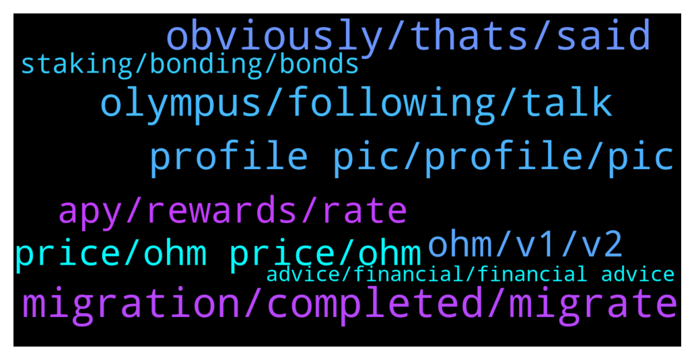

# **@OlympusTG**
 ## Analysis for **2021-12-27** - **2021-12-28**.

---

## 📊 **Basic Stats**

**n_messages_sent**: 606

---

---

## 🔝 **Top keywords and related messages**

1. **migration, completed, migrate**

    @amkuo --- *where can i see document related this migration? whats is the purpose for this migration* **--->** [TG Discussion](https://t.me/OlympusTG/136120)

    @RichR7 --- *Check out this article about the migration where you will be able to solve most of your questions https://olympusdao.medium.com/get-ready-for-olympus-v2-migration-360764a61168* **--->** [TG Discussion](https://t.me/OlympusTG/135628)

    @knisaci --- *When is launch expected to be completed? Thanks* **--->** [TG Discussion](https://t.me/OlympusTG/135264)

    @Farshid --- *Hello, has the migration been complete ? The numbers are way off* **--->** [TG Discussion](https://t.me/OlympusTG/136423)

    @stacyd82d --- *Any update on when migration will be complete* **--->** [TG Discussion](https://t.me/OlympusTG/136051)

    @nfwaple --- *no definite date, soon. You can already migrate now* **--->** [TG Discussion](https://t.me/OlympusTG/135265)

2. **obviously, thats, said**

    @theMagicUnicorn --- *Shogun my brother how are you 🐸* **--->** [TG Discussion](https://t.me/OlympusTG/135893)

    @scapiia --- *lol this doesnt answer my question* **--->** [TG Discussion](https://t.me/OlympusTG/136131)

    @MrEightBall --- *Yeah but they always say that so i thought it would be in place here😂* **--->** [TG Discussion](https://t.me/OlympusTG/135322)

    @nfwaple --- *just get the fuck out of here* **--->** [TG Discussion](https://t.me/OlympusTG/135496)

    @Tom --- *You’re not wrong but it’s unnecessary conversation.* **--->** [TG Discussion](https://t.me/OlympusTG/135416)

    @theMagicUnicorn --- *really thats all you have to say* **--->** [TG Discussion](https://t.me/OlympusTG/135330)

3. **olympus, following, talk**

    @gettinggrowth --- *Hey! Who is the official representative of Olympus?* **--->** [TG Discussion](https://t.me/OlympusTG/135679)

    @gettinggrowth --- *Sure. I'd like to know if someone is working on bridging Olympus from ETH to something else as well for more optimal trading experience?* **--->** [TG Discussion](https://t.me/OlympusTG/135683)

    @cryptosmyptos --- *can i buy olympus with bsc?* **--->** [TG Discussion](https://t.me/OlympusTG/135699)

    @Kaosi_Promise --- *Is that what I will be needing to stake on olympus dao? gOHM?* **--->** [TG Discussion](https://t.me/OlympusTG/136150)

    @A_imen --- *I want to buy and store ohm(Olympus)* **--->** [TG Discussion](https://t.me/OlympusTG/135986)

    @Dean --- *Nah olympus is the daddy 😃* **--->** [TG Discussion](https://t.me/OlympusTG/135769)

4. **profile pic, profile, pic**

    @Andrew55450 --- *@theMagicUnicorn kindly reply inbox please boss* **--->** [TG Discussion](https://t.me/OlympusTG/135478)

    @Privabit --- *Can you direct me to that guide?* **--->** [TG Discussion](https://t.me/OlympusTG/135565)

    @nfwaple --- *ask your specific question here thanks* **--->** [TG Discussion](https://t.me/OlympusTG/135680)

    @eatsandtravels --- *I’d show screenshot but can’t haha* **--->** [TG Discussion](https://t.me/OlympusTG/136351)

    @nfwaple --- *Have u been banned before? If not try desktop and change profile pic* **--->** [TG Discussion](https://t.me/OlympusTG/136121)

    @sivasden --- *Thanks and blocked it   Now scams more active than us* **--->** [TG Discussion](https://t.me/OlympusTG/136378)

5. **ohm, v1, v2**

    @S --- *hola hello !!! if i buy ohm now in a exchange or uni is the migrated version already ?* **--->** [TG Discussion](https://t.me/OlympusTG/135734)

    @Kred88 --- *for each OHM u migrate, u lost 50$.  I migrate 100 OHM of the value of 434$ to 100 OHM of the value of 385$* **--->** [TG Discussion](https://t.me/OlympusTG/135910)

    @G --- *Why is the price of ohm v2 lower than v1* **--->** [TG Discussion](https://t.me/OlympusTG/135178)

    @Whynotbit --- *So, wait, you made 10 ohm along the way by doing arbitrage, but still complaining that the migration is making you lose money.  I'm not sure I understand you here.* **--->** [TG Discussion](https://t.me/OlympusTG/135922)

    @Kred88 --- *why OHm v1 value is 434.05 $ and OHM v2 value is 385.45$ ?* **--->** [TG Discussion](https://t.me/OlympusTG/135899)

    @Nostress04 --- *Ohm v1 costs more because the price accounts for missed rebases, that you would get by converting to v2.. You would get more of sOhm v2.  It will not be 1:1* **--->** [TG Discussion](https://t.me/OlympusTG/135966)

6. **apy, rewards, rate**

    @amkuo --- *can you explain halving the APY please, not so familair about it* **--->** [TG Discussion](https://t.me/OlympusTG/136399)

    @cryptosmyptos --- *what is the actual correct apy as the pinned message says its wrong* **--->** [TG Discussion](https://t.me/OlympusTG/135694)

    @Arthur --- *Hey, Ive a stupid question, but when the APY indicates 6000%, does it mean you're supposed to wait one full year to earn it?* **--->** [TG Discussion](https://t.me/OlympusTG/135724)

    @JM --- *The yield payment at every rebase is what dictates the APY.* **--->** [TG Discussion](https://t.me/OlympusTG/135365)

    @JayJayJayMa --- *Oh no! Just 1000% APY. Lets panic sell. 🤣* **--->** [TG Discussion](https://t.me/OlympusTG/136068)

    @kaezer --- *But apy is correct so ill give it a go with a small amount and see how it goes i guess* **--->** [TG Discussion](https://t.me/OlympusTG/135368)

7. **price, ohm price, ohm**

    @RichR7 --- *You are missing OHM's price is going down.* **--->** [TG Discussion](https://t.me/OlympusTG/136099)

    @kevalbaba --- *How reliable is the price of ohm on the app? I am looking at an aggregator and the average price from various sources comes to ~420* **--->** [TG Discussion](https://t.me/OlympusTG/136018)

    @Ahmad --- *Just wondering, why does Ohm price keep dropping? Are people selling?* **--->** [TG Discussion](https://t.me/OlympusTG/135785)

    @Enjoytaira --- *Why price down if market is quiet days ago?* **--->** [TG Discussion](https://t.me/OlympusTG/135582)

    @Legislative_Justice --- *Why should I buy ohm instead of time? Looking to invest 25k* **--->** [TG Discussion](https://t.me/OlympusTG/135313)

    @sticks_na_beany --- *Why is the price on blockfolio completely different to the actual price* **--->** [TG Discussion](https://t.me/OlympusTG/135726)

8. **staking, bonding, bonds**

    @Adrian --- *So people with millions don't get millions of ohm from staking (some of which they sell). Just a thought, seemed progressive/democratic to lessen the influence of the few wealthy.* **--->** [TG Discussion](https://t.me/OlympusTG/136331)

    @Irnweirdo --- *however with bonding you get 4.8% and you funds is lock and hope the market not crash withing 5 day period* **--->** [TG Discussion](https://t.me/OlympusTG/135655)

    @FLankarooo --- *Let’s just say that we consider bonders as simpletons ( arbitragers ) assuming they will turn around 5 days from now and Sellit. That being said with bonds V2 OHM will be autostaked for the 5 days* **--->** [TG Discussion](https://t.me/OlympusTG/135650)

    @FLankarooo --- *Are you familiar with how bonds work ? 😁* **--->** [TG Discussion](https://t.me/OlympusTG/135647)

    @Irnweirdo --- *now bonding for frax is 4.86 and buying and staking immediately is 5.52 for 5 days ROI* **--->** [TG Discussion](https://t.me/OlympusTG/135646)

    @Irnweirdo --- *SO why some one incentivize to do bonding when he can get more by buying OHM and staking immediately* **--->** [TG Discussion](https://t.me/OlympusTG/135648)

