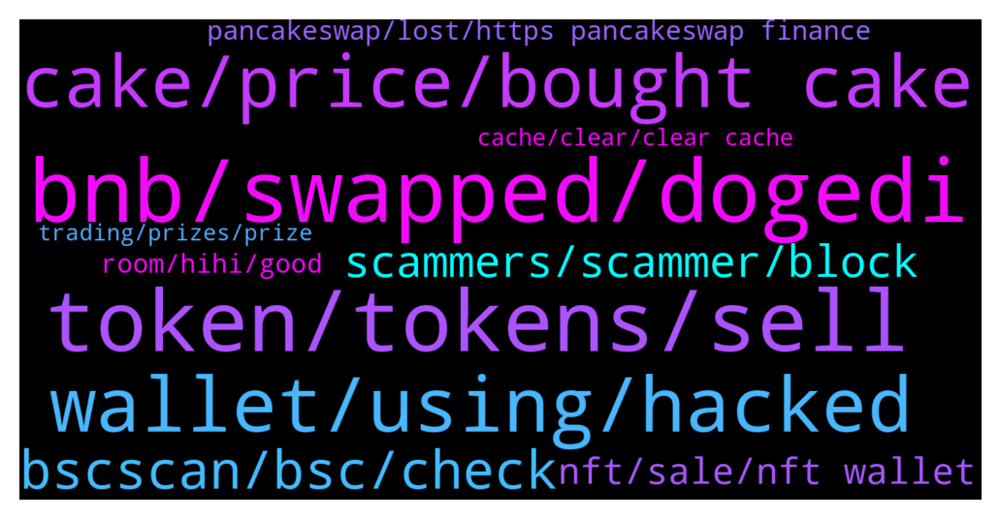

# **@PancakeSwap**
 ## Analysis for **2021-12-27** - **2021-12-28**.

---

## 📊 **Basic Stats**

**n_messages_sent**: 1295

---

---

## 🔝 **Top keywords and related messages**

1. **bnb, swapped, dogedi**

    @SecuestPcs --- *Check internal txns. You have bnb* **--->** [TG Discussion](https://t.me/PancakeSwap/2227141)

    @SecuestPcs --- *You transferred your bnb to other adress.* **--->** [TG Discussion](https://t.me/PancakeSwap/2227118)

    @HAITIENLK --- *https://bscscan.com/tx/0x96f4b775aff348ef49a543200548c1f9f0d89504dea6f36bd39ccc85fdc1d527  —> you transfer 0.019 bnb 1day ago* **--->** [TG Discussion](https://t.me/PancakeSwap/2228304)

    @Yuvraj0786 --- *Seriously I swapped bnb to dogedi* **--->** [TG Discussion](https://t.me/PancakeSwap/2227099)

    @TomorrowlandForLife --- *your BNB went to your wallet and it's been added to your BNB Balance* **--->** [TG Discussion](https://t.me/PancakeSwap/2227264)

    @HAITIENLK --- *bnb transfer in your wallet bro* **--->** [TG Discussion](https://t.me/PancakeSwap/2228298)

2. **token, tokens, sell**

    @CoinTosser --- *Yes ! I Transfered it from my TRUST Wallet to my METAMASK….  Is the coin LEDGIT ?  Please tell me how to sell or swap it.  Thank you so much* **--->** [TG Discussion](https://t.me/PancakeSwap/2228370)

    @HAITIENLK --- *The transaction is successful, the token has been in your wallet. please add the token to your wallet* **--->** [TG Discussion](https://t.me/PancakeSwap/2228122)

    @ninahaus --- *Which token did you sell? You don’t need to try posting TX hash, it’s deleted by combot but I already have… looks like very unique TX…usually they don’t have 51 logs.* **--->** [TG Discussion](https://t.me/PancakeSwap/2228057)

    @iamcryptokeeper --- *i need help with my token, o one can buy or sell after the migration to v2* **--->** [TG Discussion](https://t.me/PancakeSwap/2224668)

    @CoinTosser --- *It’s super sad …… I thought when I buy it on PCS I ll be able to sell it as well in a normal way……  If you have any other idea how I could SWAP or SELL it PLEASE tell me everything about it - even the smallest hint could help.  Thank you for your Time   Wolfgang* **--->** [TG Discussion](https://t.me/PancakeSwap/2228444)

    @Therealcrypto6 --- *I sold my tokens and the money does not appear in my wallet* **--->** [TG Discussion](https://t.me/PancakeSwap/2228045)

3. **wallet, using, hacked**

    @monksofstockmarket1 --- *Bro someone hacked my trust wallet account and wiped all my money* **--->** [TG Discussion](https://t.me/PancakeSwap/2226525)

    @kikmf --- *Metamask should fix the issue with wallet syncing, it's pathetic when using on multiple system* **--->** [TG Discussion](https://t.me/PancakeSwap/2228473)

    @HAITIENLK --- *Please explain your issue in detail and as clearly as possible - we can’t read your mind. ⁃ Which wallet are you using? ⁃ Which type of device are you using? ⁃ Which browser are you using? ⁃ What exactly do you need assistance for? ⁃ What error are you getting?* **--->** [TG Discussion](https://t.me/PancakeSwap/2228257)

    @Nicaragua --- *Is it possible to put it on a hardware wallet or to move it to a platform?* **--->** [TG Discussion](https://t.me/PancakeSwap/2225112)

    @HAITIENLK --- *I don't know if your wallet is hacked or not. I just give some guidelines based on my experience. https://t.me/PancakeSwap/2227717* **--->** [TG Discussion](https://t.me/PancakeSwap/2227766)

    @QV_zz --- *Sounds like your wallet has been compromised, nothing we can do im afraid* **--->** [TG Discussion](https://t.me/PancakeSwap/2225161)

4. **cake, price, bought cake**

    @Xmrburns --- *Look that ils not cake wrapped or som* **--->** [TG Discussion](https://t.me/PancakeSwap/2229076)

    @wiqileaks --- *It doesn’t make even 5% even bro, im holding many cakes since it was $2 and also kept buying at $35, $37* **--->** [TG Discussion](https://t.me/PancakeSwap/2225500)

    @CakeCompounder --- *Cake price go up in future but Samet still cry* **--->** [TG Discussion](https://t.me/PancakeSwap/2226795)

    @Saddedm61 --- *Sir, you must have about 13816 CAKES to earn that much… not certain everyone can get so many… 🤷🏻* **--->** [TG Discussion](https://t.me/PancakeSwap/2226227)

    @TraminerCrypto --- *Guys cake at 12 could be a good entry?* **--->** [TG Discussion](https://t.me/PancakeSwap/2226212)

    @samettkoc --- *Sushi go up but cake price kill us* **--->** [TG Discussion](https://t.me/PancakeSwap/2226793)

5. **bscscan, bsc, check**

    @Mat --- *Hello guys, I have a problem. I've lost all my Pancakes. When I look up bscscan, I see multiple transactions that I'm unaware of, made 22 days ago, and a transfer to another account. What should I do? Any help is appreciated, please* **--->** [TG Discussion](https://t.me/PancakeSwap/2225016)

    @rpoole69 --- *Also make sure you are on the BSC Mainnet network and not ETH* **--->** [TG Discussion](https://t.me/PancakeSwap/2228375)

    @Ceddi200 --- *Bro it’s simple. They claim via bscscan.com soon you will be able to claim from front end* **--->** [TG Discussion](https://t.me/PancakeSwap/2226281)

    @Regie --- *Hi! I checked my transactions in Bscscan. I have 2 claims, the 1st one was successful but the other one has error, it says "error in Txn: execution reverted".* **--->** [TG Discussion](https://t.me/PancakeSwap/2225353)

    @HAITIENLK --- *How to check history rounds you played? 1. Go to BscScan page of Prediction contract. 2. Scroll down to “8. getUserRounds”. 3. Type in your wallet address under “user(address)”. 4. Set “cursor(uint256)" to 0 and “size(uint256)" to 1000. 5. Tap “Query” 6. Rounds you entered will show below in the first row. (after “uint256[]:”)  How to check if a round is claimable? 1. Scroll down to “4. claimable”. 2. Type in the round id you want to check under "epoch(uint256)”. 3. Type in your wallet address under “user(address)”. 4. Tap “Query” 5. If a round is claimable, it will show “true”. 6. Note: ⬆️ If you saw a round returns "false", yet it shows on the UI, it's most likely has been claimed already.  How to claim? 1. Go to BscScan page of Prediction contract. 2. Tap “🔴 Connect to Web3” 3. Use MetaMask or WalletConnect to connect. 4. Scroll down to “3. claim” 5. Type in round number you want to claim in an array format. Put round numbers within [] and separate them with “,” 6. Tap “Write” 7. Confirm on wallet* **--->** [TG Discussion](https://t.me/PancakeSwap/2225318)

    @TomorrowlandForLife --- *yes you can check this information on the bscscan.com* **--->** [TG Discussion](https://t.me/PancakeSwap/2225102)

6. **scammers, scammer, block**

    @King'ori --- *There r soooo many scammers in here. The moment u post your issue, they are all over your inbox, texting and calling pretending to offer assistance. A majority of them from one specific country.* **--->** [TG Discussion](https://t.me/PancakeSwap/2226865)

    @eREKT10n --- *Hello, I joined this group and got spammed 10 or so help messages from scammers LOL* **--->** [TG Discussion](https://t.me/PancakeSwap/2228947)

    @ninahaus --- *I don’t get what you mean?  and please do not post same contents multiple times, you could be identified as a spammer.* **--->** [TG Discussion](https://t.me/PancakeSwap/2228043)

    @kikmf --- *Don't waste your precious time, 'Report Spam and Block'* **--->** [TG Discussion](https://t.me/PancakeSwap/2228146)

    @daddycom --- *Scammer blocked them all and report* **--->** [TG Discussion](https://t.me/PancakeSwap/2226817)

    @Hamed7760 --- *Hi Please block this address. The owner is a scammer and does not allow withdrawals  0x50a30bd135283f68c82b345897a2ea2eca15dfbe* **--->** [TG Discussion](https://t.me/PancakeSwap/2226037)

7. **nft, sale, nft wallet**

    @Godbabybeby --- *I have 5 NFT on my trust wallet but I can see it on collectable* **--->** [TG Discussion](https://t.me/PancakeSwap/2226545)

    @TomorrowlandForLife --- *your NFT is in your wallet* **--->** [TG Discussion](https://t.me/PancakeSwap/2225071)

    @Nicaragua --- *I cannot see where the nft is gone* **--->** [TG Discussion](https://t.me/PancakeSwap/2225670)

    @bysoulh --- *I put my admin nft on sale but it disappeared from my wallet. how can i check this* **--->** [TG Discussion](https://t.me/PancakeSwap/2226315)

    @Nicaragua --- *Thank you, i saw it ,now this nft is in my wallet?* **--->** [TG Discussion](https://t.me/PancakeSwap/2225100)

    @dockters --- *ur NFT already send to other address about 1 hour ago* **--->** [TG Discussion](https://t.me/PancakeSwap/2225673)

8. **pancakeswap, lost, https pancakeswap finance**

    @Utipmfon --- *Pls help admin, I lost my assets yesterday on pancakeswap. I didn’t do those transactions* **--->** [TG Discussion](https://t.me/PancakeSwap/2225157)

    @Renars --- *Last chance can someone explain why i cant set up name on pancake swap? Unexspected token A in JSON at position0* **--->** [TG Discussion](https://t.me/PancakeSwap/2228685)

    @Clãs --- *Hey, I have my pancake coins in crypto.com then I have to move them out from it to connect to pancakeswap?* **--->** [TG Discussion](https://t.me/PancakeSwap/2228310)

    @iamcryptokeeper --- *0x4aad6a01068c2621545d087a3c5281837112585b   these problems started christmas night after pancakeswaps indexing upgrades* **--->** [TG Discussion](https://t.me/PancakeSwap/2224683)

    @scrumba --- *From your wallet, click on Dapp, you should see pancakeswap from the list of menus* **--->** [TG Discussion](https://t.me/PancakeSwap/2224921)

    @Yuvraj0786 --- *Any solution seriously I swapped in pancakeswap* **--->** [TG Discussion](https://t.me/PancakeSwap/2227114)

9. **room, hihi, good**

    @Hodlersclub --- *Yeah man you both were very supportive.❤️* **--->** [TG Discussion](https://t.me/PancakeSwap/2224639)

    @HarrisonPP44 --- *Look for better things to do* **--->** [TG Discussion](https://t.me/PancakeSwap/2227070)

    @Hodlersclub --- *Guys you saved my ass thanks for your warm support I'll never forget your help ❤️* **--->** [TG Discussion](https://t.me/PancakeSwap/2224631)

    @forc3r --- *You both aren't early adopters so forgot it* **--->** [TG Discussion](https://t.me/PancakeSwap/2228914)

    @Ray --- *So I'm not the only one?* **--->** [TG Discussion](https://t.me/PancakeSwap/2228050)

    @Karthik --- *Lol.. there is nothing we can do 🙃🙃* **--->** [TG Discussion](https://t.me/PancakeSwap/2226158)

10. **cache, clear, clear cache**

    @sandypepedontdmfirst --- *Had same issue yesterday just got mine sort out* **--->** [TG Discussion](https://t.me/PancakeSwap/2224881)

    @ctellyc --- *try change the url to   https://bsc-dataseed.binance.org/* **--->** [TG Discussion](https://t.me/PancakeSwap/2227837)

    @gursewak2006 --- *Ok i tried again it’s working now* **--->** [TG Discussion](https://t.me/PancakeSwap/2224560)

    @King'ori --- *It worked. Thanks a lot 🙏🏿🙏🏿🙏🏿* **--->** [TG Discussion](https://t.me/PancakeSwap/2226860)

    @TomorrowlandForLife --- *clear cache or try from a different device or a different internet connection* **--->** [TG Discussion](https://t.me/PancakeSwap/2224825)

    @sandypepedontdmfirst --- *Clear the cache and try again* **--->** [TG Discussion](https://t.me/PancakeSwap/2224863)

