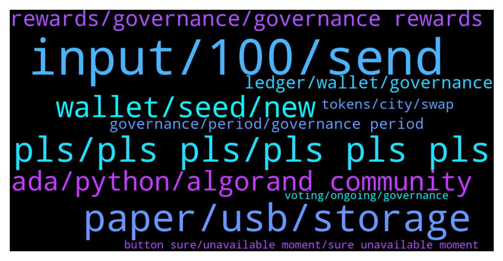

# **@algorand**
 ## Analysis for **2021-12-27** - **2021-12-28**.

---

## 📊 **Basic Stats**

**n_messages_sent**: 418

---

---

## 🔝 **Top keywords and related messages**

1. **input, 100, send**

    @idontknowwhattouseforusername --- *hello, algorand wallet team, there is one issue, when sending out ALGOs, one has to input a number, right, the input area by default has way too many trailing zeros, e.g.  if you input 100, the actual input becomes 0.0001  to send 100 algos, you have to input 100000000   please fix this, thanks.* **--->** [TG Discussion](https://t.me/algorand/326571)

    @idontknowwhattouseforusername --- *so from wikipedia:  Traditionally, English-speaking countries employed commas as the delimiter – 10,000 – and other European countries employed periods or spaces: 10.000 or 10000.* **--->** [TG Discussion](https://t.me/algorand/326669)

    @Tiny_Philosopher_784 --- *So you can only send 3.1 out of the wallet* **--->** [TG Discussion](https://t.me/algorand/326315)

    @hope9999999 --- *Eight 0 after dot is normal on exchanges. Remember this is token that currently equal to aprx $1 and it’s not real dollar which equal to 100 cents.* **--->** [TG Discussion](https://t.me/algorand/326585)

    @idontknowwhattouseforusername --- *i think i am very clear on the issue.   1. when you input the amount of algo, the keyboard pops up, the keyboard has only 0-9 and a delete button, no "DOT"  2. if you want to send 100, you have to type 10000000  3. if you want to send 100.5, you have to type 100500000  4. if you want to send 103.45, well, try that. i don't know how to ..  5. if you want to send 50.001, as @xM3Dx said, then try that ... i don't know how to ...* **--->** [TG Discussion](https://t.me/algorand/326629)

    @idontknowwhattouseforusername --- *even so, i don't think it is a good idea to set a 0.00000000 by default, if one needs to input like 100.123456 they do that in a human way. not by some default settings* **--->** [TG Discussion](https://t.me/algorand/326595)

2. **paper, usb, storage**

    @patrick_crypto --- *for funds that you would consider critical - the key should never be stored digitally - basically ever. no photos, nothing.* **--->** [TG Discussion](https://t.me/algorand/326505)

    @hope9999999 --- *I often change phrase position only i know how to arrange positions so that i never worry about whether i store it on paper or in my usb. 😂😂😂* **--->** [TG Discussion](https://t.me/algorand/326447)

    @patrick_crypto --- *there are numerous examples of people doing something like this (or variations) only to later forget their password or secret trick… don’t overestimate your memory* **--->** [TG Discussion](https://t.me/algorand/326463)

    @hope9999999 --- *😗😗😗 in some hard situation like flood, volcano, will you run asap or you try to find your metal plate? 🤪🤪🤪* **--->** [TG Discussion](https://t.me/algorand/326504)

    @Martin --- *Hey community , I was wondering if there is any way of increasing the privacy of an account? Cause at the moment everyone can know what assets are being moved from and into an account, right?* **--->** [TG Discussion](https://t.me/algorand/327023)

    @MackDenver --- *That's why it is decentralized, and Algorand blockchain is already secure. Others can see what you are transferring but nobody will know who is transferring.* **--->** [TG Discussion](https://t.me/algorand/327029)

3. **pls, pls pls, pls pls pls**

    @MackDenver --- *You can reach out to our discord about it  https://discord.com/invite/Pe8rwyPvKp* **--->** [TG Discussion](https://t.me/algorand/327091)

    @Carlos --- *I am looking forward to help on Algorand vision here in Spain. I would like to know if there is someone on the team that I could talk to* **--->** [TG Discussion](https://t.me/algorand/327080)

    @Lord_Shin_Chan_2_O --- *@MackDenver sir... Why you avoiding my messages...?🤕* **--->** [TG Discussion](https://t.me/algorand/327012)

    @hope9999999 --- *I mean you request stupid order 😂😂😂* **--->** [TG Discussion](https://t.me/algorand/326578)

    @MackDenver --- *We are always hearing your feedback and looking to improve the user experience* **--->** [TG Discussion](https://t.me/algorand/326596)

    @Leonidas_Agiad --- *@patrick_crypto while you at let me in to lol* **--->** [TG Discussion](https://t.me/algorand/326746)

4. **wallet, seed, new**

    @NightAlgorand --- *If you enter the exact seed, I am sure there will be no problem with that.* **--->** [TG Discussion](https://t.me/algorand/326905)

    @DayanJ4 --- *admin I can not log in to my wallet .I have screenshot about my 25 seeds .but after enter my seeds .it was wrong .please help me* **--->** [TG Discussion](https://t.me/algorand/326903)

    @wumbu --- *someone can help me? my pharse has the word riffle, but when i recover it riffle is not allowed. i can't recover my algo wallet* **--->** [TG Discussion](https://t.me/algorand/327005)

    @patrick_crypto --- *haven’t checked lately if it’s been updated but somebody did some nice tests on seed storage solutions: https://jlopp.github.io/metal-bitcoin-storage-reviews/* **--->** [TG Discussion](https://t.me/algorand/326523)

    @wumbu --- *yes i do, note the seed/pharse correctly* **--->** [TG Discussion](https://t.me/algorand/327009)

    @NightAlgorand --- *The key is your seed. If you can't get through, I suppose you wrongly enter the seeds.* **--->** [TG Discussion](https://t.me/algorand/326909)

5. **ada, python, algorand community**

    @KAPIBAYSIDE --- *Explain how I really like both but algo at the moment has more I can do.. USECASES* **--->** [TG Discussion](https://t.me/algorand/326782)

    @NightAlgorand --- *Algo is definitely better than ADA.* **--->** [TG Discussion](https://t.me/algorand/326780)

    @Martin --- *I am not saying anything against Algo (I love Algorand), I am just trying to figure out if things are as I am imaging them or not…* **--->** [TG Discussion](https://t.me/algorand/327041)

    @Umesh --- *Ada is better than algo ?* **--->** [TG Discussion](https://t.me/algorand/326778)

    @KKM --- *Anyone know how web Algo optimizer works?* **--->** [TG Discussion](https://t.me/algorand/327090)

    @NightAlgorand --- *Check out this link for all project built on Algorand https://www.algorand.com/ecosystem/use-cases* **--->** [TG Discussion](https://t.me/algorand/326867)

6. **rewards, governance, governance rewards**

    @MackDenver --- *Hey Gourab,  Governance rewards will be distributed in Q3 of 2022.* **--->** [TG Discussion](https://t.me/algorand/326734)

    @mcmaxims --- *6k per period? thats too much I assume around 1k algo per 30k committed algo per period* **--->** [TG Discussion](https://t.me/algorand/327120)

    @Arasconsult1 --- *how can i stake my algo* **--->** [TG Discussion](https://t.me/algorand/326919)

    @AbuRidwan16 --- *Hi folks!  How many % is the rewards for staking algo?* **--->** [TG Discussion](https://t.me/algorand/327099)

    @MackDenver --- *Hello Lucid, I have already answered it. Please check the rewards FAQ to get better understanding.   https://algorand.foundation/faq#participation-rewards-* **--->** [TG Discussion](https://t.me/algorand/327014)

    @Crypt0Playa --- *I subscribed about ~33K Algo and the MyAlgoWallet Governance portal says estimated rewards to be just shy of 6000 tokens. Is this right or an error in the portal?* **--->** [TG Discussion](https://t.me/algorand/327119)

7. **ledger, wallet, governance**

    @TheSondler --- *I have ally ALGOs on my Ledger Nano S. As i seen there in no chance to connect my Wallet-ID with the Governance Programm, because Ladger don't support note section. Also the offical algorand wallet don't support the Nano S :-(* **--->** [TG Discussion](https://t.me/algorand/326713)

    @khunpon --- *Now I had 2 address on ledger One for yieldly Another for this governance #2* **--->** [TG Discussion](https://t.me/algorand/326374)

    @Chris --- *So, If i have lets say 250 algo in my ledger could i gov' with that and then when my other algo gets free, could i gov' with the rest or is it just the "first time" amount you could only subscribe to gov' like you cant just add on to it?* **--->** [TG Discussion](https://t.me/algorand/326392)

    @Chris --- *so quick question, before i subscribe; if i connected my ledger to myalgowallet, and then decide to subscribe to the governance, do my algos from my ledger get taken out( not planning to remove any algo)* **--->** [TG Discussion](https://t.me/algorand/326371)

    @get_rekt_noob --- *I’m confused. When I search the list of eligible governors, my wallet is no longer listed there, despite the fact it was there for the first period.* **--->** [TG Discussion](https://t.me/algorand/326558)

    @Atbash1984 --- *So it is necessary to create a new wallet to go for the governance program?* **--->** [TG Discussion](https://t.me/algorand/326717)

8. **governance, period, governance period**

    @KAPIBAYSIDE --- *Does it make sense to put up a small amount of algo for governance* **--->** [TG Discussion](https://t.me/algorand/327151)

    @MackDenver --- *If you have kept ALGO committed for the first governance period, it is also committed for this round too.* **--->** [TG Discussion](https://t.me/algorand/326548)

    @get_rekt_noob --- *For governance do I need to commit Algos every voting period? So committing them once won’t just keep them committed?* **--->** [TG Discussion](https://t.me/algorand/326546)

    @MackDenver --- *Yes, these ALGOs will be distributed to all participants of the second governance period.* **--->** [TG Discussion](https://t.me/algorand/326985)

    @Rizxtarrrrrr --- *Governance means native token of algo??* **--->** [TG Discussion](https://t.me/algorand/326737)

    @Nokuaru --- *You have to commit your ALGOs for every new governance period every three months. Not for each voting session inside the gov period.* **--->** [TG Discussion](https://t.me/algorand/326567)

9. **tokens, city, swap**

    @Croketaa --- *So those are the only existing tokens on algorand at this moment?* **--->** [TG Discussion](https://t.me/algorand/326869)

    @AgenteBanderas --- *Hi everyone, I'm developing an app with @Davide99 and We would like to ask if you know any official APIs that can be integrated to convert and buy algorand in app, or if you know any other solution, like coinbase api's or transak. Thanks in advance* **--->** [TG Discussion](https://t.me/algorand/326572)

    @Croketaa --- *Hey guys, anybody here knows about maricoin token? Its related to algorand Miami acceleration but that’s all I can find online, it’s supposed to be already launched in algorand* **--->** [TG Discussion](https://t.me/algorand/326865)

    @mcmaxims --- *If you speak of tokens, there are many more which are not listed there. The link Night sent you lists all "big" projects. There are many small projects and tokens as well.* **--->** [TG Discussion](https://t.me/algorand/326875)

    @BranTaco --- *If anyone here is into NFT photography projects Algoworld. io has been a project on Algorand since early April 2021, using https://app.algoworldexplorer. io for trading/selling cards. I’m doing a giveaway of three different city cards if anyone if interested they earn $AWT AlgoWorld Tokens. These tokens are use to increase influence on cities or  to build your own city, or sell on tinyman. 50 cards city are distributed to the builder of the city, 5 to the diamond Holder of the country and 45 to city packs(will be sold in future).* **--->** [TG Discussion](https://t.me/algorand/326888)

    @alldaysmile73 --- *Hello!!! Question!!! How can i buy/sell algorand on trustwallet?* **--->** [TG Discussion](https://t.me/algorand/326826)

10. **button sure, unavailable moment, sure unavailable moment**

    @Crypt0Playa --- *I would send the screenshot so you can see but this DaySandBox bot keeps deleting it* **--->** [TG Discussion](https://t.me/algorand/327129)

    @KAPIBAYSIDE --- *It still says no longer accessible* **--->** [TG Discussion](https://t.me/algorand/326781)

    @angelo9007 --- *You should find a button to do so soon, not sure why it is unavailable at the moment* **--->** [TG Discussion](https://t.me/algorand/326420)

    @patrick_crypto --- *Unblocked - don’t ignore the entry message this time.  😉* **--->** [TG Discussion](https://t.me/algorand/326819)

    @idontknowwhattouseforusername --- *it is back, thanks everyone working on this.* **--->** [TG Discussion](https://t.me/algorand/326560)

    @NightAlgorand --- *Glad it fixed 🙂 Have a great day!* **--->** [TG Discussion](https://t.me/algorand/326918)

