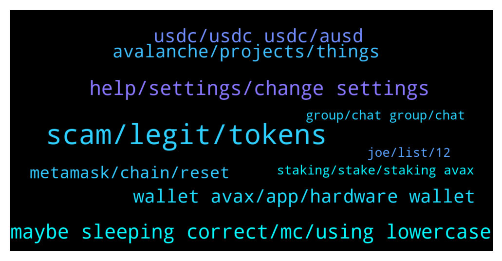

# **@avalancheavax**
 ## Analysis for **2021-12-27** - **2021-12-28**.

---

## 📊 **Basic Stats**

**n_messages_sent**: 144

---

---

## 🔝 **Top keywords and related messages**

1. **scam, legit, tokens**

    @Nicolas_A --- *There are plenty of fake tokens that are sent to users. The Avalaunch airdrop was for validators / delegators and the snapshot was taken months ago. I believe there is a 1 year period before they are airdropped* **--->** [TG Discussion](https://t.me/avalancheavax/317763)

    @EnduroV1 --- *Another Avalanche Offical group popped up on my Telegram - they saying there is airdrop. Page looks real with 11000+ members. However smells fishy to me? Can anyone confirm this is scam and if though we may need a pinned messge to warn other people in the community* **--->** [TG Discussion](https://t.me/avalancheavax/318113)

    @alrko616 --- *So how do u determine witch one is fake?* **--->** [TG Discussion](https://t.me/avalancheavax/317765)

    @Bruno_LGD --- *Most probably they are trying to scam you lol* **--->** [TG Discussion](https://t.me/avalancheavax/318167)

    @oathtobarbatos --- *It's a scam. This is the only official group. Be careful, guys!* **--->** [TG Discussion](https://t.me/avalancheavax/318129)

    @EnduroV1 --- *i wouldnt trust it, too many scams around* **--->** [TG Discussion](https://t.me/avalancheavax/318118)

2. **maybe sleeping correct, mc, using lowercase**

    @Desk --- *How you’ll be in her heart* **--->** [TG Discussion](https://t.me/avalancheavax/318125)

    @anilyeni --- *but the tradition is using lowercase* **--->** [TG Discussion](https://t.me/avalancheavax/318200)

    @jori --- *We are in the opposite state* **--->** [TG Discussion](https://t.me/avalancheavax/318093)

    @jori --- *It’s also correct. People come from everywhere here.* **--->** [TG Discussion](https://t.me/avalancheavax/318079)

    @Xushangyan --- *Do you have friends from the United States or Mexico?* **--->** [TG Discussion](https://t.me/avalancheavax/318082)

    @Chab --- *Nobody cares about MC Donalds ?* **--->** [TG Discussion](https://t.me/avalancheavax/317901)

3. **help, settings, change settings**

    @Plukumusukutu --- *I can't dm y account settings don't allow me* **--->** [TG Discussion](https://t.me/avalancheavax/317952)

    @Rob --- *Dude even said I don’t need help from an admin lol* **--->** [TG Discussion](https://t.me/avalancheavax/317965)

    @Nicolas_A --- *Then change your settings because my dms are open* **--->** [TG Discussion](https://t.me/avalancheavax/317953)

    @Plukumusukutu --- *, please dm me and i will explain my problem with details* **--->** [TG Discussion](https://t.me/avalancheavax/317948)

    @Mr. --- *did nothing and got banned? maybe system error?* **--->** [TG Discussion](https://t.me/avalancheavax/317973)

    @Rob --- *To get help from an admin you must dm them first change settings bud* **--->** [TG Discussion](https://t.me/avalancheavax/317954)

4. **usdc, usdc usdc, ausd**

    @TheSEOdude --- *even real USDT isn't that safe , haha* **--->** [TG Discussion](https://t.me/avalancheavax/317956)

    @And --- *I thought usdc.e was the bridged version for use on avax. If there is native usdc now what is the point in having both* **--->** [TG Discussion](https://t.me/avalancheavax/317797)

    @And --- *Can someone enlighten me on usdc and usdc.e* **--->** [TG Discussion](https://t.me/avalancheavax/317796)

    @TheSEOdude --- *Many - AUSD ,usdt.e, USDC.e , dai.e, mim* **--->** [TG Discussion](https://t.me/avalancheavax/317936)

    @redbullcryptoo --- *What is AUSD ? what is AVAX USD ?* **--->** [TG Discussion](https://t.me/avalancheavax/317938)

    @heheitg --- *Why is that? will it change in the future?   swapping USDC/USDC.e could be costly* **--->** [TG Discussion](https://t.me/avalancheavax/318056)

5. **wallet avax, app, hardware wallet**

    @ihatetomatoesman --- *which hardware wallet fully supports AVAX? only ledger?😔* **--->** [TG Discussion](https://t.me/avalancheavax/317784)

    @Pytor07 --- *We have special wallet for the stacking Avax?* **--->** [TG Discussion](https://t.me/avalancheavax/317990)

    @Nicolas_A --- *Synapse also works great. It gives you some avax or bsc to pay for first transaction* **--->** [TG Discussion](https://t.me/avalancheavax/317871)

    @oathtobarbatos --- *wallet.avax.network is the right link though* **--->** [TG Discussion](https://t.me/avalancheavax/318108)

    @ihatetomatoesman --- *there’s only an app, I need a hardware wallet* **--->** [TG Discussion](https://t.me/avalancheavax/317788)

    @Cathy --- *Of course there are many wallets for you to choose from* **--->** [TG Discussion](https://t.me/avalancheavax/317791)

6. **avalanche, projects, things**

    @hiteshpahwa --- *Does capitalisation of wallet address matters in smart contracts in avalanche?* **--->** [TG Discussion](https://t.me/avalancheavax/318195)

    @Nicolas_A --- *Those are not Ava labs project. You can find Avalanche projects at ecosystem.avax.network* **--->** [TG Discussion](https://t.me/avalancheavax/318191)

    @Nicolas_A --- *List of projects ? Everyone is pretty much working on Avalanche related stuff* **--->** [TG Discussion](https://t.me/avalancheavax/318189)

    @Nicolas_A --- *The driver of the Avalanche Andretti team Jake Dennis published a cool vlog in case some of you are interested https://youtu.be/3HHVpml1hJo* **--->** [TG Discussion](https://t.me/avalancheavax/317986)

    @Basje01 --- *When is the avalanche summit in Barca?* **--->** [TG Discussion](https://t.me/avalancheavax/317880)

    @flyingapeman --- *Hey guy does anyone know any avalanche go node optimizations for c chain? Other then the obvious hardware choices 😅* **--->** [TG Discussion](https://t.me/avalancheavax/318180)

7. **metamask, chain, reset**

    @Mick1187k --- *Transactions taking forever on Avalanche, is MetaMask not calculating the correct gas should we do it manually?* **--->** [TG Discussion](https://t.me/avalancheavax/317889)

    @TheSEOdude --- *don't know if anybody have noticed or not , now Metamask shows low fees for the transaction but the real transaction take higher than what metamask shows.* **--->** [TG Discussion](https://t.me/avalancheavax/317967)

    @TheSEOdude --- *Are you withdrawing it to metamask ?  If yes it  should c chain.* **--->** [TG Discussion](https://t.me/avalancheavax/317923)

    @Nicolas_A --- *From Metamask to Kucoin ? Yes you can* **--->** [TG Discussion](https://t.me/avalancheavax/317757)

    @UBIllin --- *Hi.  I tried to get support from the forum but they forwarded me here.  I sent LINK to the  AVAX bridge contract but this was due to a bug in metamask, if you look at my wallet all the transactions on the ETH Chain are top the same address, when I switched to AVAX network to send to the same address on the AVAX chain metamask did something weird.  I found another person on the forum that had the same issue.   Is there any way to recover this?  0x9be0859edc38919ec32d882ccf4eb035ed74a5d29bbe20627c6e834d111ec05d* **--->** [TG Discussion](https://t.me/avalancheavax/318194)

    @Nicolas_A --- *Try to reset metamask : settings > advanced > reset* **--->** [TG Discussion](https://t.me/avalancheavax/317891)

8. **joe, list, 12**

    @CyberSensei --- *YetiSwap going to listed on MEXC 💥💥❄️  https://twitter.com/YetiSwap/status/1475407145239818240?t=xCAZM1KiBFqjqVa7ooDiWQ&s=19* **--->** [TG Discussion](https://t.me/avalancheavax/317999)

    @gugumillo --- *Binance Will List JOE (JOE) TraderJoe 2021-12-28 01:56 Fellow Binancians, Binance will list JOE (JOE) and will open trading for JOE/BTC, JOE/BUSD and JOE/USDT trading pairs at 2021-12-28 11:00 (UTC). Users can now start depositing JOE in preparation for trading Withdrawals for JOE will open at 2021-12-29 11:00 (UTC)* **--->** [TG Discussion](https://t.me/avalancheavax/318128)

    @muzi0123 --- *Binance announced to list Trader Joe officially just now* **--->** [TG Discussion](https://t.me/avalancheavax/318114)

    @Nicolas_A --- *No date announced. Afaik it's somewhere around March / April* **--->** [TG Discussion](https://t.me/avalancheavax/317882)

    @carsi74 --- *example xava png joe and others as list?* **--->** [TG Discussion](https://t.me/avalancheavax/318190)

9. **group, chat group, chat**

    @Mr. --- *@Nicolas_A was the german group deleted?* **--->** [TG Discussion](https://t.me/avalancheavax/317968)

    @dehraw --- *Ia there a telegram chat group for AVAX developers?* **--->** [TG Discussion](https://t.me/avalancheavax/317814)

    @l_webster --- *If there is a link? Please share* **--->** [TG Discussion](https://t.me/avalancheavax/317875)

    @dehraw --- *Nah mate, I am guessing there is none, that was for discord, thanks anyway.* **--->** [TG Discussion](https://t.me/avalancheavax/317816)

    @dehraw --- *Is there a dev chat group?* **--->** [TG Discussion](https://t.me/avalancheavax/317813)

10. **staking, stake, staking avax**

    @Pieruccinii --- *Hi Guys, which is the best platform to farming or staking AVAX? Thanks in advance* **--->** [TG Discussion](https://t.me/avalancheavax/318100)

    @Toby --- *Guys please tell me more about staking* **--->** [TG Discussion](https://t.me/avalancheavax/317997)

    @Sandbar1 --- *After selecting the node validator and then confirming it - ie the last part of staking - I got that warning. I can log on again sometime and copy the exact phrase but what I quoted from memory is about 90% right. (All you scammers stop trying. I don't reply to DMs and block and report them)* **--->** [TG Discussion](https://t.me/avalancheavax/317778)

    @imissyousomuch1 --- *How can I stake my avax* **--->** [TG Discussion](https://t.me/avalancheavax/318103)

    @Sandbar1 --- *I've got a question about staking on the Avax wallet website. When I click Confirm to stake I get a red warning saying the start date has to be later, but it doesn't show where to change the start date. Anyone know what you are supposed to do and where?* **--->** [TG Discussion](https://t.me/avalancheavax/317776)

