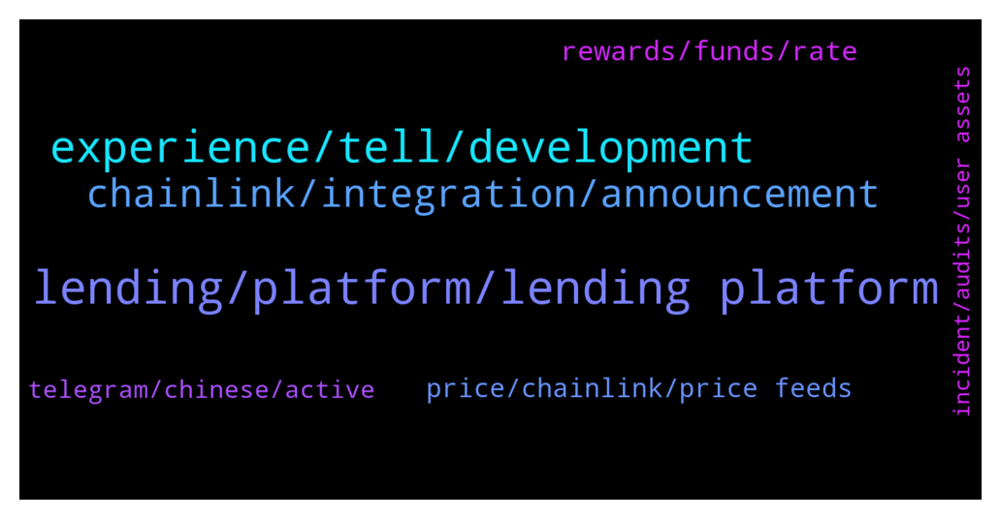

# **@chainlinkofficial**
 ## Analysis for **2021-12-27** - **2021-12-28**.

---

## 📊 **Basic Stats**

**n_messages_sent**: 185

---

---

## 🔝 **Top keywords and related messages**

1. **lending, platform, lending platform**

    @kerrran --- *Channels is about to announce the deployment of the V2 contracts. Channels     V2 will first support leveraged lending, followed by leveraged trading in mainstream tokens, and last but not the least, the lending yield vault.* **--->** [TG Discussion](https://t.me/chainlinkofficial/357639)

    @kerrran --- *In addition, Channels has been audited twice, by Fairly Security and knownsec.com, and now audited by Certik. Channels have also done KYC certification on Huobi Exchange, there is no reason to abandon the project.* **--->** [TG Discussion](https://t.me/chainlinkofficial/357669)

    @kerrran --- *Channels has integrated Chainlink Price Feeds on Binance Smart Chain (BSC) mainnet. By integrating the industry-leading decentralized oracle network, Channels now has access to high-quality, tamper-proof price feeds needed to calculate the collateral and borrowed asset value of users. This will provide our users with stronger assurances that the Channels lending platform is highly stable, healthy, and attack-resistant.* **--->** [TG Discussion](https://t.me/chainlinkofficial/357739)

    @kerrran --- *​​Channels is the leading multi-chain innovative DeFi lending protocol. Users can deposit tokens (including single token and LP) and borrow tokens in Channels, and both deposit and borrow will receive platform token CAN rewards.* **--->** [TG Discussion](https://t.me/chainlinkofficial/357633)

    @kerrran --- *The main driver for the development of Channels V2 is to improve capital efficiency, by adopting leveraged lending, leveraged trading, and implementation of lending liquidity yield aggregation strategy (LLYA).* **--->** [TG Discussion](https://t.me/chainlinkofficial/357644)

    @kerrran --- *Leveraged Trading For experienced DeFi users, it is a very common investment strategy to use a lending platform to go long or short on assets.In response to this demand, Channels V2 adds the function of one-click leverage, which is essentially to allocate funds for users to trade certain assets to achieve multiple longs and shorts.* **--->** [TG Discussion](https://t.me/chainlinkofficial/357649)

2. **experience, tell, development**

    @Jack sparrow --- *Is there a road map anywhere please?* **--->** [TG Discussion](https://t.me/chainlinkofficial/357457)

    @Flo --- *When is CCIP going to be released?* **--->** [TG Discussion](https://t.me/chainlinkofficial/357447)

    @Lenamoms --- *Hello admin,🙋‍♂️ To whom should I contact for AMA PROPOSAL, MARKETING & BUSINESS PROPOSAL..* **--->** [TG Discussion](https://t.me/chainlinkofficial/357501)

    @Mrkaaaa --- *Hi guys, how can find the news/ announcements or good/bad news about Link? any specific channel or website?* **--->** [TG Discussion](https://t.me/chainlinkofficial/357849)

    @Linkederic --- *There is no formal roadmap. The Whitepaper indicates future features (and some that are now live), this blogpost gives a good overview https://blog.chain.link/chainlink-2-0-lays-foundation-for-adoption-of-hybrid-smart-contracts/* **--->** [TG Discussion](https://t.me/chainlinkofficial/357459)

    @kerrran --- *The third point is user experience. The user experience of Channels has been praised and recognized by many users. Whether it is the convenience of interactive operations or the overall UI style, our users use one word to describe Channels: smooth We sincerely invite you to experience the channel:https://bsc.channels.finance/* **--->** [TG Discussion](https://t.me/chainlinkofficial/357675)

3. **chainlink, integration, announcement**

    @Linkederic --- *Try searching for "chainlink unofficial" 👍* **--->** [TG Discussion](https://t.me/chainlinkofficial/357553)

    @DoctorMantisToboggan --- *Is there an unofficial official chainlink group. Memes and stuff* **--->** [TG Discussion](https://t.me/chainlinkofficial/357552)

    @Da --- *Is Michael Stone a legit Chainlink developer? Hes asking me to stake my CL on his site. I think hes a fraud* **--->** [TG Discussion](https://t.me/chainlinkofficial/357450)

    @Subba0 --- *Just wanted to know, does the chainlink has partnership with MagnetDao?* **--->** [TG Discussion](https://t.me/chainlinkofficial/357550)

    @Subba0 --- *So as of now, chainlink has not tweeted about it so means no partnership?* **--->** [TG Discussion](https://t.me/chainlinkofficial/357554)

    @ProfessionalApe --- *Is there an easy way to use chainlink to read transactions/information from one chain on another chain? e.g. call a read contract method for an ETH contract on BSC?* **--->** [TG Discussion](https://t.me/chainlinkofficial/357589)

4. **rewards, funds, rate**

    @kerrran --- *2.Staking in LP： For example, providing WBNB-BUSD-LP in Pancake could get CAN and CAKE rewards, the APY will be 52.22%.* **--->** [TG Discussion](https://t.me/chainlinkofficial/357700)

    @kerrran --- *1. Staking and lending： These are our fundamental features.  You can get rewards by both supplies and borrowing. By leveraging your investment, you will have double/triple rewards and maximize your interests.* **--->** [TG Discussion](https://t.me/chainlinkofficial/357698)

    @kerrran --- *The farming rewards will be directly given to deposit users, boosting the return rate of funds on Channels. In addition, in order to ensure the absolute safety of funds, funds will only be put into reputable DEXs, such as Pancake on BSC, that has passed the risk analysis.* **--->** [TG Discussion](https://t.me/chainlinkofficial/357654)

    @kerrran --- *Such an initiative not only meets the needs of borrowers for flexible use of funds, but can also increase profits through leveraged mining. At the same time, because the shared fund pool has greatly increased the utilization rate of funds, deposit users can obtain higher rewards.* **--->** [TG Discussion](https://t.me/chainlinkofficial/357647)

    @kerrran --- *Users can stake LPs to lend a single currency, which can greatly increase the rate of return (at least doubled) while increasing the utilization rate of funds, and optimize the rate of return of users* **--->** [TG Discussion](https://t.me/chainlinkofficial/357638)

    @kerrran --- *5.CAN could also mine other tokens, for example, CAN-MDX-LP could mine YF in YF.FARM. We also partner with other projects, you can stake CAN earn out partners’ token as rewards.* **--->** [TG Discussion](https://t.me/chainlinkofficial/357706)

5. **price, chainlink, price feeds**

    @marcromeron --- *To know more about Price Feeds, check our documentation: https://chain.link/data-feeds* **--->** [TG Discussion](https://t.me/chainlinkofficial/357753)

    @kerrran --- *Decentralized Network — Chainlink Price Feeds are decentralized at the data source, oracle node, and oracle network levels, generating strong protections against downtime and tampering by either the data provider or oracle network.* **--->** [TG Discussion](https://t.me/chainlinkofficial/357749)

    @kerrran --- *High-Quality Data — Chainlink Price Feeds source data from numerous premium data aggregators, leading to price data that’s aggregated from hundreds of exchanges, weighted by volume, and cleaned of outliers and wash trading. Chainlink’s data aggregation model generates more precise global market prices that are inherently resistant to inaccuracies or manipulation of any single or small set of exchanges.* **--->** [TG Discussion](https://t.me/chainlinkofficial/357747)

    @kerrran --- *After reviewing various oracle solutions, we integrated Chainlink Price Feeds because they provide a multitude of critical features such as:* **--->** [TG Discussion](https://t.me/chainlinkofficial/357746)

    @kerrran --- *Thus, we need to make use of an oracle network to fetch aggregated price data off-chain and deliver it on-chain to be consumed by our application.* **--->** [TG Discussion](https://t.me/chainlinkofficial/357745)

    @kerrran --- *We chose Chainlink as our go-to oracle solution because its infrastructure is seamless to integrate and time-tested in production. Chainlink already helps secure leading DeFi protocols responsible for tens of billions of dollars in smart contract value, maintaining robust security and high availability even amidst unexpected extreme market events, such as exchange downtime, flash crashes, and data manipulation attacks via flash loans.* **--->** [TG Discussion](https://t.me/chainlinkofficial/357741)

6. **telegram, chinese, active**

    @kerrran --- *🌐 Website: channels.finance 🐦Twitter: https://twitter.com/ChannelsFinance/  🔥 Telegram: https://t.me/ChannelsEN 📚 Medium: https://channelsfinance.medium.com/* **--->** [TG Discussion](https://t.me/chainlinkofficial/357755)

    @Dontxmedude --- *Good I haven't understood anything you described 😎,,just understand some kinda upgrade happening 😆* **--->** [TG Discussion](https://t.me/chainlinkofficial/357526)

    @timodee --- *Warning ❗️ An attack on thematic @telegram crypto chats ongoing now. The attackers use an account named "Smokes Night" to spread Echelon malware by dropping a file into the chat room.  TLDR: Disable auto-downloading in Telegram settings right now.* **--->** [TG Discussion](https://t.me/chainlinkofficial/357538)

    @marcromeron --- *If you have any other questions, please visit their Telegram channel https://t.me/beastieschat* **--->** [TG Discussion](https://t.me/chainlinkofficial/357836)

    @nam_nguyenson --- *China has a telegram group, It’s called @chainlinkfans (unofficial) and please also feel free to check out our Chinese communities (official) here:  https://blog.chain.link/chainlink-chinese-communities/* **--->** [TG Discussion](https://t.me/chainlinkofficial/357619)

    @PolivodaTatiana --- *Please refer to the message above 👆* **--->** [TG Discussion](https://t.me/chainlinkofficial/357857)

7. **incident, audits, user assets**

    @kerrran --- *There has never been any security incident since it went online* **--->** [TG Discussion](https://t.me/chainlinkofficial/357719)

    @kerrran --- *yes, this is the safety we would like to bring to users* **--->** [TG Discussion](https://t.me/chainlinkofficial/357693)

    @kerrran --- *There has not been any incident of user assets being stolen. In addition, we also have a professional risk control consulting team.* **--->** [TG Discussion](https://t.me/chainlinkofficial/357686)

    @kerrran --- *Only by being technically foolproof can the security of users' assets be guaranteed. This is the premise. In order to ensure the safety of user assets, Channels independently designed and developed a decentralized multi-source data verification oracle solution, which has been upgraded to version V2.* **--->** [TG Discussion](https://t.me/chainlinkofficial/357685)

    @marcromeron --- *Audits are critical in blockchain ecosystem, so that's perfect.* **--->** [TG Discussion](https://t.me/chainlinkofficial/357670)

    @marcromeron --- *You talk about audits, etc.. but, how do you guarantee user's asset security?* **--->** [TG Discussion](https://t.me/chainlinkofficial/357683)

