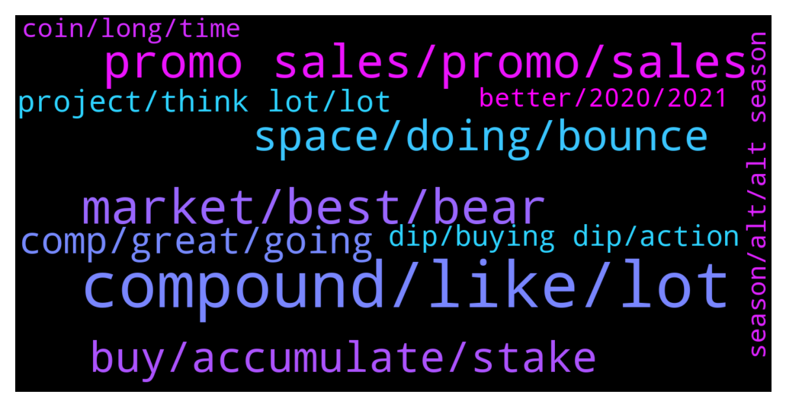

# **@compoundofficialgroup**
 ## Analysis for **2021-12-27** - **2021-12-28**.

---

## 📊 **Basic Stats**

**n_messages_sent**: 141

---

---

## 🔝 **Top keywords and related messages**

1. **compound, like, lot**

    @cyberlord21 --- *well, if you are 80 and already live off of your traditional investments with ease, I don't see a reason to get crypto.* **--->** [TG Discussion](https://t.me/compoundofficialgroup/25768)

    @marycox2 --- *COMPOUND is so much better... will most likely have its day in the sun at some point.* **--->** [TG Discussion](https://t.me/compoundofficialgroup/25888)

    @Joak --- *You should have cryptocurrency in your portfolio, no matter your age, advisors say* **--->** [TG Discussion](https://t.me/compoundofficialgroup/25767)

    @Jan --- *Binance, it's cool too But will prefer Exodus* **--->** [TG Discussion](https://t.me/compoundofficialgroup/25736)

    @k_arlsson --- *I believe COMPOUND will reach its target price in due time* **--->** [TG Discussion](https://t.me/compoundofficialgroup/25880)

    @FUTURE --- *Recently, I had been feeling like I wasted the opportunity that the pandemic gave me to learn, improve, find new hobbies, etc. I see a lot of folks at work, a lot of friends, and even some family members that have worked on degrees, learned new skills, picked up new hobbies, etc, and I felt like I had really just dropped the ball.   Then it dawned on me: I've learned a lot about the stock market and cryptocurrency/Blockchain technology the past almost 2 years. I am not an expert; far from it, in fact. And I wasn't totally new to crypto, but the last time I did anything other than sporadically hold BTC was around 2014/15, and my has the crypto world changed a lot! All of that said, I'm no longer completely perplexed when I see a lot of jargon being thrown around. I don't understand 100% of the quality DDs, research reports, white papers, etc, but I do feel much more confident in either knowing where to look for more information or what questions to ask.   I could have done a lot more research, that's true. But it's important to keep things in perspective. I DID improve myself over the course of the pandemic, I just probably won't see the results of it for a while. I will keep learning, hanging out with you fine folks, and eventually free myself from traditional financial institutions (or at least have fun trying!). Thanks, everyone, and I hope you all enjoy the holidays!* **--->** [TG Discussion](https://t.me/compoundofficialgroup/25751)

2. **market, best, bear**

    @moore022 --- *Bear markets has always been the best market to buy in* **--->** [TG Discussion](https://t.me/compoundofficialgroup/25746)

    @Jan --- *The goal is time in the market not timing the market* **--->** [TG Discussion](https://t.me/compoundofficialgroup/25836)

    @moore022 --- *The market will be bullish till nxt year* **--->** [TG Discussion](https://t.me/compoundofficialgroup/25780)

    @teresamill --- *It's really amazing how quickly this market can begin recovering* **--->** [TG Discussion](https://t.me/compoundofficialgroup/25749)

    @Elizabeth_166 --- *May the market always be in our favour* **--->** [TG Discussion](https://t.me/compoundofficialgroup/25710)

    @Rose_109 --- *Market feeling bullish guys Best time to buy is now.* **--->** [TG Discussion](https://t.me/compoundofficialgroup/25714)

3. **promo sales, promo, sales**

    @k_weber002 --- *If there wasn't a limit I think no one would have the chance to utilize it. If the idea is to get more people to buy tokens. Then having a promo sales without limit defeats the purpose* **--->** [TG Discussion](https://t.me/compoundofficialgroup/25738)

    @Jansen --- *The promo sales is my favourite right now* **--->** [TG Discussion](https://t.me/compoundofficialgroup/25701)

    @k_weber002 --- *I have bagged more COMP some couple of minutes ago guys. I took some nap and woke up to have already received my order.* **--->** [TG Discussion](https://t.me/compoundofficialgroup/25711)

    @Yhng43 --- *I can't imagine telling people in the future that COMP had an ongoing promo sales and I still didn't get enough* **--->** [TG Discussion](https://t.me/compoundofficialgroup/25893)

    @Parker0002 --- *How can I buy COMP from the promo sales to earn bonus.* **--->** [TG Discussion](https://t.me/compoundofficialgroup/25727)

    @Felix121243 --- *Been buying COMP for quite a while now, bought more when the promo sales started.* **--->** [TG Discussion](https://t.me/compoundofficialgroup/25716)

4. **space, doing, bounce**

    @moore022 --- *we had vastly different experiences lol* **--->** [TG Discussion](https://t.me/compoundofficialgroup/25871)

    @na3312 --- *Thank you for your insights. You made an interesting point that this community embraces creators and not manipulators. At the end of the day, we are all in this rollercoaster together!* **--->** [TG Discussion](https://t.me/compoundofficialgroup/25864)

    @Bakker --- *See you guys on the moon* **--->** [TG Discussion](https://t.me/compoundofficialgroup/25835)

    @teresamill --- *Very true💯  Having knowledge in this space and growing more is so underrated* **--->** [TG Discussion](https://t.me/compoundofficialgroup/25807)

    @Gab_4327 --- *Why not someone actually let them know they are doing it wrong🤷🤷  Nothing like know it all in this space* **--->** [TG Discussion](https://t.me/compoundofficialgroup/25806)

    @Felix121243 --- *Lol  Moon boys be doing the most 🤣🤣 They lack so much patience in this space* **--->** [TG Discussion](https://t.me/compoundofficialgroup/25805)

5. **buy, accumulate, stake**

    @c_dias4 --- *That's a tautology  It actually means the opposite of what you intend* **--->** [TG Discussion](https://t.me/compoundofficialgroup/25782)

    @Ethan_864 --- *Accumulating phase is about to get over* **--->** [TG Discussion](https://t.me/compoundofficialgroup/25891)

    @santos259 --- *Holder do get rewarded but if you hold and buy more you become a king* **--->** [TG Discussion](https://t.me/compoundofficialgroup/25878)

    @moore022 --- *Wait for a correction guys after this pump and then try to buy as much as you can* **--->** [TG Discussion](https://t.me/compoundofficialgroup/25810)

    @Raulafonso2 --- *If you accumulated enough from the promo, the wise thing to do now is stake* **--->** [TG Discussion](https://t.me/compoundofficialgroup/25790)

    @Jansen --- *Accumulate as much as you can now that it's not pumped yet* **--->** [TG Discussion](https://t.me/compoundofficialgroup/25789)

6. **comp, great, going**

    @marycox2 --- *What's is the best place to save your comp mate* **--->** [TG Discussion](https://t.me/compoundofficialgroup/25734)

    @Ethan_864 --- *Comp is going to melt faces again* **--->** [TG Discussion](https://t.me/compoundofficialgroup/25892)

    @marycox2 --- *Honestly, im super impressed.  COMP has come a long way* **--->** [TG Discussion](https://t.me/compoundofficialgroup/25860)

    @Jansen --- *Soon everyone will start talking about COMP* **--->** [TG Discussion](https://t.me/compoundofficialgroup/25814)

    @Gab_4327 --- *COMP is the sleeping giant.  Everyone should have  a lot  in their bag.* **--->** [TG Discussion](https://t.me/compoundofficialgroup/25793)

    @Noah_0980 --- *COMP is GREAT. It has so many partners and projects going, very promising future.* **--->** [TG Discussion](https://t.me/compoundofficialgroup/25791)

7. **project, think lot, lot**

    @Felix121243 --- *I think a lot of people are sleeping on this project.  I hear a lot of regrets in the future* **--->** [TG Discussion](https://t.me/compoundofficialgroup/25801)

    @na3312 --- *That's my favorite thing about this project* **--->** [TG Discussion](https://t.me/compoundofficialgroup/25897)

    @Alvaro_467 --- *Definitely the one project you don't want to miss out on* **--->** [TG Discussion](https://t.me/compoundofficialgroup/25802)

    @Elizabeth_166 --- *Just finished reading this and I had to FOMO!* **--->** [TG Discussion](https://t.me/compoundofficialgroup/25797)

    @Cassandra --- *I'm going 3 years on this project* **--->** [TG Discussion](https://t.me/compoundofficialgroup/25775)

    @Cort201 --- *I don't think a lot of people read on projects before buying* **--->** [TG Discussion](https://t.me/compoundofficialgroup/25763)

8. **dip, buying dip, action**

    @denis2301123 --- *I didn't sell in the dip. I knew dip is temporary. Now i am happy to see some positive action in chart.* **--->** [TG Discussion](https://t.me/compoundofficialgroup/25875)

    @k_arlsson --- *This dip seems really healthy so far* **--->** [TG Discussion](https://t.me/compoundofficialgroup/25862)

    @Bakker --- *If they did  their research then they'd be pretty chill about the dips* **--->** [TG Discussion](https://t.me/compoundofficialgroup/25766)

    @Cort201 --- *That explain all the panicking when it dips.* **--->** [TG Discussion](https://t.me/compoundofficialgroup/25764)

    @Jan --- *What's the point of buying the dip if you're not gonna hold* **--->** [TG Discussion](https://t.me/compoundofficialgroup/25761)

    @Diaz201 --- *When others are asking funny questions, action takers are busy with buying the dip .* **--->** [TG Discussion](https://t.me/compoundofficialgroup/25713)

9. **coin, long, time**

    @Alvaro_467 --- *Every coin affected by the last fud  is in recovery phase. This is the time to buy* **--->** [TG Discussion](https://t.me/compoundofficialgroup/25896)

    @santos259 --- *ICO holder here? Very undervalued coin never sold 1 COMP since ICO* **--->** [TG Discussion](https://t.me/compoundofficialgroup/25844)

    @teresamill --- *I hold a few coins of this for the long term. Its a solid project eventhough competition is fierce* **--->** [TG Discussion](https://t.me/compoundofficialgroup/25839)

    @Robert_4536 --- *I dunno but I am holding Comp and for a very long time it was my top performing coin.* **--->** [TG Discussion](https://t.me/compoundofficialgroup/25798)

    @Gab_4327 --- *The coin is not going to stop* **--->** [TG Discussion](https://t.me/compoundofficialgroup/25794)

    @Godfrey517 --- *I dunno but I am holding Comp and for a very long time it was my top performing coin.* **--->** [TG Discussion](https://t.me/compoundofficialgroup/25792)

10. **season, alt, alt season**

    @Joak --- *Should we be concerned that alts are pumping while BTC is below the bullmarket support band.* **--->** [TG Discussion](https://t.me/compoundofficialgroup/25828)

    @cyberlord21 --- *Nope. Early signs of the alt season* **--->** [TG Discussion](https://t.me/compoundofficialgroup/25829)

    @cyberlord21 --- *Exactly 💯 Holding for the bull run  Just wait it's Alt season* **--->** [TG Discussion](https://t.me/compoundofficialgroup/25739)

    @denis2301123 --- *This support can push the alts to rally* **--->** [TG Discussion](https://t.me/compoundofficialgroup/25726)

    @Alvaro_467 --- *A lot of people on here are going to make a lot of gains when the bull run starts Keep holding SPELL mates🚀📉* **--->** [TG Discussion](https://t.me/compoundofficialgroup/25708)

    @denis2301123 --- *Super alt season with BTC at 50K is really really what WE NEED.* **--->** [TG Discussion](https://t.me/compoundofficialgroup/25725)

