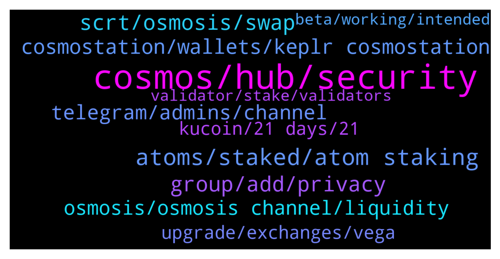

# **@cosmosproject**
 ## Analysis for **2021-12-27** - **2021-12-28**.

---

## 📊 **Basic Stats**

**n_messages_sent**: 628

---

---

## 🔝 **Top keywords and related messages**

1. **cosmos, hub, security**

    @SiPhan97 --- *Cosmos is a bit like Polkadot in that it doesn’t really have any working apps unlike LUNA and AVAX* **--->** [TG Discussion](https://t.me/cosmosproject/460986)

    @Hindrhasha --- *I'm just saying. I believe in the internet of blockchains but the whole fragmentation needs to be abstracted for mass adoption.* **--->** [TG Discussion](https://t.me/cosmosproject/461805)

    @shfxw --- *Polkadot has sharded security and that blockchains built on it can transfer more complex information than those built on cosmos* **--->** [TG Discussion](https://t.me/cosmosproject/461061)

    @johnniecosmos --- *I instructed you to go to Cosmos Ecosystem chat politely and you responded with “f… Cosmos should ….”. There are rules when engaging on the price chat.* **--->** [TG Discussion](https://t.me/cosmosproject/460930)

    @ZoltanAtom --- *I dont know if there is any marketing plan for now. but Cosmos tech keep expanding and taking the place at the mainstream. Also we have strong community which helps and spread Cosmos awareness all over!   If you have any marketing ideas,please feel free to publish at   https://forum.cosmos.network* **--->** [TG Discussion](https://t.me/cosmosproject/461534)

    @BenediktAlbert --- *Is cosmostation the official from cosmos?* **--->** [TG Discussion](https://t.me/cosmosproject/461108)

2. **atoms, staked, atom staking**

    @Dosang_11 --- *I think atomic wallet is so easy if it comes to $ATOM staking* **--->** [TG Discussion](https://t.me/cosmosproject/461233)

    @BenediktAlbert --- *so could i change my atom to smth else and bring it to exchanges?* **--->** [TG Discussion](https://t.me/cosmosproject/461180)

    @Matt --- *I at one time had hundreds of atom staked. The 3 week unlock makes me nervous to keep everything staked depending on what general market is doing* **--->** [TG Discussion](https://t.me/cosmosproject/460673)

    @daniela2i --- *Atom could hit 300 mid next year* **--->** [TG Discussion](https://t.me/cosmosproject/461693)

    @AtomJazz --- *Yeah just as I thought. They unstaked a portion of staked ATOMs and today is the day they become available. They simply ran out of liquid ATOMs* **--->** [TG Discussion](https://t.me/cosmosproject/461577)

    @AtomJazz --- *This is actually wrong on so many levels.... And yes there'll be many ways of accruing value for ATOM holders* **--->** [TG Discussion](https://t.me/cosmosproject/461067)

3. **scrt, osmosis, swap**

    @AtomJazz --- *You can withdraw IRIS or SCRT from Binance to Keplr and use Osmosis to swap for JUNO* **--->** [TG Discussion](https://t.me/cosmosproject/461723)

    @AtomJazz --- *Maybe you can withdraw some other cosmos based asset to Keplr and swap it back to atom on Osmosis?* **--->** [TG Discussion](https://t.me/cosmosproject/461299)

    @ScrubMasterAsh --- *was tryng luna now. trying to move my ATOM from Osmosis to Binance or Ku. so other way around.* **--->** [TG Discussion](https://t.me/cosmosproject/460721)

    @AtomJazz --- *Some people use SCRT or IRIS and swap them back to ATOM on Osmosis* **--->** [TG Discussion](https://t.me/cosmosproject/461228)

    @Cordtus --- *you could try swapping it for another token compatible on keplr wallet, sending that over here and then swapping it back for atom on osmosis i guess. it sucks but if you really want to just get your funds off there that is an option.* **--->** [TG Discussion](https://t.me/cosmosproject/460706)

    @AtomJazz --- *You can use Coinbase, Kraken or Cryptocom or you can withdraw IRIS or SCRT from Binance and swap them to ATOM on Osmosis* **--->** [TG Discussion](https://t.me/cosmosproject/461281)

4. **group, add, privacy**

    @M --- *Wow... 6 scammers already contact me from this chat. Looks like half of India is in here pretending to be mods and trying to scam people!* **--->** [TG Discussion](https://t.me/cosmosproject/461520)

    @Vokai --- *Lol I write there "is this scam?" They delete me 😎* **--->** [TG Discussion](https://t.me/cosmosproject/461674)

    @J --- *Removed my questions 👍 so manny potential scammers trying to help 🙈🤣* **--->** [TG Discussion](https://t.me/cosmosproject/460975)

    @Vokai --- *The seconds today, I need to take off privacy mode so I know I delete all groups invite or fake support* **--->** [TG Discussion](https://t.me/cosmosproject/461921)

    @turnipdabeets --- *Sorry to be a pain but what is the point of this group* **--->** [TG Discussion](https://t.me/cosmosproject/460840)

    @jori --- *This group is very deserted. Have changed the server? Is there a new group?* **--->** [TG Discussion](https://t.me/cosmosproject/460643)

5. **cosmostation, wallets, keplr cosmostation**

    @turnipdabeets --- *How come so many people use other wallets besides Keplr? It’s like basically the metamask of cosmos* **--->** [TG Discussion](https://t.me/cosmosproject/461816)

    @Vincent --- *Hello, im new in atom cosmos. What is the best wallet of the ecosysteme?* **--->** [TG Discussion](https://t.me/cosmosproject/461640)

    @ZoltanAtom --- *Hi. You should start from cosmos.network official websites. At the #3 message you will find lots of useful links and articles.   The most recommended wallets are Cosmostation/Keplr.   For podcasts join ;  https://t.me/citizen_cosmos* **--->** [TG Discussion](https://t.me/cosmosproject/461511)

    @Matt_Blocks_United --- *Keplr or Cosmostation. Check out our staking tutorial. It shows both wallets in action https://blocksunited.com/how-to-stake-cosmos-atom-tokens/* **--->** [TG Discussion](https://t.me/cosmosproject/461107)

    @AtomJazz --- *I don't know tbh. Ledger live team is not a part of Cosmos. Keplr is just superior and most importantly it offers everything Ledger live does + IBC features* **--->** [TG Discussion](https://t.me/cosmosproject/461626)

    @ZoltanAtom --- *Cosmostation and Keplr wallets are the recommended wallets. Cosmostation devs are contributors of Cosmos.* **--->** [TG Discussion](https://t.me/cosmosproject/461109)

6. **telegram, admins, channel**

    @turnipdabeets --- *What a pain in the ass having to find these channels with so many scam channels out there, you’d literally have to go to each one project’s website and navigate it to find the social link if you can even find it* **--->** [TG Discussion](https://t.me/cosmosproject/460834)

    @ZoltanAtom --- *🚨🚨🚨SCAM ALERT 🚨🚨🚨  👩🏻‍🚀👨🏾‍🚀 Dear Cosmonauts,  As you well know there are a lot of people who are trying to impersonate me and the other admins of the Cosmos chat to extort your personal information. Please remind that: • Admins will never DM your first • Admins will never ask you to fill a form • Admins will never ask for your seed phrase • Admins will never invite you to any airdrop  • Do not exist a Cosmos Support  ⚠️⚠️⚠️ New Users ⚠️⚠️⚠️ If you have just joined the channel and anyone DMs you impersonating an admin, the support or a bot, please report it to @notoscam.  ⚔️KEEP YOUR SEED PHRASE SAFE⚔️  If you have any doubt, the best way to verify is to write here on the main channel.  Stay Safe & Happy Staking!  🚨🚨🚨🚨🚨🚨🚨🚨🚨🚨* **--->** [TG Discussion](https://t.me/cosmosproject/461912)

    @AtomJazz --- *Ideally you would join telegram channels of those projects and ask there directly. All projects on Cosmos are sovereign and each comes with its own airdrop rules and conditions. Joining that airdrop telegram group should help though* **--->** [TG Discussion](https://t.me/cosmosproject/461717)

    @johnniecosmos --- *I also explained to you that there are designated chats* **--->** [TG Discussion](https://t.me/cosmosproject/460931)

    @Cordtus --- *http://mapofzones.com is cool. You can also find most  telegram/twitter links for each network on their coingecko pages* **--->** [TG Discussion](https://t.me/cosmosproject/460833)

    @only_arsh --- *Is this officiall cosmos network telegram?* **--->** [TG Discussion](https://t.me/cosmosproject/460886)

7. **osmosis, osmosis channel, liquidity**

    @AtomJazz --- *It should be ok. For more specific Osmosis questions it's better to ask on Osmosis chat directly* **--->** [TG Discussion](https://t.me/cosmosproject/461993)

    @ZoltanAtom --- *You are welcome.Osmosis admins will be happy to help you. Feel free to ask anything related Osmosis there.* **--->** [TG Discussion](https://t.me/cosmosproject/461526)

    @toatse --- *Hi guys, I have a question regarding Osmosis staking, but they do I can’t find an immediate answer in their TG. Can I ask it here or pm someone please?* **--->** [TG Discussion](https://t.me/cosmosproject/461523)

    @ZoltanAtom --- *You also didn’t join Osmosis channel. Please join and learn more ;  https://t.me/osmosis_chat* **--->** [TG Discussion](https://t.me/cosmosproject/461959)

    @Jayhoo --- *Does anybody use defi lama? Says atom TVL only $7M , doesn't make much sense given the amount of liquidity on osmosis* **--->** [TG Discussion](https://t.me/cosmosproject/461339)

    @AtomJazz --- *You can stake it or you can provide liquidity on Osmosis and Sifchain* **--->** [TG Discussion](https://t.me/cosmosproject/461267)

8. **upgrade, exchanges, vega**

    @Jay Jay --- *Hello I am new, I have comos in exodus wallet and says that the net work is down. Will this be exodus or is the net work down?* **--->** [TG Discussion](https://t.me/cosmosproject/461319)

    @Eqivvs --- *hello can someone tell me pse if the Cosmos Hub 4, Vega Upgrade is over ? I staked atoms on crypto.com and I can't transfer them. Tks* **--->** [TG Discussion](https://t.me/cosmosproject/461615)

    @B_hshzd --- *When will this problem be solved in the Trust wallet?!  “cosmos network is going through a network upgrade….”* **--->** [TG Discussion](https://t.me/cosmosproject/461811)

    @Cordtus --- *i don't think they are lost but definitely stuck until they upgrade. i would contact them just to be sure though* **--->** [TG Discussion](https://t.me/cosmosproject/461358)

    @Adib --- *Hi I have a problem with  Withdraw cosmos In kucoin  Atom withdraw is off and written it "network update"  And in my  trust wallet  Written it like that .  Is this problem global ?? Is there a solution? Thanks* **--->** [TG Discussion](https://t.me/cosmosproject/460949)

    @AtomJazz --- *No Cosmos network is not suspended. Its Only Binance and Kucoin that suspended withdrawals for some reason* **--->** [TG Discussion](https://t.me/cosmosproject/461834)

9. **kucoin, 21 days, 21**

    @abdkdx --- *does anyone know when kucoin withdraw is functioning again? Been awhile  since the upgrade* **--->** [TG Discussion](https://t.me/cosmosproject/461285)

    @filipcristian --- *Hello admin , I unstaked my ATOM on keplr , it say 21 days but can you explain when it will be released … I mean the exact time* **--->** [TG Discussion](https://t.me/cosmosproject/461372)

    @Mario Respect --- *21 days it is a big amount of time btw* **--->** [TG Discussion](https://t.me/cosmosproject/461129)

    @BenediktAlbert --- *So at all it seems to be kind of hard to get slashed... Kucoin withdraw is also not online...* **--->** [TG Discussion](https://t.me/cosmosproject/461149)

    @AtomJazz --- *It's 1 minute task 😁 https://medium.com/chainapsis/how-to-use-keplr-wallet-40afc80907f6?source=user_profile---------0----------------------------* **--->** [TG Discussion](https://t.me/cosmosproject/461632)

    @n0BaadD --- *The locked day is 21 days and how can I earn with dat ? Will I receive it when I unstable or how  Please explain for me better* **--->** [TG Discussion](https://t.me/cosmosproject/461273)

10. **beta, working, intended**

    @AtomJazz --- *No it hasn't, because it's not working yet* **--->** [TG Discussion](https://t.me/cosmosproject/461074)

    @AtomJazz --- *I mean that's not really true. It works but it's in beta and has limited functionalities atm* **--->** [TG Discussion](https://t.me/cosmosproject/460877)

    @lebron_jack --- *Are you sure ? Nothing is working* **--->** [TG Discussion](https://t.me/cosmosproject/461713)

    @Cordtus --- *Yes it does but it doesn't really work right now... So don't try lol* **--->** [TG Discussion](https://t.me/cosmosproject/460874)

    @abdkdx --- *of course, unfortunately i wasnt able at the time* **--->** [TG Discussion](https://t.me/cosmosproject/461298)

    @toatse --- *I was in the wrong one! Thanks!* **--->** [TG Discussion](https://t.me/cosmosproject/461525)

