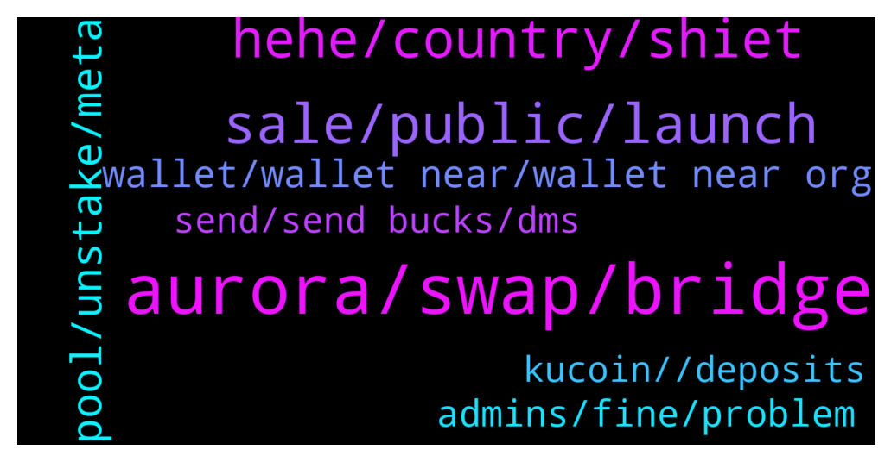

# **@cryptonear**
 ## Analysis for **2021-12-27** - **2021-12-28**.

---

## 📊 **Basic Stats**

**n_messages_sent**: 527

---

---

## 🔝 **Top keywords and related messages**

1. **aurora, swap, bridge**

    @haidang87dotcom --- *Hello all. Anyone know how Near get the benefit as Aurora growth? Please explain or give me some docs, thanks!* **--->** [TG Discussion](https://t.me/cryptonear/252848)

    @nita_NFtart --- *the swap fee is very cheap but the withdrawal fee from market is very expensive* **--->** [TG Discussion](https://t.me/cryptonear/253029)

    @TheGo1denBull --- *Just send near to Aurora. Swap for eth there* **--->** [TG Discussion](https://t.me/cryptonear/253199)

    @Aflatoon123 --- *Hey buddy give me you wallet address let me see if i can forward some 0.1 near worth eth to you on aurora* **--->** [TG Discussion](https://t.me/cryptonear/253202)

    @nita_NFtart --- *i want swap near to eth ,then bridge to aurora sir 😢* **--->** [TG Discussion](https://t.me/cryptonear/253180)

    @DanAlvarez79 --- *This is a little messy but it’ll work  Swap for atUST on Trisolaris and bridge from aurora to terra via allbridge  Then bridge from terra to binance via terra bridge   Then swap from UST on pancakeswap for usdt and bridge to matic via Anyswap* **--->** [TG Discussion](https://t.me/cryptonear/253483)

2. **sale, public, launch**

    @Kripto_Raptor --- *but i can't participate on this pre-sale. did i miss sth?* **--->** [TG Discussion](https://t.me/cryptonear/253686)

    @larry_lang --- *also u might wanna look for more details on the NEAR PAD channel:  https://t.me/nearpad* **--->** [TG Discussion](https://t.me/cryptonear/252808)

    @bailey_12 --- **Ding Ding Ding*  The wait is over. Let's jump in bois https://twitter.com/BaileyVu12/status/1475801334993481731* **--->** [TG Discussion](https://t.me/cryptonear/254107)

    @iamkemoo --- *You can check the detail of token release in the link: https://near.org/blog/near-token-supply-and-distribution/* **--->** [TG Discussion](https://t.me/cryptonear/252960)

    @larry_lang --- *So yeah what they promised  was an final running product on the jan 5th* **--->** [TG Discussion](https://t.me/cryptonear/253723)

    @TheGo1denBull --- *Frontier will have NEAR on its new app* **--->** [TG Discussion](https://t.me/cryptonear/252905)

3. **hehe, country, shiet**

    @larry_lang --- *yeah glad that u come to us to double check, next time pls keep in mind that if smt sounds too good to be true, then it's too good to be true=)))* **--->** [TG Discussion](https://t.me/cryptonear/253703)

    @nita_NFtart --- *yes my heart is troubled today 😶* **--->** [TG Discussion](https://t.me/cryptonear/253095)

    @larry_lang --- *hehe it has to be morning somewhere=00* **--->** [TG Discussion](https://t.me/cryptonear/254140)

    @thanano46 --- *🤐🤐 life and your safety comes first sir.. I hope corona disappear soon and we all live life to the fullest again. No mask ..no cancelling of parties and travel plans 😇🥳* **--->** [TG Discussion](https://t.me/cryptonear/254182)

    @larry_lang --- *Hello guys^^ wish all of  u a productive week^^* **--->** [TG Discussion](https://t.me/cryptonear/252722)

    @larry_lang --- *ah shiet im behind the tech=00* **--->** [TG Discussion](https://t.me/cryptonear/254270)

4. **pool, unstake, meta**

    @memoriesadrift --- *Correct me if I'm wrong but If you stake short term you lose more than you earned if you unstake instantly. If you stake long term you are just introducing extra risk by having stNEAR instead of NEAR, i.e. your rewards are delegated by meta pool (dApp) instead of near (the blockchain)* **--->** [TG Discussion](https://t.me/cryptonear/253304)

    @kv9990 --- *There's delayed unstaking feature too on metapool 😅* **--->** [TG Discussion](https://t.me/cryptonear/253310)

    @FritzWagner --- *11) The relationship when staking directly with a validator node is 1 to 1. When you stake with Meta Pool it is 1 delegator to 52 validator nodes. So you are helping the NEAR Protocol become more censorship resistance and decentralize the network.* **--->** [TG Discussion](https://t.me/cryptonear/253309)

    @aniketbose945 --- *Ref finance wnear to stnear then unstake* **--->** [TG Discussion](https://t.me/cryptonear/253389)

    @larry_lang --- *just gonna add that we do have a borrow protocol called Oin.finance maybe u can have some research about it:  https://twitter.com/FinanceOin* **--->** [TG Discussion](https://t.me/cryptonear/254052)

    @FritzWagner --- *you dont have to unstake instanly so you wouldnt lose any money. Also you get META tokens, also you are able to do liquid unstake, and the network is more decentralized thanks to metapool because the NEAR are going to be split into different nodes* **--->** [TG Discussion](https://t.me/cryptonear/253306)

5. **wallet, wallet near, wallet near org**

    @Juls746 --- *so no desktop wallet? any plans for one?* **--->** [TG Discussion](https://t.me/cryptonear/252892)

    @thanano46 --- *Sir you can make wallet for free by making your wallet with email or phone number signup* **--->** [TG Discussion](https://t.me/cryptonear/252619)

    @behics --- *to be honest, username.near sounds so cool BUT i dont want to generate a wallet while using a website 😕* **--->** [TG Discussion](https://t.me/cryptonear/253975)

    @kv9990 --- *Wallet browser Extension is under consideration on wallet Roadmap ✌️ https://portal.productboard.com/lnpb6dhpyz225uxhuo74d32p/tabs/1-under-consideration* **--->** [TG Discussion](https://t.me/cryptonear/252896)

    @nita_NFtart --- *ok ,now i will try with math wallet extension, anyone know about node?* **--->** [TG Discussion](https://t.me/cryptonear/253114)

    @larry_lang --- *https://near.org/blog/getting-started-with-the-near-wallet/ also here is a guide on how to create a NEAR wallet for u^^* **--->** [TG Discussion](https://t.me/cryptonear/253974)

6. **admins, fine, problem**

    @nita_NFtart --- *scroll up and read my problem 😢😪* **--->** [TG Discussion](https://t.me/cryptonear/253200)

    @kv9990 --- *:3 seems to be an problem at your end,works fine here* **--->** [TG Discussion](https://t.me/cryptonear/253094)

    @kv9990 --- *That's a solution too 😅✌️ Thanks ❤️* **--->** [TG Discussion](https://t.me/cryptonear/253203)

    @Doganalpaslan1 --- *The dc has helped me ❤️* **--->** [TG Discussion](https://t.me/cryptonear/253581)

    @kv9990 --- *https://twitter.com/finance_ref/status/1433241716526485511  Follow this guide, just change the networks😅* **--->** [TG Discussion](https://t.me/cryptonear/252755)

    @kv9990 --- *😕 that's odd , working here* **--->** [TG Discussion](https://t.me/cryptonear/253492)

7. **send, send bucks, dms**

    @Kripto_Raptor --- *what are you trying to do? why are you asking people to DM you? please give us an explanation asap* **--->** [TG Discussion](https://t.me/cryptonear/252585)

    @iamkemoo --- *Hey mate, just send me a DM. 🙌* **--->** [TG Discussion](https://t.me/cryptonear/253925)

    @larry_lang --- *pls block whoever larry that Dms u first=00* **--->** [TG Discussion](https://t.me/cryptonear/253750)

    @Kripto_Raptor --- *we Never Dm you first, ever* **--->** [TG Discussion](https://t.me/cryptonear/254320)

    @larry_lang --- *Just make sure u DM with the right handle=]]* **--->** [TG Discussion](https://t.me/cryptonear/253924)

    @StephenShimel --- *lol please swing to my dms fam* **--->** [TG Discussion](https://t.me/cryptonear/253751)

