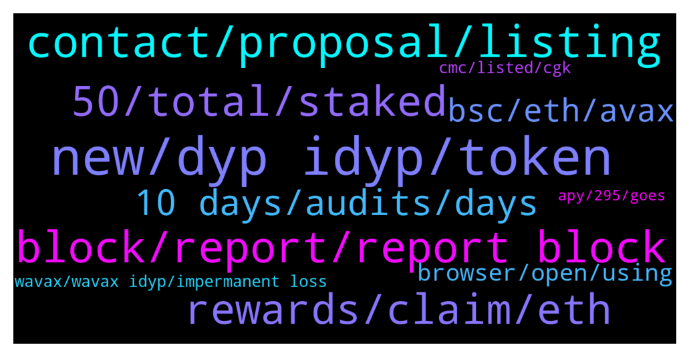

# **@dypfinance**
 ## Analysis for **2021-12-27** - **2021-12-28**.

---

## 📊 **Basic Stats**

**n_messages_sent**: 358

---

---

## 🔝 **Top keywords and related messages**

1. **new, dyp idyp, token**

    @DhoniMSD516 --- *iDYP is our new token which is being used in new strategies of farming, staking and buyback more utilities for iDYP will be coming through moving forward* **--->** [TG Discussion](https://t.me/dypfinance/234021)

    @nobodyffff --- *What kind of additional utilities should we consider for iDYP going forward?* **--->** [TG Discussion](https://t.me/dypfinance/234042)

    @DhoniMSD516 --- *Both but DYP is main and we have already many utilities around DYP https://t.me/dypfinance/229271 iDYP is launched to help in new farming startegies* **--->** [TG Discussion](https://t.me/dypfinance/234881)

    @seyedbnd --- *Is idyp a scam or is it related to dyp?!!* **--->** [TG Discussion](https://t.me/dypfinance/234578)

    @nobodyffff --- *is there or will there be a burning mechanism for iDYP too?* **--->** [TG Discussion](https://t.me/dypfinance/234022)

    @Asolohcok --- *So iDYP Is a governance token?* **--->** [TG Discussion](https://t.me/dypfinance/234883)

2. **contact, proposal, listing**

    @Btok_Draco --- *Hello folks, Merry Xmas and happy New year! Would you mind referring me to the marketing contact regarding this project? Our APP Btok is a social network that connects over 10 million active users. If you wish to promote your token on our APP, I'll send our proposal shortly.* **--->** [TG Discussion](https://t.me/dypfinance/233899)

    @Crypto_partner1 --- *Hi bro I have a sticker proposal for your project. So whom should I contact?* **--->** [TG Discussion](https://t.me/dypfinance/233973)

    @nobodyffff --- *Where can I see the proposalin question and results?* **--->** [TG Discussion](https://t.me/dypfinance/234033)

    @cryptoleadsnik4 --- *@DhoniMSD516 Good afternoon, with whom can I talk about cooperation with my YouTube channel?* **--->** [TG Discussion](https://t.me/dypfinance/234742)

    @mhmd --- *Any admin to talk you for marketing?* **--->** [TG Discussion](https://t.me/dypfinance/234354)

    @dob --- *Hi, Could you let me know where I can apply to the DYP careers as a Solidity developer?* **--->** [TG Discussion](https://t.me/dypfinance/233914)

3. **block, report, report block**

    @innacathouse --- *Does someone write to me from your community in private messages?* **--->** [TG Discussion](https://t.me/dypfinance/234317)

    @thurlo79 --- *Help desk dm me Scammers ?* **--->** [TG Discussion](https://t.me/dypfinance/234539)

    @DhoniMSD516 --- *We admins will never DM you first, lookout for scammers and impersonators never click any links in DM's or share private infos* **--->** [TG Discussion](https://t.me/dypfinance/234688)

    @HumbleFutures --- *And now scam spam from telegramers…* **--->** [TG Discussion](https://t.me/dypfinance/234174)

    @hemanrock --- *please report and block. stay away from scammers* **--->** [TG Discussion](https://t.me/dypfinance/234318)

    @hemanrock --- *DEFI YIELD PROTOCOL ADMINS WILL NEVER DM YOU FIRST, NOR WILL THEY ASK YOU FOR MONEY. PLEASE BEWARE OF SCAMS, AND BLOCK/REPORT SUSPICIOUS ACCOUNTS.* **--->** [TG Discussion](https://t.me/dypfinance/234319)

4. **50, total, staked**

    @Abulsagga --- *guys when i approve staking it asks for 200+ just for gas fees is that logical* **--->** [TG Discussion](https://t.me/dypfinance/234058)

    @LovelySuman86 --- *I invested 1800$ when dyp .56 and bnb 530 now it’s value is 1350$* **--->** [TG Discussion](https://t.me/dypfinance/233768)

    @DhoniMSD516 --- *This can be due to your share % might reduced as more people join* **--->** [TG Discussion](https://t.me/dypfinance/234900)

    @raid_off --- *U said me - I will receive 75% in my staked tokens ..... but It’s was wrong info* **--->** [TG Discussion](https://t.me/dypfinance/234225)

    @raid_off --- *I don’t received... I had staked 50 cake and unstaked only 15* **--->** [TG Discussion](https://t.me/dypfinance/234218)

    @crypto crow --- *I don't understand what you mean exactly. Can you explain further please?  The only factor I know of at the moment is the Total Value Locked (TVL).* **--->** [TG Discussion](https://t.me/dypfinance/233679)

5. **rewards, claim, eth**

    @Tettluft --- *Does it get autoclaimed when lock period is over?* **--->** [TG Discussion](https://t.me/dypfinance/233711)

    @thurlo79 --- *Do the rewards come at different times of the day ?* **--->** [TG Discussion](https://t.me/dypfinance/234534)

    @thurlo79 --- *Hey guys it’s been just over 24 hrs since my last claim …   New rewards not in yet is this normal ?* **--->** [TG Discussion](https://t.me/dypfinance/234650)

    @DhoniMSD516 --- *Hey todays rewards might have included both days rewards* **--->** [TG Discussion](https://t.me/dypfinance/234895)

    @thurlo79 --- *Do rewards bank up if not claimed daily ?* **--->** [TG Discussion](https://t.me/dypfinance/234544)

    @John --- *Hi Dhoni, I did not receive any rewards yesterday but received one day of  rewards today. This has happened once before. I am in no lock Eth farm* **--->** [TG Discussion](https://t.me/dypfinance/234894)

6. **10 days, audits, days**

    @DhoniMSD516 --- *Not live yet It is upcoming expansion* **--->** [TG Discussion](https://t.me/dypfinance/233910)

    @Stormhaven8472 --- *Any rough estimate when we should expect it* **--->** [TG Discussion](https://t.me/dypfinance/233912)

    @finaldust --- *Thanks. Currently there is no fixed date on the launch?* **--->** [TG Discussion](https://t.me/dypfinance/234255)

    @Kent Henry --- *Ok thank you! Do u have any idea when will they resume the subscription period?* **--->** [TG Discussion](https://t.me/dypfinance/233706)

    @DhoniMSD516 --- *No date yet, please stay tuned for further updates https://t.me/dypannouncements* **--->** [TG Discussion](https://t.me/dypfinance/234492)

    @Stormhaven8472 --- *Thanks. I noticed the audits were conducted a while back. Any idea when the new audits will be conducted or updated?0* **--->** [TG Discussion](https://t.me/dypfinance/233733)

7. **bsc, eth, avax**

    @ABBBBBAB_Go --- *what is the relationship between bsc and eth？* **--->** [TG Discussion](https://t.me/dypfinance/234474)

    @J --- *How much citculation supply on bsc?* **--->** [TG Discussion](https://t.me/dypfinance/233826)

    @hemanrock --- *i think it depends on almost all like supply and demand, loctime periods* **--->** [TG Discussion](https://t.me/dypfinance/233666)

    @DhoniMSD516 --- *https://dyp.finance/vote The only proposal for V2 happened in BSC https://gov-bsc.dyp.finance/proposals/1* **--->** [TG Discussion](https://t.me/dypfinance/234034)

    @Stormhaven8472 --- *Any idea which is more profitable?* **--->** [TG Discussion](https://t.me/dypfinance/233731)

    @DhoniMSD516 --- *Both are different tokens DYP have the bridge to switch between ETH-BSC and ETH-AVAX and vice versa iDYP doesn't have a bridge yet* **--->** [TG Discussion](https://t.me/dypfinance/234874)

8. **browser, open, using**

    @HumbleFutures --- *my wallet is not connecting on brave browser* **--->** [TG Discussion](https://t.me/dypfinance/234169)

    @HumbleFutures --- *I tried to send a screenshot but it deleted… Im getting a no web3 error* **--->** [TG Discussion](https://t.me/dypfinance/234182)

    @HumbleFutures --- *Im still getting errors on both mobile and desktop* **--->** [TG Discussion](https://t.me/dypfinance/234173)

    @DhoniMSD516 --- *Nope works fine on my end* **--->** [TG Discussion](https://t.me/dypfinance/234158)

    @DhoniMSD516 --- *Hey I just tested with Metamsk + Brave and it connected successfully* **--->** [TG Discussion](https://t.me/dypfinance/234172)

    @DhoniMSD516 --- *Yea bot deleted your image sorry, so I check, no web 3 is detected you are opening in your default browser, please open the links in Metamask inbuilt browser* **--->** [TG Discussion](https://t.me/dypfinance/234183)

9. **wavax, wavax idyp, impermanent loss**

    @ringLeader96 --- *Hey y’all, I tried withdrawing my WAVAX from the no Lock farming pool, and I ended up getting less than I put in? I put it in 1 WAVAX and got 0.7 when I withdrew, could someone explain this to me?* **--->** [TG Discussion](https://t.me/dypfinance/234715)

    @thurlo79 --- *3 days locked Dyp wavax farm* **--->** [TG Discussion](https://t.me/dypfinance/234654)

    @hemanrock --- *if you deposit one of the supported assets (WAVAX, USDC.e, USDT.e, WETH.e, PNG, QI, DAI.e, XAVA, WBTC.e, LINK.e, or iDYP) and earn WAVAX/ETH/DYP as rewards. https://dypfinance.medium.com/?p=c0d16bf1961c* **--->** [TG Discussion](https://t.me/dypfinance/233745)

    @DhoniMSD516 --- *You should consider the price of tokens when you entered + current price of the tokens WAVAX-iDYP  I am not an expert in explaining IL I am still learning that concept but there are some good tutorials and videos out there to understand it better so please have a look at them* **--->** [TG Discussion](https://t.me/dypfinance/234728)

    @thurlo79 --- *My apologies not sure I’m completely understanding…  There’s no wavax to claim .  Usually there is wavax around the same time everyday .  It’s not appearing at the moment .* **--->** [TG Discussion](https://t.me/dypfinance/234652)

    @DhoniMSD516 --- *Every 24 hours, the smart contract will automatically try converting the iDYP rewards to WAVAX. If the iDYP price is affected by more -2.5%, then the maximum iDYP amount not influencing the price will be swapped to WAVAX, with the remaining amount distributed in the next day’s rewards.* **--->** [TG Discussion](https://t.me/dypfinance/234038)

10. **cmc, listed, cgk**

    @DhoniMSD516 --- *Hey we are already on CMC and CGK https://coinmarketcap.com/currencies/defi-yield-protocol/  https://www.coingecko.com/en/coins/defi-yield-protocol* **--->** [TG Discussion](https://t.me/dypfinance/233825)

    @Asolohcok --- *I only see 1 contract address in CMC* **--->** [TG Discussion](https://t.me/dypfinance/234850)

    @bigdaveinnit --- *so this is not listed on either cmc or gecko?* **--->** [TG Discussion](https://t.me/dypfinance/233874)

    @Asolohcok --- *Wow, there are 2 of you in CMC* **--->** [TG Discussion](https://t.me/dypfinance/234859)

    @DhoniMSD516 --- *Looks like it was listed on CGK today will check with team* **--->** [TG Discussion](https://t.me/dypfinance/233877)

    @Hung --- *listed on cgk ,90% list on cmc today, go to the moon :)* **--->** [TG Discussion](https://t.me/dypfinance/233814)

