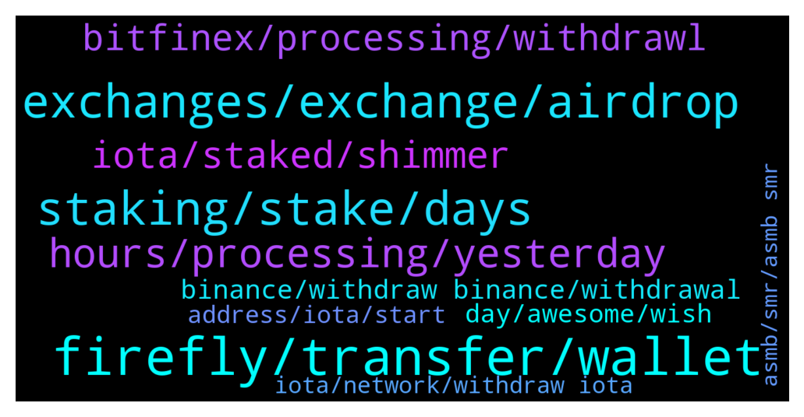

# **@iotatangle**
 ## Analysis for **2021-12-27** - **2021-12-28**.

---

## 📊 **Basic Stats**

**n_messages_sent**: 534

---

---

## 🔝 **Top keywords and related messages**

1. **firefly, transfer, wallet**

    @JohnPhishingman --- *Workaround (takes < 1hour) Sell the iota, move your money to another exchange, buy iota there and transfer it into your firefly-wallet* **--->** [TG Discussion](https://t.me/iotatangle/302933)

    @Leocarioka --- *firefly i made a new wallet and does not accept bsc transfer !* **--->** [TG Discussion](https://t.me/iotatangle/303048)

    @mosray --- *you cannot download anything from it, it just asks to connect to Chrysalis and to insert the 81 seed* **--->** [TG Discussion](https://t.me/iotatangle/303111)

    @JohnPhishingman --- *Yeah, assholes... because YOU got months of time to transfer all into your firefly-wallet...🤦‍♂* **--->** [TG Discussion](https://t.me/iotatangle/302925)

    @kmittakola --- *how much time it is taking to receive tokens on firefly end* **--->** [TG Discussion](https://t.me/iotatangle/303435)

    @wombt --- *Bitfinex or bitpanda allow withdrawals, you can swap to another coin, transfer to other exchange, swap back to iota and withdraw to firefly* **--->** [TG Discussion](https://t.me/iotatangle/303057)

2. **staking, stake, days**

    @oliverbitcoin --- *Hi guys. Quick question: Is staking only possible when i deposite to my wallet until 3pm today? Or can i transfer tomorrow and it will still stack ?* **--->** [TG Discussion](https://t.me/iotatangle/303648)

    @naz_1983 --- *Hi can i stake MIOTA today? Or its closed?* **--->** [TG Discussion](https://t.me/iotatangle/303897)

    @CryptoPete89 --- *I somehow cannot connect to discord. In my opinion the staking should not start if people cannot withdraw for a month* **--->** [TG Discussion](https://t.me/iotatangle/303127)

    @punikus --- *hi Shiba to the moon!!! if you stake more, you earn more...* **--->** [TG Discussion](https://t.me/iotatangle/302736)

    @Crypple --- *What is the difference between the pre stake and stake in Firefly?0* **--->** [TG Discussion](https://t.me/iotatangle/302783)

    @Jul_Y5 --- *Pre stake is the period before the real staking when the awards will calculated. The real stake begins at 28 dec 14 00 ETC. Will last 90 days.* **--->** [TG Discussion](https://t.me/iotatangle/302787)

3. **exchanges, exchange, airdrop**

    @mosray --- *correct, the exchanges really play such a dirty game* **--->** [TG Discussion](https://t.me/iotatangle/303116)

    @sy-subrc --- *In the end of the day it's the exchanges topic* **--->** [TG Discussion](https://t.me/iotatangle/303125)

    @mosray --- *if there is evidence that they did the migration and they simply refuse the withdrawals, that should be enough to simply boycott those exchanges for the rest of time* **--->** [TG Discussion](https://t.me/iotatangle/303168)

    @Marco --- *No, its very simple…the exchanges want your shimmer and assembley Token 💁🏻‍♂️* **--->** [TG Discussion](https://t.me/iotatangle/303174)

    @sy-subrc --- *I'd bet some 10 Mi that some exchanges will never migrate to Chrysalis* **--->** [TG Discussion](https://t.me/iotatangle/303140)

    @CryptoPete89 --- *I think it is really unfair that big exchanges will harvest the airdrop. They will for sure block withdrawals for the whole 90 day period.* **--->** [TG Discussion](https://t.me/iotatangle/303100)

4. **hours, processing, yesterday**

    @sy-subrc --- *Less than 10 minutes best case* **--->** [TG Discussion](https://t.me/iotatangle/302795)

    @Matt_Unwin --- *Mine has been showing ‘processing’ for 2 hours.* **--->** [TG Discussion](https://t.me/iotatangle/303893)

    @sy-subrc --- *I think this is after signing up, there's a freeze period of X days* **--->** [TG Discussion](https://t.me/iotatangle/303076)

    @Fold11 --- *U tried support? They can manually try fix it* **--->** [TG Discussion](https://t.me/iotatangle/303028)

    @minimalibu --- *how long has it been processing? Should be super quick..* **--->** [TG Discussion](https://t.me/iotatangle/303721)

    @itsmedev --- *I did today. It took like 2 hours* **--->** [TG Discussion](https://t.me/iotatangle/304010)

5. **iota, staked, shimmer**

    @mohsen --- *On March 2020 Iota was about  0.08 $* **--->** [TG Discussion](https://t.me/iotatangle/303379)

    @demonichans --- *no i meant the total stake, not just mine, like if only 50% iota staked we get more reward something like that* **--->** [TG Discussion](https://t.me/iotatangle/302739)

    @Sailor --- *Forecast about 14% of IOTA's total supply around 39,000,000Giota was permanently locked on Iota's original network unable to migrate to current network because owner lost passphrases According to statistics on the Chrysalish.iota.org network, after 7 months of operation, only 85.27% of IOTA tokens have been transferred by owners from the old network to the current new network, the operation time only takes 5 minutes, so at Why is this Iota token accounting for 14% of the total supply so dormant, especially tomorrow will start the STAKE program to receive Shimmer and Assemby tokens, anyone give comments to abovementioned matters?* **--->** [TG Discussion](https://t.me/iotatangle/302853)

    @lodurr666 --- *I believe that when the coordinator is eliminated, the currency gains strength. Smart contracts, NFT, speed, streaming, etc. every other currency is already way more advanced than IOTA. The difference will be the much-promised decentralization* **--->** [TG Discussion](https://t.me/iotatangle/303381)

    @demonichans --- *still it will shown on total staked, but what we have now only 50% iota got staked, it will be suspicious if the total staked suddenly goes up* **--->** [TG Discussion](https://t.me/iotatangle/303107)

    @. --- *iota is goin 2 mars my friends* **--->** [TG Discussion](https://t.me/iotatangle/303221)

6. **bitfinex, processing, withdrawl**

    @alexptn72 --- *Is someone able to withdrawl from bitfinex? My withdrawl is in processing status from yesterday* **--->** [TG Discussion](https://t.me/iotatangle/303618)

    @alexptn72 --- *for people who have a withdrawl in peocessing status on bitfinex for more than 12 hours. cancel the withdrawl e submit again. After resubmit my withdrawl arrived in 5 minutes* **--->** [TG Discussion](https://t.me/iotatangle/304025)

    @sajwancrypto --- *Because bitfinex will take 12 to 24 hours or even longer to withdrawal* **--->** [TG Discussion](https://t.me/iotatangle/303014)

    @sy-subrc --- *Withdrawal is not suspended on Bitfinex* **--->** [TG Discussion](https://t.me/iotatangle/303072)

    @razali1984 --- *Even BitFinex withdrawals are problematic now* **--->** [TG Discussion](https://t.me/iotatangle/303649)

    @Arjan --- *How long does it exactly take to withdraw from bitfinex?* **--->** [TG Discussion](https://t.me/iotatangle/303660)

7. **binance, withdraw binance, withdrawal**

    @L --- *Binance will resume withdrawal approx 12:00 GMT 28/12/2021* **--->** [TG Discussion](https://t.me/iotatangle/303059)

    @ElmettS96 --- *Binance suspend withdrawal again and my request was rejected for insufficent balance even if I made the request before the arrival of the email* **--->** [TG Discussion](https://t.me/iotatangle/303595)

    @Jonas --- *Withdrawal on binance is possible again* **--->** [TG Discussion](https://t.me/iotatangle/303574)

    @V --- *Binance withdrawal worked within minutes 💪💪* **--->** [TG Discussion](https://t.me/iotatangle/303974)

    @Jacques --- *And Binance opened for 5 min did test transfer of 100 worked* **--->** [TG Discussion](https://t.me/iotatangle/303845)

    @Donnerbalken92 --- *I Did the kyc on binance, but still unable to withdrawal* **--->** [TG Discussion](https://t.me/iotatangle/303305)

8. **day, awesome, wish**

    @Tahmis --- *np. It's a special day so we are not so strict :)* **--->** [TG Discussion](https://t.me/iotatangle/304020)

    @Boaty --- *awesome, welcome to the community :-) It's a crazy ride!* **--->** [TG Discussion](https://t.me/iotatangle/303843)

    @naz_1983 --- *Guys is this worth investing? Am new to this place* **--->** [TG Discussion](https://t.me/iotatangle/303919)

    @UKSupplements --- *My pleasure, wish you good investment 🤞* **--->** [TG Discussion](https://t.me/iotatangle/303980)

    @JurgensHayes --- *Shot, thank you. Here is holding thumbs* **--->** [TG Discussion](https://t.me/iotatangle/303482)

    @mosray --- *appreciate your kind words my friend, thank you 🙏* **--->** [TG Discussion](https://t.me/iotatangle/303123)

9. **address, iota, start**

    @Boaty --- *you'll need a profile in the IOTA mainnet where all addresses start with iota1* **--->** [TG Discussion](https://t.me/iotatangle/303835)

    @MitchKeke --- *i dont know i just whitelisted address for iota and asked me to wait 5 days for security reason* **--->** [TG Discussion](https://t.me/iotatangle/302987)

    @mosray --- *Iota exchanges address must belong to the old Iota blockchain* **--->** [TG Discussion](https://t.me/iotatangle/303150)

    @Tahmis --- *Normal iota addresses start with iota..* **--->** [TG Discussion](https://t.me/iotatangle/303832)

    @Tahmis --- *Normal iota addresses start with iota...* **--->** [TG Discussion](https://t.me/iotatangle/303776)

    @SwitchAndy --- *Does the address start with IOTA or ATOI* **--->** [TG Discussion](https://t.me/iotatangle/303752)

10. **iota, network, withdraw iota**

    @Leocarioka --- *I didn't lose because I can't transfer, but I tried several exchanges all suspended iota network* **--->** [TG Discussion](https://t.me/iotatangle/303054)

    @MitchKeke --- *no it is because i had disabled iota withdraw in 2018 i think* **--->** [TG Discussion](https://t.me/iotatangle/302990)

    @Crypple --- *Why the hell cant I withdraw my Iota from my broker?* **--->** [TG Discussion](https://t.me/iotatangle/302963)

    @. --- *is there any exchange where i can withdraw iota* **--->** [TG Discussion](https://t.me/iotatangle/302828)

    @skpywatts --- *Which exchange is currently allowing withdrawal on the iota coin* **--->** [TG Discussion](https://t.me/iotatangle/302770)

    @ef4ort --- *IOTA network withdrawal suspended. Withdrawals can be processed through alternative networks. Subscribe to network recovery reminders to receive updates.* **--->** [TG Discussion](https://t.me/iotatangle/302854)

