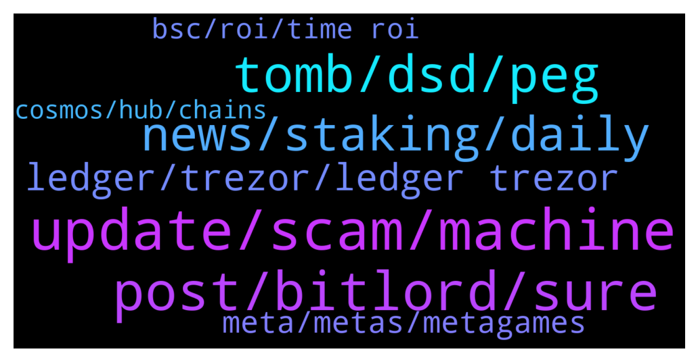

# **@lobsters_chat**
 ## Analysis for **2021-12-27** - **2021-12-28**.

---

## 📊 **Basic Stats**

**n_messages_sent**: 234

---

---

## 🔝 **Top keywords and related messages**

1. **update, scam, machine**

    @farm42 --- *TLDR: One guy’s MetaMask was hacked via infected smart sex toy (dildo). Never plug unknown devices to your working machine.  https://twitter.com/officer_cia/status/1475521089002475528?s=21* **--->** [TG Discussion](https://t.me/lobsters_chat/310949)

    @farm42 --- *Yeah, but theoretically this is a very easy «Bad-USB» attack, very easy to perform. Even with taking original tweet with some skepticism:)   https://twitter.com/crypto_bitlord7/status/1473231965927063553?s=20* **--->** [TG Discussion](https://t.me/lobsters_chat/310953)

    @RobAnon --- *If it’s in your protocol, get ready to spend a lot of ETH fixing everything at your own expense, because imo that’s the only way to approach bugs* **--->** [TG Discussion](https://t.me/lobsters_chat/311000)

    @tufuntu --- *In uniswap v2, why didn't they use IERC20 instead of selector?  https://github.com/Uniswap/v2-core/blob/master/contracts/UniswapV2Pair.sol#L45  Anybody has an idea?* **--->** [TG Discussion](https://t.me/lobsters_chat/310940)

    @farm42 --- *Gn fam, spotted a scam coin 😅 Me and CIA.gov (I assume lol) has nothing common with it. Don’t touch them if they were airdropped to you, as they prob steal coins by approve spoofing. https://www.coingecko.com/en/coins/cia  Again, this is a scam.* **--->** [TG Discussion](https://t.me/lobsters_chat/311122)

    @farm42 --- *To prevent this from happening to you too, read https://github.com/jlopp/physical-bitcoin-attacks/blob/master/README.md or airgapcomputer.org 😅* **--->** [TG Discussion](https://t.me/lobsters_chat/310951)

2. **post, bitlord, sure**

    @YoSoyCarlos --- *FYI this is def a troll post* **--->** [TG Discussion](https://t.me/lobsters_chat/310954)

    @warylow --- *spoken like a man who's blown a lot of ETH on this already hahah* **--->** [TG Discussion](https://t.me/lobsters_chat/311001)

    @Surfisup --- *Was gonna say....I take every Bitlord post with a ladle of salt haha* **--->** [TG Discussion](https://t.me/lobsters_chat/310956)

    @nickbtts --- *You added an ‘s’ to the actual degenDAO and are making people pay for it 😂  Pretty terrible attempt at a shill tbf* **--->** [TG Discussion](https://t.me/lobsters_chat/310794)

    @AdrianHetman --- *Hey!  Just wanted to leave this here as it may be helpful to some of you  https://twitter.com/adrianhetman/status/1475550508354093072?s=21* **--->** [TG Discussion](https://t.me/lobsters_chat/311010)

    @phil_muhbags --- *I might be wrong about the first* **--->** [TG Discussion](https://t.me/lobsters_chat/311089)

3. **tomb, dsd, peg**

    @phil_muhbags --- *There were so many. Remind me what ESD/DSD did?  Tomb is pegged to the price of ftm. The clones are pegged to the price of the network token* **--->** [TG Discussion](https://t.me/lobsters_chat/311101)

    @soup0 --- *algo stable ponzi which was pegged to $1. was on ETH. tomb is basically a dsd fork with some modifications* **--->** [TG Discussion](https://t.me/lobsters_chat/311102)

    @phil_muhbags --- *I'm kind of surprised that out of Algo stables ponzis, that a tomb or soup or whatever you want to call it didn't present itself on eth first* **--->** [TG Discussion](https://t.me/lobsters_chat/311082)

    @ssmccul --- *esd/dsd was OHM, but they tried to maintain a $1 peg.* **--->** [TG Discussion](https://t.me/lobsters_chat/311103)

    @tiequan --- *Nah Tomb is a fork of Basis Cash.  Its lineage includes a ton of BSC clones like BDO, MDO, MSC, etc until BDO went off peg and all of them died at the same time.  These all have the boardroom concept for seigniorage functions.  DSD / ESD is its own set of code base that allowed for attaching executing code to winning governance votes, and locking your funds via bonding short epochs.  You can tell further b/c it uses staging and then bonding vs just bonding for Basis Cash / OHM etc* **--->** [TG Discussion](https://t.me/lobsters_chat/311117)

    @Desalniettemin --- *Tomb finance started on Fantom and has been forked endlessly on other chains, except on ETH (afaik)* **--->** [TG Discussion](https://t.me/lobsters_chat/311080)

4. **news, staking, daily**

    @bout3fiddy --- *I wrote the article on UST.* **--->** [TG Discussion](https://t.me/lobsters_chat/310914)

    @PmRiviere --- *Curve recently started a series on stablecoins risk assessment. Pretty neat articles, with FRAX and UST featured so far https://substack.com/profile/66151946-curve-risk-assessments* **--->** [TG Discussion](https://t.me/lobsters_chat/310907)

    @mempirate --- *Does anyone here know of a news / interesting stuff aggregator for all things defi / ethereum? Something like hacker news* **--->** [TG Discussion](https://t.me/lobsters_chat/310982)

    @xmons --- *rekt has a news feed that's visually similar, but there's no upvoting etc* **--->** [TG Discussion](https://t.me/lobsters_chat/310984)

    @Praguebrewer --- *Defiant subscription and Crypto News mobile app, besides daily ape* **--->** [TG Discussion](https://t.me/lobsters_chat/310995)

    @metacoin --- *I am subscribed to: - The Daily Gwei (sassano as previously mentioned) - DAR news (digital asset research) - Lobster Daily medium (this chat summarized)* **--->** [TG Discussion](https://t.me/lobsters_chat/310989)

5. **ledger, trezor, ledger trezor**

    @raoufbenhar --- *What’s your guys favorite/best hardware wallet? Aside from ledger* **--->** [TG Discussion](https://t.me/lobsters_chat/310842)

    @mogglet --- *ledger nano s is still the best, I bought 2 nano x and both died upon arrival ( battery dead). Ledger team if you were here please fix asappp !* **--->** [TG Discussion](https://t.me/lobsters_chat/310859)

    @yic_alex --- *Tbh it does not make much sense to not use Ledger/Trezor if you don't want to run into compatibility issues / lack of apps. It does not pay off to go for the non market leaders with those kind of things in my experience, especially when even those already kinda suck.* **--->** [TG Discussion](https://t.me/lobsters_chat/310854)

    @yic_alex --- *It is not that Ledger and Trezor are bad, they are just confronted with the issue of having to support rapidly changing protocols / networks / browsers (and extensions) without compromising security. I think they have understood (will understand) this and will allocate more resources eventually.* **--->** [TG Discussion](https://t.me/lobsters_chat/310889)

    @forelsket.eth --- *Is lattice one fully compatible with metamask or does it also have issues like ledger?* **--->** [TG Discussion](https://t.me/lobsters_chat/310856)

    @raoufbenhar --- *has anybody switched from ledger to trezor?* **--->** [TG Discussion](https://t.me/lobsters_chat/310861)

6. **meta, metas, metagames**

    @Milan_ZIL --- *I guess we can speculate on which meta are easier to take off than others. My assumption right now that zk L2 metas are a bit too technical/abstract to take off. But I may be wrong* **--->** [TG Discussion](https://t.me/lobsters_chat/310714)

    @sixty10 --- *Really abusing the term meta here* **--->** [TG Discussion](https://t.me/lobsters_chat/310721)

    @busssssy --- *i think decentralised cross-margin will have its time in the meta as well* **--->** [TG Discussion](https://t.me/lobsters_chat/310745)

    @phil_muhbags --- *It's been defi summer for the last 18 months* **--->** [TG Discussion](https://t.me/lobsters_chat/311085)

    @sixty10 --- *Institutional money and NFTs don't have intrinsic metagames. Metagames are affordances that emerge from rules and shared understanding/interpretation of those rules* **--->** [TG Discussion](https://t.me/lobsters_chat/310728)

    @Milan_ZIL --- *Yea sorry lol, I just realized after reading that article that thinking in 'metagames' instead of narratives makes things much more coherent and easier to build more building blocks around it* **--->** [TG Discussion](https://t.me/lobsters_chat/310725)

7. **bsc, roi, time roi**

    @william_s_4 --- *I would personally be very interested in reading a thorough writeup of the BSC ecosystem at this point. From the outside it sounds like a super steroid version of Keynes's beauty contest - no one believes in anything, rather invest where they other people will invest and dump when they think others will dump.* **--->** [TG Discussion](https://t.me/lobsters_chat/311071)

    @OneRing_Ceo --- *Lbps are getting more popular anyways* **--->** [TG Discussion](https://t.me/lobsters_chat/310741)

    @river0x --- *We're running metrics on our overall defisafety chain scores and I think you can imagine how BSC does compared to ETH* **--->** [TG Discussion](https://t.me/lobsters_chat/311125)

    @phil_muhbags --- *Bsc has a lot of gamefi stuff if that's what you mean.* **--->** [TG Discussion](https://t.me/lobsters_chat/311075)

    @pandastoke --- *does anyone have useful metrics that can compare usd pair vs btc/eth/other pair trades as a quasi-zhupercycle signal?  basically if market participants are selling into crypto pairs = money stays in crypto and selling into USD pairs = money flowing out.* **--->** [TG Discussion](https://t.me/lobsters_chat/310830)

    @phil_muhbags --- *It's similar to soup which was on bsc first* **--->** [TG Discussion](https://t.me/lobsters_chat/311081)

