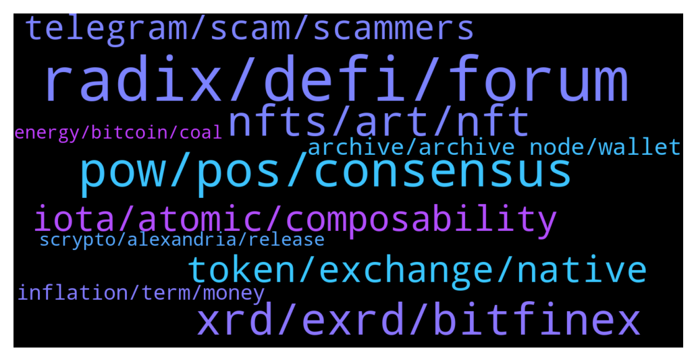

# **@radix_dlt**
 ## Analysis for **2021-12-27** - **2021-12-28**.

---

## 📊 **Basic Stats**

**n_messages_sent**: 603

---

---

## 🔝 **Top keywords and related messages**

1. **radix, defi, forum**

    @KANO_Z --- *I'd think it would be a good opportunity for those far more knowledgeable than me on the technical side to give some good insight into the strengths of radix over something like kda.* **--->** [TG Discussion](https://t.me/radix_dlt/328389)

    @Malekith_PL --- *Guys, an honest question. Does Radix / XRD have any disadvantages? Radix solves blockchainie tri (or even quad) lemma. New, secure programming language. Etc. Beside being not live yet, does it has any drowbacks that we already know of? Having some is not always bad, a some things might look too good to be true. So again, is there anything you know of?* **--->** [TG Discussion](https://t.me/radix_dlt/328187)

    @KANO_Z --- *I see parallels between Radix and Kadena. I can imagine Radix being in a similar position in a few years as the technicals seem stellar.* **--->** [TG Discussion](https://t.me/radix_dlt/328364)

    @S --- *Because they do have some nice properties that Radix does not have. Faster finality, no leader you could ddos. Lack of atom comp might not matter if you assume localized settings. Then IOTA may be preferable. Does it matter? I don't think so, I think the money is in DeFi and therefore Radix* **--->** [TG Discussion](https://t.me/radix_dlt/327775)

    @Jazzer9F --- *For those that missed it live, Piers did a fantastic interview with Cryptonites about how Radix is the only network where DeFi can thrive!   Watch it now: https://www.youtube.com/watch?v=WKoXP0c2C7Q* **--->** [TG Discussion](https://t.me/radix_dlt/327546)

    @Jazzer9F --- *🎉NEW RADIX REPORT IS NOW LIVE!🎉  In the last Radix Report of 2021 we have some juicy updates from the marketing and development teams, plus news on the latest efforts from the Radix Marketing Council.  Full Report: https://www.radixdlt.com/post/radix-report-9th-december* **--->** [TG Discussion](https://t.me/radix_dlt/327883)

2. **pow, pos, consensus**

    @CryptoRadix --- *Interesting. I didnt realize Xi'an was going to switch from pos to pow. I assume there's some write up in the docs? I haven't gotten. through everything yet. is there an ELI5 Why the team wants to switch over to pow?* **--->** [TG Discussion](https://t.me/radix_dlt/328213)

    @thenotthatgreat --- *ye i get that, but it's not just CPOW, but CPOW and POS as i understood it, but might be wrong* **--->** [TG Discussion](https://t.me/radix_dlt/328248)

    @Jazzer9F --- *PoW is a temporary thing imo. There will come a time when we look back at it and go like 'member when we used massive amounts of power to secure digital legers?  Like we look back at the way we used to create potash now. PoW will just be obsolete..* **--->** [TG Discussion](https://t.me/radix_dlt/328604)

    @Blind5ight --- *This isn’t correct. Combinatorial just refers to POW Hybrid refers to combining POW with POS True hybrid because the second phase can’t go without the first phase FYI @thenotthatgreat* **--->** [TG Discussion](https://t.me/radix_dlt/328457)

    @Blind5ight --- *There’s math added to POW so that it becomes less efficient for miners with a lot of resources* **--->** [TG Discussion](https://t.me/radix_dlt/328459)

    @thenotthatgreat --- *ye i get that, just didn't think combinatorial POW made sense for an abreviation as it's a combinatorial of POW and something else(in this case POS)* **--->** [TG Discussion](https://t.me/radix_dlt/328268)

3. **xrd, exrd, bitfinex**

    @Magal36 --- *Currently you can only buy XRD directly at Bitfinex. Alternatively, you could buy on Kukoin or other exchanges and bridge through Instabridge, or wait for XRD integration by the exchange* **--->** [TG Discussion](https://t.me/radix_dlt/327740)

    @r0best --- *GM .I bought the token in bitfinex. Do I use istantbridge to swap from erc20 format and to start to stake?* **--->** [TG Discussion](https://t.me/radix_dlt/328058)

    @gonnagasato --- *what difference between xrd and exrd? why 2 tokens existing together instead of one?* **--->** [TG Discussion](https://t.me/radix_dlt/328639)

    @Fayvivien --- *I am trying to sell my kidney for Radix (Lol, this is just as a joke). But I don't know anything about XRD.  I want to know can i buy XRD directly without buying E-Xrd. and Can I use Kucoin for that?* **--->** [TG Discussion](https://t.me/radix_dlt/327729)

    @fpieper --- *Don't think so. Point is that XRD can be used for other things than fees on Radix, like collateral etc. Also the bigger the ecosystem grows the higher the market cap of XRD. There is probably some healthy correlation between ecosystem value and XRD market cap.  I mean having a 1T$ ecosystem market cap and 3B$ market cap for XRD? I would say quite unlikely.* **--->** [TG Discussion](https://t.me/radix_dlt/327723)

    @Fayvivien --- *Will I need Eth gas fees when switching from E-XRD to XRD in future (I will use Kucoin)?* **--->** [TG Discussion](https://t.me/radix_dlt/327856)

4. **nfts, art, nft**

    @M4THEWS --- *Then why are you talking against free market. NFTs are created due to supply and demand.* **--->** [TG Discussion](https://t.me/radix_dlt/328616)

    @mx471 --- *I don't understand the point of NFTs either (at least in the current state) and would never buy one (except for fun) but if people want to do it then go ahead. And if it really is used for money laundering then the governments will do something about it one day.  NFTs are still very young and will continue to develop. Who knows, if one day in 10 years our lives are based on public ledgers, then maybe it will have value in the real world. Or maybe the rights to something will be linked to an NFT.* **--->** [TG Discussion](https://t.me/radix_dlt/328555)

    @Avaunt --- *The concept and potential of NFT's are amazing. The idea of proving ownership and provenance of digital assets or linked physical assets has great potential. Some of the valuations for digital art are a bit crazy.* **--->** [TG Discussion](https://t.me/radix_dlt/328561)

    @Artistizen --- *Everything closed? Time to pickup a few NFTs!  How to get the NFTs http://t.me/Tributjects/268* **--->** [TG Discussion](https://t.me/radix_dlt/328046)

    @nocturn9x --- *But it is worse, at least IMHO: You're wasting limited resources to mint mostly meaningless digital goods. Most NFTs are just nonsense* **--->** [TG Discussion](https://t.me/radix_dlt/328543)

    @nocturn9x --- *Sure, I'm just saying what I think is the truth about NFTs, after all* **--->** [TG Discussion](https://t.me/radix_dlt/328526)

5. **token, exchange, native**

    @S --- *Therefore, it seems to be a gas fee token* **--->** [TG Discussion](https://t.me/radix_dlt/327714)

    @S --- *Because that props up the token value* **--->** [TG Discussion](https://t.me/radix_dlt/327707)

    @S --- *ICP tokenomics are said up this way & it's a VC dump* **--->** [TG Discussion](https://t.me/radix_dlt/327750)

    @S --- *Yes, but the 'general uptrend' is another word for speculation, i.e. ponzinomics. Or IT must be a sign that the token is being used for SoV or currency.* **--->** [TG Discussion](https://t.me/radix_dlt/327711)

    @S --- *Could you tell a little more about Dan's ideas for an elastic token? Do you have a link? Thanks* **--->** [TG Discussion](https://t.me/radix_dlt/327981)

    @mtang21 --- *Thanks. I figured, but wondered what kind of token it is* **--->** [TG Discussion](https://t.me/radix_dlt/327892)

6. **iota, atomic, composability**

    @S --- *IOTA 2.0 has 2 second finality time and is leaderless* **--->** [TG Discussion](https://t.me/radix_dlt/327643)

    @MaximusGirthian --- *Some of you may have noticed that IOTA blog posts have really started suggesting that IOTA has cross shard atomic composability. It does seem like this is misleading people, but the fact is people are being misled (and falsely claiming AC). I tweeted Hans about it, which has got a little traction in the IOTA community, it would be great to get it from the big man, in writing, that it is not possible, so like and retweet!  https://mobile.twitter.com/Raddicted3/status/1474447272989667332* **--->** [TG Discussion](https://t.me/radix_dlt/327600)

    @PeterFATAss --- *IOTA is a failed project which was recycled. I sold all of it in 2018* **--->** [TG Discussion](https://t.me/radix_dlt/327641)

    @PeterFATAss --- *The biggest mistake for Ivan and David was to work with him in the first place. IOTA is now his project and will lose relevance every second* **--->** [TG Discussion](https://t.me/radix_dlt/327656)

    @MaximusGirthian --- *I know, but only we get to see that, not the IOTA maxis on Twitter* **--->** [TG Discussion](https://t.me/radix_dlt/327640)

    @S --- *This tendency towards crappy hyping turned me off IOTA in the first place.* **--->** [TG Discussion](https://t.me/radix_dlt/327636)

7. **telegram, scam, scammers**

    @MattToTheMoon --- *So right now, recovering scammed funds isn’t possible. No entity has the power to lock wallets etc.* **--->** [TG Discussion](https://t.me/radix_dlt/328067)

    @sunworshag --- *I have been, but it seemed like a scam so I posted here just to be careful* **--->** [TG Discussion](https://t.me/radix_dlt/328308)

    @mx471 --- *Meanwhile, scammers even warn me about scammers. Tell me to block them and report them. Friendly of them, I do that directly.* **--->** [TG Discussion](https://t.me/radix_dlt/328667)

    @RadixMonk --- *also be careful of scammers, they DM you when u ask for support* **--->** [TG Discussion](https://t.me/radix_dlt/328263)

    @RadixMonk --- *watch out for those scam accounts as well* **--->** [TG Discussion](https://t.me/radix_dlt/328014)

    @yr12345678 --- *These are scams, so I'm assuming you're promoting scams for them* **--->** [TG Discussion](https://t.me/radix_dlt/327896)

8. **archive, archive node, wallet**

    @Magal36 --- *Try changing the archive node on the wallet settings* **--->** [TG Discussion](https://t.me/radix_dlt/328174)

    @RadixMonk --- *type this and add archive node, sorry i dont have a copy paste version* **--->** [TG Discussion](https://t.me/radix_dlt/328262)

    @Magal36 --- *Have you updated to the latest version?* **--->** [TG Discussion](https://t.me/radix_dlt/328170)

    @yessurrrre --- *there is no chrome extension wallet ?* **--->** [TG Discussion](https://t.me/radix_dlt/327845)

    @MaximusGirthian --- *Download the latest wallet and try again* **--->** [TG Discussion](https://t.me/radix_dlt/327664)

    @RadixMonk --- *try connecting through a community archive node* **--->** [TG Discussion](https://t.me/radix_dlt/328259)

9. **inflation, term, money**

    @S --- *I'm Dutch, our housing market is ridiculous. Ppl are indebting themselves for life with mortgages that have to be re-financed at some point* **--->** [TG Discussion](https://t.me/radix_dlt/328024)

    @MassieFur --- *Didn't Japan had the same? Multiple generations needed to repay mortgages now* **--->** [TG Discussion](https://t.me/radix_dlt/328153)

    @S --- *'governments cannot abuse it'. I know that this subject may be a bit much for a crypto tg (then again, this tg has complicated discussions all the time) but central banks actually try to achieve a known and fixed inflation by *not* fixing the increase in the money supply* **--->** [TG Discussion](https://t.me/radix_dlt/327931)

    @ahsimon --- *Central banks make short term adjustments to interest rates and QE programs.  But they are subject to political pressure to kick the can down the road, and never do what Keynes himself suggested: raise rates when times are good.   A well designed DAO for governance of monetary policy should recognize that there is more than one constituency, and support both. short term and long term policy.  But the solution to that problem lies in Dan's ideas for a stable (actually elastic) token designed to be have a long term price-of goods/services value will help.   But that is further down the Radix vision than Xi'an.  IMHO It needs to algorithmically adjust the supply of "M1" to what the market needs.* **--->** [TG Discussion](https://t.me/radix_dlt/327977)

    @S --- *They couldn't maintain the rate hike even in 2019... and now debt is much higher* **--->** [TG Discussion](https://t.me/radix_dlt/327986)

    @S --- *But you're saying that mortgages are a bit crazy in Japan?* **--->** [TG Discussion](https://t.me/radix_dlt/328173)

10. **scrypto, alexandria, release**

    @fpieper --- *Quick note:  We've now passed the first 500 signups to the Radix Developer Program! We're really happy to see this level of interest so quickly!  We're extending the $25 XRD bonus for signing up just a little bit longer to include all signups by the end of the year - 12/31/21. So if you haven't signed up already or have a developer friend that wants to get the little bonus, now's the time. Just go here: https://developers.radixdlt.com/devprogram  Also, many of you probably haven't caught that we're also doing a $75 XRD bonus for people who check in good Scrypto examples of the community repo (after our team has had a chance to review them for being unique and well-implemented). That program is continuing, and will still need you to sign up for the Developer Program first to be elligible. I'll be putting a little note about this in the next mailing, but thought I'd mention it here first.  Thanks for keeping the Scrypto community growing!* **--->** [TG Discussion](https://t.me/radix_dlt/327839)

    @CharlieCrypto1 --- *Is there any way to follow the number of Devs working with Scrypto?* **--->** [TG Discussion](https://t.me/radix_dlt/327833)

    @Magal36 --- *Alexandria was Scrypto release on the 15th. Babylon, when smart contracts go live, is expected for late 2022.* **--->** [TG Discussion](https://t.me/radix_dlt/328115)

    @IanMcIlroy --- *Cerby Finance is building Dapps with Scrypto ready for the Babylon release: https://www.youtube.com/watch?v=wKTQ8VKSCBA* **--->** [TG Discussion](https://t.me/radix_dlt/328583)

    @Jazzer9F --- *We’re pleased to announce that Radix Alexandria has launched!  Scrypto is a game-changer for DeFi, developers, you can get started with Scrypto now.  Full Announcement: https://www.radixdlt.com/post/alexandria-scrypto-is-here* **--->** [TG Discussion](https://t.me/radix_dlt/327935)

    @fpieper --- *500 developers have registered on the Scrypto website: Matt said something about that here 😊 https://t.me/RadixDevelopers/18071* **--->** [TG Discussion](https://t.me/radix_dlt/327838)

