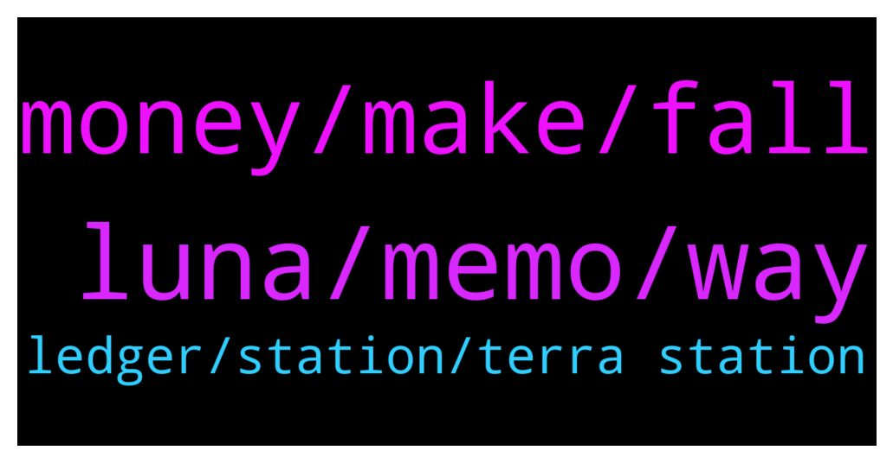

# **@terralunachat_officially**
 ## Analysis for **2021-12-27** - **2021-12-28**.

---

## 📊 **Basic Stats**

**n_messages_sent**: 115

---

---

## 🔝 **Top keywords and related messages**

1. **luna, memo, way**

    @Denison8888 --- *Where should I hold and what to do with my LUNA so I am eligible for airdrops, staking, etc. Sorry, I am new here..* **--->** [TG Discussion](https://t.me/terralunachat_officially/22045)

    @Great fudder --- *I am waiting for luna Under 70* **--->** [TG Discussion](https://t.me/terralunachat_officially/22090)

    @djackop --- *Guys you should be happy when luna price is dumping, get more luna!! Luna is unstoppable. Try to collect as much as you can.. You will regret it in few years if you don't* **--->** [TG Discussion](https://t.me/terralunachat_officially/22087)

    @Oliverpilak --- *Hey terra friends. Is there a way to buy wrapped Luna on BSC? I can't seem to find a wrapped version on there. Thanks* **--->** [TG Discussion](https://t.me/terralunachat_officially/22083)

    @ferremarco --- *Hi. Where I can stake my luna?* **--->** [TG Discussion](https://t.me/terralunachat_officially/22078)

    @Ivana_crazy --- *When withdrawing luna from binance It asks about a meno, where can I find It ?* **--->** [TG Discussion](https://t.me/terralunachat_officially/21872)

2. **money, make, fall**

    @Mina5201 --- *Newbies should understand that the essence of cryptocurrency trading is not to hold it all the time, but to keep it flowing so that you can make money. Instead of passively waiting for the market to rise or fall,* **--->** [TG Discussion](https://t.me/terralunachat_officially/21839)

    @Mina5201 --- *Novices should understand that the essence of cryptocurrency trading is not to hold it all the time, but to keep it flowing so that you can make money. Instead of passively waiting for the market to rise or fall.* **--->** [TG Discussion](https://t.me/terralunachat_officially/21886)

    @Zelgiust --- *Crypto is now a force to deal with in geopolitics an international economics subjects.* **--->** [TG Discussion](https://t.me/terralunachat_officially/22015)

    @Jym --- *Just some minor correction should be good. But if 1 bad call about BTC all altcoin will go down as well.* **--->** [TG Discussion](https://t.me/terralunachat_officially/21848)

    @Mina5201 --- *I have said that Bitcoin will fall in the past few days. Many people in the group still don’t believe it, and it has slowly fallen. Haha🤣* **--->** [TG Discussion](https://t.me/terralunachat_officially/22116)

    @Kevin --- *So people pay 18.65% to borrow?* **--->** [TG Discussion](https://t.me/terralunachat_officially/21981)

3. **ledger, station, terra station**

    @marcus --- *Hello, I am connected with my ledger to my Luna wallet on the station. I am unable to hit any submit button. Does anybody know the problem? Can delegate, undelegste or withdraw* **--->** [TG Discussion](https://t.me/terralunachat_officially/21884)

    @jackobbbb --- *Hey. I have problem with Terra Station on mac. I try to swap or deposit to anchor and get msg "Couldn't find the Ledger. Check the Ledger is plugged in and unlocked." Few days ago everything worked fine. Anyone had the issue and can help?* **--->** [TG Discussion](https://t.me/terralunachat_officially/21939)

    @fafsharchi --- *Yes, l had same problem! Tried chrome extension instead.All good* **--->** [TG Discussion](https://t.me/terralunachat_officially/22041)

    @fafsharchi --- *Thanks! I tried above but it doesnt work with a ledger device! It looks "terra station with mac" doesnt work anymore! I could manage using chrome browser to connect to my nano s! Hope this will help anyone having same issue!* **--->** [TG Discussion](https://t.me/terralunachat_officially/22034)

    @maygin1 --- *Hi Marcus,You need to re-authenticate your ledger on terra station ,use the link in the group pinned message the process is encrypted.* **--->** [TG Discussion](https://t.me/terralunachat_officially/21929)

    @POPIAHALEX --- *Hi guys.. anyone facing the new terra station cannot use ledger?* **--->** [TG Discussion](https://t.me/terralunachat_officially/21906)

